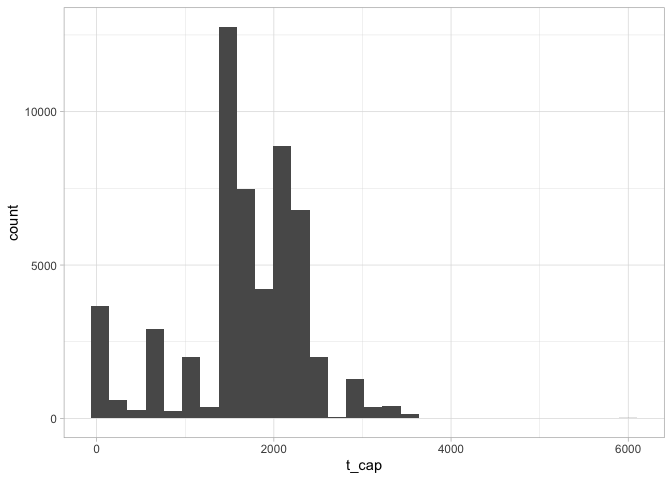
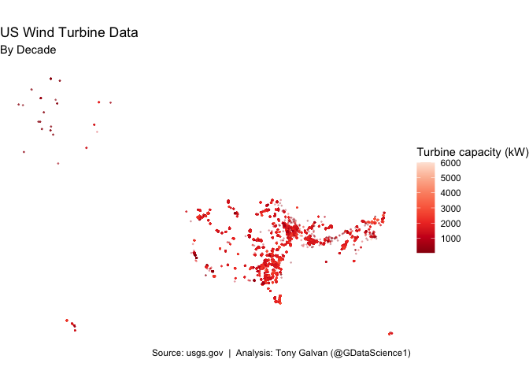

# Mapping America's Wind Power: A Visual Tour of 60,000+ Turbines

**[Source Code](2018_11_06_tidy_tuesday.Rmd)** | Data from the [TidyTuesday project](https://github.com/rfordatascience/tidytuesday/tree/master/data/2018/2018-11-06) (2018-11-06)


The USGS tracks every utility-scale wind turbine in America. We map 60,000+ turbines colored by capacity, revealing how wind power clusters in the Great Plains corridor while the coasts remain largely untouched.

---

The United States has quietly built one of the largest wind energy
infrastructures on the planet. With over 60,000 turbines scattered
across the country — from the windswept plains of Texas to the
ridgelines of Appalachia — wind power has become a defining feature of
America’s energy landscape. This week’s data from the USGS gives us
coordinates, capacity, and installation year for every single one. Let’s
map the wind revolution.

## Loading the Turbine Data

We’ll pull the US Wind Turbine dataset from the TidyTuesday archive.
This dataset contains detailed records for every utility-scale wind
turbine in the country, including geographic coordinates, turbine
capacity in kilowatts, and the year each project came online.

``` r
tt <- tt_load("2018-11-06")
```

## A First Look at the Data

Let’s explore the structure of the dataset to understand what we’re
working with.

``` r
tt |> 
  map(glimpse)
```

    ## Rows: 58,185
    ## Columns: 24
    ## $ case_id    <dbl> 3073429, 3071522, 3073425, 3071569, 3005252, 3003862, 30733…
    ## $ faa_ors    <chr> "missing", "missing", "missing", "missing", "missing", "mis…
    ## $ faa_asn    <chr> "missing", "missing", "missing", "missing", "missing", "mis…
    ## $ usgs_pr_id <dbl> 4960, 4997, 4957, 5023, 5768, 5836, 4948, 5828, 4965, 5044,…
    ## $ t_state    <chr> "CA", "CA", "CA", "CA", "CA", "CA", "CA", "CA", "CA", "CA",…
    ## $ t_county   <chr> "Kern County", "Kern County", "Kern County", "Kern County",…
    ## $ t_fips     <chr> "06029", "06029", "06029", "06029", "06029", "06029", "0602…
    ## $ p_name     <chr> "251 Wind", "251 Wind", "251 Wind", "251 Wind", "251 Wind",…
    ## $ p_year     <dbl> 1987, 1987, 1987, 1987, 1987, 1987, 1987, 1987, 1987, 1987,…
    ## $ p_tnum     <dbl> 194, 194, 194, 194, 194, 194, 194, 194, 194, 194, 194, 194,…
    ## $ p_cap      <dbl> 18.43, 18.43, 18.43, 18.43, 18.43, 18.43, 18.43, 18.43, 18.…
    ## $ t_manu     <chr> "Vestas", "Vestas", "Vestas", "Vestas", "Vestas", "Vestas",…
    ## $ t_model    <chr> "missing", "missing", "missing", "missing", "missing", "mis…
    ## $ t_cap      <dbl> 95, 95, 95, 95, 95, 95, 95, 95, 95, 95, 95, 95, 95, 95, 95,…
    ## $ t_hh       <dbl> -9999, -9999, -9999, -9999, -9999, -9999, -9999, -9999, -99…
    ## $ t_rd       <dbl> -9999, -9999, -9999, -9999, -9999, -9999, -9999, -9999, -99…
    ## $ t_rsa      <dbl> -9999, -9999, -9999, -9999, -9999, -9999, -9999, -9999, -99…
    ## $ t_ttlh     <dbl> -9999, -9999, -9999, -9999, -9999, -9999, -9999, -9999, -99…
    ## $ t_conf_atr <dbl> 2, 2, 2, 2, 2, 2, 2, 2, 2, 2, 2, 2, 2, 2, 2, 2, 2, 2, 2, 2,…
    ## $ t_conf_loc <dbl> 3, 3, 3, 3, 3, 3, 3, 3, 3, 3, 3, 3, 3, 3, 3, 3, 3, 3, 3, 3,…
    ## $ t_img_date <chr> "1/1/2012", "1/1/2012", "1/1/2012", "7/31/2016", "11/23/201…
    ## $ t_img_srce <chr> "NAIP", "NAIP", "NAIP", "Digital Globe", "Digital Globe", "…
    ## $ xlong      <dbl> -118.3607, -118.3612, -118.3604, -118.3640, -118.3543, -118…
    ## $ ylat       <dbl> 35.08378, 35.08151, 35.08471, 35.07942, 35.08559, 35.09140,…

    ## $us_wind
    ## # A tibble: 58,185 × 24
    ##    case_id faa_ors faa_asn usgs_pr_id t_state t_county    t_fips p_name   p_year
    ##      <dbl> <chr>   <chr>        <dbl> <chr>   <chr>       <chr>  <chr>     <dbl>
    ##  1 3073429 missing missing       4960 CA      Kern County 06029  251 Wind   1987
    ##  2 3071522 missing missing       4997 CA      Kern County 06029  251 Wind   1987
    ##  3 3073425 missing missing       4957 CA      Kern County 06029  251 Wind   1987
    ##  4 3071569 missing missing       5023 CA      Kern County 06029  251 Wind   1987
    ##  5 3005252 missing missing       5768 CA      Kern County 06029  251 Wind   1987
    ##  6 3003862 missing missing       5836 CA      Kern County 06029  251 Wind   1987
    ##  7 3073370 missing missing       4948 CA      Kern County 06029  251 Wind   1987
    ##  8 3010101 missing missing       5828 CA      Kern County 06029  251 Wind   1987
    ##  9 3073324 missing missing       4965 CA      Kern County 06029  251 Wind   1987
    ## 10 3072659 missing missing       5044 CA      Kern County 06029  251 Wind   1987
    ## # ℹ 58,175 more rows
    ## # ℹ 15 more variables: p_tnum <dbl>, p_cap <dbl>, t_manu <chr>, t_model <chr>,
    ## #   t_cap <dbl>, t_hh <dbl>, t_rd <dbl>, t_rsa <dbl>, t_ttlh <dbl>,
    ## #   t_conf_atr <dbl>, t_conf_loc <dbl>, t_img_date <chr>, t_img_srce <chr>,
    ## #   xlong <dbl>, ylat <dbl>

## Preparing the Data for Mapping

We’ll filter out any records with invalid coordinates (positive
longitudes would place turbines outside the continental US) and remove
entries with zero or negative capacity or missing project years.

``` r
us_wind <- tt$us_wind |>
  filter(xlong <= 0,
         t_cap >= 0,
         p_year > 0)
```

## How Powerful Are These Turbines?

Before mapping, let’s look at the distribution of turbine capacity.
Modern turbines range from small community installations to massive
multi-megawatt machines. Where does the typical American turbine fall?

``` r
# Turbine capacity - Histogram
us_wind |>
  ggplot(aes(t_cap)) +
  geom_histogram()
```

<!-- -->

The distribution is heavily right-skewed, with most turbines clustered
in the 1,000-2,000 kW range (1-2 megawatts). There’s a long tail of
older, smaller turbines and a growing number of newer, larger ones
pushing past 3,000 kW.

## Painting the Map: Where America Generates Wind Power

Now for the main event — plotting every turbine on a map of the
continental US, colored by capacity. This gives us both the geographic
spread and a sense of which regions have invested in the largest, most
modern turbines.

``` r
us_wind |>
  mutate(decade = p_year %/% 10 * 10) |>
  ggplot(aes(xlong, ylat, color = t_cap)) +
  geom_point(size = 0.25, alpha = 0.25) +
  #facet_wrap(~decade) +
  coord_map() +
  theme_void() +
  scale_color_distiller(palette = "Reds") +
  labs(title = "US Wind Turbine Data",
       subtitle = "By Decade",
       color = "Turbine capacity (kW)",
       caption = tt_caption)
```

<!-- -->

The map tells a striking story. Wind farms cluster heavily in the Great
Plains corridor — Texas, Oklahoma, Kansas, Iowa — where flat terrain and
consistent winds make turbine placement ideal. California’s passes and
the upper Midwest also show dense concentrations. The East Coast is
notably sparse, with only scattered installations along ridgelines. The
color gradient reveals that the newest, highest-capacity turbines tend
to be in the central states, while older, smaller installations dot the
coasts.

## Saving the Final Visualization

``` r
# This will save your most recent plot
ggsave(
  filename = "2018_11_06_tidy_tuesday.png",
  device = "png")
```
