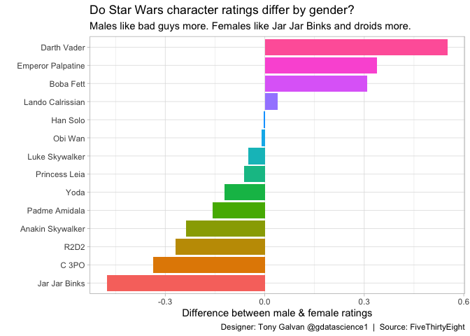

# 2018

**2 analyses** from the [TidyTuesday](https://github.com/rfordatascience/tidytuesday) project.

---

## May

<table>
<tr>
<td></td>
</tr>
<tr>
<td align="center"><a href="2018_05_14/">Star Wars</a></td>
</tr>
</table>

## November

<table>
<tr>
<td></td>
</tr>
<tr>
<td align="center"><a href="2018_11_06/">Wind</a></td>
</tr>
</table>
