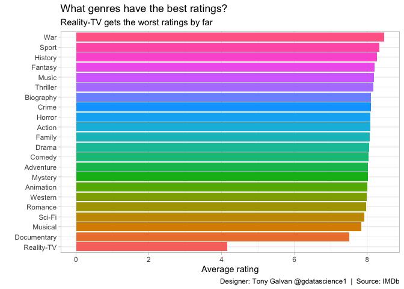
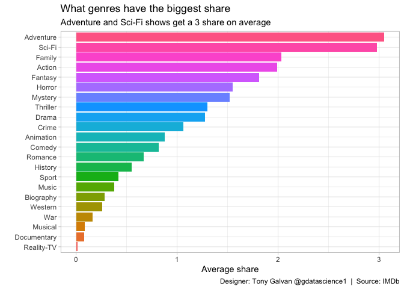

# The Golden Age of TV: What IMDb Ratings Reveal About Genre and Audience

**[Source Code](2019_01_08_tidy_tuesday_tv_ratings.Rmd)** | Data from the [TidyTuesday project](https://github.com/rfordatascience/tidytuesday/tree/master/data/2019/2019-01-08) (2019-01-08)


An exploration of 2,200+ IMDb season-level ratings spanning nearly three decades (1990–2018). The analysis reveals which TV genres consistently earn critical praise and which capture the largest audiences during what many call the "Golden Age of Television."

---

We’re living in what many call the “Golden Age of Television” — but does
the data back that up? With over 2,200 season-level ratings from IMDb
spanning nearly three decades (1990–2018), we can explore which genres
consistently earn critical praise and which ones capture the largest
audiences. Let’s dig into the numbers and see what patterns emerge.

## Loading the Data

We’ll pull the IMDb/Economist TV ratings dataset directly from the
TidyTuesday repository and take a first look at the summary statistics.

``` r
library(tidyverse)
theme_set(theme_light())

tv_ratings <- readr::read_csv("https://raw.githubusercontent.com/rfordatascience/tidytuesday/master/data/2019/2019-01-08/IMDb_Economist_tv_ratings.csv")

summary(tv_ratings)
```

    ##    titleId           seasonNumber       title                date           
    ##  Length:2266        Min.   : 1.000   Length:2266        Min.   :1990-01-03  
    ##  Class :character   1st Qu.: 1.000   Class :character   1st Qu.:2007-01-22  
    ##  Mode  :character   Median : 2.000   Mode  :character   Median :2012-12-07  
    ##                     Mean   : 3.264                      Mean   :2010-11-06  
    ##                     3rd Qu.: 4.000                      3rd Qu.:2016-03-08  
    ##                     Max.   :44.000                      Max.   :2018-10-10  
    ##    av_rating         share          genres         
    ##  Min.   :2.704   Min.   : 0.00   Length:2266       
    ##  1st Qu.:7.731   1st Qu.: 0.10   Class :character  
    ##  Median :8.115   Median : 0.32   Mode  :character  
    ##  Mean   :8.061   Mean   : 1.28                     
    ##  3rd Qu.:8.490   3rd Qu.: 1.09                     
    ##  Max.   :9.682   Max.   :55.65

This data includes 2266 television show ratings from Jan 1990 - Oct
2018.

## How Many Unique Shows Are There?

With over 2,000 ratings in the dataset, let’s figure out how many
distinct shows we’re actually looking at.

``` r
# unique titleId
summary(unique(tv_ratings$titleId))
```

    ##    Length     Class      Mode 
    ##       876 character character

``` r
# unique title
summary(unique(tv_ratings$title))
```

    ##    Length     Class      Mode 
    ##       868 character character

There are 876 unique shows, but only 868 unique titles. Some shows must
share the same title.

## Shows That Share a Title

It’s surprisingly common for different TV shows to reuse the same name —
reboots, international versions, or just coincidence. Let’s find them.

``` r
same_title <- tv_ratings |>
  group_by(title, titleId) |>
  summarise(avg_share = mean(share)) |>
  group_by(title) |>
  summarise(n = n()) |>
  filter(n > 1) |>
  pull(title)

tv_ratings |>
  filter(title %in% same_title) |>
  group_by(titleId, title) |>
  summarise(start_date = min(date)) |>
  arrange(title, start_date) |>
  ungroup() |>
  select(-titleId)
```

    ## # A tibble: 16 × 2
    ##    title                start_date
    ##    <chr>                <date>    
    ##  1 American Gothic      1995-09-22
    ##  2 American Gothic      2016-08-05
    ##  3 Battlestar Galactica 2003-12-08
    ##  4 Battlestar Galactica 2005-02-18
    ##  5 Deception            2013-01-07
    ##  6 Deception            2018-04-22
    ##  7 New Amsterdam        2008-03-04
    ##  8 New Amsterdam        2018-09-28
    ##  9 Parenthood           1990-11-13
    ## 10 Parenthood           2010-04-13
    ## 11 Prime Suspect        1991-04-07
    ## 12 Prime Suspect        2011-09-25
    ## 13 The Cape             1996-09-09
    ## 14 The Cape             2011-02-04
    ## 15 The Returned         2013-01-17
    ## 16 The Returned         2015-04-09

## Which Genres Get the Best Ratings?

Since many shows span multiple genres (e.g., “Crime,Drama,Mystery”),
we’ll split them out so each genre gets its own row. Then we can compare
average ratings across all genres.

``` r
tv_ratings_tidy <- tv_ratings |>
  mutate(genre = strsplit(genres, ",")) |>
  unnest(genre)

tv_ratings_tidy |>
  group_by(genre) |>
  summarise(avg_rating = mean(av_rating)) |>
  ungroup() |>
  mutate(genre = fct_reorder(genre, avg_rating)) |>
  ggplot(aes(genre, avg_rating, fill = genre)) +
  geom_col(show.legend = FALSE) +
  coord_flip() +
  labs(x = "",
       y = "Average rating",
       title = "What genres have the best ratings?",
       subtitle = "Reality-TV gets the worst ratings by far",
       caption = "Designer: Tony Galvan @gdatascience1  |  Source: IMDb")
```

<!-- -->

Reality-TV sits firmly at the bottom — perhaps unsurprising given the
genre’s reputation for quantity over quality. Documentary and War genres
lead the pack, suggesting that niche, high-effort productions tend to
earn stronger critical reception.

## Which Genres Capture the Biggest Audience Share?

Ratings measure quality, but audience share measures reach. A show can
be critically acclaimed but watched by few, or widely watched but poorly
rated. Let’s see which genres dominate in terms of viewership share.

``` r
tv_ratings_tidy |>
  group_by(genre) |>
  summarise(avg_share = mean(share)) |>
  ungroup() |>
  mutate(genre = fct_reorder(genre, avg_share)) |>
  ggplot(aes(genre, avg_share, fill = genre)) +
  geom_col(show.legend = FALSE) +
  coord_flip() +
  labs(x = "",
       y = "Average share",
       title = "What genres have the biggest share",
       subtitle = "Adventure and Sci-Fi shows get a 3 share on average",
       caption = "Designer: Tony Galvan @gdatascience1  |  Source: IMDb")
```

<!-- -->

Adventure and Sci-Fi shows command the largest average audience share —
these are the big-budget spectacles that draw viewers in. The gap
between “best rated” and “most watched” genres tells an interesting
story about the difference between critical quality and mass appeal.

## Building a Show-Level Dataset

Let’s aggregate the season-level data into a show-level summary,
capturing each show’s total seasons, rating range, and audience share
statistics.

``` r
tv_shows <- tv_ratings |>
  group_by(titleId, title) |>
  summarise(tot_seasons = n(),
            max_season = max(seasonNumber),
            min_date = min(date),
            max_date = max(date),
            avg_rating = mean(av_rating),
            max_rating = max(av_rating),
            min_rating = min(av_rating),
            tot_share = sum(share),
            avg_share = mean(share),
            max_share = max(share),
            min_share = min(share))
```

## The Highest-Rated Seasons of All Time

Which individual seasons earned the highest IMDb ratings? These
represent the absolute peaks of television quality according to viewer
scores.

``` r
tv_ratings |>
  arrange(desc(av_rating)) |>
  head(5)
```

    ## # A tibble: 5 × 7
    ##   titleId   seasonNumber title                 date       av_rating share genres
    ##   <chr>            <dbl> <chr>                 <date>         <dbl> <dbl> <chr> 
    ## 1 tt0098887            1 Parenthood            1990-11-13      9.68  1.68 Comed…
    ## 2 tt0106028            6 Homicide: Life on th… 1997-12-05      9.6   0.13 Crime…
    ## 3 tt0108968            5 Touched by an Angel   1998-11-15      9.6   0.08 Drama…
    ## 4 tt0903747            5 Breaking Bad          2013-02-20      9.55 19.0  Crime…
    ## 5 tt0944947            6 Game of Thrones       2016-05-25      9.49 15.2  Actio…

These top-rated seasons represent some of the most celebrated moments in
television history — the kind of seasons that spark water-cooler
conversations and define an era of storytelling.
