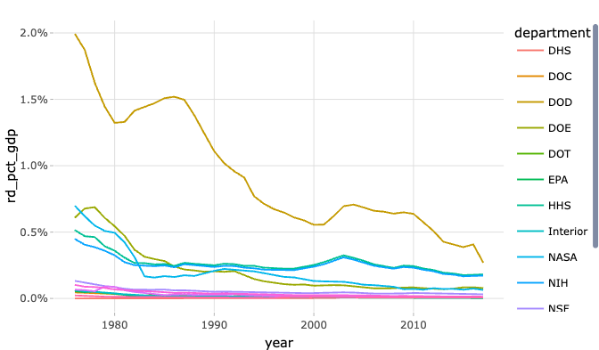
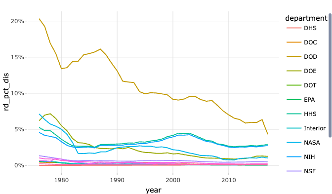

# Where Does America Invest in Science? Federal R&D Spending by Agency

**[Source Code](2019_02_12_tidy_tuesday_fed_spending.Rmd)** | Data from the [TidyTuesday project](https://github.com/rfordatascience/tidytuesday/tree/master/data/2019/2019-02-12) (2019-02-12)


An exploration of how federal research and development spending has evolved over four decades. From the Department of Defense to the National Institutes of Health, each agency's R&D budget reflects shifting national priorities in science, technology, and innovation.

---

Federal research and development spending shapes the future of American
science, technology, and innovation. From the Department of Defense to
the National Institutes of Health, each agency’s R&D budget reflects
national priorities — and those priorities have shifted dramatically
over four decades. Let’s explore how federal R&D spending has evolved
from 1976 to 2017, both as a share of GDP and as a fraction of
discretionary spending.

## Loading the Data

We’ll use the `plotly` package for interactive exploration, which lets
us hover over individual agencies to trace their funding trajectories.

``` r
library(tidyverse)
library(plotly)

theme_set(theme_light())

fed_rd <- readr::read_csv("https://raw.githubusercontent.com/rfordatascience/tidytuesday/master/data/2019/2019-02-12/fed_r_d_spending.csv")
```

## Profiling the Dataset

Let’s get a sense of the data’s structure and coverage.

``` r
fed_rd |> 
    summary()
```

    ##   department             year        rd_budget         total_outlays      
    ##  Length:588         Min.   :1976   Min.   :0.000e+00   Min.   :3.718e+11  
    ##  Class :character   1st Qu.:1986   1st Qu.:9.020e+08   1st Qu.:9.904e+11  
    ##  Mode  :character   Median :1996   Median :1.888e+09   Median :1.581e+12  
    ##                     Mean   :1996   Mean   :1.035e+10   Mean   :1.880e+12  
    ##                     3rd Qu.:2007   3rd Qu.:1.206e+10   3rd Qu.:2.729e+12  
    ##                     Max.   :2017   Max.   :9.432e+10   Max.   :3.982e+12  
    ##  discretionary_outlays      gdp           
    ##  Min.   :1.756e+11     Min.   :1.790e+12  
    ##  1st Qu.:4.385e+11     1st Qu.:4.536e+12  
    ##  Median :5.460e+11     Median :8.230e+12  
    ##  Mean   :6.942e+11     Mean   :9.175e+12  
    ##  3rd Qu.:1.042e+12     3rd Qu.:1.432e+13  
    ##  Max.   :1.347e+12     Max.   :1.918e+13

This data contains 588 total observations from 1976 to 2017.

## Engineering New Metrics

Raw dollar amounts don’t tell the full story — a billion dollars meant
something very different in 1976 than in 2017. To make meaningful
comparisons across time, we’ll compute R&D spending as a percentage of
GDP, total federal outlays, and discretionary outlays.

``` r
fed_rd_processed <- fed_rd |>
    mutate(rd_pct_gdp = rd_budget / gdp, 
            rd_pct_tot = rd_budget / total_outlays, 
        rd_pct_dis = rd_budget / discretionary_outlays)
```

## R&D as a Percentage of GDP

This view shows how much of the nation’s total economic output goes
toward federally funded research. A declining share might indicate that
private-sector R&D is growing faster, or that federal priorities have
shifted away from research.

``` r
p <- fed_rd_processed |> 
    ggplot(aes(year, rd_pct_gdp, color = department)) +
    geom_line() + 
    scale_y_continuous(labels = scales::percent_format())
    
ggplotly(p) 
```

<!-- -->

The Department of Defense dominates federal R&D spending as a share of
GDP, though its share has declined steadily since the Cold War peak.
NASA’s share shows a dramatic spike during the Space Race era before
settling into a much smaller footprint.

## R&D as a Percentage of Discretionary Outlays

Discretionary spending is the portion of the budget that Congress
actively decides each year (as opposed to mandatory programs like Social
Security). Looking at R&D as a share of discretionary outlays reveals
how much of the “controllable” budget goes to research.

``` r
p <- fed_rd_processed |> 
    ggplot(aes(year, rd_pct_dis, color = department)) +
    geom_line() + 
    scale_y_continuous(labels = scales::percent_format())
    
ggplotly(p) 
```

<!-- -->

This perspective tells a slightly different story — while R&D’s share of
GDP has declined, its share of discretionary spending has been more
stable for some agencies, suggesting that the decline is partly driven
by GDP growth outpacing budget growth rather than active cuts to
research funding.
