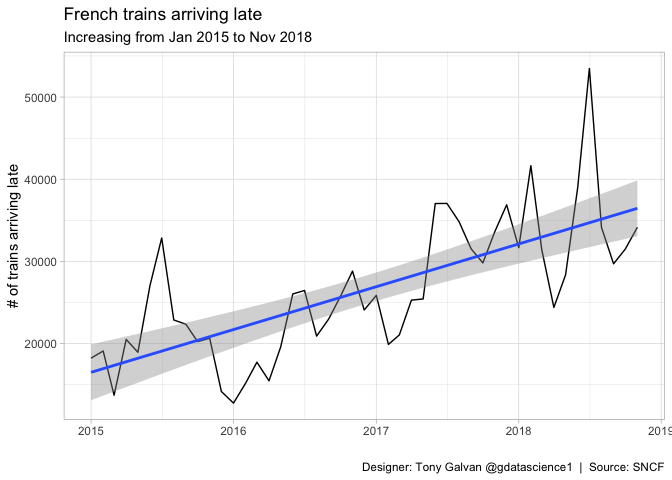
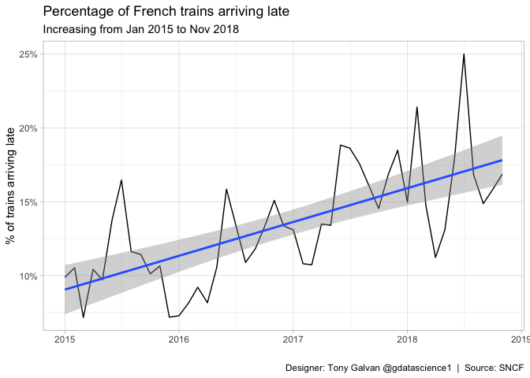
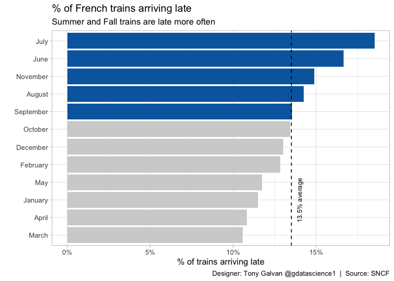

# Running Late: Are French Trains Getting Worse Over Time?

**[Source Code](2019_02_26_tidy_tuesday_french_trains.Rmd)** | Data from the [TidyTuesday project](https://github.com/rfordatascience/tidytuesday/tree/master/data/2019/2019-02-26) (2019-02-26)


With nearly four years of SNCF delay data (January 2015 through November 2018), this analysis tracks whether France's busy rail network is getting less reliable. The data identifies which months are the worst offenders for late arrivals and whether delays are trending upward.

---

France’s SNCF rail network is one of Europe’s busiest — but is it
getting less reliable? With nearly four years of delay data (January
2015 through November 2018), we can track whether late arrivals are
trending upward and identify which months are the worst offenders. If
you’re planning a trip through France, this analysis might help you pick
the right time to travel.

## Loading the Data

``` r
library(tidyverse)

theme_set(theme_light())
```

``` r
small_trains <- readr::read_csv("https://raw.githubusercontent.com/rfordatascience/tidytuesday/master/data/2019/2019-02-26/small_trains.csv") 
```

## Exploring the Dataset

Let’s get a sense of what variables we’re working with and the time
range covered.

``` r
glimpse(small_trains)
```

    ## Rows: 32,772
    ## Columns: 13
    ## $ year                    <dbl> 2017, 2017, 2017, 2017, 2017, 2017, 2017, 2017…
    ## $ month                   <dbl> 9, 9, 9, 9, 9, 9, 9, 9, 9, 9, 9, 9, 9, 9, 9, 9…
    ## $ service                 <chr> "National", "National", "National", "National"…
    ## $ departure_station       <chr> "PARIS EST", "REIMS", "PARIS EST", "PARIS LYON…
    ## $ arrival_station         <chr> "METZ", "PARIS EST", "STRASBOURG", "AVIGNON TG…
    ## $ journey_time_avg        <dbl> 85.13378, 47.06452, 116.23494, 161.08958, 164.…
    ## $ total_num_trips         <dbl> 299, 218, 333, 481, 190, 191, 208, 216, 661, 2…
    ## $ avg_delay_all_departing <dbl> 0.7520067, 1.2635177, 1.1392570, 1.4062153, 1.…
    ## $ avg_delay_all_arriving  <dbl> 0.4198439, 1.1375576, 1.5863956, 4.7885417, 6.…
    ## $ num_late_at_departure   <dbl> 15, 10, 20, 36, 16, 18, 49, 24, 141, 23, 33, 5…
    ## $ num_arriving_late       <dbl> 17, 23, 19, 61, 38, 18, 38, 37, 122, 26, 64, 6…
    ## $ delay_cause             <chr> "delay_cause_external_cause", "delay_cause_ext…
    ## $ delayed_number          <dbl> 0.25000000, 0.25000000, 0.21428571, 0.15517241…

## Creating a Date Variable

We’ll combine the year and month columns into a proper date for
time-series plotting.

``` r
trains_processed <- small_trains |>
  mutate(date = lubridate::ymd(paste(year, month, 1, sep = "-")))

summary(trains_processed$date)
```

    ##         Min.      1st Qu.       Median         Mean      3rd Qu.         Max. 
    ## "2015-01-01" "2016-01-01" "2017-01-01" "2016-12-20" "2018-01-01" "2018-11-01"

The data goes from January 2015 to November 2018. Let’s plot the number
of trains arriving late over time.

## Raw Count of Late Arrivals

First, let’s look at the absolute number of trains arriving late each
month. An upward trend here could mean more delays — or simply more
trains running.

``` r
trains_processed |>
  group_by(date) |>
  summarise(late_total = sum(num_arriving_late, na.rm = TRUE)) |>
  ggplot(aes(date, late_total)) +
  geom_line() + 
  geom_smooth(method = "lm") +
  labs(x = "",
       y = "# of trains arriving late",
       title = "French trains arriving late",
       subtitle = "Increasing from Jan 2015 to Nov 2018",
       caption = "Designer: Tony Galvan @gdatascience1  |  Source: SNCF")
```

<!-- -->

The raw count is clearly trending upward, but we need to normalize by
total trips to know if the *rate* of delays is actually worsening.

## Percentage of Trains Arriving Late

This is the more meaningful metric — what fraction of all trips arrive
late?

``` r
trains_processed |>
  group_by(date) |>
  summarise(pct_late = sum(num_arriving_late, na.rm = TRUE) / 
              sum(total_num_trips, na.rm = TRUE)) |>
  ggplot(aes(date, pct_late)) +
  geom_line() + 
  scale_y_continuous(labels = scales::percent_format()) +
  geom_smooth(method = "lm") +
  labs(x = "",
       y = "% of trains arriving late",
       title = "Percentage of French trains arriving late",
       subtitle = "Increasing from Jan 2015 to Nov 2018",
       caption = "Designer: Tony Galvan @gdatascience1  |  Source: SNCF")
```

<!-- -->

Even as a percentage, late arrivals are trending upward. The SNCF
network appears to be getting less punctual over this period.

## Seasonal Patterns: Which Months Are Worst?

Are there predictable seasonal patterns? If so, travelers could plan
around the worst months.

``` r
avg_pct_late <- sum(trains_processed$num_arriving_late, na.rm = TRUE) / 
  sum(trains_processed$total_num_trips, na.rm = TRUE)

p <- trains_processed |>
  mutate(month_name = month.name[month]) |>
  group_by(month_name) |>
  summarise(pct_late = sum(num_arriving_late, na.rm = TRUE) / 
              sum(total_num_trips, na.rm = TRUE)) |>
  mutate(month_name = fct_reorder(month_name, pct_late),
         above_or_below_avg = if_else(pct_late > avg_pct_late, "above", "below")) |>
  ggplot(aes(month_name, pct_late, fill = above_or_below_avg)) +
  geom_col(show.legend = FALSE) +
  scale_y_continuous(labels = scales::percent_format()) +
  scale_fill_manual(values = c("#0568ae", "#d2d2d2")) +
  geom_hline(yintercept = avg_pct_late, linetype = 2) +
  annotate("text", x = "January", y = avg_pct_late + 0.005, angle = 90, 
           size = 3, label = "13.5% average") +
  coord_flip() +
  labs(x = "",
       y = "% of trains arriving late",
       title = "% of French trains arriving late",
       subtitle = "Summer and Fall trains are late more often",
       caption = "Designer: Tony Galvan @gdatascience1  |  Source: SNCF")
p
```

<!-- -->

``` r
ggsave("outputs/2019_02_26_tidy_tuesday_french_trains.png", p)
```

Summer and fall months consistently exceed the 13.5% average delay rate.
July and October are the worst — likely due to vacation travel surges
and autumn weather disruptions. If you want the most punctual French
train experience, aim for February or March.
