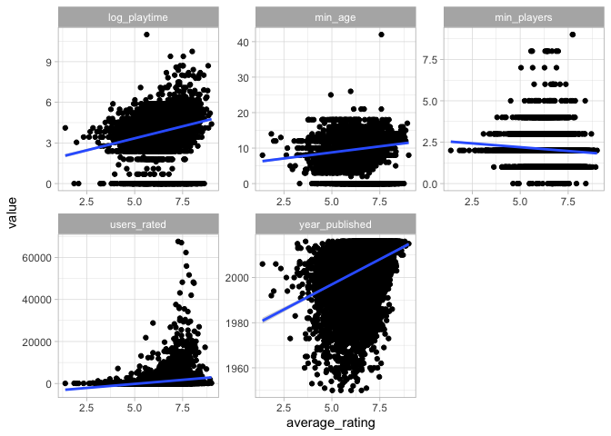
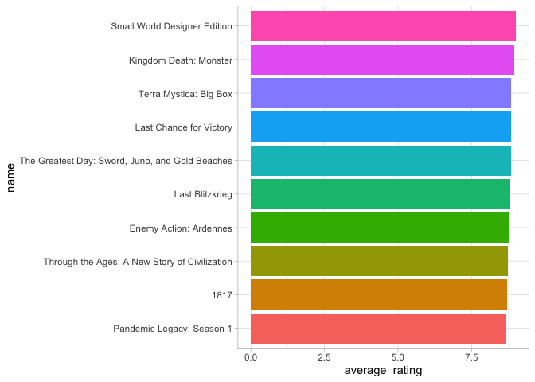
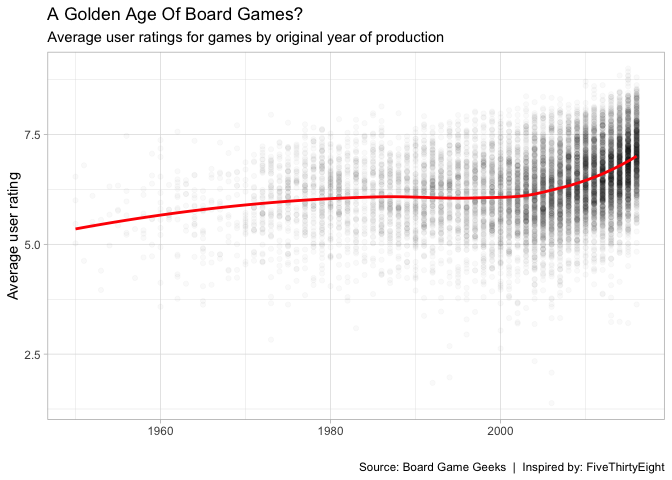
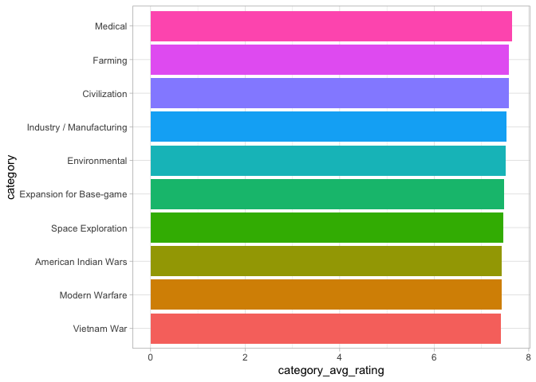
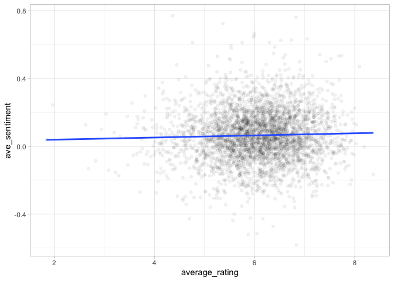
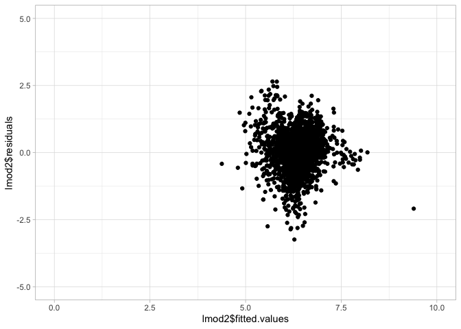
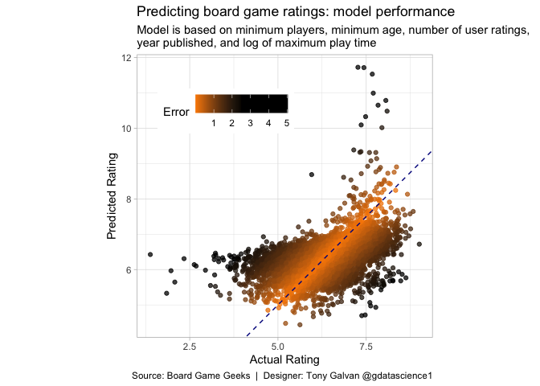

# Predicting Board Game Ratings: From Sentiment Analysis to Linear Models

**[Source Code](2019_03_12_tidy_tuesday_board_games.Rmd)** | Data from the [TidyTuesday project](https://github.com/rfordatascience/tidytuesday/tree/master/data/2019/2019-03-12) (2019-03-12)


Board games are experiencing a renaissance, and Board Game Geek has become the definitive rating platform. This analysis explores what makes a board game highly rated — play time, complexity, theme — and builds a linear model to predict ratings from game characteristics and description sentiment.

---

Board games are experiencing a renaissance. From Catan to Gloomhaven,
the hobby has exploded in popularity — and Board Game Geek (BGG) has
become the definitive rating platform for the community. But what makes
a board game highly rated? Is it the play time, the complexity, the
theme? Let’s explore the BGG dataset and see if we can build a model
that predicts a game’s rating from its attributes.

## Loading the Data

    ## Rows: 10,532
    ## Columns: 22
    ## $ game_id        <dbl> 1, 2, 3, 4, 5, 6, 7, 8, 9, 10, 11, 12, 13, 14, 15, 16, …
    ## $ description    <chr> "Die Macher is a game about seven sequential political …
    ## $ image          <chr> "//cf.geekdo-images.com/images/pic159509.jpg", "//cf.ge…
    ## $ max_players    <dbl> 5, 4, 4, 4, 6, 6, 2, 5, 4, 6, 7, 5, 4, 4, 6, 4, 2, 8, 4…
    ## $ max_playtime   <dbl> 240, 30, 60, 60, 90, 240, 20, 120, 90, 60, 45, 60, 120,…
    ## $ min_age        <dbl> 14, 12, 10, 12, 12, 12, 8, 12, 13, 10, 13, 12, 10, 10, …
    ## $ min_players    <dbl> 3, 3, 2, 2, 3, 2, 2, 2, 2, 2, 2, 2, 3, 3, 2, 3, 2, 2, 2…
    ## $ min_playtime   <dbl> 240, 30, 30, 60, 90, 240, 20, 120, 90, 60, 45, 45, 60, …
    ## $ name           <chr> "Die Macher", "Dragonmaster", "Samurai", "Tal der König…
    ## $ playing_time   <dbl> 240, 30, 60, 60, 90, 240, 20, 120, 90, 60, 45, 60, 120,…
    ## $ thumbnail      <chr> "//cf.geekdo-images.com/images/pic159509_t.jpg", "//cf.…
    ## $ year_published <dbl> 1986, 1981, 1998, 1992, 1964, 1989, 1978, 1993, 1998, 1…
    ## $ artist         <chr> "Marcus Gschwendtner", "Bob Pepper", "Franz Vohwinkel",…
    ## $ category       <chr> "Economic,Negotiation,Political", "Card Game,Fantasy", …
    ## $ compilation    <chr> NA, NA, NA, NA, NA, NA, NA, NA, NA, NA, NA, NA, "CATAN …
    ## $ designer       <chr> "Karl-Heinz Schmiel", "G. W. \"Jerry\" D'Arcey", "Reine…
    ## $ expansion      <chr> NA, NA, NA, NA, NA, NA, NA, NA, NA, "Elfengold,Elfenlan…
    ## $ family         <chr> "Country: Germany,Valley Games Classic Line", "Animals:…
    ## $ mechanic       <chr> "Area Control / Area Influence,Auction/Bidding,Dice Rol…
    ## $ publisher      <chr> "Hans im Glück Verlags-GmbH,Moskito Spiele,Valley Games…
    ## $ average_rating <dbl> 7.66508, 6.60815, 7.44119, 6.60675, 7.35830, 6.52534, 6…
    ## $ users_rated    <dbl> 4498, 478, 12019, 314, 15195, 73, 2751, 186, 1263, 6729…

## Exploring Relationships with Rating

Let’s visualize how average rating correlates with several numeric
variables — play time, minimum age, player count, year published, and
number of user ratings.

``` r
board_games |>
  mutate(log_playtime = log(max_playtime+1)) |>
  select(average_rating, log_playtime, min_age, min_players, 
         year_published, users_rated) |>
  gather(variable, value, -average_rating) |>
  ggplot(aes(average_rating, value)) +
  geom_point() +
  geom_smooth(method = "lm") +
  facet_wrap(~variable, scales = "free")
```

<!-- -->

The number of user ratings shows the strongest positive relationship
with average rating — popular games tend to be well-rated games (or
perhaps well-rated games attract more raters).

## The Highest-Rated Games

Which games sit at the very top of the BGG rankings?

``` r
board_games |>
  top_n(10, wt = average_rating) |>
  mutate(name = fct_reorder(name, average_rating)) |>
  ggplot(aes(name, average_rating, fill = name)) + 
  geom_col(show.legend = FALSE) +
  coord_flip()
```

<!-- -->

## A Golden Age of Board Games?

FiveThirtyEight famously asked whether we’re in a “Golden Age” of board
games. Let’s recreate that analysis — are newer games rated higher than
older ones?

``` r
board_games |>
  ggplot(aes(year_published, average_rating)) +
  geom_point(alpha = 0.025) + 
  geom_smooth(method = "loess", se = FALSE, color = "red") +
  labs(x = "",
       y = "Average user rating",
       title = "A Golden Age Of Board Games?",
       subtitle = "Average user ratings for games by original year of production",
       caption = "Source: Board Game Geeks  |  Inspired by: FiveThirtyEight")
```

<!-- -->

The upward trend is clear — games published in recent years tend to
receive higher ratings. Whether that’s because game design has genuinely
improved or because of survivorship bias (only good modern games get
rated) is an open question.

## Which Categories Get the Highest Ratings?

Let’s split multi-category games into individual rows and find which
game categories earn the best scores.

``` r
categories <- board_games |>
  unnest(category = strsplit(category, ","))

glimpse(categories)
```

    ## Rows: 27,514
    ## Columns: 22
    ## $ game_id        <dbl> 1, 1, 1, 2, 2, 3, 3, 4, 5, 6, 6, 7, 8, 8, 9, 10, 10, 11…
    ## $ description    <chr> "Die Macher is a game about seven sequential political …
    ## $ image          <chr> "//cf.geekdo-images.com/images/pic159509.jpg", "//cf.ge…
    ## $ max_players    <dbl> 5, 5, 5, 4, 4, 4, 4, 4, 6, 6, 6, 2, 5, 5, 4, 6, 6, 7, 7…
    ## $ max_playtime   <dbl> 240, 240, 240, 30, 30, 60, 60, 60, 90, 240, 240, 20, 12…
    ## $ min_age        <dbl> 14, 14, 14, 12, 12, 10, 10, 12, 12, 12, 12, 8, 12, 12, …
    ## $ min_players    <dbl> 3, 3, 3, 3, 3, 2, 2, 2, 3, 2, 2, 2, 2, 2, 2, 2, 2, 2, 2…
    ## $ min_playtime   <dbl> 240, 240, 240, 30, 30, 30, 30, 60, 90, 240, 240, 20, 12…
    ## $ name           <chr> "Die Macher", "Die Macher", "Die Macher", "Dragonmaster…
    ## $ playing_time   <dbl> 240, 240, 240, 30, 30, 60, 60, 60, 90, 240, 240, 20, 12…
    ## $ thumbnail      <chr> "//cf.geekdo-images.com/images/pic159509_t.jpg", "//cf.…
    ## $ year_published <dbl> 1986, 1986, 1986, 1981, 1981, 1998, 1998, 1992, 1964, 1…
    ## $ artist         <chr> "Marcus Gschwendtner", "Marcus Gschwendtner", "Marcus G…
    ## $ category       <chr> "Economic", "Negotiation", "Political", "Card Game", "F…
    ## $ compilation    <chr> NA, NA, NA, NA, NA, NA, NA, NA, NA, NA, NA, NA, NA, NA,…
    ## $ designer       <chr> "Karl-Heinz Schmiel", "Karl-Heinz Schmiel", "Karl-Heinz…
    ## $ expansion      <chr> NA, NA, NA, NA, NA, NA, NA, NA, NA, NA, NA, NA, NA, NA,…
    ## $ family         <chr> "Country: Germany,Valley Games Classic Line", "Country:…
    ## $ mechanic       <chr> "Area Control / Area Influence,Auction/Bidding,Dice Rol…
    ## $ publisher      <chr> "Hans im Glück Verlags-GmbH,Moskito Spiele,Valley Games…
    ## $ average_rating <dbl> 7.66508, 7.66508, 7.66508, 6.60815, 6.60815, 7.44119, 7…
    ## $ users_rated    <dbl> 4498, 4498, 4498, 478, 478, 12019, 12019, 314, 15195, 7…

``` r
categories |>
  mutate(total_rating = average_rating * users_rated) |>
  group_by(category) |>
  summarise(n = n(),
            category_user_ratings = sum(users_rated),
            category_rating = sum(total_rating),
            category_avg_rating = category_rating / category_user_ratings) |>
  ungroup() |>
  top_n(10, wt = category_avg_rating) |>
  mutate(category = fct_reorder(category, category_avg_rating)) |>
  ggplot(aes(category, category_avg_rating, fill = category)) + 
  geom_col(show.legend = FALSE) + 
  coord_flip()
```

<!-- -->

## Text Mining: What Words Appear in Game Descriptions?

Let’s use text mining to explore the most common words in board game
descriptions, filtering out generic terms like “game” and “player.”

``` r
library(tidytext)

board_games |>
  unnest_tokens(tbl = ., output = word, input = description) |>
  count(word, sort = TRUE) |>
  mutate(word = str_to_lower(word)) |>
  filter(is.na(as.numeric(word)) & !word %in% c("game", "player", "players")) |>
  anti_join(get_stopwords()) |>
  filter(n > 1000) |>
  na.omit() |>
  wordcloud2::wordcloud2(shape = "cardiod")
```

## Sentiment Analysis: Do Positive Descriptions Mean Higher Ratings?

Intuitively, games with more positively-worded descriptions might also
be better games. Let’s test that hypothesis using sentiment analysis on
the description text.

``` r
library(sentimentr)

game_sentiment <- board_games |>
  pull(description) |>
  get_sentences() |>
  sentiment_by()

glimpse(game_sentiment)
```

    ## Rows: 10,532
    ## Columns: 4
    ## $ element_id    <int> 1, 2, 3, 4, 5, 6, 7, 8, 9, 10, 11, 12, 13, 14, 15, 16, 1…
    ## $ word_count    <int> 216, 156, 190, 101, 192, 69, 106, 103, 157, 711, 174, 23…
    ## $ sd            <dbl> 0.20471612, 0.27917598, 0.13639933, 0.31031675, 0.191915…
    ## $ ave_sentiment <dbl> 0.280294601, 0.099046275, 0.198267997, 0.054002183, 0.33…

``` r
board_games |>
  inner_join(game_sentiment, by = c("game_id" = "element_id")) |>
  ggplot(aes(average_rating, ave_sentiment)) +
  geom_point(alpha = 0.05) + 
  geom_smooth(method = "lm", se = FALSE)
```

<!-- -->

There’s a slight positive relationship — games with more positive
description sentiment tend to have slightly higher ratings, though the
effect is modest.

## Building a Predictive Model

Can we predict a board game’s rating from its measurable attributes?
Let’s split the data into training and test sets and fit a linear model.

``` r
#split the data into test/training sets
n <- nrow(board_games)
set.seed(1874)
test_index <- sample.int(n,size=round(0.2*n))
games_train <- board_games[test_index,]
games_test <- board_games[-test_index,]

lmod1 <- lm(average_rating ~ max_players + log(max_playtime+1) + min_age + 
       min_players + log(min_playtime+1) + year_published + users_rated, 
     data = games_train)

summary(lmod1)
```

    ## 
    ## Call:
    ## lm(formula = average_rating ~ max_players + log(max_playtime + 
    ##     1) + min_age + min_players + log(min_playtime + 1) + year_published + 
    ##     users_rated, data = games_train)
    ## 
    ## Residuals:
    ##     Min      1Q  Median      3Q     Max 
    ## -3.2377 -0.4216  0.0212  0.4280  2.6473 
    ## 
    ## Coefficients:
    ##                         Estimate Std. Error t value Pr(>|t|)    
    ## (Intercept)           -4.450e+01  2.707e+00 -16.435  < 2e-16 ***
    ## max_players           -8.207e-04  6.961e-04  -1.179   0.2385    
    ## log(max_playtime + 1)  2.026e-01  3.773e-02   5.371 8.70e-08 ***
    ## min_age                1.415e-02  5.001e-03   2.830   0.0047 ** 
    ## min_players           -1.379e-01  2.532e-02  -5.445 5.79e-08 ***
    ## log(min_playtime + 1)  9.463e-04  4.001e-02   0.024   0.9811    
    ## year_published         2.505e-02  1.346e-03  18.609  < 2e-16 ***
    ## users_rated            8.211e-05  7.652e-06  10.730  < 2e-16 ***
    ## ---
    ## Signif. codes:  0 '***' 0.001 '**' 0.01 '*' 0.05 '.' 0.1 ' ' 1
    ## 
    ## Residual standard error: 0.7369 on 2098 degrees of freedom
    ## Multiple R-squared:  0.249,  Adjusted R-squared:  0.2464 
    ## F-statistic: 99.35 on 7 and 2098 DF,  p-value: < 2.2e-16

## Feature Selection with Stepwise AIC

Let’s use stepwise selection to find the most parsimonious model that
still explains the variance well.

``` r
lmod2 <- MASS::stepAIC(lmod1)
```

    ## Start:  AIC=-1277.98
    ## average_rating ~ max_players + log(max_playtime + 1) + min_age + 
    ##     min_players + log(min_playtime + 1) + year_published + users_rated
    ## 
    ##                         Df Sum of Sq    RSS      AIC
    ## - log(min_playtime + 1)  1     0.000 1139.2 -1279.98
    ## - max_players            1     0.755 1140.0 -1278.59
    ## <none>                               1139.2 -1277.98
    ## - min_age                1     4.350 1143.6 -1271.96
    ## - log(max_playtime + 1)  1    15.665 1154.9 -1251.22
    ## - min_players            1    16.098 1155.3 -1250.43
    ## - users_rated            1    62.523 1201.8 -1167.46
    ## - year_published         1   188.045 1327.3  -958.24
    ## 
    ## Step:  AIC=-1279.98
    ## average_rating ~ max_players + log(max_playtime + 1) + min_age + 
    ##     min_players + year_published + users_rated
    ## 
    ##                         Df Sum of Sq    RSS      AIC
    ## - max_players            1     0.767 1140.0 -1280.57
    ## <none>                               1139.2 -1279.98
    ## - min_age                1     4.401 1143.6 -1273.86
    ## - min_players            1    16.107 1155.3 -1252.41
    ## - users_rated            1    62.539 1201.8 -1169.43
    ## - log(max_playtime + 1)  1    92.514 1231.8 -1117.55
    ## - year_published         1   194.482 1333.7  -950.05
    ## 
    ## Step:  AIC=-1280.57
    ## average_rating ~ log(max_playtime + 1) + min_age + min_players + 
    ##     year_published + users_rated
    ## 
    ##                         Df Sum of Sq    RSS      AIC
    ## <none>                               1140.0 -1280.57
    ## - min_age                1     4.421 1144.4 -1274.41
    ## - min_players            1    16.563 1156.6 -1252.19
    ## - users_rated            1    62.465 1202.5 -1170.22
    ## - log(max_playtime + 1)  1    92.666 1232.7 -1117.98
    ## - year_published         1   193.953 1334.0  -951.68

``` r
summary(lmod2)
```

    ## 
    ## Call:
    ## lm(formula = average_rating ~ log(max_playtime + 1) + min_age + 
    ##     min_players + year_published + users_rated, data = games_train)
    ## 
    ## Residuals:
    ##     Min      1Q  Median      3Q     Max 
    ## -3.2381 -0.4225  0.0217  0.4295  2.6490 
    ## 
    ## Coefficients:
    ##                         Estimate Std. Error t value Pr(>|t|)    
    ## (Intercept)           -4.440e+01  2.658e+00 -16.702  < 2e-16 ***
    ## log(max_playtime + 1)  2.036e-01  1.558e-02  13.065  < 2e-16 ***
    ## min_age                1.420e-02  4.975e-03   2.854  0.00436 ** 
    ## min_players           -1.396e-01  2.527e-02  -5.524 3.73e-08 ***
    ## year_published         2.500e-02  1.323e-03  18.902  < 2e-16 ***
    ## users_rated            8.206e-05  7.650e-06  10.727  < 2e-16 ***
    ## ---
    ## Signif. codes:  0 '***' 0.001 '**' 0.01 '*' 0.05 '.' 0.1 ' ' 1
    ## 
    ## Residual standard error: 0.7368 on 2100 degrees of freedom
    ## Multiple R-squared:  0.2485, Adjusted R-squared:  0.2467 
    ## F-statistic: 138.8 on 5 and 2100 DF,  p-value: < 2.2e-16

## Checking for Outliers

We’ll use Cook’s distance to identify any observations that have
outsized influence on the model.

``` r
summary(cooks.distance(lmod2))
```

    ##      Min.   1st Qu.    Median      Mean   3rd Qu.      Max. 
    ## 0.000e+00 1.857e-05 9.995e-05 7.142e-04 3.826e-04 2.478e-01

Since there are no values greater than 1, we assume there are no
outliers.

## Validating Model Assumptions

A residuals-vs-fitted plot helps us check whether the model’s
assumptions (constant variance, linearity) hold.

``` r
ggplot(data = lmod2, aes(lmod2$fitted.values, lmod2$residuals)) + 
  geom_point() +
  scale_x_continuous(limits = c(0,10)) + 
  scale_y_continuous(limits = c(-5,5))
```

<!-- -->

The points are not in a cone shape. The variance appears to be constant.

## Testing the Model on Held-Out Data

The real test — how well does our model predict ratings for games it
hasn’t seen?

``` r
games_test |>
  mutate(pred = predict(lmod2, newdata = games_test),
         error = abs(pred - average_rating)) |>
  ggplot(aes(average_rating, pred, color = error)) +
  geom_point(alpha = 0.75) + 
  geom_abline(slope = 1, intercept = 0, color = "darkblue", linetype = 2) +
  coord_equal() + 
  scale_color_gradient2(low = "darkorange", mid = "black", high = "black", 
                        midpoint = 2.5) + 
  theme(legend.position = c(0.3, 0.8),
        legend.direction = "horizontal") +
  labs(x = "Actual Rating",
       y = "Predicted Rating",
       color = "Error",
       title = "Predicting board game ratings: model performance",
       subtitle = "Model is based on minimum players, minimum age, number of user ratings, \nyear published, and log of maximum play time",
       caption = default_caption)
```

<!-- -->

``` r
#ggsave("outputs/2019_03_12_tidy_tuesday_board_games.png", height = 5.25, width = 5.25)
```

The model does a reasonable job — most predictions cluster near the
diagonal line (perfect prediction), with the largest errors occurring
for games at the extremes of the rating scale. The number of user
ratings and year published are the strongest predictors, suggesting that
popularity and recency are the best proxies for quality in this dataset.
