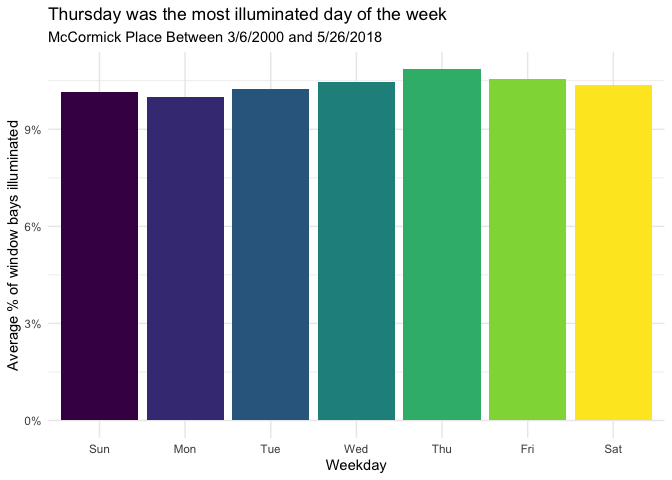
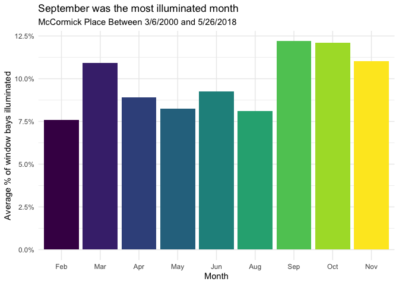
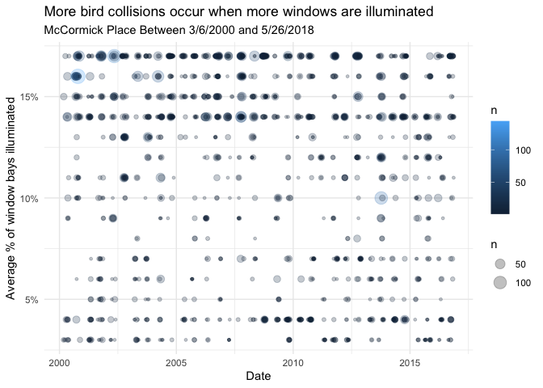
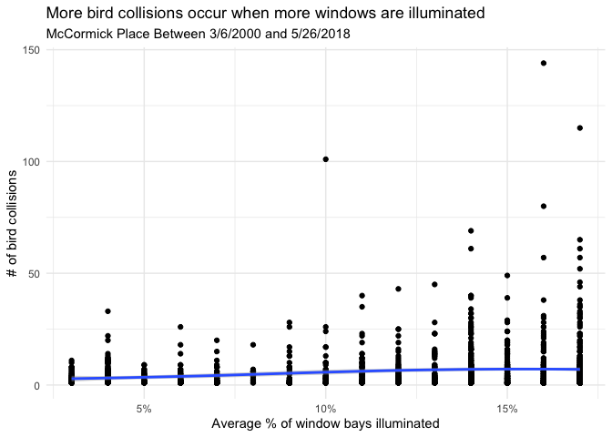

# Lights Out for Birds: How Building Illumination Drives Collision Deaths in Chicago

**[Source Code](2019_04_30_tidy_tuesday_bird_collisions.Rmd)** | Data from the [TidyTuesday project](https://github.com/rfordatascience/tidytuesday/tree/master/data/2019/2019-04-30) (2019-04-30)


Researchers at McCormick Place in Chicago have tracked bird collisions since 1978, pairing collision counts with detailed lighting data. This analysis directly tests whether turning off lights saves bird lives — and the answer is striking.

---

Every year, hundreds of millions of birds die from collisions with
buildings in the United States. In Chicago, researchers have been
tracking these collisions at McCormick Place — one of the largest
convention centers in North America — since 1978. What makes this
dataset special is that it pairs collision counts with detailed lighting
data, letting us directly test whether turning off lights saves bird
lives. The answer is striking.

## Loading the Data

We have two datasets: bird collision records spanning nearly four
decades, and nightly light scores at McCormick Place measuring what
fraction of window bays were illuminated.

``` r
library(tidyverse)

theme_set(theme_minimal())

bird_collisions <- readr::read_csv("https://raw.githubusercontent.com/rfordatascience/tidytuesday/master/data/2019/2019-04-30/bird_collisions.csv")
mp_light <- readr::read_csv("https://raw.githubusercontent.com/rfordatascience/tidytuesday/master/data/2019/2019-04-30/mp_light.csv")
```

## Exploring the Collision Data

``` r
glimpse(bird_collisions)
```

    ## Rows: 69,695
    ## Columns: 8
    ## $ genus       <chr> "Passerculus", "Passerculus", "Passerculus", "Passerculus"…
    ## $ species     <chr> "sandwichensis", "sandwichensis", "sandwichensis", "sandwi…
    ## $ date        <date> 1978-10-27, 1979-10-23, 1980-04-19, 1981-09-23, 1982-05-2…
    ## $ locality    <chr> "MP", "MP", "MP", "MP", "MP", "MP", "MP", "MP", "MP", "MP"…
    ## $ family      <chr> "Passerellidae", "Passerellidae", "Passerellidae", "Passer…
    ## $ flight_call <chr> "Yes", "Yes", "Yes", "Yes", "Yes", "Yes", "Yes", "Yes", "Y…
    ## $ habitat     <chr> "Open", "Open", "Open", "Open", "Open", "Open", "Open", "O…
    ## $ stratum     <chr> "Lower", "Lower", "Lower", "Lower", "Lower", "Lower", "Low…

``` r
summary(bird_collisions$date)
```

    ##         Min.      1st Qu.       Median         Mean      3rd Qu.         Max. 
    ## "1978-09-15" "1992-10-12" "2006-09-07" "2002-05-26" "2011-10-14" "2016-11-30"

The “bird_collisions” data contains observations of birds colliding with
various lighted structures in Chicago from 9/15/1978 to 11/30/2016.

## Understanding the Light Score Data

``` r
mp_light |>
  summary()
```

    ##       date             light_score   
    ##  Min.   :2000-03-06   Min.   : 3.00  
    ##  1st Qu.:2004-11-20   1st Qu.: 4.00  
    ##  Median :2009-09-04   Median :11.00  
    ##  Mean   :2009-07-17   Mean   :10.38  
    ##  3rd Qu.:2013-11-07   3rd Qu.:15.00  
    ##  Max.   :2018-05-26   Max.   :17.00

The “mp_light” data contains light scores (proportion of the 17 window
bays that were illuminated) at McCormick Place in Chicago between
3/6/2000 and 5/26/2018.

Are there dates with multiple light_scores?

``` r
mp_light_processed <- mp_light |>
  group_by(date) |>
  summarise(n = n()) |>
  filter(n == 1) |>
  select(date) |>
  left_join(mp_light)
```

## Illumination by Day of the Week

Let’s see if there’s a pattern in how brightly the building is lit based
on the day of the week — convention schedules likely drive this.

``` r
mp_light_processed |>
  mutate(weekday = lubridate::wday(date, label = TRUE)) |>
  group_by(weekday) |>
  summarize(pct_light_score = mean(light_score)/100) |>
  ggplot(aes(weekday, pct_light_score, fill = weekday)) +
  geom_col(show.legend = FALSE) +
  scale_y_continuous(labels = scales::percent_format()) +
  labs(x = "Weekday", 
       y = "Average % of window bays illuminated",
       title = "Thursday was the most illuminated day of the week",
       subtitle = "McCormick Place Between 3/6/2000 and 5/26/2018")
```

<!-- -->

Thursday stands out as the brightest day — likely because conventions
often run Thursday through the weekend, with setup lighting on Wednesday
nights.

## Illumination by Month

Seasonal patterns in building use should show up in the monthly
averages.

``` r
mp_light_processed |>
  mutate(month = lubridate::month(date, label = TRUE)) |>
  group_by(month) |>
  summarize(pct_light_score = mean(light_score)/100) |>
  ggplot(aes(month, pct_light_score, fill = month)) +
  geom_col(show.legend = FALSE) +
  scale_y_continuous(labels = scales::percent_format()) +
  labs(x = "Month", 
       y = "Average % of window bays illuminated",
       title = "September was the most illuminated month",
       subtitle = "McCormick Place Between 3/6/2000 and 5/26/2018")
```

<!-- -->

September — peak convention season — is also peak illumination.
Unfortunately, this coincides with fall bird migration, creating a
deadly combination.

## Joining Collisions with Light Data

Now let’s connect the dots: on nights when more windows were lit, did
more birds die?

``` r
mp_bird_collisions <- bird_collisions |>
  filter(locality == "MP") |>
  left_join(mp_light_processed) |>
  filter(date > "2000-03-05" & !is.na(light_score)) |>
  mutate(light_score = light_score/100) |>
  group_by(date, light_score) |>
  summarise(n = n())

summary(mp_bird_collisions$date)
```

    ##         Min.      1st Qu.       Median         Mean      3rd Qu.         Max. 
    ## "2000-03-06" "2004-05-28" "2008-09-15" "2008-08-23" "2012-10-13" "2016-11-13"

## Collisions Over Time, Colored by Light Score

``` r
mp_bird_collisions |>
  ggplot(aes(date, light_score, color = n)) +
  geom_point(aes(size = n), alpha = 0.25) +
  scale_y_continuous(labels = scales::percent_format()) +
  labs(x = "Date", 
       y = "Average % of window bays illuminated",
       title = "More bird collisions occur when more windows are illuminated",
       subtitle = "McCormick Place Between 3/6/2000 and 5/26/2018")
```

<!-- -->

## The Direct Relationship: Light Score vs. Collision Count

This is the key plot — a direct scatter of illumination level against
bird deaths, with a smoothed trend line.

``` r
mp_bird_collisions |>
  ggplot(aes(light_score, n)) +
  geom_point() +
  scale_x_continuous(labels = scales::percent_format()) +
  geom_smooth(method = "loess") +
  labs(x = "Average % of window bays illuminated", 
       y = "# of bird collisions",
       title = "More bird collisions occur when more windows are illuminated",
       subtitle = "McCormick Place Between 3/6/2000 and 5/26/2018")
```

<!-- -->

The relationship is clear and compelling: as illumination increases, so
do bird collisions. The loess curve shows the effect accelerating at
higher light levels.

## Statistical Modeling: Poisson Regression

Since we’re modeling count data (number of collisions), a Poisson
regression is a natural starting point.

``` r
mod_pois <- glm(n ~ light_score, data = mp_bird_collisions, family = poisson)
summary(mod_pois)
pcount_pois <- colSums(pscl::predprob(mod_pois))[0:10]
```

## Negative Binomial Regression

Count data often exhibits overdispersion (variance exceeding the mean),
which violates the Poisson assumption. A negative binomial model relaxes
this constraint.

``` r
mod_negb <- MASS::glm.nb(n ~ light_score, data = mp_bird_collisions)
summary(mod_negb)
```

    ## 
    ## Call:
    ## MASS::glm.nb(formula = n ~ light_score, data = mp_bird_collisions, 
    ##     init.theta = 1.175876903, link = log)
    ## 
    ## Coefficients:
    ##             Estimate Std. Error z value Pr(>|z|)    
    ## (Intercept)  0.95718    0.06785   14.11   <2e-16 ***
    ## light_score  6.49800    0.52079   12.48   <2e-16 ***
    ## ---
    ## Signif. codes:  0 '***' 0.001 '**' 0.01 '*' 0.05 '.' 0.1 ' ' 1
    ## 
    ## (Dispersion parameter for Negative Binomial(1.1759) family taken to be 1)
    ## 
    ##     Null deviance: 1796.2  on 1636  degrees of freedom
    ## Residual deviance: 1653.7  on 1635  degrees of freedom
    ## AIC: 9196.2
    ## 
    ## Number of Fisher Scoring iterations: 1
    ## 
    ## 
    ##               Theta:  1.1759 
    ##           Std. Err.:  0.0455 
    ## 
    ##  2 x log-likelihood:  -9190.1790

## Comparing Model Fit

Let’s compare the observed counts with the predicted probabilities from
both models to see which fits better.

``` r
ocount <- table(mp_bird_collisions$n)[0:10]
pcount_negb <- colSums(pscl::predprob(mod_negb))[0:10]
data.frame(ocount, pcount_pois, pcount_negb)
```

## Conclusion

The Negative Binomial Regression model fits better than the Poisson
model, confirming that the collision data is overdispersed. More
importantly, both models confirm the same story: building illumination
is a statistically significant predictor of bird collisions. The “Lights
Out” programs that many cities have adopted are backed by solid evidence
— turning off unnecessary lighting during migration seasons genuinely
saves bird lives.
