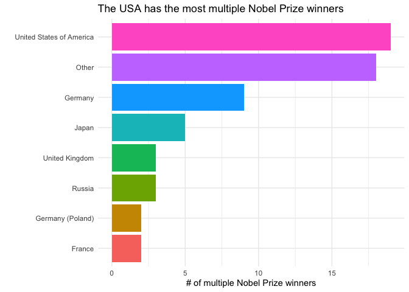

# Repeat Champions: Which Countries Produce Multiple Nobel Prize Winners?

**[Source Code](2019_05_14_tidy_tuesday_nobel_prizes.Rmd)** | Data from the [TidyTuesday project](https://github.com/rfordatascience/tidytuesday/tree/master/data/2019/2019-05-14) (2019-05-14)


Some individuals have won more than one Nobel Prize. This analysis maps the geography of extraordinary achievement, exploring where these exceptional repeat laureates come from and which nations have produced the most multi-time winners.

---

Winning a Nobel Prize is one of the highest honors in science,
literature, and peace — but some individuals have won more than once.
Where do these exceptional repeat laureates come from? Using data on all
Nobel Prize winners and their publications, we can map the geography of
extraordinary achievement and see which nations have produced the most
multi-time winners.

## Loading the Data

``` r
library(tidyverse)

theme_set(theme_minimal())

nobel_winners <- readr::read_csv("https://raw.githubusercontent.com/rfordatascience/tidytuesday/master/data/2019/2019-05-14/nobel_winners.csv")
nobel_winner_all_pubs <- readr::read_csv("https://raw.githubusercontent.com/rfordatascience/tidytuesday/master/data/2019/2019-05-14/nobel_winner_all_pubs.csv")
```

## Multiple Nobel Prize Winners by Birth Country

Let’s identify laureates who have won more than once and see which
countries they were born in. We’ll lump smaller countries into an
“Other” category to focus on the top producers.

``` r
nobel_winners |>
  group_by(laureate_id, birth_country) |>
  summarise(n = n()) |>
  filter(n > 1) |>
  ungroup() |>
  mutate(birth_country = fct_lump(birth_country, n = 7)) |>
  group_by(birth_country) |>
  summarise(n2 = n()) |>
  filter(!is.na(birth_country)) |>
  mutate(birth_country = fct_reorder(birth_country, n2)) |>
  ggplot(aes(birth_country, n2, fill = birth_country)) +
  geom_col(show.legend = FALSE) +
  coord_flip() +
  labs(x = "",
       y = "# of multiple Nobel Prize winners", 
       title = "The USA has the most multiple Nobel Prize winners")
```

<!-- -->

The United States leads decisively in producing repeat Nobel laureates —
a reflection of its massive research infrastructure, university system,
and ability to attract top talent from around the world. The presence of
several European nations (UK, France, Germany) reflects the historical
concentration of scientific institutions in the West, though the
landscape of Nobel-caliber research is gradually becoming more global.
