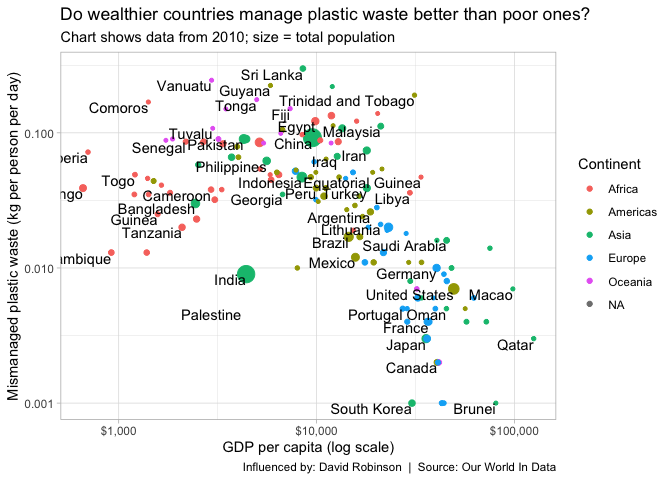
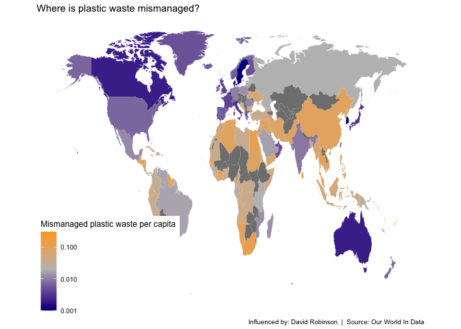

# Plastic Planet: Does Wealth Protect Against Waste Mismanagement?

**[Source Code](2019_05_21_tidy_tuesday_plastic_waste.Rmd)** | Data from the [TidyTuesday project](https://github.com/rfordatascience/tidytuesday/tree/master/data/2019/2019-05-21) (2019-05-21)


Using 2010 data from Our World in Data, this analysis explores whether GDP per capita predicts how well a country handles its plastic waste. The relationship between wealth and environmental responsibility challenges some common assumptions.

---

Plastic waste is one of the defining environmental challenges of our
time — but it’s not distributed equally. Some countries mismanage far
more plastic per person than others, and the relationship with national
wealth is complex. Using 2010 data from Our World in Data, we can
explore whether GDP per capita predicts how well a country handles its
plastic waste, and compare that relationship to CO2 emissions. The
results challenge some assumptions about wealth and environmental
responsibility.

## Loading the Data

We’ll work with three related datasets covering coastal populations,
mismanaged plastic waste, and per-capita waste relative to GDP.

``` r
# load tidyverse library and data; set the default theme
library(tidyverse)
library(scales)
theme_set(theme_light())

coast_vs_waste <- readr::read_csv("https://raw.githubusercontent.com/rfordatascience/tidytuesday/master/data/2019/2019-05-21/coastal-population-vs-mismanaged-plastic.csv")

mismanaged_vs_gdp <- readr::read_csv("https://raw.githubusercontent.com/rfordatascience/tidytuesday/master/data/2019/2019-05-21/per-capita-mismanaged-plastic-waste-vs-gdp-per-capita.csv")

waste_vs_gdp <- readr::read_csv("https://raw.githubusercontent.com/rfordatascience/tidytuesday/master/data/2019/2019-05-21/per-capita-plastic-waste-vs-gdp-per-capita.csv")
```

## Cleaning and Joining the Datasets

We’ll filter to 2010 (the year with the most complete data), clean
column names, and join everything into a single analysis-ready
dataframe.

``` r
library(janitor)

# Create a function to clean the data sets
clean_data_set <- function(data_set) {
  data_set |>
    clean_names() |>
    rename(country = entity) |>
    filter(year == 2010) |>
    select(-year)
}

plastic_waste <- coast_vs_waste |>
  clean_data_set() |>
  inner_join(clean_data_set(mismanaged_vs_gdp), by = c("country", "code")) |>
  inner_join(clean_data_set(waste_vs_gdp), by = c("country", "code")) |>
  select(country, 
         code, 
         population = total_population_gapminder, 
         coastal_population, 
         gdp_per_capita = gdp_per_capita_ppp_constant_2011_international_constant_2011_international,
         waste = mismanaged_plastic_waste_tonnes,
         waste_per_capita = per_capita_mismanaged_plastic_waste_kilograms_per_person_per_day)
```

## Adding Continent Information

To color our visualizations by geography, we’ll use the `countrycode`
package to map country names to continents.

``` r
library(countrycode)

df <- data.frame(plastic_waste)

plastic_waste$continent <- countrycode(sourcevar = df[,"country"], 
                                       origin = "country.name",
                                       destination = "continent")
plastic_waste |>
  filter(is.na(continent))
```

    ## # A tibble: 4 × 8
    ##   country              code  population coastal_population gdp_per_capita  waste
    ##   <chr>                <chr>      <dbl>              <dbl>          <dbl>  <dbl>
    ## 1 Channel Islands      OWID…         NA             153352            NA  2.81e2
    ## 2 Cocos Islands        CCK          596                596            NA  1   e0
    ## 3 Micronesia (country) FSM           NA             154895          3298. 4.79e3
    ## 4 World                OWID…         NA                 NA         13176. 3.19e7
    ## # ℹ 2 more variables: waste_per_capita <dbl>, continent <chr>

## GDP vs. Plastic Waste Mismanagement

Here’s the central question: do wealthier countries manage their plastic
waste better? This scatter plot shows GDP per capita against mismanaged
plastic waste per person, with bubble size representing population.

``` r
g1 <- plastic_waste |>
  arrange(-population) |>
  ggplot(aes(gdp_per_capita, waste_per_capita)) +
  geom_point(aes(color = continent, size = population)) + 
  geom_text(aes(label = country), vjust = 1, hjust = 1, check_overlap = TRUE) +
  scale_x_log10(labels = dollar_format()) +
  scale_y_log10() +
  scale_size_continuous(guide = FALSE) +
  labs(x = "GDP per capita (log scale)",
       y = "Mismanaged plastic waste (kg per person per day)",
       color = "Continent",
       title = "Do wealthier countries manage plastic waste better than poor ones?",
       subtitle = "Chart shows data from 2010; size = total population",
       caption = "Influenced by: David Robinson  |  Source: Our World In Data")

## Future work:  color by continent
g1
```

<!-- -->

The relationship is noisy but present — wealthier countries tend to
mismanage less plastic per capita. However, the scatter is enormous,
suggesting that policy choices matter as much as (or more than) raw
wealth.

## A David Robinson Quote

Inspired by David Robinson’s approach to data analysis — working with
the data you have rather than waiting for perfect data.

``` r
library(magick)
dr_quote <- data.frame(line1 = '"Go to war with the data you have ...', 
                       line2 = '... not the data you want"',
                       author = "David Robinson")

dr_image <- image_read("https://pbs.twimg.com/profile_images/876529727284039680/dfvG_Dy4_400x400.jpg")

ggplot(dr_quote, aes()) + 
  geom_text(aes(0, 0.5, label = line1), size = 7.5, fontface = "bold") +
  geom_text(aes(0, 0.25, label = line2), size = 7.5, fontface = "bold") +
  geom_text(aes(0, 0, label = author), size = 6) +
  theme_void() + 
  scale_y_continuous(limits = c(-1, 1)) + 
  labs(caption = "Designer: Tony Galvan @gdatascience1  |  Source: https://youtu.be/BRdLOYtJk9o")

ggsave("outputs/quote.png")
quote_image <- image_read("quote.png")
final_image <- image_composite(quote_image, dr_image, offset = "+625+575")
image_write(final_image, "drob_quote.png")
```

## World Map: Where Is Plastic Waste Mismanaged?

A choropleth map gives us the geographic intuition — which regions of
the world are struggling most with plastic waste management?

``` r
library(fuzzyjoin)

iso3166 <- as_tibble(maps::iso3166)

plastic_data <- plastic_waste |>
  inner_join(iso3166, by = c("code" = "a3")) 

map_data("world") |>
  as_tibble() |>
  filter(region != "Antarctica") |>
  regex_left_join(plastic_data, by = c("region" = "mapname")) |>
  ggplot(aes(long, lat, group = group, fill = waste_per_capita)) + 
  geom_polygon() + 
  scale_fill_gradient2(trans = "log10",
                       low = "dark blue",
                       high = "orange",
                       mid = "grey",
                       midpoint = log10(0.02)) +
  coord_fixed(2) + 
  ggthemes::theme_map() + 
  labs(fill = "Mismanaged plastic waste per capita",
       title = "Where is plastic waste mismanaged?", 
       caption = "Influenced by: David Robinson  |  Source: Our World In Data")
```

<!-- -->

South and Southeast Asia stand out as hotspots for plastic waste
mismanagement — a combination of large populations, rapid economic
growth, and waste infrastructure that hasn’t kept pace.

## Comparing Plastic Waste to CO2 Emissions

Here’s where it gets interesting: while plastic waste mismanagement is
*negatively* correlated with GDP (poorer countries mismanage more), CO2
emissions are *positively* correlated with GDP (richer countries emit
more). Let’s visualize both side by side.

``` r
library(WDI)

wdi_data <- WDI(indicator = c("co2_emissions_per_capita" = "EN.ATM.CO2E.PC"), 
                  start = 2010, end = 2010) |>
  as.tibble() |>
  select(-country)

plastic_with_indicators <- wdi_data |>
  inner_join(plastic_data, by = c(iso2c = "a2")) |>
  arrange(desc(population))

g2 <- plastic_with_indicators |>
  ggplot(aes(gdp_per_capita, co2_emissions_per_capita)) +
  geom_point(aes(color = continent, size = population)) +
  geom_text(aes(label = country), vjust = 1, hjust = 1, check_overlap = TRUE) +
  scale_size_continuous(guide = FALSE) +
  scale_x_log10(labels = dollar_format()) +
  scale_y_log10() +
  labs(x = "GDP per capita (log scale)",
       y = "CO2 emissions (tons per capita)",
       color = "Continent", 
       title = "Do wealthier countries manage CO2 emissions better than poor ones?",
       subtitle = "Chart shows data from 2010; size = total population",
       caption = "Influenced by: David Robinson  |  Source: Our World In Data")

library(patchwork)

g2 +
  labs(title = "CO2 emissions are correlated with country income, but not plastic waste",
       caption = "") + 
  scale_color_discrete(guide = FALSE) +
  g1 +
  labs(title = "",
       subtitle = "")

ggsave("outputs/2019_05_21_tidy_tuesday_plastic_waste.png", width = 10, height = 6)
```

This juxtaposition reveals a fundamental asymmetry in environmental
challenges: wealth helps solve the plastic waste problem (through better
infrastructure) but *creates* the CO2 problem (through higher
consumption). Addressing both requires very different policy approaches.
