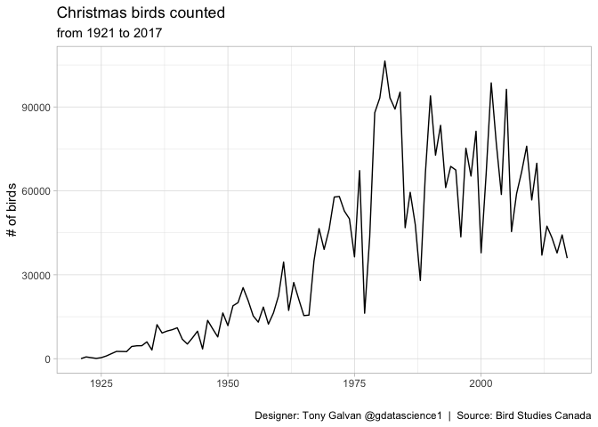
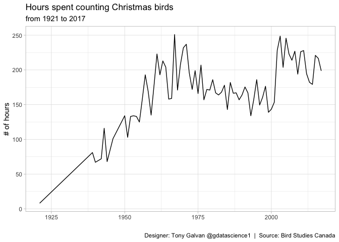

# A Century of Counting: The Christmas Bird Count’s Remarkable Growth

**[Source Code](2019_06_18_tidy_tuesday_christmas_birds.Rmd)** | Data from the [TidyTuesday project](https://github.com/rfordatascience/tidytuesday/tree/master/data/2019/2019-06-18) (2019-06-18)


Since 1921, volunteers across North America have bundled up in winter to count birds as part of the Christmas Bird Count — one of the longest-running citizen science projects in the world. This analysis explores nearly a century of dedicated birdwatching and the remarkable growth of the volunteer effort.

---

Since 1921, volunteers across North America have bundled up in winter to
count birds as part of the Christmas Bird Count — one of the
longest-running citizen science projects in the world. The data from
Bird Studies Canada reveals not just bird population trends, but the
remarkable growth of the volunteer effort itself. Let’s explore nearly a
century of dedicated birdwatching.

## Loading the Data

``` r
library(tidyverse)
theme_set(theme_light())

bird_counts <- readr::read_csv("https://raw.githubusercontent.com/rfordatascience/tidytuesday/master/data/2019/2019-06-18/bird_counts.csv")
```

## Data Overview

``` r
bird_counts |>
  summary()
```

    ##       year        species          species_latin      how_many_counted 
    ##  Min.   :1921   Length:18706       Length:18706       Min.   :    0.0  
    ##  1st Qu.:1947   Class :character   Class :character   1st Qu.:    0.0  
    ##  Median :1970   Mode  :character   Mode  :character   Median :    0.0  
    ##  Mean   :1970                                         Mean   :  193.5  
    ##  3rd Qu.:1994                                         3rd Qu.:    5.0  
    ##  Max.   :2017                                         Max.   :73000.0  
    ##                                                                        
    ##   total_hours    how_many_counted_by_hour
    ##  Min.   :  8.0   Min.   :  0.000         
    ##  1st Qu.:149.5   1st Qu.:  0.000         
    ##  Median :171.0   Median :  0.000         
    ##  Mean   :170.8   Mean   :  1.336         
    ##  3rd Qu.:203.8   3rd Qu.:  0.051         
    ##  Max.   :251.0   Max.   :439.024         
    ##  NA's   :3781    NA's   :3781

This data spans from 1921 to 2017 — nearly a century of continuous
observation.

## Total Birds Counted Over Time

How has the total count changed across the decades? This reflects both
actual bird populations and the expanding scope of the counting effort.

``` r
bird_counts |>
  group_by(year) |>
  summarise(total = sum(how_many_counted)) |>
  ggplot(aes(year, total)) +
  geom_line() + 
  labs(x = "",
       y = "# of birds",
       title = "Christmas birds counted",
       subtitle = "from 1921 to 2017",
       caption = "Designer: Tony Galvan @gdatascience1  |  Source: Bird Studies Canada")
```

<!-- -->

The exponential growth in total birds counted is striking — but is it
because there are more birds, or because more people are looking? The
next chart helps answer that.

## Hours Spent Counting Over Time

Let’s look at the volunteer effort itself — how many hours are being
invested in the count each year?

``` r
bird_counts |>
  filter(!is.na(total_hours)) |>
  group_by(year) |>
  summarise(hours = mean(total_hours)) |>
  ggplot(aes(year, hours)) +
  geom_line() + 
  labs(x = "",
       y = "# of hours",
       title = "Hours spent counting Christmas birds",
       subtitle = "from 1921 to 2017",
       caption = "Designer: Tony Galvan @gdatascience1  |  Source: Bird Studies Canada")
```

<!-- -->

The hours spent counting have grown dramatically too — suggesting that
much of the increase in total birds counted is driven by expanded effort
rather than growing bird populations. This is a common challenge in
citizen science: separating signal (actual population changes) from
noise (changes in observation effort). To draw conclusions about bird
populations, researchers need to normalize counts by effort — birds per
party-hour rather than raw totals.
