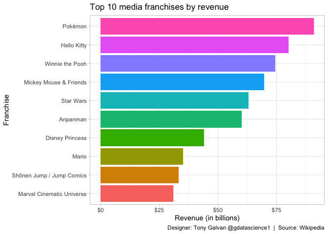
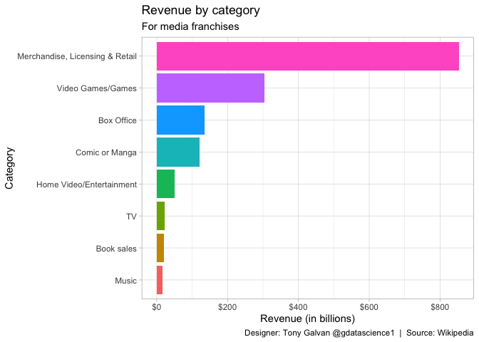
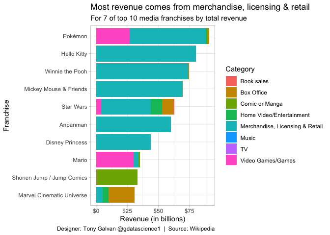

# Billion-Dollar Universes: Where the World’s Top Media Franchises Make Their Money

**[Source Code](2019_07_02_tidy_tuesday_media_franchises.Rmd)** | Data from the [TidyTuesday project](https://github.com/rfordatascience/tidytuesday/tree/master/data/2019/2019-07-02) (2019-07-02)


Pokémon, Hello Kitty, Star Wars — these aren’t just entertainment properties, they’re economic empires worth tens of billions each. This analysis reveals that the biggest franchises don’t make their fortunes at the box office — they make them in toy stores and on t-shirts.

---

Pokémon, Hello Kitty, Star Wars — these aren’t just entertainment
properties, they’re economic empires worth tens of billions of dollars
each. But where does all that money actually come from? Using
Wikipedia’s data on media franchise revenue by category, we can see that
the biggest franchises don’t make their fortunes at the box office —
they make them in toy stores and on t-shirts.

## Loading the Data

``` r
library(tidyverse)
theme_set(theme_light())

media_franchises <- readr::read_csv("https://raw.githubusercontent.com/rfordatascience/tidytuesday/master/data/2019/2019-07-02/media_franchises.csv") |>
  distinct()
```

## Exploring the Dataset

``` r
media_franchises |>
  glimpse()
```

    ## Rows: 321
    ## Columns: 7
    ## $ franchise        <chr> "A Song of Ice and Fire /  Game of Thrones", "A Song …
    ## $ revenue_category <chr> "Book sales", "Box Office", "Home Video/Entertainment…
    ## $ revenue          <dbl> 0.900, 0.001, 0.280, 4.000, 0.132, 0.760, 1.000, 0.50…
    ## $ year_created     <dbl> 1996, 1996, 1996, 1996, 1996, 1992, 1992, 1992, 1992,…
    ## $ original_media   <chr> "Novel", "Novel", "Novel", "Novel", "Novel", "Animate…
    ## $ creators         <chr> "George R. R. Martin", "George R. R. Martin", "George…
    ## $ owners           <chr> "Random House WarnerMedia (AT&T)", "Random House Warn…

## The Top 10 Highest-Grossing Franchises

Which media franchises have generated the most total revenue across all
categories?

``` r
top10_media_franchises <- media_franchises |>
  group_by(franchise) |>
  summarise(total_revenue = sum(revenue)) |>
  top_n(10) |>
  mutate(franchise = fct_reorder(franchise, total_revenue)) 

top10_media_franchises |>
  ggplot(aes(franchise, total_revenue, fill = franchise)) +
  geom_col(show.legend = FALSE) + 
  scale_y_continuous(labels = scales::dollar_format()) +
  coord_flip() + 
  labs(x = "Franchise",
       y = "Revenue (in billions)",
       title = "Top 10 media franchises by revenue",
       caption = "Designer: Tony Galvan @gdatascience1  |  Source: Wikipedia")
```

<!-- -->

Pokémon leads the pack with staggering total revenue — driven largely by
merchandise and video game sales rather than the animated series or
films.

## Revenue by Category

Which revenue categories generate the most money across all franchises
combined?

``` r
media_franchises |>
  group_by(revenue_category) |>
  summarise(total_revenue = sum(revenue)) |>
  mutate(revenue_category = fct_reorder(revenue_category, total_revenue)) |>
  ggplot(aes(revenue_category, total_revenue, fill = revenue_category)) +
  geom_col(show.legend = FALSE) + 
  scale_y_continuous(labels = scales::dollar_format()) +
  coord_flip() + 
  labs(x = "Category",
       y = "Revenue (in billions)",
       title = "Revenue by category",
       subtitle = "For media franchises",
       caption = "Designer: Tony Galvan @gdatascience1  |  Source: Wikipedia")
```

<!-- -->

Merchandise, licensing, and retail dominates — it’s not even close. The
content (movies, TV, books) is often just the marketing vehicle for the
real money-maker: physical products.

## Revenue Breakdown for Top Franchises

Let’s see how the top 10 franchises distribute their revenue across
categories. This reveals which franchises are merchandise machines
versus box office juggernauts.

``` r
top10_media_franchises |>
  inner_join(media_franchises) |>
  mutate(franchise = fct_reorder(franchise, total_revenue))  |>
  ggplot(aes(franchise, revenue, fill = revenue_category)) +
  geom_col() + 
  scale_y_continuous(labels = scales::dollar_format()) +
  coord_flip() + 
  labs(x = "Franchise",
       y = "Revenue (in billions)",
       fill = "Category",
       title = "Most revenue comes from merchandise, licensing & retail",
       subtitle = "For 7 of top 10 media franchises by total revenue",
       caption = "Designer: Tony Galvan @gdatascience1  |  Source: Wikipedia")
```

<!-- -->

The stacked bars tell a clear story: for 7 of the top 10 franchises,
merchandise and licensing is the dominant revenue source. The exceptions
— like Star Wars with its massive box office — are the outliers, not the
rule. In the media franchise business, the content is the advertisement
and the merchandise is the product.
