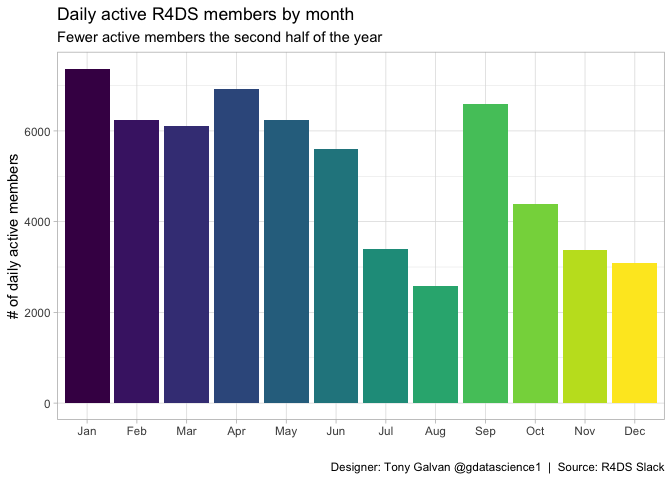
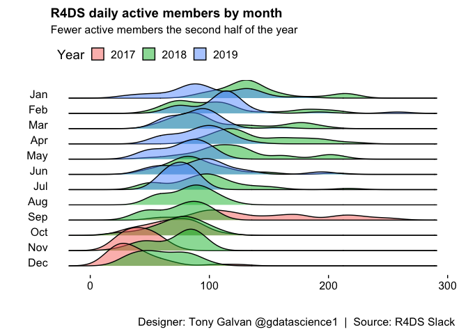
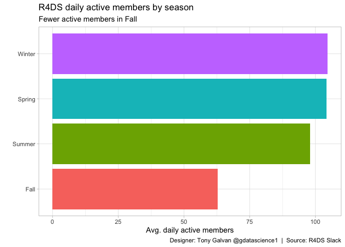
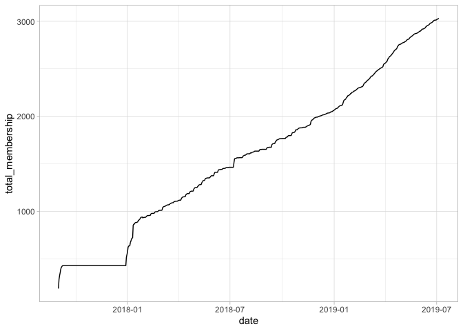

# Community Pulse: Tracking the R4DS Slack Community’s Growth and Engagement

**[Source Code](2019_07_16_tidy_tuesday_r4ds_membership.Rmd)** | Data from the [TidyTuesday project](https://github.com/rfordatascience/tidytuesday/tree/master/data/2019/2019-07-16) (2019-07-16)


The R4DS Online Learning Community grew from a small Slack workspace into one of the most active R communities on the internet. With daily membership and activity stats from August 2017 through July 2019, this analysis traces growth patterns and seasonal rhythms in how people learn data science.

---

The R4DS (R for Data Science) Online Learning Community started as a
Slack workspace for people working through Hadley Wickham’s book — and
grew into one of the most active R communities on the internet. With
daily membership and activity stats from August 2017 through July 2019,
we can trace the community’s growth patterns and identify when members
are most engaged. The seasonal rhythms tell a story about how people
learn data science.

## Loading and Preparing the Data

We’ll filter to the period after the community’s founding, create
time-based features, and assign seasons for seasonal analysis.

``` r
library(tidyverse)
library(lubridate)
library(ggridges)
theme_set(theme_light())

r4ds_members <- readr::read_csv("https://raw.githubusercontent.com/rfordatascience/tidytuesday/master/data/2019/2019-07-16/r4ds_members.csv") |>
  filter(date > '2017-08-31') |>
  select(-guests, -name, -messages_in_shared_channels) |>
  mutate(month = factor(month(date, label = TRUE)),
         day = factor(wday(date, label = TRUE)), 
         year = factor(year(date)),
         season = case_when(
           date < '2017-09-22' ~ "Summer",
           date >= '2017-09-22' & date < '2017-12-21' ~ "Fall",
           date >= '2017-12-21' & date < '2018-03-20' ~ "Winter",
           date >= '2018-03-20' & date < '2018-06-21' ~ "Spring",
           date >= '2018-06-21' & date < '2018-09-22' ~ "Summer",
           date >= '2018-09-22' & date < '2018-12-21' ~ "Fall",
           date >= '2018-12-21' & date < '2019-03-20' ~ "Winter",
           date >= '2019-03-20' & date < '2019-06-21' ~ "Spring",
           date >= '2019-06-21' ~ "Summer"))
```

## Data Overview

``` r
r4ds_members |>
  summary()
```

    ##       date            total_membership  full_members  daily_active_members
    ##  Min.   :2017-09-01   Min.   : 188     Min.   : 188   Min.   : 15.00      
    ##  1st Qu.:2018-02-16   1st Qu.: 979     1st Qu.: 979   1st Qu.: 64.00      
    ##  Median :2018-08-03   Median :1606     Median :1606   Median : 88.00      
    ##  Mean   :2018-08-03   Mean   :1579     Mean   :1579   Mean   : 92.06      
    ##  3rd Qu.:2019-01-18   3rd Qu.:2166     3rd Qu.:2166   3rd Qu.:111.00      
    ##  Max.   :2019-07-05   Max.   :3029     Max.   :3029   Max.   :258.00      
    ##                                                                           
    ##  daily_members_posting_messages weekly_active_members
    ##  Min.   :  0.00                 Min.   : 76.0        
    ##  1st Qu.:  7.00                 1st Qu.:207.0        
    ##  Median : 11.00                 Median :239.0        
    ##  Mean   : 13.34                 Mean   :251.5        
    ##  3rd Qu.: 16.00                 3rd Qu.:309.0        
    ##  Max.   :111.00                 Max.   :525.0        
    ##                                                      
    ##  weekly_members_posting_messages messages_in_public_channels
    ##  Min.   : 10.00                  Min.   :  0.00             
    ##  1st Qu.: 36.00                  1st Qu.: 10.00             
    ##  Median : 48.00                  Median : 19.00             
    ##  Mean   : 52.54                  Mean   : 28.66             
    ##  3rd Qu.: 59.00                  3rd Qu.: 35.00             
    ##  Max.   :278.00                  Max.   :326.00             
    ##                                                             
    ##  messages_in_private_channels messages_in_d_ms
    ##  Min.   : 0.000               Min.   :  0.00  
    ##  1st Qu.: 0.000               1st Qu.:  1.00  
    ##  Median : 0.000               Median :  4.00  
    ##  Mean   : 1.731               Mean   : 13.14  
    ##  3rd Qu.: 0.000               3rd Qu.: 12.00  
    ##  Max.   :75.000               Max.   :227.00  
    ##                                               
    ##  percent_of_messages_public_channels percent_of_messages_private_channels
    ##  Min.   :0.0000                      Min.   :0.00000                     
    ##  1st Qu.:0.5862                      1st Qu.:0.00000                     
    ##  Median :0.8000                      Median :0.00000                     
    ##  Mean   :0.7275                      Mean   :0.03073                     
    ##  3rd Qu.:0.9444                      3rd Qu.:0.00000                     
    ##  Max.   :1.0000                      Max.   :1.00000                     
    ##                                                                          
    ##  percent_of_messages_d_ms percent_of_views_public_channels
    ##  Min.   :0.0000           Min.   :0.2726                  
    ##  1st Qu.:0.0370           1st Qu.:0.9112                  
    ##  Median :0.1613           Median :0.9519                  
    ##  Mean   :0.2284           Mean   :0.9290                  
    ##  3rd Qu.:0.3500           3rd Qu.:0.9744                  
    ##  Max.   :1.0000           Max.   :1.0000                  
    ##                                                           
    ##  percent_of_views_private_channels percent_of_views_d_ms
    ##  Min.   :0.000000                  Min.   :0.00000      
    ##  1st Qu.:0.000000                  1st Qu.:0.02250      
    ##  Median :0.000000                  Median :0.04170      
    ##  Mean   :0.009845                  Mean   :0.06116      
    ##  3rd Qu.:0.006500                  3rd Qu.:0.07450      
    ##  Max.   :0.267400                  Max.   :0.72170      
    ##                                                         
    ##  public_channels_single_workspace messages_posted     month      day    
    ##  Min.   :10.00                    Min.   : 1101   Jan    : 62   Sun:96  
    ##  1st Qu.:15.00                    1st Qu.:20963   Mar    : 62   Mon:96  
    ##  Median :19.00                    Median :34036   May    : 62   Tue:96  
    ##  Mean   :17.86                    Mean   :33180   Oct    : 62   Wed:96  
    ##  3rd Qu.:21.00                    3rd Qu.:40230   Dec    : 62   Thu:96  
    ##  Max.   :27.00                    Max.   :59627   Apr    : 60   Fri:97  
    ##                                                   (Other):303   Sat:96  
    ##    year        season         
    ##  2017:122   Length:673        
    ##  2018:365   Class :character  
    ##  2019:186   Mode  :character  
    ##                               
    ##                               
    ##                               
    ## 

This data covers the R4DS community from its founding through early July
2019 (8/27/2017 to 7/5/2019).

## Daily Active Members by Month

Let’s explore engagement patterns — which months see the most activity?

``` r
r4ds_members |>
  group_by(month, year) |>
  summarise(total_active_members = sum(daily_active_members)) |>
  ggplot(aes(month, total_active_members, fill = month)) +
  geom_col(show.legend = FALSE) +
  labs(x = "",
       y = "# of daily active members",
       title = "Daily active R4DS members by month",
       subtitle = "Fewer active members the second half of the year",
       caption = "Designer: Tony Galvan @gdatascience1  |  Source: R4DS Slack")
```

<!-- -->

The first half of the year consistently shows higher engagement —
perhaps because New Year’s resolutions drive people to learn new skills,
or because academic semesters align with peak activity.

## Ridgeline Plot: Activity Distribution by Month

A ridgeline plot shows the full distribution of daily active members for
each month, revealing not just averages but the spread of activity
levels.

``` r
r4ds_members |>
  ggplot(aes(daily_active_members, fct_rev(month))) + 
  geom_density_ridges(aes(fill = year), alpha = 0.5) + 
  theme_ridges(grid = FALSE) + 
  labs(x = "",
       y = "",
       title = "R4DS daily active members by month",
       fill = "Year",
       subtitle = "Fewer active members the second half of the year",
       caption = "Designer: Tony Galvan @gdatascience1  |  Source: R4DS Slack") +
  theme(legend.position = "top")
```

<!-- -->

The 2019 distributions (shown in a different color) are shifted right
compared to 2018, confirming that the community grew year-over-year even
as seasonal patterns persisted.

## Seasonal Engagement Patterns

Grouping by season makes the pattern even clearer — when do R learners
engage most?

``` r
r4ds_members |>
  group_by(season) |>
  summarise(avg_active_members = sum(daily_active_members) / n()) |>
  mutate(season = fct_reorder(season, avg_active_members)) |>
  ggplot(aes(season, avg_active_members, fill = season)) +
  geom_col(show.legend = FALSE) +
  coord_flip() + 
  labs(x = "",
       y = "Avg. daily active members",
       title = "R4DS daily active members by season",
       subtitle = "Fewer active members in Fall",
       caption = "Designer: Tony Galvan @gdatascience1  |  Source: R4DS Slack")
```

<!-- -->

Fall shows the lowest engagement — perhaps because the initial
motivation from earlier in the year has faded, or because people are
busy with back-to-school and work ramp-ups.

## Total Membership Growth

Finally, let’s look at the raw growth trajectory — how has total
membership evolved since the community’s founding?

``` r
r4ds_members |>
  ggplot(aes(date, total_membership)) +
  geom_line()
```

<!-- -->

The growth is remarkably steady and linear — the community adds members
at a consistent rate, suggesting strong word-of-mouth and ongoing
relevance of the R4DS book as a learning resource.
