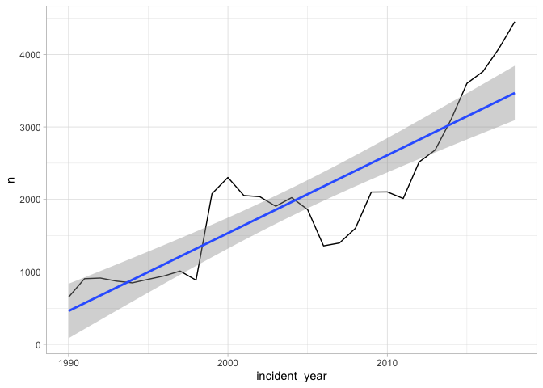
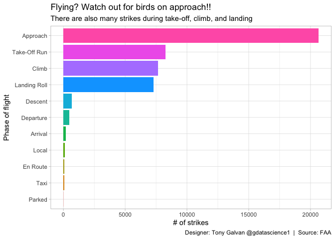
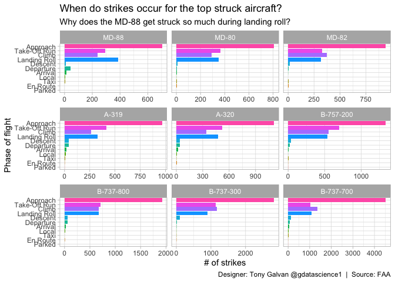
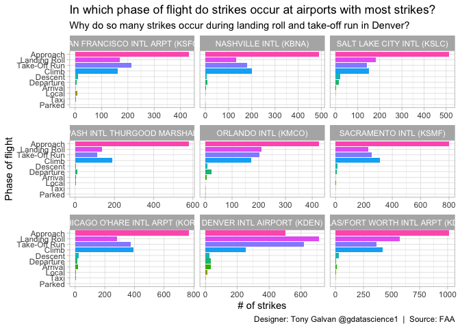

# Watch Out on Approach: When and Where Birds Strike Aircraft

**[Source Code](2019_07_23_tidy_tuesday_wildlife_strikes.Rmd)** | Data from the [TidyTuesday project](https://github.com/rfordatascience/tidytuesday/tree/master/data/2019/2019-07-23) (2019-07-23)


Every year, thousands of birds collide with aircraft in the United States. Using the FAA’s wildlife strike database, this analysis identifies when strikes are most likely, which aircraft are most vulnerable, and which airports are hotspots.

---

Every year, thousands of birds collide with aircraft in the United
States — a hazard that costs the aviation industry hundreds of millions
of dollars and occasionally threatens passenger safety. The FAA’s
wildlife strike database records decades of these incidents, letting us
identify when strikes are most likely, which aircraft are most
vulnerable, and which airports are hotspots. If you’re a nervous flyer,
the approach phase should worry you most.

## Loading and Preparing the Data

We’ll clean up the flight phase variable and get a summary of the
dataset.

``` r
library(tidyverse)
library(lubridate)
theme_set(theme_light())

wildlife_impacts <- readr::read_csv("https://raw.githubusercontent.com/rfordatascience/tidytuesday/master/data/2019/2019-07-23/wildlife_impacts.csv") |>
  mutate(flight_phase = na_if(str_to_title(phase_of_flt), "Unknown"))

summary(wildlife_impacts)
```

    ##  incident_date                       state            airport_id       
    ##  Min.   :1990-01-01 00:00:00.00   Length:56978       Length:56978      
    ##  1st Qu.:2001-11-15 00:00:00.00   Class :character   Class :character  
    ##  Median :2009-11-03 00:00:00.00   Mode  :character   Mode  :character  
    ##  Mean   :2008-05-21 04:57:11.04                                        
    ##  3rd Qu.:2015-07-26 00:00:00.00                                        
    ##  Max.   :2018-12-31 00:00:00.00                                        
    ##                                                                        
    ##    airport            operator            atype             type_eng        
    ##  Length:56978       Length:56978       Length:56978       Length:56978      
    ##  Class :character   Class :character   Class :character   Class :character  
    ##  Mode  :character   Mode  :character   Mode  :character   Mode  :character  
    ##                                                                             
    ##                                                                             
    ##                                                                             
    ##                                                                             
    ##   species_id          species             damage             num_engs    
    ##  Length:56978       Length:56978       Length:56978       Min.   :1.000  
    ##  Class :character   Class :character   Class :character   1st Qu.:2.000  
    ##  Mode  :character   Mode  :character   Mode  :character   Median :2.000  
    ##                                                           Mean   :2.059  
    ##                                                           3rd Qu.:2.000  
    ##                                                           Max.   :4.000  
    ##                                                           NA's   :233    
    ##  incident_month   incident_year  time_of_day             time      
    ##  Min.   : 1.000   Min.   :1990   Length:56978       Min.   : -84   
    ##  1st Qu.: 5.000   1st Qu.:2001   Class :character   1st Qu.: 930   
    ##  Median : 8.000   Median :2009   Mode  :character   Median :1426   
    ##  Mean   : 7.235   Mean   :2008                      Mean   :1428   
    ##  3rd Qu.:10.000   3rd Qu.:2015                      3rd Qu.:1950   
    ##  Max.   :12.000   Max.   :2018                      Max.   :2359   
    ##                                                     NA's   :26124  
    ##      height            speed       phase_of_flt           sky           
    ##  Min.   :    0.0   Min.   :  0.0   Length:56978       Length:56978      
    ##  1st Qu.:    0.0   1st Qu.:130.0   Class :character   Class :character  
    ##  Median :   50.0   Median :140.0   Mode  :character   Mode  :character  
    ##  Mean   :  983.8   Mean   :154.6                                        
    ##  3rd Qu.: 1000.0   3rd Qu.:170.0                                        
    ##  Max.   :25000.0   Max.   :354.0                                        
    ##  NA's   :18038     NA's   :30046                                        
    ##     precip          cost_repairs_infl_adj flight_phase      
    ##  Length:56978       Min.   :      11      Length:56978      
    ##  Class :character   1st Qu.:    5128      Class :character  
    ##  Mode  :character   Median :   26783      Mode  :character  
    ##                     Mean   :  242388                        
    ##                     3rd Qu.:   93124                        
    ##                     Max.   :16380000                        
    ##                     NA's   :56363

## Strikes Over Time

Are wildlife strikes increasing? Let’s plot the annual count to see the
trend.

``` r
wildlife_impacts |>
  count(incident_year) |>
  ggplot(aes(incident_year, n)) +
  geom_line() + 
  geom_smooth(method = "lm")
```

<!-- -->

The upward trend is dramatic — but it likely reflects improved reporting
requirements and awareness rather than an actual increase in bird
populations near airports.

## Which States Have the Most Strikes?

``` r
wildlife_impacts |>
  filter(state != "N/A") |>
  count(state, sort = TRUE)
```

    ## # A tibble: 58 × 2
    ##    state     n
    ##    <chr> <int>
    ##  1 TX     7146
    ##  2 CA     5780
    ##  3 FL     3686
    ##  4 IL     2744
    ##  5 CO     2441
    ##  6 NY     2242
    ##  7 MO     1674
    ##  8 TN     1251
    ##  9 DC     1228
    ## 10 GA     1138
    ## # ℹ 48 more rows

## Strikes by Flight Phase

This is the key safety question: during which phase of flight are
strikes most dangerous and most common?

``` r
wildlife_impacts |>
  filter(!is.na(flight_phase)) |>
  group_by(flight_phase) |>
  summarise(n = n()) |>
  mutate(flight_phase = fct_reorder(flight_phase, n)) |>
  ggplot(aes(flight_phase, n, fill = flight_phase)) + 
  geom_col(show.legend = FALSE) + 
  coord_flip() +
  labs(x = "Phase of flight",
       y = "# of strikes",
       title = "Flying? Watch out for birds on approach!!",
       subtitle = "There are also many strikes during take-off, climb, and landing",
       caption = "Designer: Tony Galvan @gdatascience1  |  Source: FAA")
```

<!-- -->

Approach dominates — aircraft are at low altitude, moving through bird
habitat, and decelerating (giving birds less time to react). Take-off
and climb are also high-risk phases.

``` r
ggsave("outputs/2019_07_23_tidy_tuesday_wildlife_strikes.png", width = 5.5)
```

## Strikes by Aircraft Type

Do certain aircraft attract more strikes? Let’s look at the top 9
most-struck aircraft models and see if the flight phase pattern differs.

``` r
top_struck_aircraft <- wildlife_impacts |>
  filter(!is.na(flight_phase)) |>
  group_by(atype) |>
  summarise(n = n()) |>
  top_n(9, n) |>
  ungroup()

wildlife_impacts |>
  inner_join(top_struck_aircraft) |>
  filter(!is.na(flight_phase)) |>
  group_by(atype, flight_phase) |>
  summarise(n = n()) |>
  ungroup() |>
  mutate(flight_phase = fct_reorder(flight_phase, n, sum),
         atype = fct_reorder(atype, n, sum)) |>
  ggplot(aes(flight_phase, n, fill = flight_phase)) + 
  geom_col(show.legend = FALSE) + 
  facet_wrap(~atype, scales = "free_x") +
  coord_flip() +
  labs(x = "Phase of flight",
       y = "# of strikes",
       title = "When do strikes occur for the top struck aircraft?",
       subtitle = "Why does the MD-88 get struck so much during landing roll?",
       caption = "Designer: Tony Galvan @gdatascience1  |  Source: FAA")
```

<!-- -->

Most aircraft follow the same pattern (approach dominates), but the
MD-88 stands out with an unusual number of landing roll strikes —
possibly related to its engine placement or the airports where it
operates.

## Strikes by Airport

Which airports are the most dangerous for bird strikes? Geography,
habitat, and flight volume all play a role.

``` r
top_struck_airports <- wildlife_impacts |>
  filter(!is.na(flight_phase)) |>
  group_by(airport_id) |>
  summarise(n = n()) |>
  top_n(9, n) |>
  ungroup()

wildlife_impacts |>
  inner_join(top_struck_airports) |>
  filter(!is.na(flight_phase)) |>
  group_by(airport_id, airport, flight_phase) |>
  summarise(n = n()) |>
  ungroup() |>
  mutate(airport_name = paste0(airport, " (", airport_id, ")"),
         flight_phase = fct_reorder(flight_phase, n, sum),
         airport_name = fct_reorder(airport_name, n, sum)) |>
  ggplot(aes(flight_phase, n, fill = flight_phase)) + 
  geom_col(show.legend = FALSE) + 
  facet_wrap(~airport_name, scales = "free_x") +
  coord_flip() +
  labs(x = "Phase of flight",
       y = "# of strikes",
       title = "In which phase of flight do strikes occur at airports with most strikes?",
       subtitle = "Why do so many strikes occur during landing roll and take-off run in Denver?",
       caption = "Designer: Tony Galvan @gdatascience1  |  Source: FAA")
```

<!-- -->

Denver International Airport (DEN) shows an unusual pattern with high
numbers of strikes during landing roll and take-off run — likely related
to its prairie location and the wildlife habitat surrounding its
runways. Dallas/Fort Worth and Chicago O’Hare also rank high, reflecting
both high traffic volume and proximity to bird habitats.
