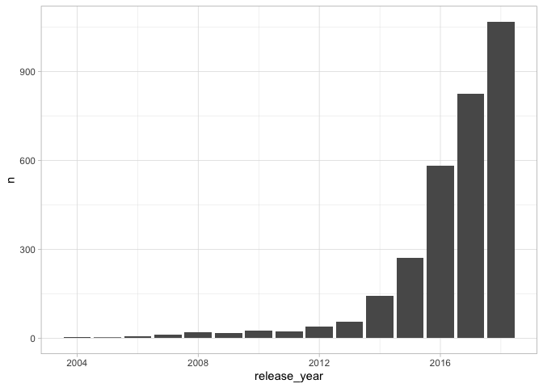
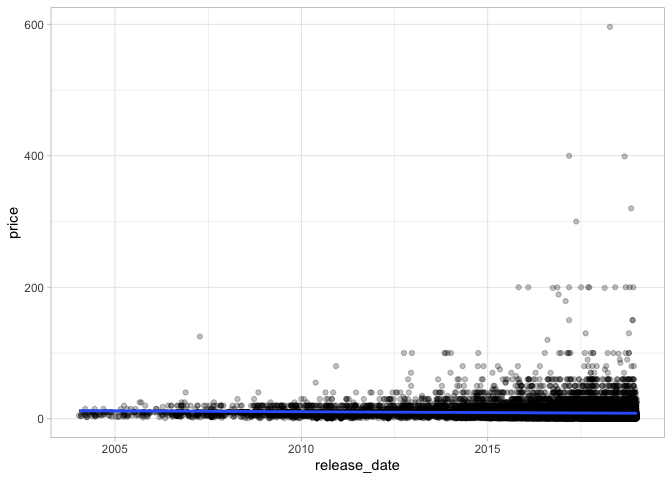
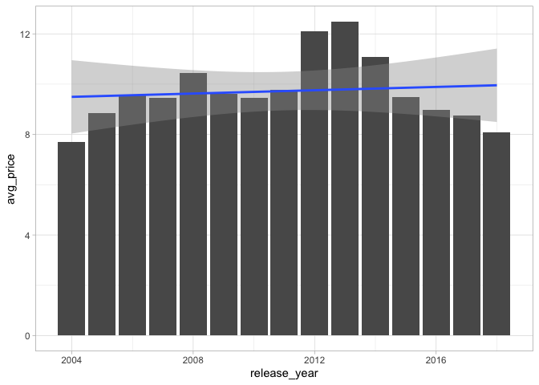
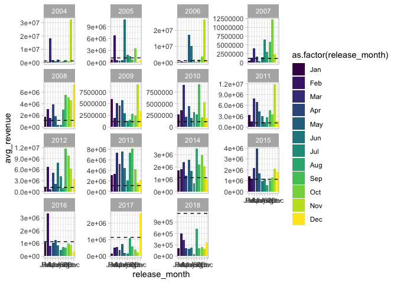
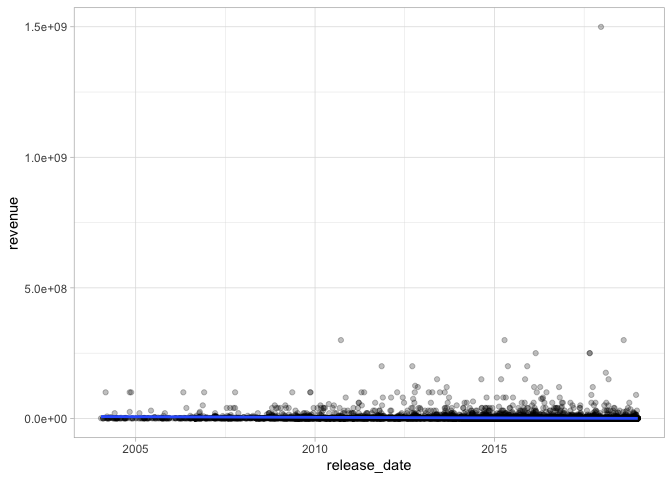
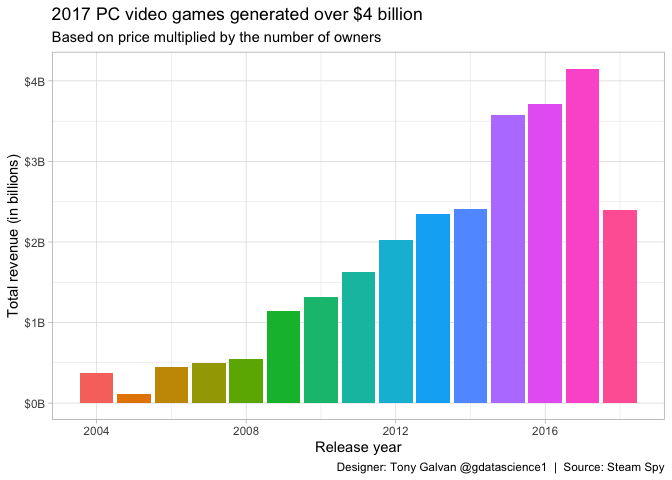

# The Steam Economy: How PC Game Prices and Revenue Have Shifted Over Time

**[Source Code](2019_07_30_tidy_tuesday_video_games.Rmd)** | Data from the [TidyTuesday project](https://github.com/rfordatascience/tidytuesday/tree/master/data/2019/2019-07-30) (2019-07-30)


The PC gaming market has transformed dramatically over the past decade. Using Steam Spy data, this analysis traces how free-to-play games, indie titles, and massive sales have reshaped pricing and revenue — a story of falling prices but rising volume.

---

The PC gaming market has transformed dramatically over the past decade.
Free-to-play games, indie titles, and massive sales have reshaped how
games are priced and how revenue flows. Using data from Steam Spy —
which estimates ownership and pricing for games on Valve’s Steam
platform — we can trace these shifts and see which years and months
generated the most revenue. The story of PC gaming economics is one of
falling prices but rising volume.

## Loading and Preparing the Data

We’ll do some preprocessing: standardize game titles, parse release
dates, extract the lower bound of the ownership range, and calculate
estimated revenue.

``` r
library(tidyverse)
library(lubridate)
theme_set(theme_light())

video_games <- readr::read_csv("https://raw.githubusercontent.com/rfordatascience/tidytuesday/master/data/2019/2019-07-30/video_games.csv") |>
  mutate(game = str_to_title(game),
         release_date = str_replace(release_date, "8 Oct, 2014", "Oct 8, 2014"),
         release_date = mdy(release_date),
         release_year = year(release_date),
         release_month = month(release_date, label = TRUE),
         owners = as.numeric(gsub(",","",str_extract(owners,"[0-9]+(,[0-9]+)*"))),
         owners = if_else(owners == 0, 1, owners),
         revenue = owners * price) |>
  select(-number)
```

## The Most-Owned Games

Which games have the largest player bases on Steam?

``` r
video_games |>
  arrange(desc(owners)) |>
  select(game, release_date, price, owners, revenue) |>
  top_n(7, owners)
```

    ## # A tibble: 7 × 5
    ##   game                             release_date price    owners    revenue
    ##   <chr>                            <date>       <dbl>     <dbl>      <dbl>
    ## 1 Dota 2                           2013-07-09    NA   100000000         NA
    ## 2 Team Fortress 2                  2007-10-10    NA    50000000         NA
    ## 3 Counter-Strike: Global Offensive 2012-08-21    NA    50000000         NA
    ## 4 Playerunknown's Battlegrounds    2017-12-21    30.0  50000000 1499500000
    ## 5 Warframe                         2013-03-25    NA    20000000         NA
    ## 6 Unturned                         2017-07-07    NA    20000000         NA
    ## 7 Paladins                         2018-05-08    NA    20000000         NA

Why do so many of the top games have a missing price? It turns out that
these may be “free to play” games.

## The Missing Price Problem

How many games lack price data? This is important because it affects our
revenue calculations.

``` r
paste0(sum(is.na(video_games$price)), " out of ", nrow(video_games), " = ", round(100*sum(is.na(video_games$price))/nrow(video_games), 2), "%")
```

    ## [1] "3095 out of 26688 = 11.6%"

Are the missing prices “free to play” games or truly missing data?

## Missing Prices Over Time

If free-to-play games are becoming more common, we’d expect the number
of missing prices to increase over time.

``` r
video_games |>
  filter(is.na(price)) |>
  group_by(release_year) |>
  summarise(n = n()) |>
  ggplot(aes(release_year, n)) + 
  geom_col()
```

<!-- -->

The sharp increase in missing prices after 2015 strongly suggests these
are free-to-play titles — a business model that has exploded in
popularity.

## Price Trends Over Time

For games that do have a price, how have prices changed?

``` r
video_games |>
  ggplot(aes(release_date, price)) + 
  geom_point(alpha = 0.25) + 
  geom_smooth(method = "lm")
```

<!-- -->

Prices are decreasing over time. Could it be because of the increase in
indie games and mobile-style pricing?

## Average Price by Year

Let’s look at the trend more clearly with yearly averages.

``` r
video_games |>
  group_by(release_year) |>
  summarise(avg_price = mean(price, na.rm = TRUE)) |>
  ggplot(aes(release_year, avg_price)) + 
  geom_col() +
  geom_smooth(method = "lm")
```

<!-- -->

The downward trend is unmistakable — the average PC game price has
fallen steadily as the market has shifted toward lower price points and
free-to-play models.

## Revenue Patterns by Month and Year

When do the highest-revenue games get released? Let’s look at average
revenue by release month, faceted by year.

``` r
avg_video_game_revenue <- mean(video_games$revenue, na.rm = TRUE)

video_games |>
  group_by(release_year, release_month) |>
  summarise(avg_revenue = mean(revenue, na.rm = TRUE)) |>
  ggplot(aes(release_month, avg_revenue, fill = as.factor(release_month))) + 
  geom_col() + 
  facet_wrap(~release_year, scales = "free_y") +
  geom_hline(yintercept = avg_video_game_revenue, linetype = 2)
```

<!-- -->

## Top Revenue Games

Which individual games generated the most estimated revenue?

``` r
video_games |>
  arrange(desc(revenue)) |>
  select(game, release_date, price, owners, revenue)
```

    ## # A tibble: 26,688 × 5
    ##    game                          release_date price   owners    revenue
    ##    <chr>                         <date>       <dbl>    <dbl>      <dbl>
    ##  1 Playerunknown's Battlegrounds 2017-12-21    30.0 50000000 1499500000
    ##  2 Monster Hunter: World         2018-08-09    60.0  5000000  299950000
    ##  3 Sid Meier's Civilization V    2010-09-21    30.0 10000000  299900000
    ##  4 Grand Theft Auto V            2015-04-14    30.0 10000000  299900000
    ##  5 Ark: Survival Evolved         2017-08-27    50.0  5000000  249950000
    ##  6 Ark: Survival Of The Fittest  2017-08-29    50.0  5000000  249950000
    ##  7 Grim Dawn                     2016-02-25    25.0 10000000  249900000
    ##  8 The Witcher 3: Wild Hunt      2015-05-18    40.0  5000000  199950000
    ##  9 The Elder Scrolls V: Skyrim   2011-11-10    20.0 10000000  199900000
    ## 10 Borderlands 2                 2012-09-17    20.0 10000000  199900000
    ## # ℹ 26,678 more rows

## Revenue Over Time

Is the overall revenue per game increasing or decreasing?

``` r
video_games |>
  ggplot(aes(release_date, revenue)) + 
  geom_point(alpha = 0.25) +
  geom_smooth(method = "lm")
```

<!-- -->

Revenue is decreasing over time on a per-game basis — but that doesn’t
mean the market is shrinking. Let’s look at total revenue by year.

## Total Revenue by Year

``` r
video_games |>
  group_by(release_year) |>
  summarise(total_revenue = sum(revenue, na.rm = TRUE)) |>
  ggplot(aes(release_year, total_revenue, fill = as.factor(release_year))) + 
  geom_col(show.legend = FALSE) +
  scale_y_continuous(labels = scales::dollar_format(scale = 0.000000001, suffix = "B")) + 
  labs(x = "Release year",
       y = "Total revenue (in billions)",
       title = "2017 PC video games generated over $4 billion",
       subtitle = "Based on price multiplied by the number of owners",
       caption = "Designer: Tony Galvan @gdatascience1  |  Source: Steam Spy")
```

<!-- -->

Despite falling per-game prices and revenue, the total market has grown
— 2017 generated over \$4 billion in estimated revenue. The PC gaming
economy is healthy, just distributed across many more titles at lower
individual price points.

## Word Cloud from Game Names

What words appear most frequently in PC game titles? This gives us a
sense of the themes and genres that dominate the platform.

``` r
video_games |>
  tidytext::unnest_tokens(tbl = ., output = word, input = game) |>
  count(word, sort = TRUE) |>
  filter(is.na(as.numeric(word))) |>
  anti_join(get_stopwords()) |>
  filter(n > 100) |>
  na.omit() |>
  wordcloud2::wordcloud2(shape = "cardiod")
```

Words like “dark,” “war,” “world,” and “dead” dominate — reflecting the
gaming industry’s well-known preference for action, conflict, and
fantasy themes in their titles.
