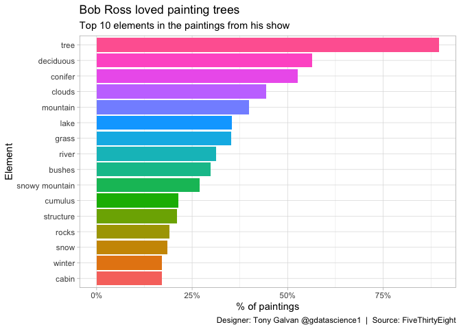
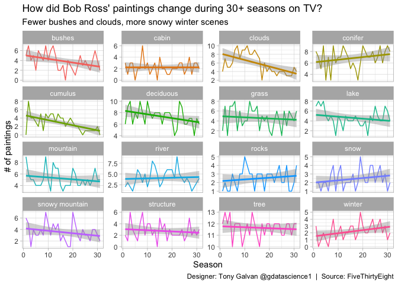

# Happy Little Trees: How Bob Ross’s Painting Style Evolved Over 31 Seasons

**[Source Code](2019_08_05_tidy_tuesday_bob_ross_paintings.Rmd)** | Data from the [TidyTuesday project](https://github.com/rfordatascience/tidytuesday/tree/master/data/2019/2019-08-05) (2019-08-05)


Bob Ross painted 403 landscapes on The Joy of Painting over 31 seasons, and FiveThirtyEight cataloged every element. This analysis explores which elements he favored, how his preferences shifted over time, and what words dominated his painting titles.

---

Bob Ross painted 403 landscapes on *The Joy of Painting* over 31 seasons
— and FiveThirtyEight cataloged every element in every painting. Trees,
mountains, clouds, cabins, lakes — each painting is a combination of
these building blocks. But did Bob’s style change over three decades on
television? Let’s find out which elements he favored, how his
preferences shifted over time, and what words dominated his painting
titles.

## Loading the Data

We’ll use the `fivethirtyeight` package which includes the pre-processed
Bob Ross dataset.

``` r
library(tidyverse)
theme_set(theme_light())

paintings <- fivethirtyeight::bob_ross |> 
  mutate(title = str_to_title(title))

summary(paintings)
```

    ##    episode              season    episode_num    title          
    ##  Length:403         Min.   : 1   Min.   : 1   Length:403        
    ##  Class :character   1st Qu.: 8   1st Qu.: 4   Class :character  
    ##  Mode  :character   Median :16   Median : 7   Mode  :character  
    ##                     Mean   :16   Mean   : 7                     
    ##                     3rd Qu.:24   3rd Qu.:10                     
    ##                     Max.   :31   Max.   :13                     
    ##   apple_frame       aurora_borealis         barn             beach      
    ##  Min.   :0.000000   Min.   :0.000000   Min.   :0.00000   Min.   :0.000  
    ##  1st Qu.:0.000000   1st Qu.:0.000000   1st Qu.:0.00000   1st Qu.:0.000  
    ##  Median :0.000000   Median :0.000000   Median :0.00000   Median :0.000  
    ##  Mean   :0.002481   Mean   :0.004963   Mean   :0.04218   Mean   :0.067  
    ##  3rd Qu.:0.000000   3rd Qu.:0.000000   3rd Qu.:0.00000   3rd Qu.:0.000  
    ##  Max.   :1.000000   Max.   :1.000000   Max.   :1.00000   Max.   :1.000  
    ##       boat              bridge           building            bushes      
    ##  Min.   :0.000000   Min.   :0.00000   Min.   :0.000000   Min.   :0.0000  
    ##  1st Qu.:0.000000   1st Qu.:0.00000   1st Qu.:0.000000   1st Qu.:0.0000  
    ##  Median :0.000000   Median :0.00000   Median :0.000000   Median :0.0000  
    ##  Mean   :0.004963   Mean   :0.01737   Mean   :0.002481   Mean   :0.2978  
    ##  3rd Qu.:0.000000   3rd Qu.:0.00000   3rd Qu.:0.000000   3rd Qu.:1.0000  
    ##  Max.   :1.000000   Max.   :1.00000   Max.   :1.000000   Max.   :1.0000  
    ##      cabin            cactus          circle_frame          cirrus       
    ##  Min.   :0.0000   Min.   :0.000000   Min.   :0.000000   Min.   :0.00000  
    ##  1st Qu.:0.0000   1st Qu.:0.000000   1st Qu.:0.000000   1st Qu.:0.00000  
    ##  Median :0.0000   Median :0.000000   Median :0.000000   Median :0.00000  
    ##  Mean   :0.1712   Mean   :0.009926   Mean   :0.004963   Mean   :0.06948  
    ##  3rd Qu.:0.0000   3rd Qu.:0.000000   3rd Qu.:0.000000   3rd Qu.:0.00000  
    ##  Max.   :1.0000   Max.   :1.000000   Max.   :1.000000   Max.   :1.00000  
    ##      cliff             clouds          conifer          cumulus      
    ##  Min.   :0.00000   Min.   :0.0000   Min.   :0.0000   Min.   :0.0000  
    ##  1st Qu.:0.00000   1st Qu.:0.0000   1st Qu.:0.0000   1st Qu.:0.0000  
    ##  Median :0.00000   Median :0.0000   Median :1.0000   Median :0.0000  
    ##  Mean   :0.01985   Mean   :0.4442   Mean   :0.5261   Mean   :0.2134  
    ##  3rd Qu.:0.00000   3rd Qu.:1.0000   3rd Qu.:1.0000   3rd Qu.:0.0000  
    ##  Max.   :1.00000   Max.   :1.0000   Max.   :1.0000   Max.   :1.0000  
    ##    deciduous       diane_andre            dock          double_oval_frame 
    ##  Min.   :0.0000   Min.   :0.000000   Min.   :0.000000   Min.   :0.000000  
    ##  1st Qu.:0.0000   1st Qu.:0.000000   1st Qu.:0.000000   1st Qu.:0.000000  
    ##  Median :1.0000   Median :0.000000   Median :0.000000   Median :0.000000  
    ##  Mean   :0.5633   Mean   :0.002481   Mean   :0.002481   Mean   :0.002481  
    ##  3rd Qu.:1.0000   3rd Qu.:0.000000   3rd Qu.:0.000000   3rd Qu.:0.000000  
    ##  Max.   :1.0000   Max.   :1.000000   Max.   :1.000000   Max.   :1.000000  
    ##       farm              fence              fire          florida_frame     
    ##  Min.   :0.000000   Min.   :0.00000   Min.   :0.000000   Min.   :0.000000  
    ##  1st Qu.:0.000000   1st Qu.:0.00000   1st Qu.:0.000000   1st Qu.:0.000000  
    ##  Median :0.000000   Median :0.00000   Median :0.000000   Median :0.000000  
    ##  Mean   :0.002481   Mean   :0.05955   Mean   :0.002481   Mean   :0.002481  
    ##  3rd Qu.:0.000000   3rd Qu.:0.00000   3rd Qu.:0.000000   3rd Qu.:0.000000  
    ##  Max.   :1.000000   Max.   :1.00000   Max.   :1.000000   Max.   :1.000000  
    ##     flowers             fog              framed           grass       
    ##  Min.   :0.00000   Min.   :0.00000   Min.   :0.0000   Min.   :0.0000  
    ##  1st Qu.:0.00000   1st Qu.:0.00000   1st Qu.:0.0000   1st Qu.:0.0000  
    ##  Median :0.00000   Median :0.00000   Median :0.0000   Median :0.0000  
    ##  Mean   :0.02978   Mean   :0.05707   Mean   :0.1315   Mean   :0.3524  
    ##  3rd Qu.:0.00000   3rd Qu.:0.00000   3rd Qu.:0.0000   3rd Qu.:1.0000  
    ##  Max.   :1.00000   Max.   :1.00000   Max.   :1.0000   Max.   :1.0000  
    ##      guest         half_circle_frame  half_oval_frame        hills        
    ##  Min.   :0.00000   Min.   :0.000000   Min.   :0.000000   Min.   :0.00000  
    ##  1st Qu.:0.00000   1st Qu.:0.000000   1st Qu.:0.000000   1st Qu.:0.00000  
    ##  Median :0.00000   Median :0.000000   Median :0.000000   Median :0.00000  
    ##  Mean   :0.05459   Mean   :0.002481   Mean   :0.002481   Mean   :0.04467  
    ##  3rd Qu.:0.00000   3rd Qu.:0.000000   3rd Qu.:0.000000   3rd Qu.:0.00000  
    ##  Max.   :1.00000   Max.   :1.000000   Max.   :1.000000   Max.   :1.00000  
    ##       lake            lakes     lighthouse            mill         
    ##  Min.   :0.0000   Min.   :0   Min.   :0.000000   Min.   :0.000000  
    ##  1st Qu.:0.0000   1st Qu.:0   1st Qu.:0.000000   1st Qu.:0.000000  
    ##  Median :0.0000   Median :0   Median :0.000000   Median :0.000000  
    ##  Mean   :0.3548   Mean   :0   Mean   :0.002481   Mean   :0.004963  
    ##  3rd Qu.:1.0000   3rd Qu.:0   3rd Qu.:0.000000   3rd Qu.:0.000000  
    ##  Max.   :1.0000   Max.   :0   Max.   :1.000000   Max.   :1.000000  
    ##       moon             mountain       mountains          night       
    ##  Min.   :0.000000   Min.   :0.000   Min.   :0.0000   Min.   :0.0000  
    ##  1st Qu.:0.000000   1st Qu.:0.000   1st Qu.:0.0000   1st Qu.:0.0000  
    ##  Median :0.000000   Median :0.000   Median :0.0000   Median :0.0000  
    ##  Mean   :0.007444   Mean   :0.397   Mean   :0.2457   Mean   :0.0273  
    ##  3rd Qu.:0.000000   3rd Qu.:1.000   3rd Qu.:0.0000   3rd Qu.:0.0000  
    ##  Max.   :1.000000   Max.   :1.000   Max.   :1.0000   Max.   :1.0000  
    ##      ocean           oval_frame        palm_trees           path       
    ##  Min.   :0.00000   Min.   :0.00000   Min.   :0.00000   Min.   :0.0000  
    ##  1st Qu.:0.00000   1st Qu.:0.00000   1st Qu.:0.00000   1st Qu.:0.0000  
    ##  Median :0.00000   Median :0.00000   Median :0.00000   Median :0.0000  
    ##  Mean   :0.08933   Mean   :0.09429   Mean   :0.02233   Mean   :0.1216  
    ##  3rd Qu.:0.00000   3rd Qu.:0.00000   3rd Qu.:0.00000   3rd Qu.:0.0000  
    ##  Max.   :1.00000   Max.   :1.00000   Max.   :1.00000   Max.   :1.0000  
    ##      person            portrait        rectangle_3d_frame rectangular_frame 
    ##  Min.   :0.000000   Min.   :0.000000   Min.   :0.000000   Min.   :0.000000  
    ##  1st Qu.:0.000000   1st Qu.:0.000000   1st Qu.:0.000000   1st Qu.:0.000000  
    ##  Median :0.000000   Median :0.000000   Median :0.000000   Median :0.000000  
    ##  Mean   :0.002481   Mean   :0.007444   Mean   :0.002481   Mean   :0.002481  
    ##  3rd Qu.:0.000000   3rd Qu.:0.000000   3rd Qu.:0.000000   3rd Qu.:0.000000  
    ##  Max.   :1.000000   Max.   :1.000000   Max.   :1.000000   Max.   :1.000000  
    ##      river            rocks        seashell_frame          snow       
    ##  Min.   :0.0000   Min.   :0.0000   Min.   :0.000000   Min.   :0.0000  
    ##  1st Qu.:0.0000   1st Qu.:0.0000   1st Qu.:0.000000   1st Qu.:0.0000  
    ##  Median :0.0000   Median :0.0000   Median :0.000000   Median :0.0000  
    ##  Mean   :0.3127   Mean   :0.1911   Mean   :0.002481   Mean   :0.1861  
    ##  3rd Qu.:1.0000   3rd Qu.:0.0000   3rd Qu.:0.000000   3rd Qu.:0.0000  
    ##  Max.   :1.0000   Max.   :1.0000   Max.   :1.000000   Max.   :1.0000  
    ##  snowy_mountain    split_frame         steve_ross       structure     
    ##  Min.   :0.0000   Min.   :0.000000   Min.   :0.0000   Min.   :0.0000  
    ##  1st Qu.:0.0000   1st Qu.:0.000000   1st Qu.:0.0000   1st Qu.:0.0000  
    ##  Median :0.0000   Median :0.000000   Median :0.0000   Median :0.0000  
    ##  Mean   :0.2705   Mean   :0.002481   Mean   :0.0273   Mean   :0.2109  
    ##  3rd Qu.:1.0000   3rd Qu.:0.000000   3rd Qu.:0.0000   3rd Qu.:0.0000  
    ##  Max.   :1.0000   Max.   :1.000000   Max.   :1.0000   Max.   :1.0000  
    ##       sun            tomb_frame            tree            trees       
    ##  Min.   :0.00000   Min.   :0.000000   Min.   :0.0000   Min.   :0.0000  
    ##  1st Qu.:0.00000   1st Qu.:0.000000   1st Qu.:1.0000   1st Qu.:1.0000  
    ##  Median :0.00000   Median :0.000000   Median :1.0000   Median :1.0000  
    ##  Mean   :0.09926   Mean   :0.002481   Mean   :0.8958   Mean   :0.8362  
    ##  3rd Qu.:0.00000   3rd Qu.:0.000000   3rd Qu.:1.0000   3rd Qu.:1.0000  
    ##  Max.   :1.00000   Max.   :1.000000   Max.   :1.0000   Max.   :1.0000  
    ##   triple_frame        waterfall           waves            windmill       
    ##  Min.   :0.000000   Min.   :0.00000   Min.   :0.00000   Min.   :0.000000  
    ##  1st Qu.:0.000000   1st Qu.:0.00000   1st Qu.:0.00000   1st Qu.:0.000000  
    ##  Median :0.000000   Median :0.00000   Median :0.00000   Median :0.000000  
    ##  Mean   :0.002481   Mean   :0.09677   Mean   :0.08437   Mean   :0.002481  
    ##  3rd Qu.:0.000000   3rd Qu.:0.00000   3rd Qu.:0.00000   3rd Qu.:0.000000  
    ##  Max.   :1.000000   Max.   :1.00000   Max.   :1.00000   Max.   :1.000000  
    ##   window_frame          winter        wood_framed      
    ##  Min.   :0.000000   Min.   :0.0000   Min.   :0.000000  
    ##  1st Qu.:0.000000   1st Qu.:0.0000   1st Qu.:0.000000  
    ##  Median :0.000000   Median :0.0000   Median :0.000000  
    ##  Mean   :0.002481   Mean   :0.1712   Mean   :0.002481  
    ##  3rd Qu.:0.000000   3rd Qu.:0.0000   3rd Qu.:0.000000  
    ##  Max.   :1.000000   Max.   :1.0000   Max.   :1.000000

## Reshaping the Data

The dataset has one column per element (tree, mountain, lake, etc.) with
binary indicators. We’ll pivot this into a long format for easier
analysis, consolidating plural categories (e.g., “lakes” into “lake”).

``` r
bob_ross <- paintings |> 
  mutate(lake = as.integer(if_else(lakes == 1,1,as.double(lake))),
         mountain = as.integer(if_else(mountains == 1,1,as.double(mountain))),
         tree = as.integer(if_else(trees == 1,1,as.double(tree)))) |>
  select(-episode, -lakes, -mountains, -trees) |>
  gather(element, exists, -season, -episode_num, -title) |>
  mutate(element = str_replace_all(element,"_"," "))

summary(bob_ross)
```

    ##      season    episode_num    title             element         
    ##  Min.   : 1   Min.   : 1   Length:25792       Length:25792      
    ##  1st Qu.: 8   1st Qu.: 4   Class :character   Class :character  
    ##  Median :16   Median : 7   Mode  :character   Mode  :character  
    ##  Mean   :16   Mean   : 7                                        
    ##  3rd Qu.:24   3rd Qu.:10                                        
    ##  Max.   :31   Max.   :13                                        
    ##      exists     
    ##  Min.   :0.000  
    ##  1st Qu.:0.000  
    ##  Median :0.000  
    ##  Mean   :0.108  
    ##  3rd Qu.:0.000  
    ##  Max.   :1.000

## The Most Common Painting Elements

Which elements appear in the highest percentage of Bob Ross paintings?
The answer won’t surprise anyone who’s watched the show.

``` r
num_of_paintings <- nrow(paintings)

top_elements <- bob_ross |>
  group_by(element) |>
  summarise(pct_of_paintings = sum(exists)/num_of_paintings) |>
  top_n(16, pct_of_paintings) |>
  ungroup() 

top_elements |>
  mutate(element = fct_reorder(element, pct_of_paintings)) |>
  ggplot(aes(element, pct_of_paintings, fill = element)) +
  geom_col(show.legend = FALSE) +
  scale_y_continuous(labels = scales::percent_format()) +
  coord_flip() +
  labs(x = "Element",
       y = "% of paintings",
       title = "Bob Ross loved painting trees",
       subtitle = "Top 10 elements in the paintings from his show",
       caption = "Designer: Tony Galvan @gdatascience1  |  Source: FiveThirtyEight")
```

<!-- -->

Trees appear in over 85% of all paintings — Bob’s “happy little trees”
catchphrase was well-earned. Mountains, clouds, and bushes round out the
top elements, painting a picture of Bob’s quintessential landscape: a
tree-lined mountain scene with clouds overhead.

## How Did Bob’s Style Evolve?

Let’s track the top elements across all 31 seasons. Did Bob paint more
or fewer of certain elements as the show progressed?

``` r
bob_ross |>
  inner_join(top_elements) |>
  group_by(season, element) |>
  summarise(num_of_paintings = sum(exists)) |>
  ungroup() |>
  ggplot(aes(season, num_of_paintings, color = element)) +
  geom_line() +
  geom_smooth(method = "lm") +
  facet_wrap(~element, scales = "free_y") +
  theme(legend.position = "None") + 
  labs(x = "Season",
       y = "# of paintings",
       title = "How did Bob Ross' paintings change during 30+ seasons on TV?",
       subtitle = "Fewer bushes and clouds, more snowy winter scenes",
       caption = "Designer: Tony Galvan @gdatascience1  |  Source: FiveThirtyEight")
```

<!-- -->

``` r
ggsave("outputs/2019_08_05_tidy_tuesday_bob_ross_paintings.png", width = 7.5, height = 8)
```

The trends reveal a subtle evolution: Bob painted fewer bushes and
clouds in later seasons while increasing snow and winter scenes. Trees
remained constant throughout — some things never change.

## Word Cloud from Painting Titles

What words did Bob use most in his painting titles? The titles often
evoke mood and setting.

``` r
paintings |>
  tidytext::unnest_tokens(tbl = ., output = word, input = title) |>
  anti_join(tidytext::get_stopwords()) |>
  count(word, sort = TRUE) |>
  filter(n > 3) |>
  wordcloud2::wordcloud2(shape = "cardiod")
```

“Mountain,” “winter,” “sunset,” and “lake” dominate the titles — a
perfect summary of the Bob Ross aesthetic. His painting titles read like
a love letter to the American wilderness.
