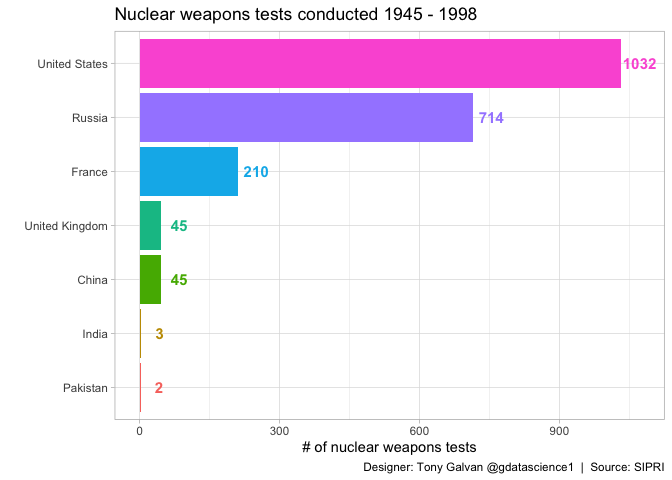
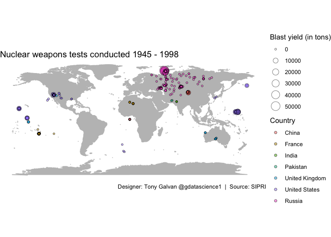
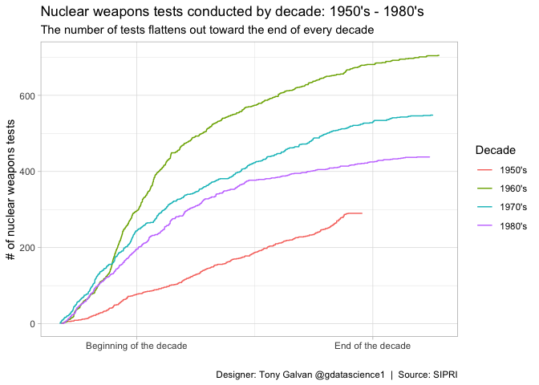
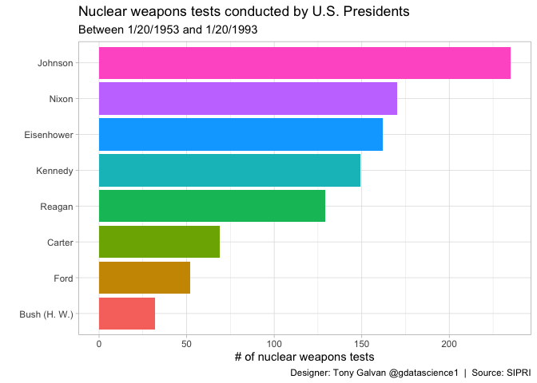
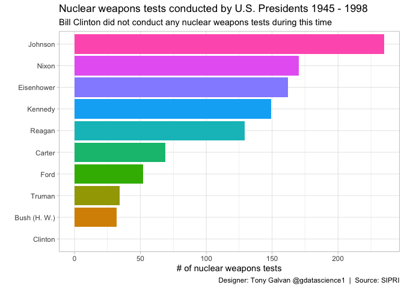

# The Atomic Age in Numbers: Mapping Every Nuclear Weapons Test from 1945 to 1998

**[Source Code](2019_08_20_tidy_tuesday_nuclear_explosions.Rmd)** | Data from the [TidyTuesday project](https://github.com/rfordatascience/tidytuesday/tree/master/data/2019/2019-08-20) (2019-08-20)


Between 1945 and 1998, the world’s nuclear powers detonated over 2,000 nuclear weapons in tests. Using SIPRI data, this analysis maps the geography of nuclear testing, traces the arms race decade by decade, and identifies which U.S. presidents presided over the most tests.

---

Between 1945 and 1998, the world’s nuclear powers detonated over 2,000
nuclear weapons in tests — from the deserts of Nevada to remote Pacific
atolls to the frozen steppes of Kazakhstan. The Stockholm International
Peace Research Institute (SIPRI) cataloged every one of them. This
dataset lets us map the geography of nuclear testing, trace the arms
race decade by decade, and see which U.S. presidents presided over the
most tests.

## Loading and Preparing the Data

We’ll recode country names for readability, parse dates, assign decades,
and map each U.S. test to the sitting president.

``` r
library(tidyverse)
library(lubridate)
theme_set(theme_light())

nuclear_explosions <- readr::read_csv("https://raw.githubusercontent.com/rfordatascience/tidytuesday/master/data/2019/2019-08-20/nuclear_explosions.csv") |>
  mutate(country = fct_recode(country, 
                              "United States" = "USA",
                              "Russia" = "USSR",
                              "France" = "FRANCE",
                              "United Kingdom" = "UK",
                              "China" = "CHINA",
                              "India" = "INDIA",
                              "Pakistan" = "PAKIST"),
         date  = ymd(date_long),
         decade = 10 * (year %/% 10),
         day_of_decade = yday(date) * (year - decade + 1),
         president = case_when(date < "1953-01-20" ~ "Truman",
                               date < "1961-01-20" ~ "Eisenhower",
                               date < "1963-11-22" ~ "Kennedy",
                               date < "1969-01-20" ~ "Johnson",
                               date < "1974-08-09" ~ "Nixon",
                               date < "1977-01-20" ~ "Ford",
                               date < "1981-01-20" ~ "Carter",
                               date < "1989-01-20" ~ "Reagan",
                               date < "1993-01-20" ~ "Bush (H. W.)",
                               TRUE ~ "Clinton")) |>
  select(-date_long)

summary(nuclear_explosions)
```

    ##       year          id_no                 country        region         
    ##  Min.   :1945   Min.   :45001   China         :  45   Length:2051       
    ##  1st Qu.:1962   1st Qu.:62140   France        : 210   Class :character  
    ##  Median :1970   Median :70021   India         :   3   Mode  :character  
    ##  Mean   :1971   Mean   :70934   Pakistan      :   2                     
    ##  3rd Qu.:1979   3rd Qu.:79044   United Kingdom:  45                     
    ##  Max.   :1998   Max.   :98005   United States :1032                     
    ##                                 Russia        : 714                     
    ##     source             latitude        longitude       magnitude_body 
    ##  Length:2051        Min.   :-49.50   Min.   :-169.32   Min.   :0.000  
    ##  Class :character   1st Qu.: 37.00   1st Qu.:-116.05   1st Qu.:0.000  
    ##  Mode  :character   Median : 37.10   Median :-116.00   Median :0.000  
    ##                     Mean   : 35.40   Mean   : -36.05   Mean   :2.145  
    ##                     3rd Qu.: 49.87   3rd Qu.:  78.00   3rd Qu.:5.100  
    ##                     Max.   : 75.10   Max.   : 179.22   Max.   :7.400  
    ##                                                                       
    ##  magnitude_surface     depth            yield_lower       yield_upper      
    ##  Min.   :0.0000    Min.   :-400.0000   Min.   :    0.0   Min.   :    0.00  
    ##  1st Qu.:0.0000    1st Qu.:   0.0000   1st Qu.:    0.0   1st Qu.:   18.25  
    ##  Median :0.0000    Median :   0.0000   Median :    0.0   Median :   20.00  
    ##  Mean   :0.3558    Mean   :  -0.4896   Mean   :  209.2   Mean   :  323.43  
    ##  3rd Qu.:0.0000    3rd Qu.:   0.0000   3rd Qu.:   20.0   3rd Qu.:  150.00  
    ##  Max.   :6.0000    Max.   :   1.4510   Max.   :50000.0   Max.   :50000.00  
    ##                                        NA's   :3         NA's   :5         
    ##    purpose              name               type                date           
    ##  Length:2051        Length:2051        Length:2051        Min.   :1945-07-16  
    ##  Class :character   Class :character   Class :character   1st Qu.:1962-10-31  
    ##  Mode  :character   Mode  :character   Mode  :character   Median :1970-05-01  
    ##                                                           Mean   :1971-06-19  
    ##                                                           3rd Qu.:1979-09-20  
    ##                                                           Max.   :1998-05-30  
    ##                                                                               
    ##      decade     day_of_decade   president        
    ##  Min.   :1940   Min.   :  15   Length:2051       
    ##  1st Qu.:1960   1st Qu.: 512   Class :character  
    ##  Median :1970   Median : 924   Mode  :character  
    ##  Mean   :1966   Mean   :1153                     
    ##  3rd Qu.:1970   3rd Qu.:1700                     
    ##  Max.   :1990   Max.   :3630                     
    ## 

## Which Countries Conducted Nuclear Tests?

The nuclear club is small but its members tested prolifically. Let’s see
the total count by country.

``` r
nuclear_explosions |>
  count(country, sort = TRUE) |>
  mutate(country = fct_reorder(country, n)) |>
  ggplot(aes(country, n)) +
  geom_col(aes(fill = country), show.legend = FALSE) + 
  coord_flip() + 
  geom_text(aes(label = n, color = country), show.legend = FALSE,
            nudge_y = 40, size = 4, fontface = "bold") + 
  labs(x = "",
       y = "# of nuclear weapons tests",
       title = "Nuclear weapons tests conducted 1945 - 1998",
       caption = "Designer: Tony Galvan @gdatascience1  |  Source: SIPRI")
```

<!-- -->

The United States and Russia (USSR) conducted the vast majority of tests
— over 1,000 each — reflecting the Cold War arms race that defined the
second half of the 20th century.

## World Map of Test Locations

Where on Earth were these weapons detonated? The geographic
concentration is striking.

``` r
nuclear_explosions |>
  ggplot(aes(longitude, latitude, size = yield_upper)) +
  borders("world", colour = "gray75", fill = "gray75") +
  geom_point(aes(fill = country), pch = 21, color = "black", alpha = 0.5) +
  coord_quickmap() + 
  theme_void() + 
  labs(size = "Blast yield (in tons)",
       fill = "Country",
       title = "Nuclear weapons tests conducted 1945 - 1998",
       caption = "Designer: Tony Galvan @gdatascience1  |  Source: SIPRI")
```

<!-- -->

The clusters are unmistakable: Nevada (USA), Semipalatinsk and Novaya
Zemlya (USSR), the Pacific atolls (USA, UK, France), the Sahara
(France), Lop Nur (China), and Rajasthan (India/Pakistan). These remote
locations were chosen to minimize civilian exposure — though the
long-term health effects on nearby populations remain controversial.

## The Arms Race by Decade

An overlayed step plot shows how testing intensity evolved decade by
decade. Each line traces the cumulative number of tests within its
decade.

``` r
nuclear_explosions |>
  filter(date > "1949-12-31" & date < "1990-01-01") |>
  group_by(day_of_decade, decade) |>
  summarise(n = n()) |>
  ungroup() |>
  mutate(counter = 1) |>
  group_by(decade) |>
  mutate(counter = cumsum(n)) |>
  ungroup() |>
  ggplot(aes(day_of_decade, counter, group = decade, color = factor(decade))) + 
  geom_step() + 
  scale_color_discrete(labels = c("1950's", "1960's", "1970's", "1980's")) +
  scale_x_continuous(breaks = c(750, 3000),
                     labels = c("Beginning of the decade", "End of the decade")) +
  labs(x = "",
       y = "# of nuclear weapons tests",
       color = "Decade",
       title = "Nuclear weapons tests conducted by decade: 1950's - 1980's",
       subtitle = "The number of tests flattens out toward the end of every decade",
       caption = "Designer: Tony Galvan @gdatascience1  |  Source: SIPRI")
```

<!-- -->

``` r
ggsave("outputs/2019_08_20_tidy_tuesday_nuclear_explosions.png", width = 5.75)
```

A fascinating pattern emerges: every decade shows a burst of testing
early on that flattens toward the end. This likely reflects test ban
negotiations and political pressure that built throughout each decade.

## Nuclear Tests by U.S. President

Which American presidents oversaw the most nuclear weapons tests? The
answer reflects both Cold War intensity and individual policy choices.

``` r
nuclear_explosions |>
  filter(country == "United States" & 
           president != "Truman" & president != "Clinton") |>
  group_by(president) |>
  summarise(n = n()) |>
  mutate(president = fct_reorder(president, n)) |>
  ggplot(aes(president, n, fill = president)) + 
  geom_col(show.legend = FALSE) +
  coord_flip() +
  labs(x = "",
       y = "# of nuclear weapons tests",
       title = "Nuclear weapons tests conducted by U.S. Presidents",
       subtitle = "Between 1/20/1953 and 1/20/1993",
       caption = "Designer: Tony Galvan @gdatascience1  |  Source: SIPRI")
```

<!-- -->

## Including the Full Presidential Timeline

Let’s expand the view to include all presidents from Truman through
Clinton — notably, Clinton conducted zero tests during this period.

``` r
nuclear_explosions |>
  filter(country == "United States") |>
  group_by(president) |>
  summarise(n = n()) |>
  ungroup() |>
  bind_rows(data.frame(president = "Clinton", n = 0)) |>
  mutate(president = fct_reorder(president, n)) |>
  ggplot(aes(president, n, fill = president)) + 
  geom_col(show.legend = FALSE) +
  coord_flip() +
  labs(x = "",
       y = "# of nuclear weapons tests",
       title = "Nuclear weapons tests conducted by U.S. Presidents 1945 - 1998",
       subtitle = "Bill Clinton did not conduct any nuclear weapons tests during this time",
       caption = "Designer: Tony Galvan @gdatascience1  |  Source: SIPRI")
```

<!-- -->

``` r
ggsave("outputs/2019_08_20_tidy_tuesday_nuclear_presidents.png", width = 6.5)
```

Reagan conducted the most tests of any president — over 200 during his
eight years — reflecting his administration’s “peace through strength”
philosophy. Clinton’s zero tests mark the end of an era: the
Comprehensive Nuclear-Test-Ban Treaty was signed in 1996, and no country
has conducted a confirmed nuclear test since 1998 (with the exception of
North Korea).
