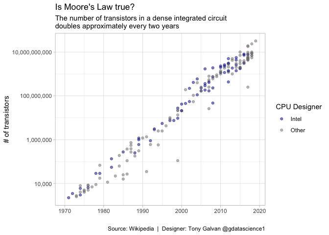

# Is Moore’s Law Still Alive? Tracking Transistor Counts from 1971 to Today

**[Source Code](2019_09_03_tidy_tuesday_moores_law.Rmd)** | Data from the [TidyTuesday project](https://github.com/rfordatascience/tidytuesday/tree/master/data/2019/2019-09-03) (2019-09-03)


In 1965, Gordon Moore predicted that transistor counts would double approximately every two years. More than five decades later, this analysis tracks whether Moore’s Law has held up and examines the exponential growth of computing power that transformed our world.

---

In 1965, Gordon Moore predicted that the number of transistors on a chip
would double approximately every two years. More than five decades
later, this observation — known as Moore’s Law — has held remarkably
well, driving the exponential growth of computing power that transformed
the modern world. Using Wikipedia’s data on CPU, GPU, and RAM transistor
counts, we can visualize this exponential trajectory and see whether
Intel has led or followed the pack.

## Loading the Data

We’ll load three datasets covering CPUs, GPUs, and RAM chips — each
tracking transistor counts over time.

## CPU Transistor Counts: Intel vs. the World

The classic Moore’s Law chart — transistor count on a logarithmic scale
over time. If Moore’s Law holds, the points should fall along a straight
line on this log scale. We’ll highlight Intel (the company Moore
co-founded) versus all other manufacturers.

``` r
cpu |>
  ggplot(aes(date_of_introduction, transistor_count, color = if_else(designer == "Intel", "Intel", "Other"))) +
  geom_point(alpha = 0.5) + 
  scale_y_log10(labels = scales::comma_format()) + 
  scale_color_manual(values = c("darkblue", "gray50")) +
  labs(x = "",
       y = "# of transistors",
       color = "CPU Designer",
       title = "Is Moore's Law true?",
       subtitle = "The number of transistors in a dense integrated circuit\ndoubles approximately every two years",
       caption = default_caption)
```

<!-- -->

``` r
##ggsave("outputs/2019_09_03_tidy_tuesday_moores_law.png", width = 6, height = 4)
```

The log-scale plot confirms that Moore’s Law has held remarkably well
for nearly 50 years. The points trace a roughly linear path on the log
scale — meaning exponential growth in real terms. Intel chips (in blue)
have generally tracked the overall trend rather than leading it, with
other manufacturers keeping pace throughout. The slight flattening at
the top right hints at the physical limits that are beginning to
challenge continued scaling — but reports of Moore’s Law’s death remain
premature.
