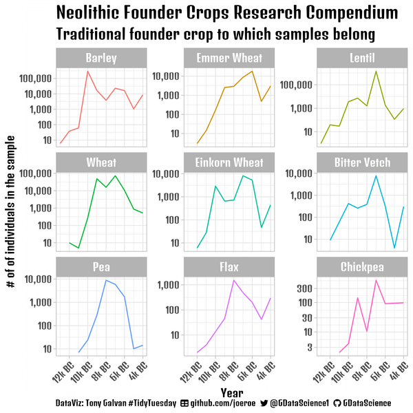

# TidyTuesday - April 18, 2023

Data comes from the [TidyTuesday project](https://github.com/rfordatascience/tidytuesday/tree/master/data/2023/2023-04-18).

## Source Code

- [2023_04_18_tidy_tuesday_founder_crops.Rmd](2023_04_18_tidy_tuesday_founder_crops.Rmd)

