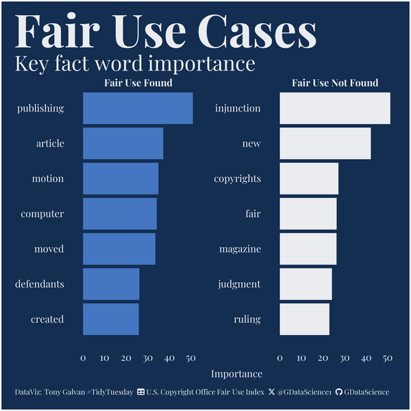

# TidyTuesday - August 29, 2023

Data comes from the [TidyTuesday project](https://github.com/rfordatascience/tidytuesday/tree/master/data/2023/2023-08-29).

## Source Code

- [2023_08_29_tidy_tuesday_fair_use.Rmd](2023_08_29_tidy_tuesday_fair_use.Rmd)

