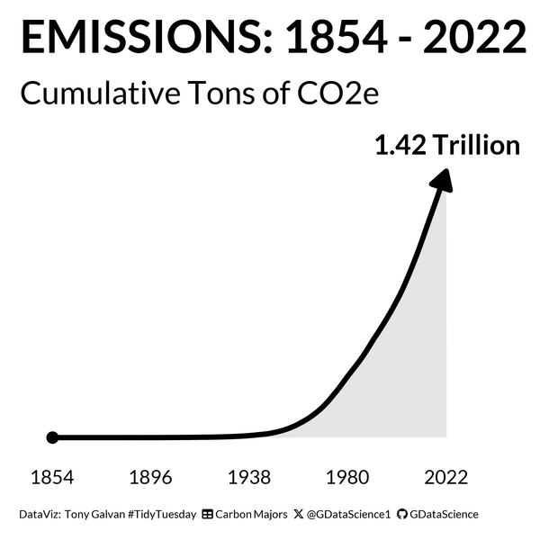

# TidyTuesday - May 21, 2024

Data comes from the [TidyTuesday project](https://github.com/rfordatascience/tidytuesday/tree/master/data/2024/2024-05-21).

## Source Code

- [2024_05_21_tidy_tuesday_emissions.Rmd](2024_05_21_tidy_tuesday_emissions.Rmd)

