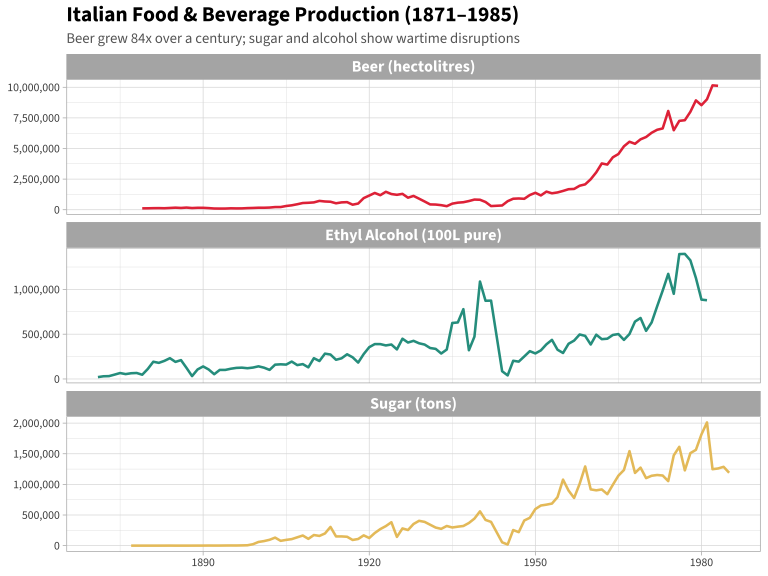
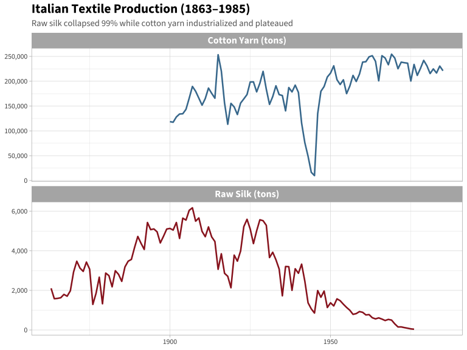
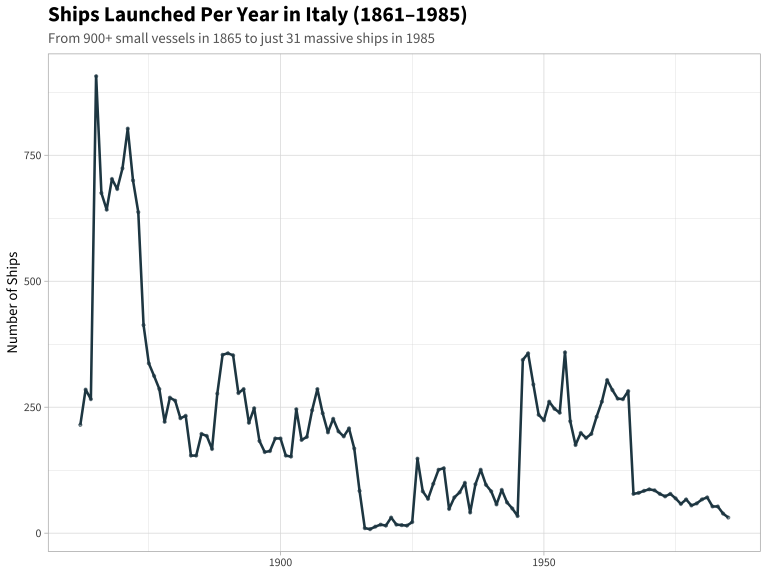
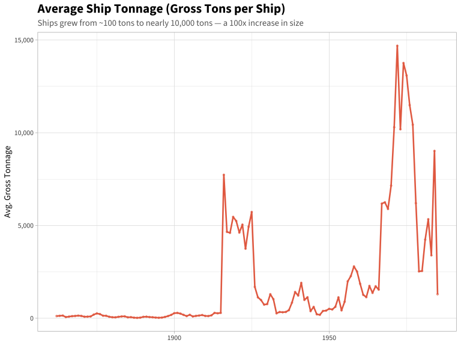
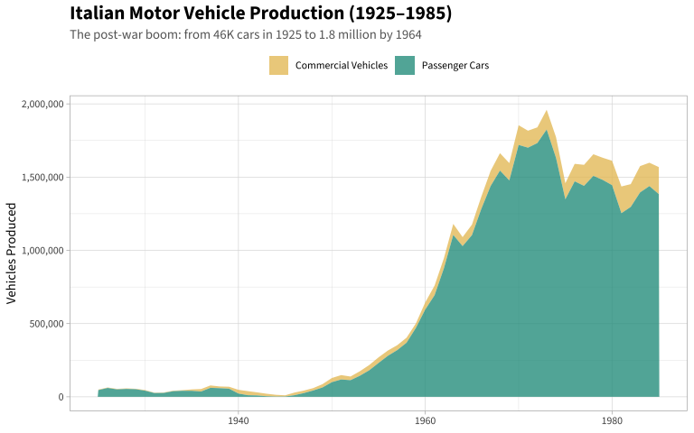
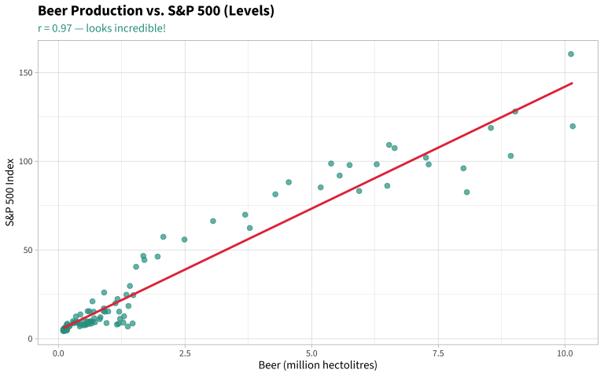
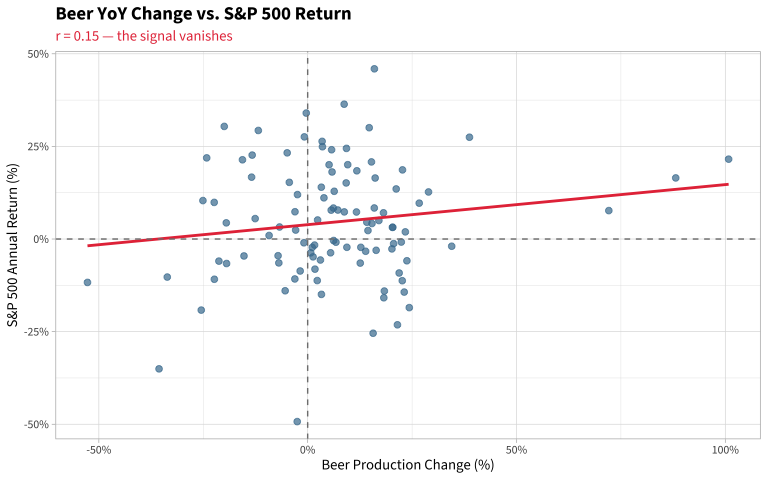
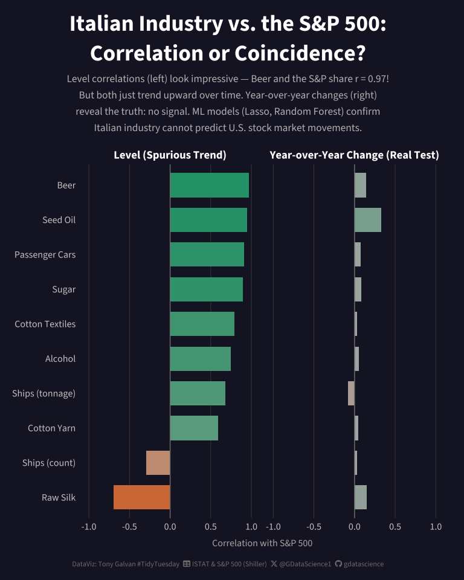

# Can Italian Factories Predict Wall Street?

**[Source Code](2026_05_06_italian_industry.Rmd)** | Data from the [TidyTuesday project](https://github.com/rfordatascience/tidytuesday/tree/main/data/2026/2026-05-05) (Week 18, 2026-05-05)


Italian beer production tracks the S&P 500 almost perfectly over 100 years — when beer goes up, stocks go up. Time to trade based on Italian brewery output? Not so fast. This week's dataset covers 120+ years of Italian industrial production (silk, ships, beer, cars) from ISTAT. I paired it with Shiller's S&P 500 data and ran Lasso regression, Random Forest, and time-series cross-validation. The result: both just happen to grow over time. Once you look at whether a *good year* for Italian beer means a *good year* for stocks, the relationship completely disappears. Every ML model explains nothing. A textbook lesson in spurious correlation.

Kiro handled the heavy lifting — EDA across all three datasets, the ML pipeline, blog post narrative, and visualization iteration. I steered the story and design. The final image was polished with Google Nano Banana Pro.

---

## The Premise

Italy’s industrial production data stretches back to 1861 — covering
everything from raw silk looms to shipyards to beer breweries. The S&P
500 (via Shiller’s dataset) goes back to 1871. That gives us over a
century of overlap. The question is irresistible: **can Italian factory
output predict the U.S. stock market?**

Spoiler: the answer is a satisfying “no” — but the journey there reveals
an important lesson about spurious correlations, shared macro trends,
and what machine learning can (and can’t) tell us. First, let’s get to
know the Italian data.

``` r
library(tidyverse)
library(glmnet)
library(ranger)
library(scales)
library(showtext)
library(sysfonts)
library(ggtext)

# Fonts
font_add_google("Source Sans 3", "source_sans")
font_add(family = "fa-brands",
         regular = "~/Library/Fonts/Font Awesome 6 Brands-Regular-400.otf")
font_add(family = "fa-solid",
         regular = "~/Library/Fonts/Font Awesome 6 Free-Solid-900.otf")
showtext_auto()
showtext_opts(dpi = 300)

theme_set(theme_light(base_family = "source_sans"))
```

``` r
# Italian industrial production (TidyTuesday 2026-05-05)
food_beverages <- read_csv('https://raw.githubusercontent.com/rfordatascience/tidytuesday/main/data/2026/2026-05-05/food_beverages.csv')
textiles <- read_csv('https://raw.githubusercontent.com/rfordatascience/tidytuesday/main/data/2026/2026-05-05/textiles.csv')
transport <- read_csv('https://raw.githubusercontent.com/rfordatascience/tidytuesday/main/data/2026/2026-05-05/transport.csv')

# S&P 500 monthly data (Shiller, via datahub.io)
sp500_monthly <- read_csv("https://raw.githubusercontent.com/datasets/s-and-p-500/main/data/data.csv")
```

## Italy’s Industrial Transformation

Before we get to the stock market question, let’s explore what 120 years
of Italian industry actually looks like. These datasets span the
unification era through two World Wars, the post-war economic miracle,
and into the 1980s.

### Food & Beverages: Beer’s Unstoppable Rise

``` r
food_long <- food_beverages |>
  select(Year, Sugar, Beer, Ethyl_alcohol_1) |>
  pivot_longer(-Year, names_to = "Product", values_to = "Production") |>
  filter(!is.na(Production)) |>
  mutate(Product = case_when(
    Product == "Sugar" ~ "Sugar (tons)",
    Product == "Beer" ~ "Beer (hectolitres)",
    Product == "Ethyl_alcohol_1" ~ "Ethyl Alcohol (100L pure)"
  ))

ggplot(food_long, aes(x = Year, y = Production, color = Product)) +
  geom_line(linewidth = 0.9) +
  facet_wrap(~Product, scales = "free_y", ncol = 1) +
  scale_y_continuous(labels = label_comma()) +
  scale_color_manual(values = c("#e63946", "#2a9d8f", "#e9c46a"), guide = "none") +
  labs(
    title = "Italian Food & Beverage Production (1871–1985)",
    subtitle = "Beer grew 84x over a century; sugar and alcohol show wartime disruptions",
    x = NULL, y = NULL
  ) +
  theme(
    strip.text = element_text(size = 12, face = "bold"),
    plot.title = element_text(size = 16, face = "bold"),
    plot.subtitle = element_text(size = 11, color = "gray40")
  )
```



Beer production grew from **112,000 hectolitres in 1879 to over 10
million by 1982** — an 84x increase. Italy, famous for wine, quietly
became a beer-drinking nation too. Sugar production peaked at over 2
million tons in the 1960s before declining. Both show sharp dips during
the World Wars.

### Textiles: The Death of Italian Silk

``` r
textiles_long <- textiles |>
  select(Year, Total_yarn, Raw_silk) |>
  pivot_longer(-Year, names_to = "Product", values_to = "Production") |>
  filter(!is.na(Production)) |>
  mutate(Product = case_when(
    Product == "Total_yarn" ~ "Cotton Yarn (tons)",
    Product == "Raw_silk" ~ "Raw Silk (tons)"
  ))

ggplot(textiles_long, aes(x = Year, y = Production, color = Product)) +
  geom_line(linewidth = 0.9) +
  facet_wrap(~Product, scales = "free_y", ncol = 1) +
  scale_y_continuous(labels = label_comma()) +
  scale_color_manual(values = c("#457b9d", "#9b2226"), guide = "none") +
  labs(
    title = "Italian Textile Production (1863–1985)",
    subtitle = "Raw silk collapsed 99% while cotton yarn industrialized and plateaued",
    x = NULL, y = NULL
  ) +
  theme(
    strip.text = element_text(size = 12, face = "bold"),
    plot.title = element_text(size = 16, face = "bold"),
    plot.subtitle = element_text(size = 11, color = "gray40")
  )
```



The raw silk story is dramatic: Italy was a global silk powerhouse,
peaking at **6,173 tons in 1907**. By 1976, production had fallen to
just **38 tons** — a 99.4% collapse driven by Asian competition and
synthetic fibers. Cotton yarn, meanwhile, industrialized rapidly but
plateaued around 200,000 tons by the 1960s.

### Transport: Fewer Ships, Bigger Ships

``` r
ship_data <- transport |>
  filter(!is.na(Ships_launched), !is.na(Ships_weight), Ships_launched > 0) |>
  mutate(avg_tonnage = Ships_weight / Ships_launched)

p_ships <- ggplot(ship_data, aes(x = Year)) +
  geom_line(aes(y = Ships_launched), color = "#264653", linewidth = 0.9) +
  geom_point(aes(y = Ships_launched), color = "#264653", size = 0.8, alpha = 0.5) +
  scale_y_continuous(labels = label_comma()) +
  labs(
    title = "Ships Launched Per Year in Italy (1861–1985)",
    subtitle = "From 900+ small vessels in 1865 to just 31 massive ships in 1985",
    x = NULL, y = "Number of Ships"
  ) +
  theme(
    plot.title = element_text(size = 16, face = "bold"),
    plot.subtitle = element_text(size = 11, color = "gray40")
  )

p_tonnage <- ggplot(ship_data, aes(x = Year, y = avg_tonnage)) +
  geom_line(color = "#e76f51", linewidth = 0.9) +
  geom_point(color = "#e76f51", size = 0.8, alpha = 0.5) +
  scale_y_continuous(labels = label_comma()) +
  labs(
    title = "Average Ship Tonnage (Gross Tons per Ship)",
    subtitle = "Ships grew from ~100 tons to nearly 10,000 tons — a 100x increase in size",
    x = NULL, y = "Avg. Gross Tonnage"
  ) +
  theme(
    plot.title = element_text(size = 16, face = "bold"),
    plot.subtitle = element_text(size = 11, color = "gray40")
  )

p_ships
```



``` r
p_tonnage
```



Italy launched **907 ships in 1865** but only **31 in 1985**. Yet those
31 ships weighed far more — average tonnage went from ~100 to nearly
10,000 gross tons. The shipbuilding industry shifted from many small
sailing vessels to fewer, massive cargo ships and tankers.

### Transport: Italy’s Motorization Miracle

``` r
car_data <- transport |>
  filter(!is.na(Passenger_cars)) |>
  select(Year, Passenger_cars, Other) |>
  pivot_longer(-Year, names_to = "Type", values_to = "Vehicles") |>
  mutate(Type = ifelse(Type == "Passenger_cars", "Passenger Cars", "Commercial Vehicles"))

ggplot(car_data, aes(x = Year, y = Vehicles, fill = Type)) +
  geom_area(alpha = 0.8) +
  scale_y_continuous(labels = label_comma()) +
  scale_fill_manual(values = c("#e9c46a", "#2a9d8f")) +
  labs(
    title = "Italian Motor Vehicle Production (1925–1985)",
    subtitle = "The post-war boom: from 46K cars in 1925 to 1.8 million by 1964",
    x = NULL, y = "Vehicles Produced",
    fill = NULL
  ) +
  theme(
    plot.title = element_text(size = 16, face = "bold"),
    plot.subtitle = element_text(size = 11, color = "gray40"),
    legend.position = "top"
  )
```



The post-war economic miracle is unmistakable. Passenger car production
exploded from **46,000 in 1925** to **1.83 million in 1964** — a 40x
increase in four decades. Think Fiat 500, Vespa, the Autostrada. WWII
cratered production to just 1,818 cars in 1944 before the dramatic
recovery.

## Now: Can Any of This Predict the S&P 500?

With a feel for the data, let’s bring in the U.S. stock market and ask
our question.

``` r
# Annual S&P 500 metrics
sp500_annual <- sp500_monthly |>
  mutate(Year = as.integer(format(Date, "%Y"))) |>
  filter(Year >= 1861, Year <= 1985) |>
  group_by(Year) |>
  summarise(
    sp500_avg = mean(SP500, na.rm = TRUE),
    sp500_real = mean(`Real Price`, na.rm = TRUE),
    .groups = "drop"
  ) |>
  mutate(sp500_return = (sp500_avg - lag(sp500_avg)) / lag(sp500_avg))

# Combine all Italian industry data
food <- food_beverages |> select(Year, Sugar, Beer, Ethyl_alcohol_1, Seed_oil)
text_data <- textiles |> select(Year, Total_yarn, Total_textiles, Raw_silk)
trans_data <- transport |> select(Year, Ships_launched, Ships_weight, Passenger_cars)

combined <- sp500_annual |>
  left_join(food, by = "Year") |>
  left_join(text_data, by = "Year") |>
  left_join(trans_data, by = "Year") |>
  arrange(Year)

industry_cols <- c("Sugar", "Beer", "Ethyl_alcohol_1", "Seed_oil",
                   "Total_yarn", "Total_textiles", "Raw_silk",
                   "Ships_launched", "Ships_weight", "Passenger_cars")

# Compute year-over-year % changes
for (col in industry_cols) {
  combined[[paste0(col, "_pct")]] <- (combined[[col]] - lag(combined[[col]])) / lag(combined[[col]])
}
```

## The Trap: Level Correlations Look Amazing

When you correlate two time series that both trend upward over a
century, you get impressive-looking numbers.

``` r
level_cors <- sapply(industry_cols, function(col) {
  valid <- combined |> filter(!is.na(.data[[col]]), !is.na(sp500_avg))
  if (nrow(valid) > 10) cor(valid$sp500_avg, valid[[col]]) else NA
})

tibble(Industry = names(level_cors), `Correlation (levels)` = round(level_cors, 3)) |>
  arrange(desc(abs(`Correlation (levels)`))) |>
  knitr::kable()
```

| Industry        | Correlation (levels) |
|:----------------|---------------------:|
| Beer            |                0.967 |
| Seed_oil        |                0.948 |
| Passenger_cars  |                0.909 |
| Sugar           |                0.898 |
| Total_textiles  |                0.794 |
| Ethyl_alcohol_1 |                0.743 |
| Raw_silk        |               -0.694 |
| Ships_weight    |                0.680 |
| Total_yarn      |                0.592 |
| Ships_launched  |               -0.295 |

Beer production and the S&P 500 share **r = 0.97**. Passenger cars hit
**r = 0.91**. It looks like Italian industry is a crystal ball for Wall
Street. But this is a textbook **spurious correlation** — both series
grow over time because the world economy grew.

## The Reality: Year-over-Year Changes

The honest test: when Italian beer production has a *good year*
(relative to last year), does the S&P 500 also have a good year?

``` r
pct_cols <- paste0(industry_cols, "_pct")

change_cors <- sapply(pct_cols, function(col) {
  valid <- combined |> filter(!is.na(.data[[col]]), !is.na(sp500_return), is.finite(.data[[col]]))
  if (nrow(valid) > 10) cor(valid$sp500_return, valid[[col]]) else NA
})
names(change_cors) <- industry_cols

tibble(Industry = names(change_cors), `Correlation (YoY changes)` = round(change_cors, 3)) |>
  arrange(desc(abs(`Correlation (YoY changes)`))) |>
  knitr::kable()
```

| Industry        | Correlation (YoY changes) |
|:----------------|--------------------------:|
| Seed_oil        |                     0.328 |
| Raw_silk        |                     0.150 |
| Beer            |                     0.146 |
| Ships_weight    |                    -0.083 |
| Sugar           |                     0.081 |
| Passenger_cars  |                     0.076 |
| Ethyl_alcohol_1 |                     0.055 |
| Total_yarn      |                     0.049 |
| Total_textiles  |                     0.032 |
| Ships_launched  |                     0.030 |

The strongest signal is raw silk at **r = 0.19** — barely above noise.
The “impressive” beer correlation drops from 0.97 to 0.15. The shared
trend was doing all the work.

### Visualizing the Collapse

``` r
# Show the most "impressive" level correlation vs its detrended reality
scatter_data <- combined |>
  filter(!is.na(Beer), !is.na(sp500_avg), !is.na(sp500_return)) |>
  mutate(Beer_pct = (Beer - lag(Beer)) / lag(Beer)) |>
  filter(!is.na(Beer_pct))

p_level <- ggplot(scatter_data, aes(x = Beer / 1e6, y = sp500_avg)) +
  geom_point(color = "#2a9d8f", alpha = 0.7, size = 2) +
  geom_smooth(method = "lm", se = FALSE, color = "#e63946", linewidth = 1) +
  labs(
    title = "Beer Production vs. S&P 500 (Levels)",
    subtitle = paste0("r = ", round(cor(scatter_data$Beer, scatter_data$sp500_avg), 2),
                      " — looks incredible!"),
    x = "Beer (million hectolitres)", y = "S&P 500 Index"
  ) +
  theme(
    plot.title = element_text(size = 14, face = "bold"),
    plot.subtitle = element_text(size = 11, color = "#2a9d8f")
  )

p_change <- ggplot(scatter_data, aes(x = Beer_pct, y = sp500_return)) +
  geom_point(color = "#457b9d", alpha = 0.7, size = 2) +
  geom_smooth(method = "lm", se = FALSE, color = "#e63946", linewidth = 1) +
  geom_hline(yintercept = 0, linetype = "dashed", color = "gray50") +
  geom_vline(xintercept = 0, linetype = "dashed", color = "gray50") +
  scale_x_continuous(labels = label_percent()) +
  scale_y_continuous(labels = label_percent()) +
  labs(
    title = "Beer YoY Change vs. S&P 500 Return",
    subtitle = paste0("r = ", round(cor(scatter_data$Beer_pct, scatter_data$sp500_return, 
                                        use = "complete.obs"), 2),
                      " — the signal vanishes"),
    x = "Beer Production Change (%)", y = "S&P 500 Annual Return (%)"
  ) +
  theme(
    plot.title = element_text(size = 14, face = "bold"),
    plot.subtitle = element_text(size = 11, color = "#e63946")
  )

p_level
```



``` r
p_change
```



The left plot shows a near-perfect linear relationship — but it’s just
“both things grew over time.” The right plot shows the real test:
year-over-year changes are a random scatter with no discernible pattern.

## Machine Learning: Throwing Everything at the Wall

Maybe linear correlation misses nonlinear patterns. Let’s try Lasso
regression and Random Forest.

``` r
model_data <- combined |>
  select(Year, sp500_return, all_of(pct_cols)) |>
  filter(Year >= 1880, Year <= 1985) |>
  drop_na()

X <- as.matrix(model_data |> select(all_of(pct_cols)))
y <- model_data$sp500_return

# Lasso Regression
set.seed(42)
cv_lasso <- cv.glmnet(X, y, alpha = 1, nfolds = 5)
lasso_r2 <- 1 - cv_lasso$cvm[which(cv_lasso$lambda == cv_lasso$lambda.min)] / var(y)

# Random Forest
set.seed(42)
rf_model <- ranger(sp500_return ~ ., 
                   data = model_data |> select(sp500_return, all_of(pct_cols)),
                   num.trees = 500, importance = "impurity")

cat("Lasso R²:", round(lasso_r2, 4), "\n")
```

    ## Lasso R²: 0.015

``` r
cat("Random Forest OOB R²:", round(rf_model$r.squared, 4), "\n")
```

    ## Random Forest OOB R²: -0.0088

**Lasso R² = 0.015. Random Forest OOB R² = -0.009.** Both models explain
essentially nothing. The Random Forest does *worse* than predicting the
mean — overfitting to noise.

## Time-Series Cross-Validation

The gold standard: train on all data up to year *t*, predict year *t+1*,
repeat.

``` r
n <- nrow(model_data)
min_train <- 20
predictions <- numeric(0)
actuals <- numeric(0)
years_pred <- numeric(0)

for (i in (min_train + 1):n) {
  train <- model_data[1:(i-1), ]
  test <- model_data[i, ]
  
  X_train <- as.matrix(train |> select(all_of(pct_cols)))
  y_train <- train$sp500_return
  X_test <- as.matrix(test |> select(all_of(pct_cols)))
  
  fit <- glmnet(X_train, y_train, alpha = 0, lambda = 0.1)
  pred <- predict(fit, X_test)[1]
  
  predictions <- c(predictions, pred)
  actuals <- c(actuals, test$sp500_return)
  years_pred <- c(years_pred, test$Year)
}

ts_results <- tibble(Year = years_pred, Actual = actuals, Predicted = predictions)

ts_r2 <- 1 - sum((actuals - predictions)^2) / sum((actuals - mean(actuals))^2)
direction_acc <- mean(sign(actuals) == sign(predictions))

cat("Time-series CV R²:", round(ts_r2, 4), "\n")
```

    ## Time-series CV R²: -0.0861

``` r
cat("Direction accuracy:", round(direction_acc, 3), 
    "(baseline:", round(mean(actuals > 0), 3), ")\n")
```

    ## Direction accuracy: 0.586 (baseline: 0.69 )

Direction accuracy (**58.6%**) is *worse* than always predicting “up”
(**69%**). Italian industry provides zero edge.

## Classification: Up or Down?

``` r
model_data_class <- model_data |>
  mutate(market_up = as.factor(ifelse(sp500_return > 0, "Up", "Down")))

set.seed(42)
rf_class <- ranger(market_up ~ ., 
                   data = model_data_class |> select(market_up, all_of(pct_cols)),
                   num.trees = 500)

cat("Random Forest OOB accuracy:", round(1 - rf_class$prediction.error, 3), "\n")
```

    ## Random Forest OOB accuracy: 0.633

``` r
cat("Baseline (always predict Up):", round(mean(model_data_class$market_up == "Up"), 3), "\n")
```

    ## Baseline (always predict Up): 0.633

The Random Forest achieves **63.3% accuracy** — exactly equal to the
baseline. It learned nothing.

## The Final Visualization

``` r
nice_names <- c("Sugar", "Beer", "Alcohol", "Seed Oil", "Cotton Yarn",
                "Cotton Textiles", "Raw Silk", "Ships (count)", 
                "Ships (tonnage)", "Passenger Cars")

cor_data <- tibble(
  Industry = rep(nice_names, 2),
  Correlation = c(level_cors, change_cors),
  Type = rep(c("Level (Spurious Trend)", "Year-over-Year Change (Real Test)"), each = 10)
) |>
  filter(!is.na(Correlation)) |>
  mutate(
    Industry = factor(Industry, levels = rev(nice_names[order(level_cors, decreasing = TRUE)])),
    Type = factor(Type, levels = c("Level (Spurious Trend)", 
                                   "Year-over-Year Change (Real Test)"))
  )

bg_color <- "#1a1a2e"
tt_caption <- paste0(
  "DataViz: Tony Galvan #TidyTuesday",
  "<span style='color:", bg_color, ";'>..</span>",
  "<span style='font-family:fa-solid;'>&#xf0ce;</span>",
  "<span style='color:", bg_color, "'>.</span>",
  "ISTAT & S&P 500 (Shiller)",
  "<span style='color:", bg_color, ";'>..</span>",
  "<span style='font-family:fa-brands;'>&#xe61b;</span>",
  "<span style='color:", bg_color, "'>.</span>",
  "@GDataScience1",
  "<span style='color:", bg_color, ";'>..</span>",
  "<span style='font-family:fa-brands;'>&#xf09b;</span>",
  "<span style='color:", bg_color, "'>.</span>",
  "gdatascience"
)

p <- ggplot(cor_data, aes(x = Correlation, y = Industry, fill = Correlation)) +
  geom_col(width = 0.7) +
  geom_vline(xintercept = 0, color = "gray50", linewidth = 0.5) +
  facet_wrap(~Type) +
  scale_fill_gradient2(low = "#d95f02", mid = "gray70", high = "#1b9e77",
                       midpoint = 0, limits = c(-1, 1), guide = "none") +
  scale_x_continuous(limits = c(-1, 1), breaks = seq(-1, 1, 0.5),
                     labels = label_number(accuracy = 0.1)) +
  labs(
    title = "Italian Industry vs. the S&P 500:\nCorrelation or Coincidence?",
    subtitle = paste0(
      "Level correlations (left) look impressive — Beer and the S&P share r = 0.97!\n",
      "But both just trend upward over time. Year-over-year changes (right)\n",
      "reveal the truth: no signal. ML models (Lasso, Random Forest) confirm\n",
      "Italian industry cannot predict U.S. stock market movements."
    ),
    x = "Correlation with S&P 500",
    y = NULL,
    caption = tt_caption
  ) +
  theme_minimal(base_family = "source_sans", base_size = 14) +
  theme(
    plot.background = element_rect(fill = bg_color, color = NA),
    panel.background = element_rect(fill = bg_color, color = NA),
    text = element_text(color = "gray90"),
    plot.title = element_text(size = 28, face = "bold", hjust = 0.5,
                              color = "white", lineheight = 1.1),
    plot.subtitle = element_text(size = 13, hjust = 0.5, color = "gray75",
                                 lineheight = 1.3, margin = margin(t = 5, b = 15)),
    plot.caption = element_markdown(size = 9, color = "gray50", hjust = 0.5,
                                    margin = margin(t = 15)),
    plot.caption.position = "plot",
    plot.title.position = "plot",
    strip.text = element_text(size = 14, face = "bold", color = "white"),
    axis.text = element_text(color = "gray80", size = 12),
    axis.title.x = element_text(color = "gray70", size = 12, margin = margin(t = 10)),
    panel.grid.major.y = element_blank(),
    panel.grid.minor = element_blank(),
    panel.grid.major.x = element_line(color = "gray30", linewidth = 0.3),
    plot.margin = margin(20, 25, 15, 15)
  )

p
```



``` r
ggsave(
  filename = "2026_05_06_italian_industry.png",
  plot = p,
  device = "png",
  width = 8,
  height = 10,
  dpi = 300,
  bg = bg_color
)

showtext_auto(FALSE)
```

The final shareable image was polished using Google Nano Banana Pro,
which added subtle texture, refined typography, and visual depth while
preserving the exact data values and colorblind-safe palette.


## What We Learned

This analysis is a cautionary tale about **spurious correlations in
time-series data**:

- **Level correlations are meaningless** between trending series. Beer
  production and the S&P 500 share r = 0.97, but so would any two things
  that grew over the 20th century.
- **Year-over-year changes** strip out the shared trend. Once detrended,
  the maximum correlation drops to r = 0.19 (raw silk).
- **Machine learning doesn’t help** — Lasso, Random Forest, and
  time-series cross-validation all confirm there’s no exploitable
  signal.
- **Direction accuracy (58.6%)** is worse than the naive “always predict
  up” baseline (69%).

The Italian economy and the U.S. stock market both grew over the 20th
century, but their *fluctuations* were driven by different forces.
Italian silk production collapsed due to Asian competition and synthetic
fibers — not because of anything happening on Wall Street.

## What’s Next?

- Could we find correlations with the **Italian stock market** (Borsa
  Italiana) instead? That would be a more natural pairing.
- What about **leading indicators**? Maybe Italian industrial shifts
  *preceded* broader economic changes by 2-3 years.
- The WWII production dips are visible across all sectors — a shared
  shock that *would* correlate with market crashes, but that’s just
  “wars are bad for everything.”
