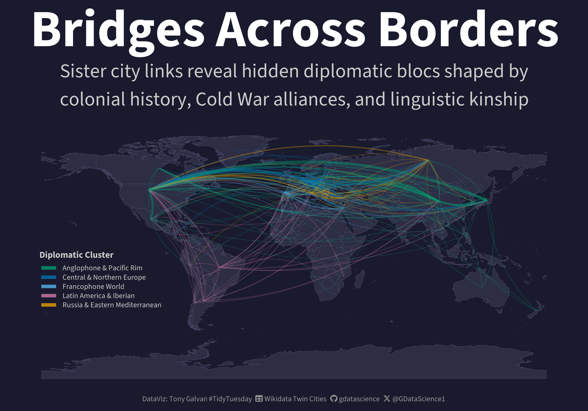
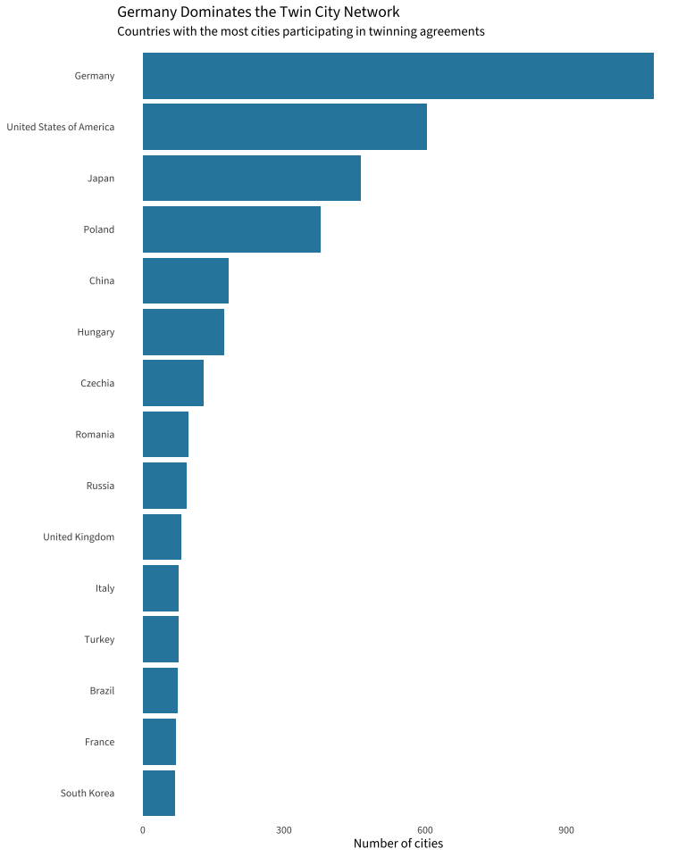
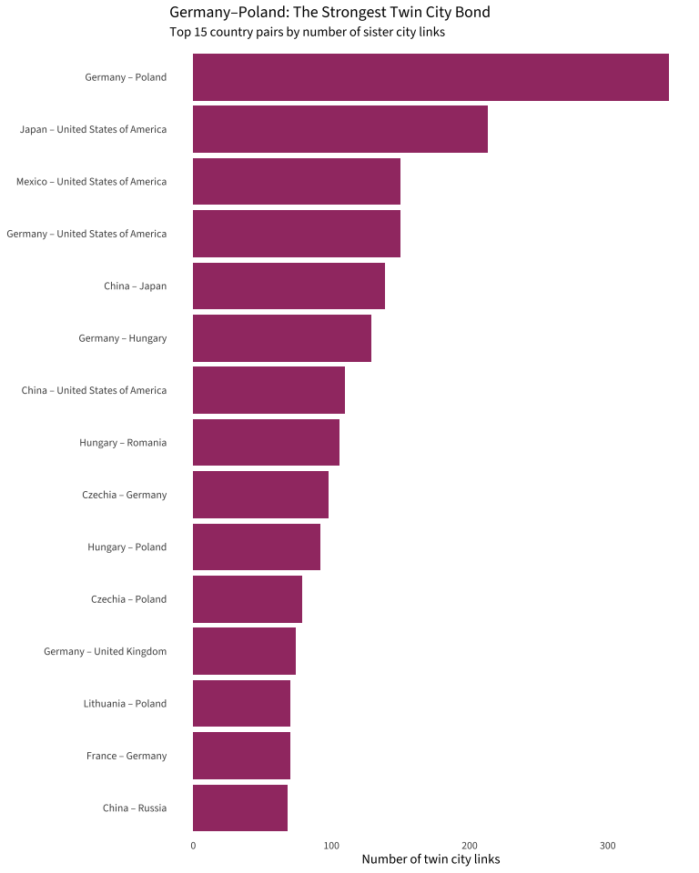

# Bridges Across Borders: The Hidden Diplomacy of Sister Cities

**[Source Code](2026_05_12_tidy_tuesday_twinned_cities.Rmd)** | Data from the [TidyTuesday project](https://github.com/rfordatascience/tidytuesday/tree/main/data/2026/2026-05-12) (Week 19, 2026-05-12)



10,596 twin city links connect 5,470 cities across 191 countries. Using Louvain community detection on the country-level network, the algorithm independently rediscovered colonial ties, Cold War alliances, and post-WWII reconciliation blocs — all encoded in which cities chose to become siblings.

---

Sister cities — also called twin towns — are one of the quietest forms
of international diplomacy. Two cities in different countries agree to a
cultural and commercial partnership, and over decades these links
accumulate into a sprawling global network. This week's TidyTuesday
dataset maps **10,596 twin city links** connecting **5,470 cities**
across **191 countries**.

What happens when you treat this as a network and ask: *who clusters
with whom?* The answer reveals the fingerprints of history — colonial
ties, Cold War alliances, and linguistic kinship — all encoded in which
cities chose to become siblings.

## Libraries

``` r
library(tidyverse)
library(scales)
library(sf)
library(rnaturalearth)
library(rnaturalearthdata)
library(geosphere)
library(igraph)
library(showtext)
library(ggtext)

# Fonts
font_add_google("Source Sans 3", "source_sans")
font_add(family = "fa-brands",
         regular = "~/Library/Fonts/Font Awesome 6 Brands-Regular-400.otf")
font_add(family = "fa-solid",
         regular = "~/Library/Fonts/Font Awesome 6 Free-Solid-900.otf")
showtext_auto()
showtext_opts(dpi = 300)

theme_set(theme_light(base_family = "source_sans"))
```

## Load Data

``` r
cities <- read_csv('https://raw.githubusercontent.com/rfordatascience/tidytuesday/main/data/2026/2026-05-12/cities.csv')
links <- read_csv('https://raw.githubusercontent.com/rfordatascience/tidytuesday/main/data/2026/2026-05-12/links.csv')
```

We have **5,470 cities** and **10,596 twin city links** to work with.
Let's start by understanding the landscape.

## The Global Landscape

``` r
# Top countries by number of cities in the network
cities |>
  count(country, sort = TRUE) |>
  head(15) |>
  ggplot(aes(x = n, y = reorder(country, n))) +
  geom_col(fill = "#2E86AB") +
  labs(
    title = "Germany Dominates the Twin City Network",
    subtitle = "Countries with the most cities participating in twinning agreements",
    x = "Number of cities", y = NULL
  ) +
  theme(
    panel.grid = element_blank(),
    panel.border = element_blank(),
    axis.ticks = element_blank()
  )
```



**Germany has 1,086 cities** in the network — nearly twice as many as
the United States (603). This reflects Germany's strong tradition of
*Städtepartnerschaften* (city partnerships), many forged after WWII as
tools of reconciliation with Poland, France, and Israel.

## Who Twins With Whom?

``` r
# Enrich links with country info
links_enriched <- links |>
  left_join(cities |> select(id, country_s = country, continent_s = continent), 
            by = c("source" = "id")) |>
  left_join(cities |> select(id, country_t = country, continent_t = continent), 
            by = c("target" = "id"))

# Top international country pairs
top_pairs <- links_enriched |>
  filter(country_s != country_t) |>
  mutate(
    c1 = pmin(country_s, country_t),
    c2 = pmax(country_s, country_t)
  ) |>
  count(c1, c2, sort = TRUE, name = "n_links") |>
  head(15) |>
  mutate(pair = paste(c1, "–", c2))

top_pairs |>
  ggplot(aes(x = n_links, y = reorder(pair, n_links))) +
  geom_col(fill = "#A23B72") +
  labs(
    title = "Germany–Poland: The Strongest Twin City Bond",
    subtitle = "Top 15 country pairs by number of sister city links",
    x = "Number of twin city links", y = NULL
  ) +
  theme(
    panel.grid = element_blank(),
    panel.border = element_blank(),
    axis.ticks = element_blank()
  )
```



The **Germany–Poland** corridor has **344 twin city links** — more than
any other international pair. This is the legacy of post-WWII
reconciliation, where hundreds of German and Polish cities formalized
partnerships to rebuild trust across a border that had been a site of
immense suffering.

**Japan–USA** (213 links) is the second strongest, reflecting decades of
post-war alliance and cultural exchange. **Mexico–USA** (150) shows the
deep ties along the world's most-crossed border.

## Community Detection: Finding the Blocs

Here's where it gets interesting. If we build a network where countries
are nodes and twin city links are weighted edges, we can use the Louvain
algorithm to detect communities — groups of countries that twin more
heavily with each other than with outsiders.

``` r
# Build country-level network
country_edges <- links_enriched |>
  filter(country_s != country_t) |>
  mutate(c1 = pmin(country_s, country_t), c2 = pmax(country_s, country_t)) |>
  count(c1, c2, name = "weight")

g <- graph_from_data_frame(country_edges, directed = FALSE)
E(g)$weight <- country_edges$weight

# Louvain community detection
set.seed(42)
comm <- cluster_louvain(g, weights = E(g)$weight)

membership_df <- tibble(
  country = V(g)$name,
  community = membership(comm)
)

cat("Communities found:", max(membership_df$community), "\n")
```

    ## Communities found: 5

``` r
cat("Modularity:", round(modularity(comm), 3), "\n")
```

    ## Modularity: 0.276

The algorithm finds **5 distinct communities** with a modularity of
0.276 — a meaningful structure. Let's see what they are:

``` r
# Label communities based on their composition
community_labels <- c(
  "1" = "Russia & Eastern Mediterranean",
  "2" = "Francophone World",
  "3" = "Anglophone & Pacific Rim",
  "4" = "Latin America & Iberian",
  "5" = "Central & Northern Europe"
)

membership_df <- membership_df |>
  mutate(community_label = community_labels[as.character(community)])

membership_df |>
  count(community_label, sort = TRUE) |>
  print()
```

    ## # A tibble: 5 × 2
    ##   community_label                    n
    ##   <chr>                          <int>
    ## 1 Anglophone & Pacific Rim          59
    ## 2 Russia & Eastern Mediterranean    49
    ## 3 Latin America & Iberian           35
    ## 4 Central & Northern Europe         26
    ## 5 Francophone World                 22

These clusters are **not geographic** — they're **historical and
linguistic**. The algorithm independently rediscovered:

- **Colonial ties** (France clusters with West Africa; Spain/Portugal
  with Latin America)
- **Cold War alliances** (Russia clusters with the Middle East and
  Central Asia)
- **Post-WWII reconciliation** (Germany, Poland, Israel, and the Nordics
  form a tight bloc)
- **Anglophone networks** (US, Japan, China, Canada, Australia, and much
  of East/Southeast Asia)

## The World Map: Arcs of Connection

Now let's visualize the strongest connections on a world map, colored by
which community cluster they belong to.

``` r
# For the map, use the top connections (weight >= 5 links between countries)
strong_edges <- country_edges |> filter(weight >= 5)

# Get country centroids for arc endpoints
world <- ne_countries(scale = "medium", returnclass = "sf")

country_centroids <- world |>
  st_centroid() |>
  st_coordinates() |>
  as_tibble() |>
  bind_cols(world |> st_drop_geometry() |> select(name)) |>
  rename(lng = X, lat = Y, country = name)

# Join centroids to edges
arcs <- strong_edges |>
  left_join(country_centroids |> rename(lng_s = lng, lat_s = lat), 
            by = c("c1" = "country")) |>
  left_join(country_centroids |> rename(lng_t = lng, lat_t = lat), 
            by = c("c2" = "country")) |>
  filter(!is.na(lng_s) & !is.na(lng_t))

# Assign community color based on the source country
arcs <- arcs |>
  left_join(membership_df |> select(country, community, community_label), 
            by = c("c1" = "country"))

cat("Arcs with coordinates:", nrow(arcs), "of", nrow(strong_edges), "strong edges\n")
```

    ## Arcs with coordinates: 409 of 409 strong edges

``` r
# Community colors - distinct, colorblind-friendly
community_colors <- c(
  "Russia & Eastern Mediterranean" = "#E69F00",
  "Francophone World" = "#56B4E9",
  "Anglophone & Pacific Rim" = "#009E73",
  "Latin America & Iberian" = "#CC79A7",
  "Central & Northern Europe" = "#0072B2"
)

# Build the map
p <- ggplot() +
  geom_sf(data = world, fill = "#2d2d44", color = "#4a4a6a", linewidth = 0.15) +
  geom_curve(
    data = arcs |> filter(!is.na(community_label)),
    aes(x = lng_s, y = lat_s, xend = lng_t, yend = lat_t,
        color = community_label, linewidth = weight),
    alpha = 0.4, curvature = 0.2
  ) +
  scale_color_manual(values = community_colors, name = "Diplomatic Cluster") +
  scale_linewidth_continuous(range = c(0.2, 2.5), guide = "none") +
  coord_sf(ylim = c(-90, 90)) +
  labs(
    title = "Bridges Across Borders",
    subtitle = "Sister city links reveal hidden diplomatic blocs shaped by\ncolonial history, Cold War alliances, and linguistic kinship",
    caption = tt_caption
  ) +
  theme_void(base_family = "source_sans") +
  theme(
    plot.background = element_rect(fill = bg_color, color = NA),
    plot.title = element_text(color = "white", size = 64, face = "bold", hjust = 0.5),
    plot.subtitle = element_text(color = "gray80", size = 24, hjust = 0.5),
    legend.position = c(0.15, 0.40),
    legend.direction = "vertical",
    legend.background = element_rect(fill = alpha(bg_color, 0.7), color = NA),
    legend.title = element_text(color = "gray80", size = 11, face = "bold"),
    legend.text = element_text(color = "gray80", size = 9)
  ) +
  guides(color = guide_legend(ncol = 1, override.aes = list(linewidth = 2, alpha = 0.8)))

ggsave(
  filename = "outputs/2026_05_12_tidy_tuesday_twinned_cities.png",
  plot = p, device = "png", width = 10, height = 7, dpi = 300, bg = bg_color
)
```

## What the Clusters Reveal

The five communities the algorithm discovered tell a story of **history
encoded in municipal diplomacy**:

- **Central & Northern Europe** (blue): Germany, Poland, UK, Nordics,
  Israel — the post-WWII reconciliation network. Germany alone has 344
  links to Poland and 58 to Israel.
- **Francophone World** (light blue): France and its former colonies in
  West Africa form a tight cluster, with Algeria, Morocco, and Tunisia
  as key nodes.
- **Russia & Eastern Mediterranean** (gold): Russia, Turkey, the Middle
  East, and Central Asia — reflecting both Soviet-era ties and Turkey's
  bridge role between Europe and Asia.
- **Anglophone & Pacific Rim** (green): The US, Japan, China, Canada,
  Australia, and much of East/Southeast Asia. Japan-US alone has 213
  links.
- **Latin America & Iberian** (pink): Spain, Portugal, and all of Latin
  America — 500 years of colonial linguistic ties still visible in
  municipal diplomacy.

## What's Next?

Some open questions this data raises:

- **Is every country reachable** through a chain of twin city links?
  (Yes — all 191 countries are connected.)
- **Do these clusters predict trade flows?** Countries that twin
  together likely trade together.
- **How has the network grown over time?** The dataset doesn't include
  dates, but Wikidata might.
- **Which cities are the "bridges"** — connecting communities that
  otherwise wouldn't link?

The quiet diplomacy of sister cities turns out to be a remarkably
faithful mirror of geopolitical history.
