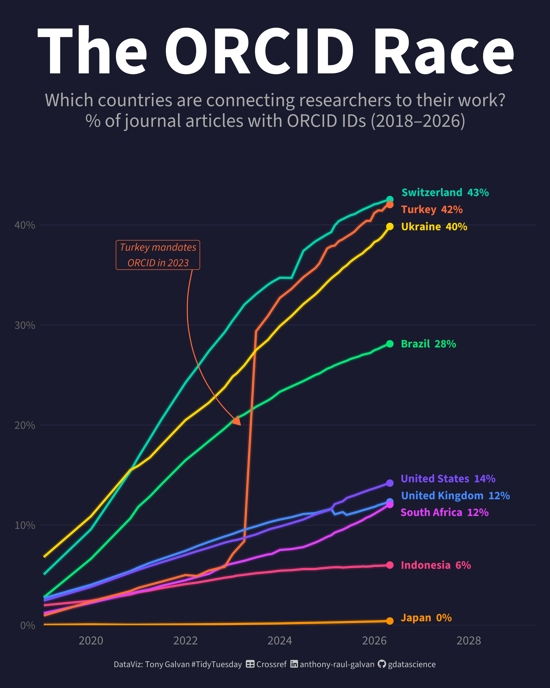
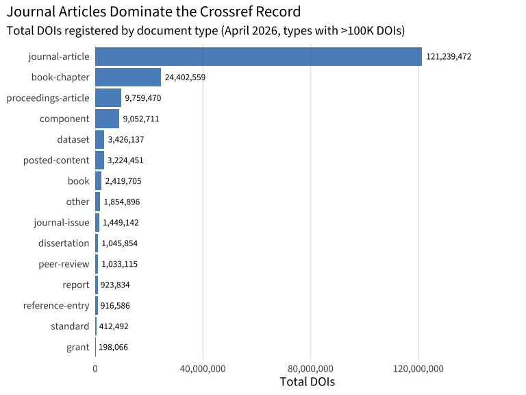
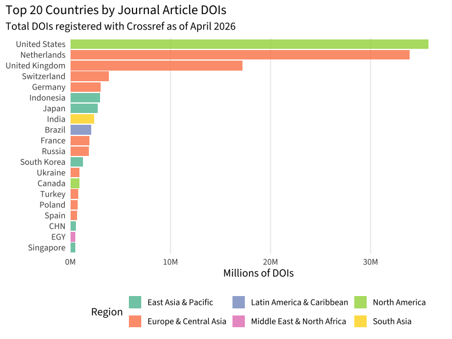
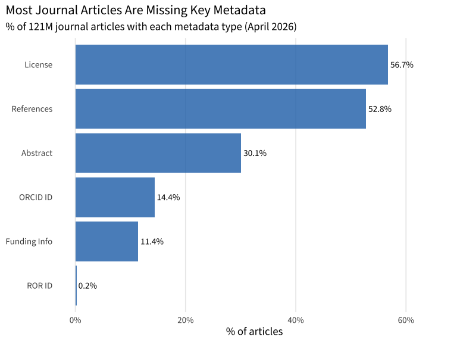
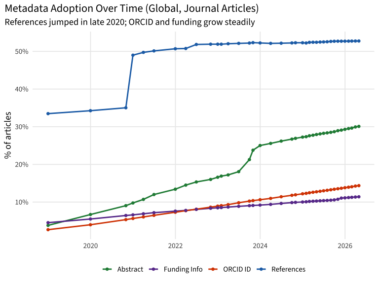
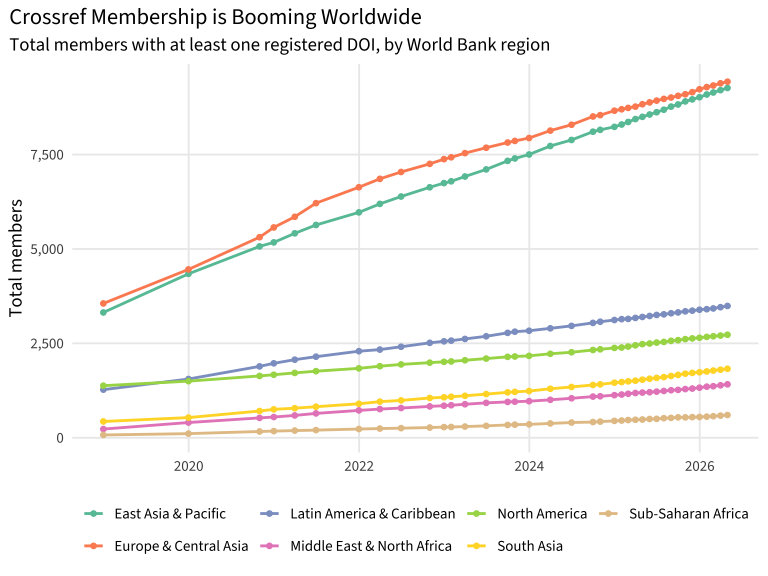
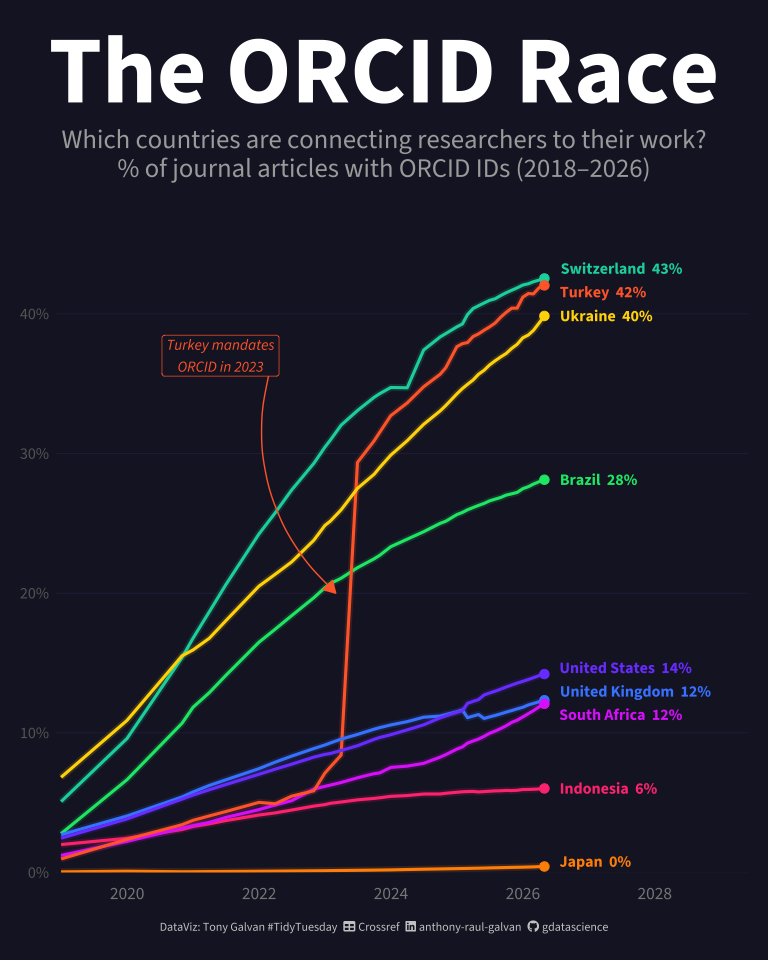
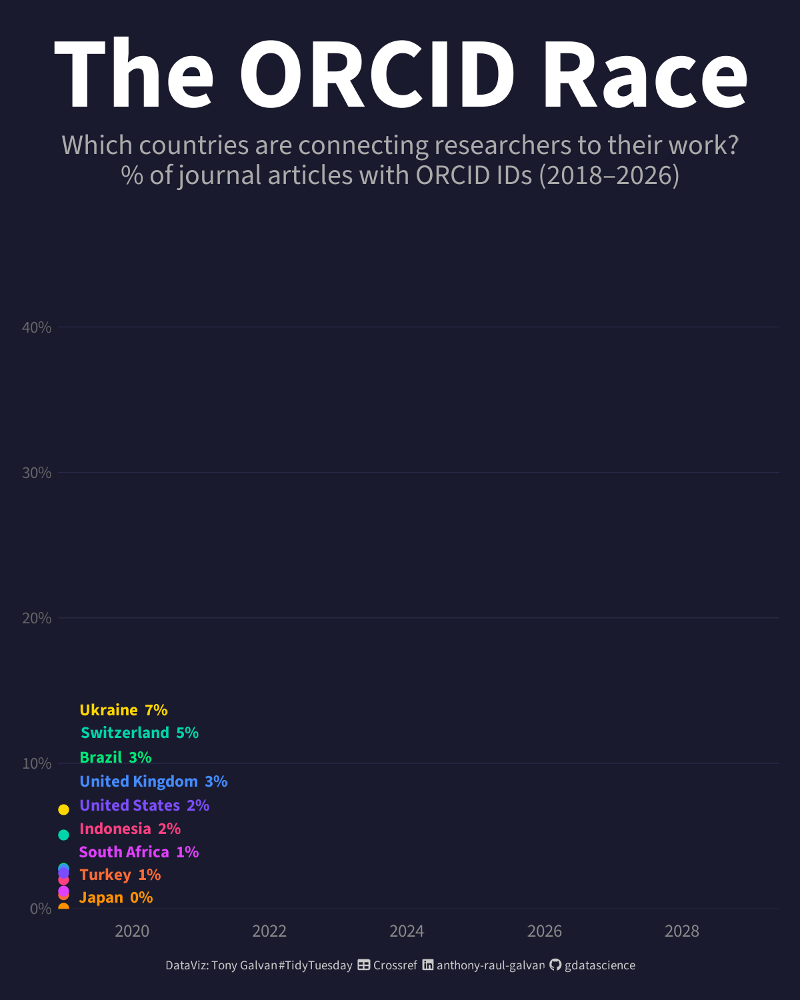
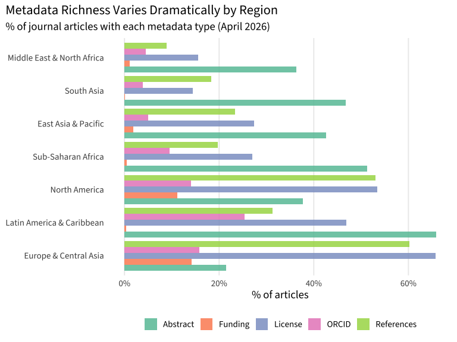

# Who’s Connecting the Dots? The Global Rise of Research Metadata

**[Source Code](2026_05_19_tidy_tuesday_crossref.Rmd)** | Data from the [TidyTuesday project](https://github.com/rfordatascience/tidytuesday/tree/main/data/2026/2026-05-19) (Week 20, 2026-05-19)



Turkey’s ORCID adoption exploded from under 1% to 42% in seven years — the largest jump among major publishing nations. This analysis explores how the global research metadata landscape is transforming, with Latin America and Eastern Europe leading the charge toward connected, transparent science.

---
## The Invisible Infrastructure of Science

Every time a researcher publishes a paper, a web of metadata connects
that work to the broader scientific record. But what *is* metadata in
this context?

**Metadata** is “data about data” — the structured information that
describes a research publication beyond its content. Think of it like
the label on a package: it tells you who sent it, where it’s going,
what’s inside, and how to track it. For academic papers, metadata
includes things like:

- **[DOI](https://www.doi.org/)** (Digital Object Identifier) — a
  permanent URL for a publication, like a social security number for a
  paper
- **[ORCID](https://orcid.org/)** — a unique ID for researchers (solving
  the “which John Smith wrote this?” problem)
- **[ROR](https://ror.org/)** (Research Organization Registry) — a
  unique ID for institutions
- **References** — which other papers this work cites (creating a
  citation network)
- **Funding acknowledgments** — who paid for the research

[Crossref](https://www.crossref.org/) is the organization that maintains
this metadata infrastructure for over 121 million scholarly works. This
week’s [TidyTuesday](https://github.com/rfordatascience/tidytuesday)
dataset provides a granular look at how metadata completeness varies
across 170 countries, from December 2018 to April 2026.

``` r
library(tidyverse)
library(scales)
library(showtext)
library(ggtext)
library(ggrepel)

# Load fonts
font_add_google("Source Sans 3", "source_sans")
font_add(family = "fa-brands",
         regular = "~/Library/Fonts/Font Awesome 6 Brands-Regular-400.otf")
font_add(family = "fa-solid",
         regular = "~/Library/Fonts/Font Awesome 6 Free-Solid-900.otf")
showtext_auto()
showtext_opts(dpi = 300)

theme_set(theme_minimal(base_family = "source_sans", base_size = 14))
```

``` r
# Load cached data
tt <- readRDS("../../.kiro/specs/2026_05_19_tidy_tuesday_crossref/tt_cache.rds")
member <- tt$member
coverage <- tt$coverage
```

## Exploring the Data

We have two datasets to work with. Let’s start by understanding their
shape and contents.

### Member Participation Stats

This dataset tracks how many Crossref members (publishers, universities,
research organizations) in each country have deposited various types of
metadata.

``` r
cat("Dimensions:", nrow(member), "rows x", ncol(member), "columns\n")
```

    ## Dimensions: 6001 rows x 23 columns

``` r
glimpse(member)
```

    ## Rows: 6,001
    ## Columns: 23
    ## $ current_up_to                    <date> 2026-04-30, 2026-04-30, 2026-04-30, …
    ## $ region_id                        <chr> "EAS", "EAS", "EAS", "EAS", "EAS", "E…
    ## $ iso3_code                        <chr> "AUS", "BRN", "CHN", "FJI", "HKG", "I…
    ## $ total_members                    <dbl> 251, 5, 185, 1, 147, 4517, 684, 14, 2…
    ## $ deposits_ref                     <dbl> 69, 0, 74, 1, 51, 643, 624, 5, 1239, …
    ## $ deposits_abstract                <dbl> 188, 5, 107, 1, 119, 4425, 28, 13, 64…
    ## $ deposits_license                 <dbl> 76, 2, 50, 0, 69, 3680, 23, 6, 443, 3…
    ## $ deposits_crossmark               <dbl> 13, 0, 19, 0, 10, 198, 7, 0, 619, 1, …
    ## $ deposits_updates                 <dbl> 8, 0, 7, 0, 3, 12, 5, 0, 214, 1, 0, 0…
    ## $ deposits_textmining              <dbl> 65, 3, 48, 0, 69, 4375, 19, 7, 450, 3…
    ## $ deposits_status_info             <dbl> 0, 0, 0, 0, 0, 0, 0, 0, 0, 0, 0, 0, 0…
    ## $ acknowledges_funding             <dbl> 15, 0, 14, 1, 12, 106, 75, 0, 565, 0,…
    ## $ deposits_funder_id               <dbl> 15, 0, 13, 1, 10, 92, 73, 0, 528, 0, …
    ## $ deposits_grant_id                <dbl> 0, 0, 0, 0, 0, 0, 0, 0, 0, 0, 0, 0, 0…
    ## $ deposits_orcid                   <dbl> 157, 3, 55, 1, 55, 2815, 99, 11, 369,…
    ## $ deposits_orcid_for_authors       <dbl> 157, 3, 55, 1, 55, 2814, 99, 11, 369,…
    ## $ deposits_orcid_for_chairs        <dbl> 1, 0, 0, 0, 2, 0, 0, 0, 1, 0, 0, 0, 0…
    ## $ deposits_orcid_for_editors       <dbl> 24, 0, 2, 0, 5, 15, 5, 0, 1, 1, 0, 0,…
    ## $ deposits_orcid_for_translators   <dbl> 0, 0, 0, 0, 1, 0, 0, 0, 0, 1, 0, 0, 0…
    ## $ deposits_ror_id                  <dbl> 27, 0, 14, 1, 18, 166, 77, 2, 2, 1, 0…
    ## $ deposits_ror_id_for_affiliations <dbl> 27, 0, 14, 1, 18, 166, 77, 2, 2, 1, 0…
    ## $ deposits_ror_id_for_funders      <dbl> 2, 0, 1, 0, 3, 3, 1, 0, 0, 0, 0, 0, 0…
    ## $ deposits_ror_id_for_institutions <dbl> 1, 0, 0, 0, 0, 0, 0, 0, 0, 0, 0, 0, 0…

The dataset has **6001 rows** spanning **170 countries** across **38
time snapshots** from 2018-12-31 to 2026-04-30. Each row represents one
country at one point in time, with counts of how many members have
deposited each type of metadata.

The `region_id` column uses [World Bank region
codes](https://datahelpdesk.worldbank.org/knowledgebase/articles/906519-world-bank-country-and-lending-groups):

``` r
# Region names mapping
region_names <- c(
  "EAS" = "East Asia & Pacific",
  "ECS" = "Europe & Central Asia",
  "LCN" = "Latin America & Caribbean",
  "MEA" = "Middle East & North Africa",
  "NAC" = "North America",
  "SAS" = "South Asia",
  "SSF" = "Sub-Saharan Africa"
)

member |>
  filter(current_up_to == max(current_up_to)) |>
  group_by(region_id) |>
  summarise(
    countries = n(),
    total_members = sum(total_members),
    .groups = "drop"
  ) |>
  mutate(region_name = region_names[region_id]) |>
  arrange(desc(total_members)) |>
  select(region_name, countries, total_members) |>
  knitr::kable(col.names = c("Region", "Countries", "Total Members"))
```

| Region                     | Countries | Total Members |
|:---------------------------|----------:|--------------:|
| Europe & Central Asia      |        52 |          9430 |
| East Asia & Pacific        |        24 |          9264 |
| Latin America & Caribbean  |        28 |          3491 |
| North America              |         2 |          2728 |
| South Asia                 |         6 |          1827 |
| Middle East & North Africa |        21 |          1415 |
| Sub-Saharan Africa         |        37 |           602 |

### Metadata Coverage Stats

The second dataset is much larger — it tracks the actual *works*
(papers, books, datasets, etc.) and what percentage have each type of
metadata filled in.

``` r
cat("Dimensions:", nrow(coverage), "rows x", ncol(coverage), "columns\n")
```

    ## Dimensions: 53820 rows x 49 columns

``` r
coverage |>
  filter(current_up_to == max(current_up_to)) |>
  count(document_type, sort = TRUE) |>
  knitr::kable(col.names = c("Document Type", "Country-Rows"))
```

| Document Type       | Country-Rows |
|:--------------------|-------------:|
| journal-article     |          167 |
| journal             |          156 |
| journal-issue       |          152 |
| book                |          119 |
| journal-volume      |          100 |
| proceedings-article |           95 |
| report              |           92 |
| proceedings         |           87 |
| book-chapter        |           86 |
| posted-content      |           82 |
| database            |           75 |
| component           |           70 |
| dissertation        |           69 |
| dataset             |           50 |
| book-series         |           42 |
| proceedings-series  |           40 |
| report-component    |           36 |
| book-set            |           30 |
| report-series       |           30 |
| other               |           25 |
| grant               |           15 |
| peer-review         |           11 |
| standard            |            8 |
| book-part           |            7 |
| book-section        |            6 |
| reference-entry     |            5 |
| book-track          |            1 |

The coverage dataset breaks down metadata by **document type** — there
are 27 types, but journal articles dominate the scholarly record. Let’s
see how the DOIs are distributed:

``` r
coverage |>
  filter(current_up_to == max(current_up_to)) |>
  group_by(document_type) |>
  summarise(total_dois = sum(n_dois, na.rm = TRUE), .groups = "drop") |>
  mutate(
    pct = total_dois / sum(total_dois) * 100,
    document_type = fct_reorder(document_type, total_dois)
  ) |>
  filter(total_dois > 100000) |>
  ggplot(aes(x = total_dois, y = document_type)) +
  geom_col(fill = "#2171B5", alpha = 0.8) +
  geom_text(aes(label = comma(total_dois)), hjust = -0.1, size = 3.5,
            family = "source_sans") +
  scale_x_continuous(labels = label_comma(), expand = expansion(mult = c(0, 0.3))) +
  labs(
    title = "Journal Articles Dominate the Crossref Record",
    subtitle = "Total DOIs registered by document type (April 2026, types with >100K DOIs)",
    x = "Total DOIs", y = NULL
  ) +
  theme(
    panel.grid.minor = element_blank(),
    panel.grid.major.y = element_blank(),
    plot.title.position = "plot"
  )
```

<!-- -->

**Journal articles** account for the vast majority of DOIs. For the rest
of this analysis, we’ll focus on journal articles to keep comparisons
meaningful.

### Which Countries Publish the Most?

``` r
# Country names for labeling
country_names <- c(
  "TUR" = "Turkey", "CHE" = "Switzerland", "UKR" = "Ukraine",
  "ECU" = "Ecuador", "PER" = "Peru", "POL" = "Poland",
  "BRA" = "Brazil", "COL" = "Colombia", "SRB" = "Serbia",
  "MEX" = "Mexico", "ARG" = "Argentina", "RUS" = "Russia",
  "ESP" = "Spain", "USA" = "United States", "GBR" = "United Kingdom",
  "NLD" = "Netherlands", "IDN" = "Indonesia", "JPN" = "Japan",
  "IND" = "India", "KOR" = "South Korea", "NZL" = "New Zealand",
  "HUN" = "Hungary", "DEU" = "Germany", "FRA" = "France",
  "CAN" = "Canada", "AUS" = "Australia", "SGP" = "Singapore",
  "ZAF" = "South Africa"
)

top_20_countries <- coverage |>
  filter(current_up_to == max(current_up_to), document_type == "journal-article") |>
  group_by(iso3_code, region_id) |>
  summarise(total_dois = sum(n_dois, na.rm = TRUE), .groups = "drop") |>
  arrange(desc(total_dois)) |>
  head(20) |>
  mutate(
    country_name = ifelse(iso3_code %in% names(country_names),
                          country_names[iso3_code], iso3_code),
    region_name = region_names[region_id]
  )

top_20_countries |>
  mutate(country_name = fct_reorder(country_name, total_dois)) |>
  ggplot(aes(x = total_dois, y = country_name, fill = region_name)) +
  geom_col(alpha = 0.85) +
  scale_x_continuous(labels = label_number(scale = 1e-6, suffix = "M"),
                     expand = expansion(mult = c(0, 0.05))) +
  scale_fill_brewer(palette = "Set2") +
  labs(
    title = "Top 20 Countries by Journal Article DOIs",
    subtitle = "Total DOIs registered with Crossref as of April 2026",
    x = "Millions of DOIs", y = NULL, fill = "Region"
  ) +
  theme(
    panel.grid.minor = element_blank(),
    panel.grid.major.y = element_blank(),
    plot.title.position = "plot",
    legend.position = "bottom"
  ) +
  guides(fill = guide_legend(nrow = 2))
```

<!-- -->

A surprise here: **the Netherlands ranks \#2** with 34 million DOIs
despite being a small country. This is because major international
publishers like Elsevier and Springer Nature are headquartered there —
the country code reflects where the *publisher* is registered, not where
the *research* was conducted.

### How Complete is the Metadata?

Not all DOIs are created equal. Some have rich metadata (references,
abstracts, author IDs, funding info), while others are essentially just
a title and a link. Let’s look at the current state of metadata
completeness for journal articles globally:

``` r
global_coverage <- coverage |>
  filter(current_up_to == max(current_up_to), document_type == "journal-article") |>
  summarise(
    total_dois = sum(n_dois, na.rm = TRUE),
    with_ref = sum(with_ref, na.rm = TRUE),
    with_abstract = sum(with_abstract, na.rm = TRUE),
    with_license = sum(with_license, na.rm = TRUE),
    with_orcid = sum(with_orcid, na.rm = TRUE),
    acknowledges_funding = sum(acknowledges_funding, na.rm = TRUE),
    with_ror_id = sum(with_ror_id, na.rm = TRUE)
  ) |>
  pivot_longer(-total_dois, names_to = "metadata_type", values_to = "count") |>
  mutate(
    pct = count / total_dois * 100,
    metadata_label = case_when(
      metadata_type == "with_ref" ~ "References",
      metadata_type == "with_abstract" ~ "Abstract",
      metadata_type == "with_license" ~ "License",
      metadata_type == "with_orcid" ~ "ORCID ID",
      metadata_type == "acknowledges_funding" ~ "Funding Info",
      metadata_type == "with_ror_id" ~ "ROR ID"
    ),
    metadata_label = fct_reorder(metadata_label, pct)
  )

global_coverage |>
  ggplot(aes(x = pct, y = metadata_label)) +
  geom_col(fill = "#2171B5", alpha = 0.8) +
  geom_text(aes(label = paste0(round(pct, 1), "%")), hjust = -0.1,
            size = 4, family = "source_sans") +
  scale_x_continuous(limits = c(0, 65), labels = \(x) paste0(x, "%")) +
  labs(
    title = "Most Journal Articles Are Missing Key Metadata",
    subtitle = "% of 121M journal articles with each metadata type (April 2026)",
    x = "% of articles", y = NULL
  ) +
  theme(
    panel.grid.minor = element_blank(),
    panel.grid.major.y = element_blank(),
    plot.title.position = "plot"
  )
```

<!-- -->

This is striking: only about **53% of journal articles include
references**, meaning nearly half the scholarly record has broken
citation links. ORCID adoption sits at just **14%**, funding metadata at
**11%**, and ROR IDs are essentially nonexistent at **0.2%**. There’s
enormous room for improvement.

### How Has Metadata Grown Over Time?

``` r
temporal_trends <- coverage |>
  filter(document_type == "journal-article") |>
  group_by(current_up_to) |>
  summarise(
    total_dois = sum(n_dois, na.rm = TRUE),
    with_ref = sum(with_ref, na.rm = TRUE),
    with_abstract = sum(with_abstract, na.rm = TRUE),
    with_orcid = sum(with_orcid, na.rm = TRUE),
    acknowledges_funding = sum(acknowledges_funding, na.rm = TRUE),
    .groups = "drop"
  ) |>
  mutate(
    pct_ref = with_ref / total_dois * 100,
    pct_abstract = with_abstract / total_dois * 100,
    pct_orcid = with_orcid / total_dois * 100,
    pct_funding = acknowledges_funding / total_dois * 100
  ) |>
  select(current_up_to, starts_with("pct_")) |>
  pivot_longer(-current_up_to, names_to = "metric", values_to = "pct") |>
  mutate(metric_label = case_when(
    metric == "pct_ref" ~ "References",
    metric == "pct_abstract" ~ "Abstract",
    metric == "pct_orcid" ~ "ORCID ID",
    metric == "pct_funding" ~ "Funding Info"
  ))

temporal_trends |>
  ggplot(aes(x = current_up_to, y = pct, color = metric_label)) +
  geom_line(linewidth = 1) +
  geom_point(size = 1.5) +
  scale_y_continuous(labels = \(x) paste0(x, "%")) +
  scale_color_manual(values = c(
    "References" = "#2171B5",
    "Abstract" = "#238B45",
    "ORCID ID" = "#D94801",
    "Funding Info" = "#6A3D9A"
  )) +
  labs(
    title = "Metadata Adoption Over Time (Global, Journal Articles)",
    subtitle = "References jumped in late 2020; ORCID and funding grow steadily",
    x = NULL, y = "% of articles", color = NULL
  ) +
  theme(
    panel.grid.minor = element_blank(),
    plot.title.position = "plot",
    legend.position = "bottom"
  )
```

<!-- -->

A few things stand out:

- **References jumped from ~34% to ~50% in late 2020** — likely driven
  by a major publisher (probably Elsevier or Springer) bulk-depositing
  reference metadata for their back catalog
- **ORCID adoption** has grown steadily from 3% to 14% — a 5x increase
  in 7 years
- **Funding metadata** grew from 5% to 11% — doubling, but still low
- **Abstracts** have remained relatively flat around 30% — suggesting
  this metadata type isn’t being prioritized

### Membership Growth by Region

``` r
member_growth <- member |>
  group_by(current_up_to, region_id) |>
  summarise(total_members = sum(total_members, na.rm = TRUE), .groups = "drop") |>
  mutate(region_name = region_names[region_id])

member_growth |>
  ggplot(aes(x = current_up_to, y = total_members, color = region_name)) +
  geom_line(linewidth = 1) +
  geom_point(size = 1.5) +
  scale_y_continuous(labels = label_comma()) +
  scale_color_brewer(palette = "Set2") +
  labs(
    title = "Crossref Membership is Booming Worldwide",
    subtitle = "Total members with at least one registered DOI, by World Bank region",
    x = NULL, y = "Total members", color = NULL
  ) +
  theme(
    panel.grid.minor = element_blank(),
    plot.title.position = "plot",
    legend.position = "bottom"
  ) +
  guides(color = guide_legend(nrow = 2))
```

<!-- -->

East Asia & Pacific and Europe & Central Asia dominate in absolute
numbers, but the growth story is elsewhere. Let’s look at the relative
growth:

``` r
member |>
  group_by(current_up_to, region_id) |>
  summarise(total_members = sum(total_members, na.rm = TRUE), .groups = "drop") |>
  filter(current_up_to %in% c(as.Date("2018-12-31"), as.Date("2026-04-30"))) |>
  pivot_wider(names_from = current_up_to, values_from = total_members) |>
  mutate(
    region_name = region_names[region_id],
    growth_pct = (`2026-04-30` - `2018-12-31`) / `2018-12-31` * 100
  ) |>
  arrange(desc(growth_pct)) |>
  select(region_name, `2018-12-31`, `2026-04-30`, growth_pct) |>
  knitr::kable(
    col.names = c("Region", "Members (2018)", "Members (2026)", "Growth (%)"),
    digits = 0
  )
```

| Region                     | Members (2018) | Members (2026) | Growth (%) |
|:---------------------------|---------------:|---------------:|-----------:|
| Sub-Saharan Africa         |             74 |            602 |        714 |
| Middle East & North Africa |            230 |           1415 |        515 |
| South Asia                 |            431 |           1827 |        324 |
| East Asia & Pacific        |           3318 |           9264 |        179 |
| Latin America & Caribbean  |           1274 |           3491 |        174 |
| Europe & Central Asia      |           3557 |           9430 |        165 |
| North America              |           1379 |           2728 |         98 |

**Sub-Saharan Africa grew 714%** — from 74 to 602 members. The Middle
East & North Africa grew 515%. These regions are rapidly joining the
global research infrastructure, even if their absolute numbers are still
small compared to Europe and East Asia.

## The ORCID Revolution

Now that we understand the data landscape, let’s zoom in on the most
compelling story: the dramatic rise of [ORCID](https://orcid.org/)
adoption.

ORCID (Open Researcher and Contributor ID) is a 16-digit identifier that
uniquely identifies researchers — like a social security number for
academics. It solves a real problem: there are thousands of researchers
named “Wei Zhang” or “Maria Garcia,” and without a unique ID, it’s
impossible to reliably attribute work to the right person. When a
publisher includes ORCID IDs in their metadata, it creates an
unambiguous link between a paper and its authors.

We’ll visualize this as a racing line chart — tracking each country’s
ORCID adoption percentage over the full 7-year period. This reveals not
just *how much* countries grew, but *when* the growth happened and how
sudden it was.

``` r
# Calculate ORCID adoption over time for journal articles
orcid_by_country <- coverage |>
  filter(document_type == "journal-article") |>
  group_by(iso3_code, region_id, current_up_to) |>
  summarise(
    n_dois = sum(n_dois, na.rm = TRUE),
    with_orcid = sum(with_orcid, na.rm = TRUE),
    .groups = "drop"
  ) |>
  mutate(pct_orcid = with_orcid / n_dois * 100)
```

``` r
# Build the full time series for featured countries
featured_countries <- c("TUR", "CHE", "UKR", "BRA", "USA", "GBR", "IDN", "JPN", "ZAF")

orcid_ts <- orcid_by_country |>
  filter(iso3_code %in% featured_countries) |>
  mutate(
    country_name = country_names[iso3_code],
    region_name = region_names[region_id]
  )

# Country-specific colors (vibrant on dark background)
country_colors <- c(
  "Turkey" = "#FF6B35",
  "Switzerland" = "#00D4AA",
  "Ukraine" = "#FFD700",
  "Brazil" = "#00E676",
  "United States" = "#7C4DFF",
  "United Kingdom" = "#448AFF",
  "Indonesia" = "#FF4081",
  "Japan" = "#FF9100",
  "South Africa" = "#E040FB"
)

# Build caption (dark background version)
bg_color <- "#1a1a2e"
tt_source <- "Crossref"
tt_caption <- paste0(
 "<span style='color:#cccccc;'>DataViz: Tony Galvan #TidyTuesday</span>",
 "<span style='color:", bg_color, ";'>..</span>",
 "<span style='font-family:fa-solid;color:#cccccc;'>&#xf0ce;</span>",
 "<span style='color:", bg_color, ";'>.</span>",
 "<span style='color:#cccccc;'>", tt_source, "</span>",
 "<span style='color:", bg_color, ";'>..</span>",
 "<span style='font-family:fa-brands;color:#cccccc;'>&#xf08c;</span>",
 "<span style='color:", bg_color, ";'>.</span>",
 "<span style='color:#cccccc;'>anthony-raul-galvan</span>",
 "<span style='color:", bg_color, ";'>..</span>",
 "<span style='font-family:fa-brands;color:#cccccc;'>&#xf09b;</span>",
 "<span style='color:", bg_color, ";'>.</span>",
 "<span style='color:#cccccc;'>gdatascience</span>"
)

# End labels
end_labels <- orcid_ts |>
  filter(current_up_to == max(current_up_to))

# Create the racing line chart
p <- orcid_ts |>
  ggplot(aes(x = current_up_to, y = pct_orcid, color = country_name)) +
  # Subtle grid lines
  geom_hline(yintercept = seq(0, 40, 10), color = "#2a2a4a", linewidth = 0.3) +
  # Glow effect (wider, semi-transparent line behind)
  geom_line(linewidth = 2.5, alpha = 0.15) +
  # Main lines
  geom_line(linewidth = 1.1) +
  # End points
  geom_point(data = end_labels, size = 3) +
  # End labels (repel to avoid overlap)
  geom_text_repel(
    data = end_labels,
    aes(label = paste0(country_name, "  ", round(pct_orcid, 0), "%")),
    hjust = 0, nudge_x = 60, direction = "y",
    size = 4.2, family = "source_sans", fontface = "bold",
    segment.color = NA, box.padding = 0.3,
    xlim = c(as.Date("2026-07-01"), NA)
  ) +
  # Turkey spike annotation
  annotate(
    "curve",
    x = as.Date("2022-03-01"), y = 36,
    xend = as.Date("2023-03-01"), yend = 20,
    curvature = 0.3, color = "#FF6B35", linewidth = 0.5,
    arrow = arrow(length = unit(0.02, "npc"), type = "closed")
  ) +
  annotate(
    "label",
    x = as.Date("2021-06-01"), y = 37,
    label = "Turkey mandates\nORCID in 2023",
    color = "#FF6B35", fill = "#1a1a2e", label.size = 0,
    size = 4, family = "source_sans", fontface = "italic", hjust = 0.5
  ) +
  scale_color_manual(values = country_colors) +
  scale_x_date(
    date_breaks = "2 years", date_labels = "%Y",
    limits = c(as.Date("2018-12-01"), as.Date("2029-06-01")),
    expand = c(0, 0)
  ) +
  scale_y_continuous(
    breaks = seq(0, 45, 10),
    labels = \(x) paste0(x, "%"),
    limits = c(0, 47),
    expand = c(0, 0)
  ) +
  labs(
    title = "The ORCID Race",
    subtitle = "Which countries are connecting researchers to their work?\n% of journal articles with ORCID IDs (2018\u20132026)",
    caption = tt_caption,
    x = NULL, y = NULL
  ) +
  theme_void(base_family = "source_sans") +
  theme(
    plot.background = element_rect(fill = bg_color, color = NA),
    plot.title = element_text(size = 72, face = "bold", hjust = 0.5,
                              color = "white", margin = margin(t = 20, b = 5)),
    plot.title.position = "plot",
    plot.subtitle = element_text(size = 20, hjust = 0.5, color = "#aaaaaa",
                                  margin = margin(b = 25)),
    plot.caption = element_markdown(size = 9, hjust = 0.5,
                                     margin = margin(t = 15, b = 10)),
    plot.caption.position = "plot",
    axis.text.x = element_text(size = 13, color = "#888888",
                                margin = margin(t = 10)),
    axis.text.y = element_text(size = 12, color = "#666666",
                                margin = margin(r = 5), hjust = 1),
    legend.position = "none",
    plot.margin = margin(10, 15, 10, 15)
  )

p
```

<!-- -->

The racing line chart tells a vivid story. **Turkey’s near-vertical
spike in mid-2023** stands out immediately — the country went from ~8%
to ~30% in a single quarter, almost certainly driven by a national
mandate requiring ORCID IDs in academic submissions. Switzerland and
Ukraine show steady, relentless climbs. Brazil’s growth is remarkably
consistent — a straight diagonal from 3% to 28%.

Here’s the animated version showing how the race unfolded over time:

<figure>

<figcaption aria-hidden="true">The ORCID Race animated</figcaption>
</figure>

Meanwhile, the US and UK — despite being the world’s largest publishers
— are stuck in the low teens. Their massive back-catalogs of older
papers (published before ORCID existed in 2012) drag down the percentage
even as new papers increasingly include author IDs.

Japan and Indonesia, despite having large research outputs, remain below
5% — suggesting that ORCID adoption in East Asia still has enormous room
to grow.

## The Metadata Richness Gap

Beyond ORCID, how do countries compare across *all* metadata types? We
can compute a simple “metadata richness score” — the average percentage
across five key metadata fields (references, abstracts, ORCID, funding,
and license). This gives us a single number that captures how
well-connected a country’s research output is.

``` r
richness_by_region <- coverage |>
  filter(current_up_to == max(current_up_to), document_type == "journal-article") |>
  group_by(region_id) |>
  summarise(
    n_dois = sum(n_dois, na.rm = TRUE),
    pct_ref = sum(with_ref, na.rm = TRUE) / n_dois * 100,
    pct_abstract = sum(with_abstract, na.rm = TRUE) / n_dois * 100,
    pct_orcid = sum(with_orcid, na.rm = TRUE) / n_dois * 100,
    pct_funding = sum(acknowledges_funding, na.rm = TRUE) / n_dois * 100,
    pct_license = sum(with_license, na.rm = TRUE) / n_dois * 100,
    .groups = "drop"
  ) |>
  mutate(region_name = region_names[region_id]) |>
  pivot_longer(cols = starts_with("pct_"), names_to = "metric", values_to = "pct") |>
  mutate(metric_label = case_when(
    metric == "pct_ref" ~ "References",
    metric == "pct_abstract" ~ "Abstract",
    metric == "pct_orcid" ~ "ORCID",
    metric == "pct_funding" ~ "Funding",
    metric == "pct_license" ~ "License"
  ))

richness_by_region |>
  mutate(region_name = fct_reorder(region_name, pct, .fun = mean, .desc = TRUE)) |>
  ggplot(aes(x = pct, y = region_name, fill = metric_label)) +
  geom_col(position = "dodge", alpha = 0.85) +
  scale_x_continuous(labels = \(x) paste0(x, "%")) +
  scale_fill_brewer(palette = "Set2") +
  labs(
    title = "Metadata Richness Varies Dramatically by Region",
    subtitle = "% of journal articles with each metadata type (April 2026)",
    x = "% of articles", y = NULL, fill = NULL
  ) +
  theme(
    panel.grid.minor = element_blank(),
    panel.grid.major.y = element_blank(),
    plot.title.position = "plot",
    legend.position = "bottom"
  )
```

<!-- -->

**Europe & Central Asia** and **North America** lead across most
metadata types, particularly in references and funding acknowledgments.
But the picture is nuanced — **Latin America** actually leads in
abstracts (many Latin American journals require abstracts in both
Spanish/Portuguese and English), and **East Asia & Pacific** has high
abstract rates driven by Indonesia’s large open-access journal
ecosystem.

The biggest gap is in **funding metadata** — Europe and North America
are far ahead because their funding agencies (like the NIH, NSF, and EU
Horizon programs) mandate that publishers include grant information in
metadata.

## What’s Next?

The Crossref data reveals a research world in transition. The
infrastructure for connected, transparent science is being built — but
unevenly. Key questions remain:

- Will the fast-growing regions (Africa, Middle East) also improve their
  metadata richness, or will membership growth outpace quality?
- What’s driving Turkey’s remarkable ORCID adoption — policy mandates,
  institutional culture, or platform defaults?
- As [ROR IDs](https://ror.org/) are still near 0% globally, which
  regions will lead that next wave of institutional identification?

The [Research Nexus](https://www.crossref.org/community/research-nexus/)
vision — a fully connected graph of people, organizations, and outputs —
is still far off. But the trajectory is clear: the dots are being
connected, one metadata field at a time.
