# When You Play the Game of Names: How TV Shapes What We Call Our Children

**[Source Code](2026_06_16_tidy_tuesday_uk_baby_names.Rmd)** | Data from the [TidyTuesday project](https://github.com/rfordatascience/tidytuesday/tree/main/data/2026/2026-06-16) (Week 24, 2026-06-16)

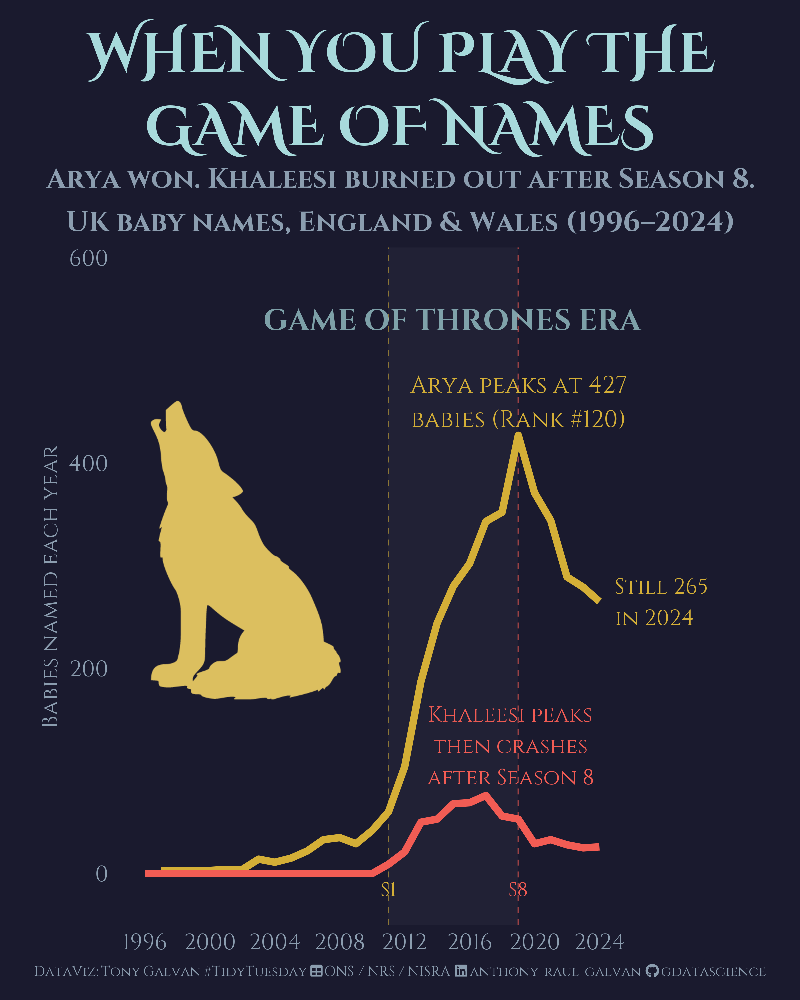

Game of Thrones left permanent marks on British birth certificates. Arya went from 3 babies to 427 at peak — and is still going strong at 265. Khaleesi rose from nothing, then crashed after the controversial Season 8 finale. We trace the naming fingerprints of TV, forecast where name concentration is headed, and use PCA to reveal the UK's distinct regional naming identities.

---

What’s in a name? Quite a lot, it turns out — especially when Netflix
gets involved. This week’s TidyTuesday brings us **UK baby name data**
spanning half a century across England & Wales, Scotland, and Northern
Ireland. We’ll explore how naming culture has fractured into thousands
of micro-choices, trace the fingerprints of pop culture on birth
certificates, forecast where name concentration is headed, and use
clustering to reveal how culturally distinct the UK’s nations really are
when it comes to naming their children.

## Libraries

``` r
library(tidyverse)
library(scales)
library(showtext)
library(sysfonts)
library(ggtext)
library(patchwork)
library(fable)
library(fabletools)
library(tsibble)
library(feasts)
library(factoextra)

# Bridgerton-inspired fonts: elegant serif for titles, clean sans for body
font_add_google("Playfair Display", "playfair")
font_add_google("Lato", "lato")
showtext_auto()
showtext_opts(dpi = 300)

# Font Awesome for captions
font_add(family = "fa-brands",
         regular = "~/Library/Fonts/Font Awesome 7 Brands-Regular-400.otf")
font_add(family = "fa-solid",
         regular = "~/Library/Fonts/Font Awesome 7 Free-Solid-900.otf")

# Bridgerton color palette — Regency elegance
bridgerton_blue <- "#2C3E50"
bridgerton_gold <- "#C9A96E"
bridgerton_rose <- "#D4808F"
bridgerton_lavender <- "#9B8EC1"
bridgerton_cream <- "#FAF3E8"
bridgerton_sage <- "#7BA396"
bridgerton_burgundy <- "#8B2252"
bridgerton_navy <- "#1B2838"

theme_set(theme_minimal(base_family = "lato", base_size = 14))
```

## Load Data

``` r
england_wales <- read_csv('https://raw.githubusercontent.com/rfordatascience/tidytuesday/main/data/2026/2026-06-16/england_wales_names.csv')
ni <- read_csv('https://raw.githubusercontent.com/rfordatascience/tidytuesday/main/data/2026/2026-06-16/ni_names.csv')
scotland <- read_csv('https://raw.githubusercontent.com/rfordatascience/tidytuesday/main/data/2026/2026-06-16/scotland_names.csv')
```

## Exploratory Data Analysis

Let’s get a sense of the scale and structure of these three datasets
before diving into the stories they tell.

### Data Overview

``` r
cat("England & Wales:", nrow(england_wales), "rows,", 
    n_distinct(england_wales$Name), "unique names,",
    min(england_wales$Year), "-", max(england_wales$Year), "\n")
```

    ## England & Wales: 349987 rows, 38998 unique names, 1996 - 2024

``` r
cat("Scotland:", nrow(scotland), "rows,",
    n_distinct(scotland$Name), "unique names,",
    min(scotland$Year), "-", max(scotland$Year), "\n")
```

    ## Scotland: 74331 rows, 5954 unique names, 1974 - 2025

``` r
cat("Northern Ireland:", nrow(ni), "rows,",
    n_distinct(ni$Name), "unique names,",
    min(ni$Year), "-", max(ni$Year), "\n")
```

    ## Northern Ireland: 120756 rows, 28551 unique names, 1997 - 2025

Scotland gives us the longest time series — **51 years** back to 1974.
England & Wales starts in 1996, and Northern Ireland in 1997. All three
datasets share the same structure: Year, Sex, Name, Number (count of
babies), and Rank.

### Distribution of Name Counts

``` r
england_wales |>
  filter(Year == 2024) |>
  ggplot(aes(x = Number)) +
  geom_histogram(bins = 50, fill = bridgerton_blue, alpha = 0.8) +
  scale_x_log10(labels = comma) +
  facet_wrap(~Sex) +
  labs(
    title = "Most names are rare — the long tail dominates",
    subtitle = "Distribution of baby counts per name in England & Wales (2024, log scale)",
    x = "Number of babies (log scale)",
    y = "Count of names"
  ) +
  theme(
    plot.title = element_text(face = "bold", size = 16),
    strip.text = element_text(face = "bold")
  )
```

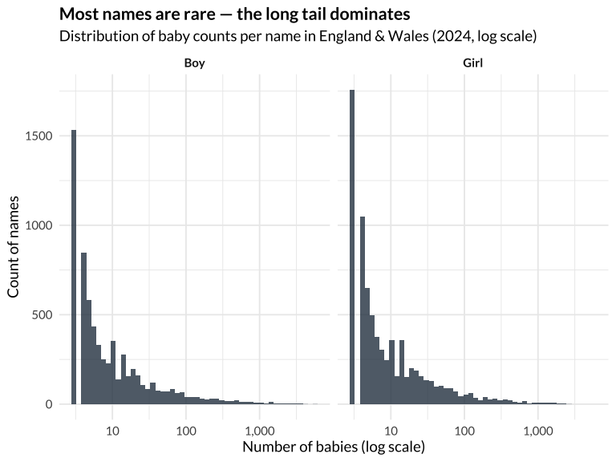<!-- -->

The distribution is dramatically right-skewed: thousands of names have
fewer than 10 babies each, while only a handful cross 1,000. This long
tail is the heart of our fragmentation story.

### Top 10 Names Over Time

``` r
top10_share <- england_wales |>
  group_by(Year, Sex) |>
  summarise(
    total = sum(Number),
    top10_total = sum(Number[Rank <= 10]),
    .groups = "drop"
  ) |>
  mutate(share = top10_total / total)

top10_share |>
  ggplot(aes(x = Year, y = share, color = Sex)) +
  geom_line(linewidth = 1.2) +
  geom_point(size = 2) +
  scale_y_continuous(labels = percent_format(), limits = c(0, NA)) +
  scale_color_manual(values = c("Boy" = bridgerton_blue, "Girl" = bridgerton_rose)) +
  labs(
    title = "The top 10 names are losing their grip",
    subtitle = "Share of all babies given a top-10 name (England & Wales)",
    x = NULL, y = "Share of babies",
    color = NULL
  ) +
  theme(
    plot.title = element_text(face = "bold", size = 16),
    legend.position = "top"
  )
```

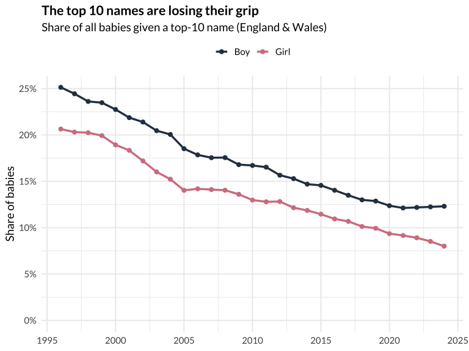<!-- -->

In 1996, the top 10 boys’ names accounted for nearly **14%** of all boys
born. By 2024, that’s dropped below **7%**. Girls show the same pattern.
Parents are making increasingly individualized choices — the era of
classroom name collisions is fading.

### Name Diversity Explosion

``` r
name_diversity <- england_wales |>
  group_by(Year, Sex) |>
  summarise(n_unique = n_distinct(Name), .groups = "drop")

name_diversity |>
  ggplot(aes(x = Year, y = n_unique, color = Sex)) +
  geom_line(linewidth = 1.2) +
  geom_point(size = 2) +
  scale_y_continuous(labels = comma) +
  scale_color_manual(values = c("Boy" = bridgerton_blue, "Girl" = bridgerton_rose)) +
  labs(
    title = "The name pool keeps expanding",
    subtitle = "Number of distinct names registered each year (England & Wales)",
    x = NULL, y = "Unique names",
    color = NULL
  ) +
  theme(
    plot.title = element_text(face = "bold", size = 16),
    legend.position = "top"
  )
```

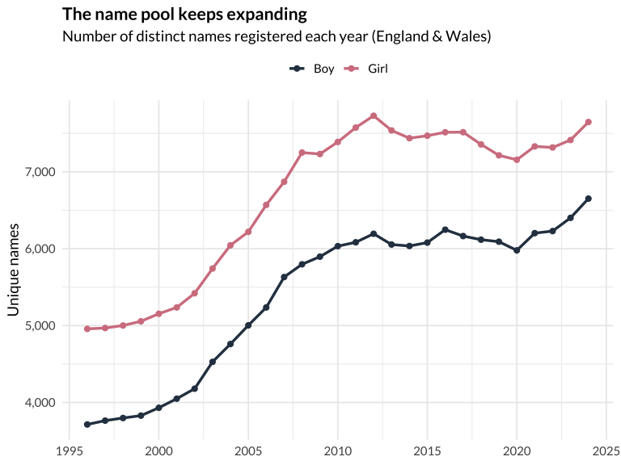<!-- -->

Girls’ names are consistently more diverse than boys’ — about **7,600 vs
6,600** unique names in 2024. Both genders show an upward trend since
1996, though there was a small dip during the late 2010s (potentially
linked to falling birth rates).

### Regional Identity: Northern Ireland’s Gaelic Names

``` r
gaelic_names <- c("Oisin", "Fiadh", "Aoife", "Meabh", "Caoimhe", 
                  "Saoirse", "Ciaran", "Padraig", "Niamh", "Conor")

ni |>
  filter(Name %in% gaelic_names, !is.na(Rank), Year >= 2010) |>
  ggplot(aes(x = Year, y = Rank, color = Name)) +
  geom_line(linewidth = 1) +
  geom_point(size = 1.5) +
  scale_y_reverse() +
  facet_wrap(~Sex, scales = "free_y") +
  labs(
    title = "Irish names are thriving in Northern Ireland",
    subtitle = "Rank trajectory of Gaelic names (lower = more popular)",
    x = NULL, y = "Rank (inverted)",
    color = NULL
  ) +
  theme(
    plot.title = element_text(face = "bold", size = 16),
    legend.position = "bottom",
    strip.text = element_text(face = "bold")
  )
```

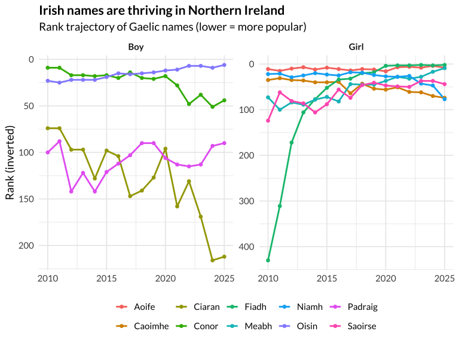<!-- -->

Names like Fiadh (#2 in 2025), Aoife, and Oisín reflect a strong
cultural identity in Northern Ireland that simply doesn’t appear in
England & Wales rankings.

## The Bridgerton Effect — Who Actually Benefits?

Netflix’s *Bridgerton* premiered on Christmas Day 2020, adapted from
Julia Quinn’s romance novels set in Regency-era London. The show became
Netflix’s most-watched series at the time. But did it *actually* leave a
mark on British birth certificates? Let’s look at the evidence
critically.

``` r
bridgerton_names <- c("Daphne", "Eloise", "Penelope")

bridgerton_data <- england_wales |>
  filter(Name %in% bridgerton_names, Sex == "Girl")

bridgerton_data |>
  ggplot(aes(x = Year, y = Number, color = Name)) +
  geom_line(linewidth = 1.2) +
  geom_point(size = 1.5) +
  geom_vline(xintercept = 2020.98, linetype = "dashed", color = "gray40", linewidth = 0.5) +
  annotate("text", x = 2020.5, y = 1100,
           label = "Bridgerton\npremiere", hjust = 1, size = 3.5, color = "gray40",
           family = "lato") +
  scale_color_manual(values = c(
    "Daphne" = bridgerton_rose,
    "Eloise" = bridgerton_lavender,
    "Penelope" = bridgerton_gold
  )) +
  labs(
    title = "Only Daphne shows a clear Bridgerton effect",
    subtitle = "Penelope was already surging pre-show; Eloise remains volatile",
    x = NULL, y = "Number of babies",
    color = NULL
  ) +
  theme(
    plot.title = element_text(face = "bold", size = 16),
    legend.position = "bottom"
  )
```

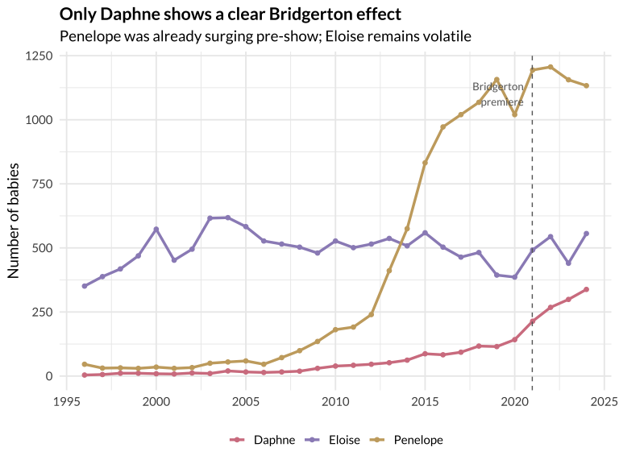<!-- -->

The data tells a more nuanced story than “Bridgerton made all these
names popular”:

- **Penelope** was already exploding since 2009 — from 135 babies to
  1,157 by 2019 — long before the show. She actually *plateaued* after
  the premiere. The growth likely traces to broader vintage-name trends
  (and possibly the Bridgerton books, published 2000–2006).
- **Eloise** is volatile — she was *declining* from 2015–2020, bounced
  up in 2021, then dropped again in 2023. No consistent Bridgerton
  signal.
- **Daphne** is the real story. Her growth rate nearly **tripled** after
  the show: a 7% annual growth rate (2015–2019) leapt to **24%
  annually** (2020–2024), with a stunning 51% spike in 2021 alone.

So the “Bridgerton effect” is really a **Daphne effect**. Let’s compare
her to other names that show clear TV/film fingerprints.

### Pop Culture Naming: Daphne vs. the Franchise Names

``` r
# Arya (GOT premiered April 2011), Elsa (Frozen released Nov 2013), 
# Khaleesi (invented name - purest pop culture signal)
pop_culture <- england_wales |>
  filter(
    (Name == "Daphne" & Sex == "Girl") |
    (Name == "Arya" & Sex == "Girl") |
    (Name == "Elsa" & Sex == "Girl") |
    (Name == "Khaleesi" & Sex == "Girl")
  ) |>
  # Normalize: index each name to 100 at their "trigger year"
  group_by(Name) |>
  mutate(
    trigger_year = case_when(
      Name == "Daphne" ~ 2020L,
      Name == "Arya" ~ 2011L,
      Name == "Elsa" ~ 2013L,
      Name == "Khaleesi" ~ 2011L
    ),
    years_from_trigger = Year - trigger_year,
    index = Number / Number[Year == trigger_year] * 100
  ) |>
  ungroup()

pop_culture |>
  filter(years_from_trigger >= -5, years_from_trigger <= 5) |>
  ggplot(aes(x = years_from_trigger, y = index, color = Name)) +
  geom_line(linewidth = 1.2) +
  geom_point(size = 2) +
  geom_vline(xintercept = 0, linetype = "dashed", color = "gray40") +
  geom_hline(yintercept = 100, linetype = "dotted", color = "gray60") +
  annotate("text", x = 0.3, y = 350, label = "Show/film\npremieres",
           hjust = 0, size = 3.5, color = "gray40", family = "lato") +
  scale_color_manual(values = c(
    "Daphne" = bridgerton_rose,
    "Arya" = bridgerton_blue,
    "Elsa" = bridgerton_gold,
    "Khaleesi" = bridgerton_lavender
  )) +
  labs(
    title = "Daphne's post-Bridgerton growth outpaces other franchise names",
    subtitle = "Name popularity indexed to 100 at premiere year (±5 years)",
    x = "Years from show/film premiere", y = "Index (100 = premiere year)",
    color = NULL
  ) +
  theme(
    plot.title = element_text(face = "bold", size = 16),
    legend.position = "bottom"
  )
```

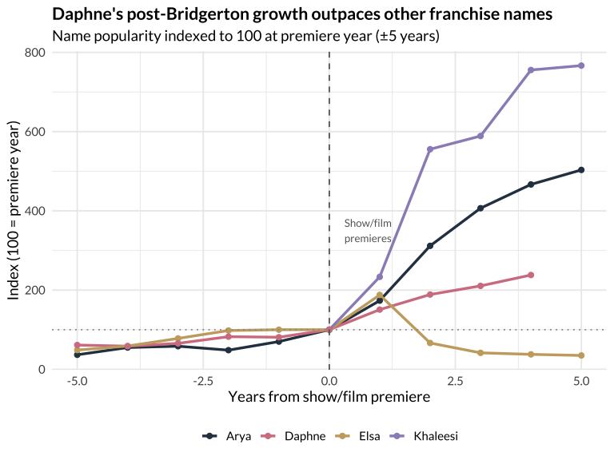<!-- -->

This indexed comparison reveals the different shapes of pop culture
naming:

- **Khaleesi** (a name invented by Game of Thrones) shows the purest pop
  culture signal — it didn’t exist before the show.
- **Elsa** spiked immediately after Frozen (2013) then collapsed — the
  “flash” pattern. Parents who loved the movie in 2014 named their
  daughters Elsa; by 2016, the association felt too on-the-nose.
- **Arya** shows steady sustained growth throughout GoT’s run.
- **Daphne** is the most sustained grower — and she was *already* rising
  before Bridgerton, just much more slowly. The show poured fuel on a
  smoldering fire.

## Forecasting: Where Is Name Concentration Headed?

[Time series forecasting](https://otexts.com/fpp3/) lets us project
trends into the future using patterns in historical data. We’ll use the
`fable` package — a modern, tidy interface for forecasting that supports
multiple model types including [ETS (Exponential
Smoothing)](https://otexts.com/fpp3/expsmooth.html) and
[ARIMA](https://otexts.com/fpp3/arima.html) models.

We’ll forecast the **top-10 name share** — the percentage of babies
given one of the 10 most popular names — to see when (or if) it
approaches a floor.

``` r
# Build time series of top-10 share for boys and girls combined
concentration_ts <- england_wales |>
  group_by(Year) |>
  summarise(
    total = sum(Number),
    top10_total = sum(Number[Rank <= 10]),
    .groups = "drop"
  ) |>
  mutate(share = top10_total / total) |>
  as_tsibble(index = Year)

# Fit multiple models and select best
fit <- concentration_ts |>
  model(
    ets = ETS(share),
    arima = ARIMA(share),
    tslm = TSLM(share ~ trend())
  )

# Forecast 10 years ahead
fc <- fit |> forecast(h = 10)

# Accuracy comparison
cat("Model accuracy (training set):\n")
```

    ## Model accuracy (training set):

``` r
accuracy(fit) |>
  select(.model, RMSE, MAE, MAPE) |>
  arrange(MAPE) |>
  print()
```

    ## # A tibble: 3 × 4
    ##   .model    RMSE     MAE  MAPE
    ##   <chr>    <dbl>   <dbl> <dbl>
    ## 1 ets    0.00264 0.00201  1.29
    ## 2 arima  0.00295 0.00220  1.48
    ## 3 tslm   0.00713 0.00591  3.85

``` r
# Plot forecast
fc |>
  autoplot(concentration_ts, level = 80) +
  scale_y_continuous(labels = percent_format()) +
  scale_color_manual(values = c(
    "ets" = bridgerton_rose,
    "arima" = bridgerton_blue,
    "tslm" = bridgerton_gold
  )) +
  scale_fill_manual(values = c(
    "ets" = bridgerton_rose,
    "arima" = bridgerton_blue,
    "tslm" = bridgerton_gold
  )) +
  labs(
    title = "Name concentration will keep falling — but how fast?",
    subtitle = "Forecast of top-10 name share (England & Wales, 80% prediction interval)",
    x = NULL, y = "Top-10 name share",
    color = "Model", fill = "Model"
  ) +
  theme(
    plot.title = element_text(face = "bold", size = 16),
    legend.position = "bottom"
  )
```

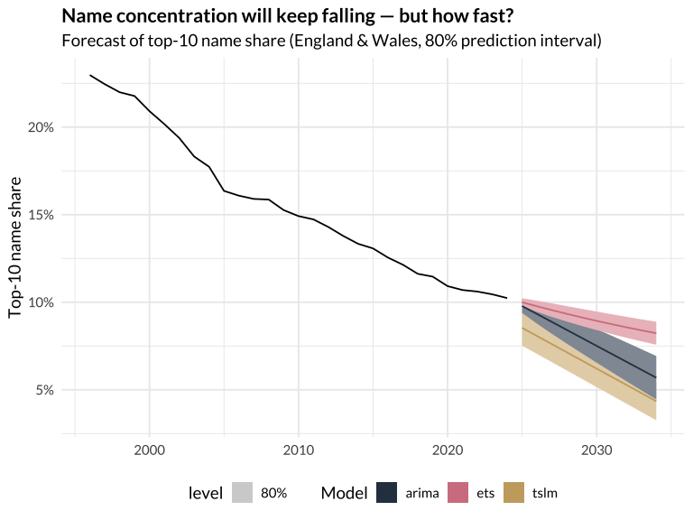<!-- -->

All three models agree on the direction: the top-10 share will continue
declining. The **ETS model** (which captures the level and trend as
smoothed components) and the **ARIMA model** (which models
autocorrelation in the differenced series) both suggest the decline is
decelerating — we may approach a floor around **8-9%** by the early
2030s. The linear trend model is more pessimistic, projecting continued
straight-line decline.

This makes intuitive sense: there’s probably a natural floor where
popular names stabilize, even as the long tail keeps growing.

## Clustering: How Culturally Distinct Are the UK’s Nations?

[Principal Component Analysis
(PCA)](https://en.wikipedia.org/wiki/Principal_component_analysis) is a
technique that reduces many variables into a few “principal components”
that capture the most variation in the data. Think of it as finding the
main axes along which data points differ. We’ll use it to see how naming
patterns cluster by region and time period.

We’ll build a feature matrix where each row is a region-year combination
and columns are the market shares of popular names, then cluster to see
if Scotland, NI, and England & Wales form distinct groups.

``` r
# Get overlapping years across all three datasets
common_years <- intersect(
  intersect(unique(england_wales$Year), unique(scotland$Year)),
  unique(ni$Year)
)

# For each region-year, compute share of top 20 names
get_top_shares <- function(df, region_name, top_n = 30) {
  df |>
    filter(Year %in% common_years, !is.na(Number)) |>
    # Aggregate across Sex so each Name appears once per Year
    group_by(Year, Name) |>
    summarise(Number = sum(Number, na.rm = TRUE), .groups = "drop") |>
    group_by(Year) |>
    mutate(total = sum(Number)) |>
    ungroup() |>
    mutate(share = Number / total) |>
    # Get top names across all years combined
    group_by(Name) |>
    summarise(avg_share = mean(share), .groups = "drop") |>
    slice_max(avg_share, n = top_n) |>
    pull(Name) -> top_names
  
  df |>
    filter(Year %in% common_years, !is.na(Number), Name %in% top_names) |>
    group_by(Year, Name) |>
    summarise(Number = sum(Number, na.rm = TRUE), .groups = "drop") |>
    group_by(Year) |>
    mutate(total = sum(Number)) |>
    ungroup() |>
    mutate(share = Number / total) |>
    select(Year, Name, share) |>
    pivot_wider(names_from = Name, values_from = share, values_fill = 0) |>
    mutate(region = region_name)
}

ew_shares <- get_top_shares(england_wales, "England & Wales")
sc_shares <- get_top_shares(scotland, "Scotland")
ni_shares <- get_top_shares(ni |> filter(!is.na(Number)), "N. Ireland")

# Combine — use common columns only
common_names <- Reduce(intersect, list(
  names(ew_shares), names(sc_shares), names(ni_shares)
))

all_shares <- bind_rows(
  ew_shares |> select(all_of(common_names)),
  sc_shares |> select(all_of(common_names)),
  ni_shares |> select(all_of(common_names))
) |>
  mutate(label = paste(region, Year))
```

### PCA Visualization

``` r
# Run PCA
pca_data <- all_shares |> select(-Year, -region, -label)
pca_result <- prcomp(pca_data, scale. = TRUE)

# Extract scores
pca_scores <- as_tibble(pca_result$x[, 1:2]) |>
  mutate(
    region = all_shares$region,
    year = all_shares$Year,
    label = all_shares$label
  )

# PCA biplot
pca_scores |>
  ggplot(aes(x = PC1, y = PC2, color = region)) +
  geom_point(aes(size = year), alpha = 0.7) +
  geom_text(
    data = pca_scores |> filter(year %in% c(1997, 2005, 2015, 2024)),
    aes(label = year),
    size = 3, nudge_y = 0.3, family = "lato"
  ) +
  scale_color_manual(values = c(
    "England & Wales" = bridgerton_blue,
    "Scotland" = bridgerton_sage,
    "N. Ireland" = bridgerton_gold
  )) +
  scale_size_continuous(range = c(2, 5), guide = "none") +
  labs(
    title = "UK nations have distinct naming identities",
    subtitle = "PCA of name market shares — each dot is a region-year",
    x = paste0("PC1 (", round(summary(pca_result)$importance[2,1]*100, 1), "% variance)"),
    y = paste0("PC2 (", round(summary(pca_result)$importance[2,2]*100, 1), "% variance)"),
    color = NULL
  ) +
  theme(
    plot.title = element_text(face = "bold", size = 16),
    legend.position = "bottom"
  )
```

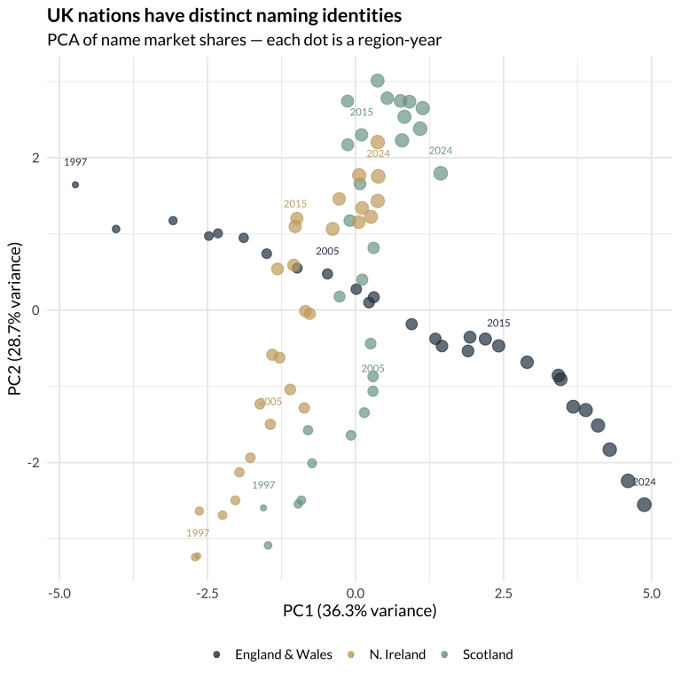<!-- -->

### Hierarchical Clustering Dendrogram

A [dendrogram](https://en.wikipedia.org/wiki/Dendrogram) is a tree
diagram that shows how observations group together based on similarity.
Items that merge at lower heights are more similar to each other.

``` r
# Use a subset of years for readability
cluster_data <- all_shares |>
 filter(Year %in% seq(1997, 2024, by = 3)) |>
 mutate(label = paste(region, Year))

cluster_matrix <- cluster_data |> select(-Year, -region, -label)
rownames(cluster_matrix) <- cluster_data$label

# Hierarchical clustering
dist_matrix <- dist(scale(cluster_matrix))
hc <- hclust(dist_matrix, method = "ward.D2")

# Color by region
region_colors <- c(
  "England & Wales" = bridgerton_blue,
  "Scotland" = bridgerton_sage,
  "N. Ireland" = bridgerton_gold
)

fviz_dend(hc, k = 3, 
          cex = 0.6,
          color_labels_by_k = TRUE,
          rect = TRUE,
          main = "UK naming patterns cluster by nation",
          xlab = "",
          ylab = "Distance (Ward's method)") +
  theme(
    plot.title = element_text(face = "bold", size = 16, family = "lato"),
    text = element_text(family = "lato")
  )
```

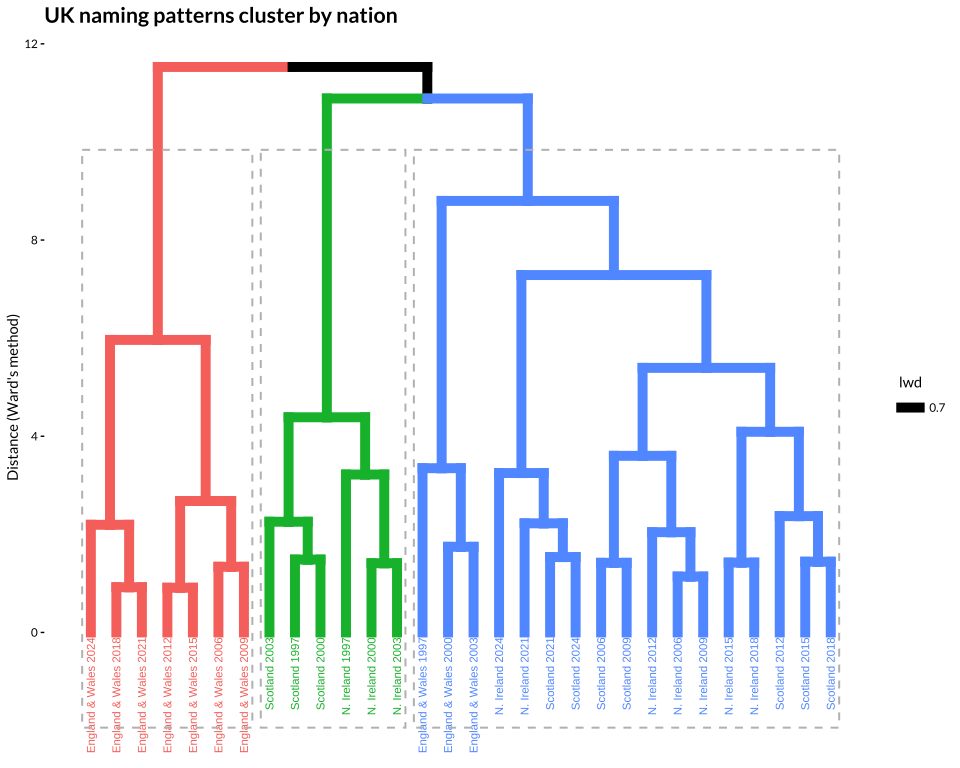<!-- -->

The dendrogram confirms what the PCA suggests: naming patterns cluster
primarily by **nation**, not by time period. Scotland and Northern
Ireland form distinct groups, while England & Wales occupies its own
space. Within each cluster, you can see temporal progression — recent
years are more similar to each other than to the 1990s.

## The Hero Visualization: Daphne’s Meteoric Rise

For our final shareable image, we’ll focus on a story with broader pop
culture appeal — **Game of Thrones** and the names it launched (and
destroyed). GOT premiered in April 2011 and ended in May 2019. Some
names thrived; others crashed after the controversial final season.
“When you play the game of names, you win or you die.”

``` r
# GOT font — medieval/fantasy serif
font_add_google("Cinzel", "cinzel")
font_add_google("Cinzel Decorative", "cinzel_dec")
showtext_auto()
showtext_opts(dpi = 300)

# GOT color palette
got_black <- "#1a1a2e"
got_dark <- "#16213e"
got_gold <- "#D4AF37"
got_ice <- "#A8DADC"
got_fire <- "#F25C54"
got_stark_gray <- "#8B9DAF"
got_lannister <- "#C9A96E"
got_targaryen <- "#8B0000"

# Prepare data — key GOT names with clear signals
got_hero_data <- england_wales |>
  filter(Sex == "Girl") |>
  filter(Name %in% c("Arya", "Khaleesi")) |>
  # Fill missing years with 0 for Khaleesi pre-2011

  bind_rows(
    tibble(Year = 1996:2010, Sex = "Girl", Name = "Khaleesi", Number = 0, Rank = NA_real_)
  ) |>
  arrange(Name, Year)

# Caption
bg_color <- got_black
tt_source <- "ONS / NRS / NISRA"

tt_caption <- paste0(
 "<span style='color:#8B9DAF;'>DataViz: Tony Galvan #TidyTuesday</span>",
 "<span style='color:", bg_color, ";'>..</span>",
 "<span style='font-family:fa-solid;color:#8B9DAF;'>&#xf0ce;</span>",
 "<span style='color:", bg_color, ";'>.</span>",
 "<span style='color:#8B9DAF;'>", tt_source, "</span>",
 "<span style='color:", bg_color, ";'>..</span>",
 "<span style='font-family:fa-brands;color:#8B9DAF;'>&#xf08c;</span>",
 "<span style='color:", bg_color, ";'>.</span>",
 "<span style='color:#8B9DAF;'>anthony-raul-galvan</span>",
 "<span style='color:", bg_color, ";'>..</span>",
 "<span style='font-family:fa-brands;color:#8B9DAF;'>&#xf09b;</span>",
 "<span style='color:", bg_color, ";'>.</span>",
 "<span style='color:#8B9DAF;'>gdatascience</span>"
)

p_hero <- got_hero_data |>
  ggplot(aes(x = Year, y = Number, color = Name)) +
  # GOT era shading
  annotate("rect", xmin = 2011, xmax = 2019, ymin = -Inf, ymax = Inf,
           fill = "white", alpha = 0.03) +
  # Season premiere/finale markers
  geom_vline(xintercept = 2011, linetype = "dashed", color = got_gold, 
             linewidth = 0.5, alpha = 0.6) +
  geom_vline(xintercept = 2019, linetype = "dashed", color = got_fire, 
             linewidth = 0.5, alpha = 0.6) +
  # Lines
  geom_line(linewidth = 2.5) +
  # Arya peak label
  annotate("text", x = 2019, y = 460,
           label = "Arya peaks at 427\nbabies (Rank #120)",
           hjust = 0.5, size = 6, color = got_gold,
           family = "cinzel") +
  # Khaleesi peak and fall
  annotate("text", x = 2018.5, y = 125,
           label = "Khaleesi peaks\nthen crashes\nafter Season 8",
           hjust = 0.5, size = 5.5, color = got_fire,
           family = "cinzel") +
  # Era labels
  annotate("text", x = 2015, y = 540,
           label = "GAME OF THRONES ERA",
           hjust = 0.5, size = 7.5, color = got_ice, alpha = 0.7,
           family = "cinzel", fontface = "bold") +
  annotate("text", x = 2011, y = -15,
           label = "S1", hjust = 0.5, size = 5, color = got_gold,
           family = "cinzel") +
  annotate("text", x = 2019, y = -15,
           label = "S8", hjust = 0.5, size = 5, color = got_fire,
           family = "cinzel") +
  # 2024 Arya label
  annotate("text", x = 2025, y = 265,
           label = "Still 265\nin 2024",
           hjust = 0, size = 5.5, color = got_gold,
           family = "cinzel") +
  scale_color_manual(values = c(
    "Arya" = got_gold,
    "Khaleesi" = got_fire
  )) +
  scale_x_continuous(
    breaks = seq(1996, 2024, by = 4),
    limits = c(1996, 2032)
  ) +
  scale_y_continuous(labels = comma, limits = c(-20, 580)) +
  labs(
    title = "WHEN YOU PLAY THE\nGAME OF NAMES",
    subtitle = "Arya won. Khaleesi burned out after Season 8.\nUK baby names, England & Wales (1996–2024)",
    x = NULL,
    y = "Babies named each year",
    caption = tt_caption
  ) +
  theme(
    plot.background = element_rect(fill = got_black, color = NA),
    panel.background = element_rect(fill = got_black, color = NA),
    panel.grid = element_blank(),
    panel.border = element_blank(),
    axis.ticks = element_blank(),
    plot.title = element_text(
      family = "cinzel_dec", face = "bold", size = 40,
      color = got_ice, hjust = 0.5, lineheight = 1.1
    ),
    plot.title.position = "plot",
    plot.subtitle = element_text(
      family = "cinzel", face = "bold", size = 20,
      color = got_stark_gray, hjust = 0.5, lineheight = 1.3
    ),
    plot.caption = element_markdown(
      family = "cinzel", size = 10, hjust = 0.5
    ),
    plot.caption.position = "plot",
    axis.text = element_text(family = "cinzel", size = 16, color = got_stark_gray),
    axis.title.y = element_text(family = "cinzel", size = 16, color = got_stark_gray),
    legend.position = "none",
    plot.margin = margin(20, 30, 15, 30)
  )

p_hero
```

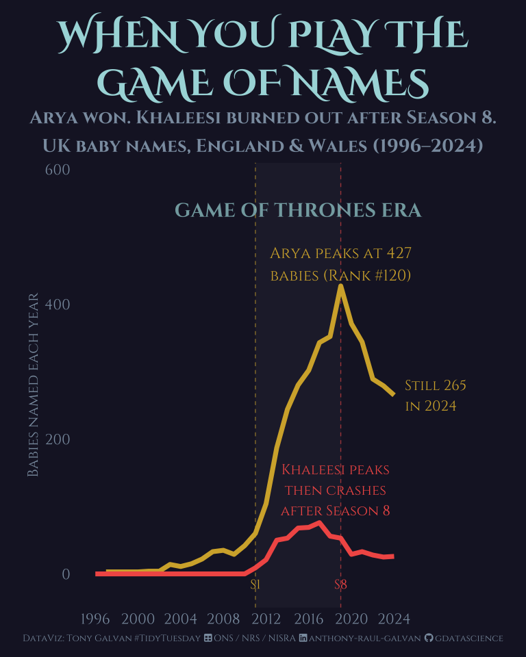<!-- -->

``` r
library(magick)

# Save base plot
ggsave(
  filename = "outputs/2026_06_16_tidy_tuesday_uk_baby_names.png",
  plot = p_hero,
  device = "png",
  width = 8,
  height = 10,
  dpi = 300,
  bg = got_black
)

# Composite wolf silhouette — larger, positioned in the empty pre-GOT space
base_img <- image_read("outputs/2026_06_16_tidy_tuesday_uk_baby_names.png")
wolf_img <- image_read("../../.kiro/specs/2026_06_16_tidy_tuesday_uk_baby_names/wolf_white.png") |>
  image_resize("900x900") |>
  image_colorize(opacity = 80, color = got_gold)

# Place in the pre-GOT empty space
final_img <- image_composite(
  base_img, wolf_img,
  offset = "+287+1200",
  operator = "over"
)

image_write(final_img, "outputs/2026_06_16_tidy_tuesday_uk_baby_names.png")

showtext_auto(FALSE)
```

## What’s Next?

This dataset opens up several fascinating threads worth pulling:

- **The “Frozen effect” reversal** — Elsa spiked in 2014 and then
  *crashed*. Do fictional villain associations kill names? (Looking at
  you, Cersei.)
- **Gender-neutral naming trends** — names like Remi, Quinn, and River
  are increasingly given to both boys and girls. Is this accelerating?
- **The Muhammad question** — combining spellings, it’s been the \#1
  boys’ name for years. What does the trajectory look like when we
  account for all variants?
- **Scottish exceptionalism** — with 51 years of data, Scotland offers
  the deepest look at generational naming cycles. David → Jack → Noah is
  a 50-year dynasty chart.

The data tells us that we’re in an era of radical naming individualism.
The days of five Emilys in one classroom are fading — but pop culture
can still create brief moments of collective agreement. Netflix, it
turns out, is the new village square.
