# Can You Beat the Odds? What 7,000 UFC Fights Tell Us About Predicting Combat

**[Source Code](2026_07_07_tidy_tuesday_ufc.Rmd)** | Data from the [TidyTuesday project](https://github.com/rfordatascience/tidytuesday/tree/main/data/2026/2026-07-07) (Week 27, 2026-07-07)

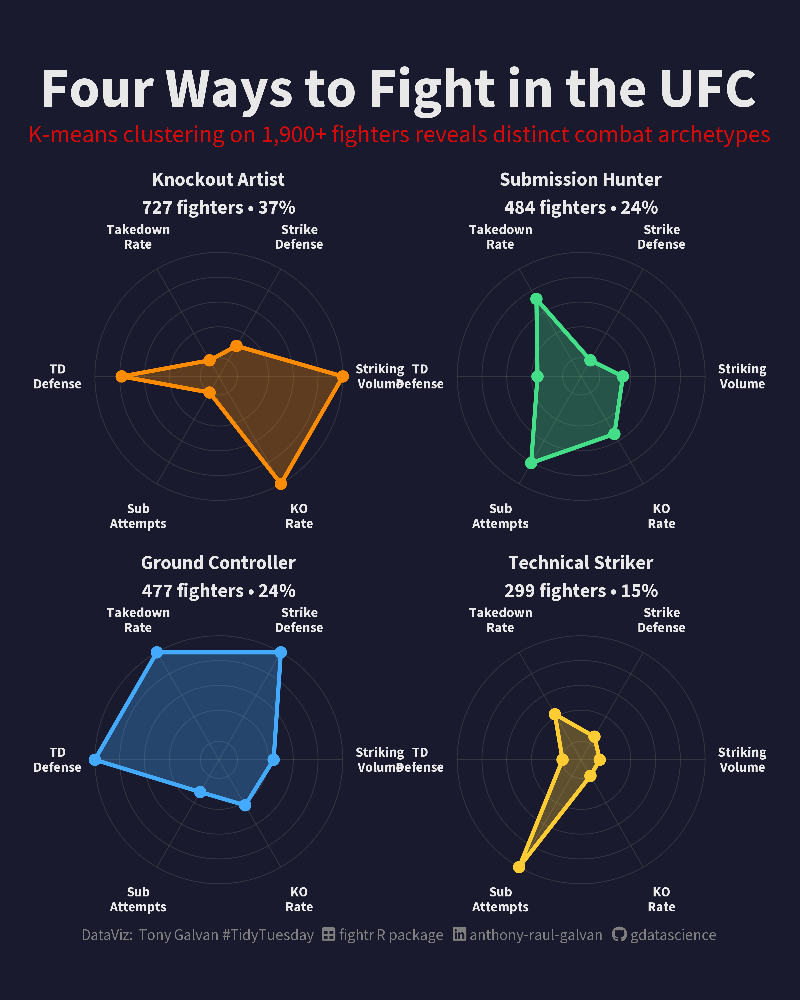

K-means clustering on 1,987 UFC fighters reveals four distinct combat archetypes — Knockout Artists, Ground Controllers, Submission Hunters, and Technical Strikers. Plus: a random forest model tries (and fails) to beat Vegas at predicting fight outcomes.

---

Tony Galvan
2026-07-07

## Into the Octagon

The UFC is the ultimate meritocracy — two fighters enter the Octagon,
and only skill, preparation, and a bit of luck determine who walks out
with their hand raised. But how predictable is it really? Las Vegas
oddsmakers set betting lines on every fight, and millions of dollars
ride on their accuracy. This week’s TidyTuesday dataset gives us **7,177
UFC bouts** spanning 2010–2026, complete with betting odds, fighter
stats, physical measurements, and career histories.

We’ll ask a simple question: **Can a machine learning model beat Vegas
at predicting UFC fights?** Along the way, we’ll profile fighter
archetypes using clustering and discover what really separates winners
from losers in the Octagon.

``` r
library(tidyverse)
library(tidymodels)
library(scales)
library(ggtext)
library(showtext)
library(sysfonts)

font_add_google("Source Sans 3", "source_sans")
font_add(family = "fa-brands",
         regular = "~/Library/Fonts/Font Awesome 7 Brands-Regular-400.otf")
font_add(family = "fa-solid",
         regular = "~/Library/Fonts/Font Awesome 7 Free-Solid-900.otf")
showtext_auto()
showtext_opts(dpi = 300)

# UFC-themed color palette (matching hero dataviz)
bg_color <- "#1a1a2e"
text_color <- "#e8e8e8"
ufc_red <- "#D20A0A"
ufc_orange <- "#FF8C00"
ufc_blue <- "#44AAFF"
ufc_green <- "#44DD88"
ufc_yellow <- "#FFCC33"

# Set a dark theme for all plots
theme_set(

  theme_minimal(base_family = "source_sans", base_size = 14) +
    theme(
      plot.background = element_rect(fill = bg_color, color = NA),
      panel.background = element_rect(fill = bg_color, color = NA),
      panel.grid.major = element_line(color = "gray30"),
      panel.grid.minor = element_blank(),
      text = element_text(color = text_color),
      axis.text = element_text(color = "gray70"),
      plot.title = element_text(color = text_color, face = "bold", size = 18),
      plot.subtitle = element_text(color = ufc_red, size = 13),
      plot.title.position = "plot",
      legend.text = element_text(color = text_color),
      legend.title = element_text(color = text_color)
    )
)
```

``` r
ufc_athletes <- read_csv('https://raw.githubusercontent.com/rfordatascience/tidytuesday/main/data/2026/2026-07-07/ufc_athletes.csv')
ufc_fights <- read_csv('https://raw.githubusercontent.com/rfordatascience/tidytuesday/main/data/2026/2026-07-07/ufc_fights.csv')
ultimate_ufc <- read_csv('https://raw.githubusercontent.com/rfordatascience/tidytuesday/main/data/2026/2026-07-07/ultimate_ufc_dataset.csv')
```

## Getting to Know the Data

The `ultimate_ufc_dataset` is our main table — each row is a single bout
with stats for both the Red and Blue corner fighters. Let’s profile it.

``` r
glimpse(ultimate_ufc)
```

    ## Rows: 7,177
    ## Columns: 118
    ## $ r_fighter                    <chr> "Israel Adesanya", "Alexa Grasso", "Micha…
    ## $ b_fighter                    <chr> "Joe Pyfer", "Maycee Barber", "Niko Price…
    ## $ r_odds                       <dbl> -130, 124, -901, 235, -158, -150, -295, -…
    ## $ b_odds                       <dbl> 102, -158, 550, -320, 124, 118, 220, 210,…
    ## $ r_ev                         <dbl> 76.9231, 124.0000, 11.0988, 235.0000, 63.…
    ## $ b_ev                         <dbl> 102.0000, 63.2911, 550.0000, 31.2500, 124…
    ## $ date                         <date> 2026-03-28, 2026-03-28, 2026-03-28, 2026…
    ## $ location                     <chr> "Seattle, Washington, USA", "Seattle, Was…
    ## $ country                      <chr> "USA", "USA", "USA", "USA", "USA", "USA",…
    ## $ winner                       <chr> "Blue", "Red", "Red", "Blue", "Blue", "Re…
    ## $ title_bout                   <lgl> FALSE, FALSE, FALSE, FALSE, FALSE, FALSE,…
    ## $ weight_class                 <chr> "Middleweight", "Women's Flyweight", "Wel…
    ## $ gender                       <chr> "MALE", "FEMALE", "MALE", "MALE", "MALE",…
    ## $ no_of_rounds                 <dbl> 5, 3, 3, 3, 3, 3, 3, 3, 3, 3, 3, 3, 3, 5,…
    ## $ b_current_lose_streak        <dbl> 0, 0, 3, 0, 0, 0, 1, 1, 0, 0, 1, 1, 1, 0,…
    ## $ b_current_win_streak         <dbl> 3, 7, 0, 1, 2, 1, 0, 0, 0, 3, 0, 0, 0, 9,…
    ## $ b_draw                       <dbl> 0, 0, 0, 0, 0, 1, 0, 0, 0, 0, 0, 0, 0, 1,…
    ## $ b_avg_sig_str_landed         <dbl> 3.52, 4.56, 5.11, 8.67, 6.10, 3.60, 1.84,…
    ## $ b_avg_sig_str_pct            <dbl> 0.44, 0.53, 0.43, 0.64, 0.64, 0.45, 0.46,…
    ## $ b_avg_sub_att                <dbl> 0.9, 0.1, 0.6, 0.0, 0.0, 0.5, 0.0, 0.0, 0…
    ## $ b_avg_td_landed              <dbl> 1.45, 1.56, 1.06, 0.00, 0.29, 1.18, 2.30,…
    ## $ b_avg_td_pct                 <dbl> 0.30, 0.45, 0.30, 0.00, 1.00, 0.23, 0.60,…
    ## $ b_longest_win_streak         <dbl> 4, 7, 2, 1, 2, 3, 0, 0, 0, 3, 2, 6, 1, 9,…
    ## $ b_losses                     <dbl> 2, 2, 10, 0, 1, 5, 1, 1, 0, 2, 2, 3, 4, 0…
    ## $ b_total_rounds_fought        <dbl> 18, 34, 40, 1, 9, 26, 1, 3, 0, 14, 7, 18,…
    ## $ b_total_title_bouts          <dbl> 0, 0, 0, 0, 0, 0, 0, 0, 0, 0, 0, 0, 0, 0,…
    ## $ b_win_by_decision_majority   <dbl> 0, 0, 0, 0, 0, 0, 0, 0, 0, 0, 0, 0, 0, 0,…
    ## $ b_win_by_decision_split      <dbl> 0, 2, 0, 0, 0, 0, 0, 0, 0, 1, 0, 1, 0, 1,…
    ## $ b_win_by_decision_unanimous  <dbl> 1, 4, 2, 0, 0, 3, 0, 0, 0, 1, 1, 0, 3, 5,…
    ## $ b_win_by_ko_tko              <dbl> 4, 5, 4, 1, 2, 2, 0, 0, 0, 0, 1, 6, 1, 3,…
    ## $ b_win_by_submission          <dbl> 2, 0, 2, 0, 0, 0, 0, 0, 0, 1, 0, 0, 0, 0,…
    ## $ b_win_by_tko_doctor_stoppage <dbl> 0, 0, 0, 0, 0, 0, 0, 0, 0, 0, 0, 0, 0, 0,…
    ## $ b_wins                       <dbl> 7, 11, 8, 1, 2, 5, 0, 0, 0, 3, 2, 7, 4, 9…
    ## $ b_stance                     <chr> "Orthodox", "Switch", "Orthodox", "Orthod…
    ## $ b_height_cms                 <dbl> 187.96, 165.10, 182.88, 175.26, 198.12, 1…
    ## $ b_reach_cms                  <dbl> 190.50, 165.10, 193.04, 182.88, 200.66, 1…
    ## $ b_weight_lbs                 <dbl> 185, 125, 170, 145, 185, 155, 155, 155, 2…
    ## $ r_current_lose_streak        <dbl> 3, 2, 0, 1, 0, 1, 1, 1, 1, 0, 0, 1, 0, 0,…
    ## $ r_current_win_streak         <dbl> 0, 0, 3, 0, 4, 0, 0, 0, 0, 1, 4, 0, 3, 9,…
    ## $ r_draw                       <dbl> 0, 1, 0, 0, 1, 0, 0, 0, 0, 0, 0, 0, 0, 0,…
    ## $ r_avg_sig_str_landed         <dbl> 4.03, 4.11, 2.02, 6.18, 3.28, 6.53, 5.99,…
    ## $ r_avg_sig_str_pct            <dbl> 0.48, 0.41, 0.40, 0.48, 0.44, 0.55, 0.46,…
    ## $ r_avg_sub_att                <dbl> 0.1, 0.7, 1.0, 0.7, 0.3, 2.1, 0.6, 2.1, 0…
    ## $ r_avg_td_landed              <dbl> 0.05, 0.40, 3.11, 1.73, 1.65, 3.31, 0.00,…
    ## $ r_avg_td_pct                 <dbl> 0.09, 0.35, 0.47, 0.43, 0.41, 0.40, 0.00,…
    ## $ r_longest_win_streak         <dbl> 9, 5, 4, 3, 3, 2, 3, 5, 5, 4, 4, 5, 3, 9,…
    ## $ r_losses                     <dbl> 5, 5, 7, 8, 0, 6, 3, 4, 9, 2, 0, 6, 0, 0,…
    ## $ r_total_rounds_fought        <dbl> 66, 45, 47, 36, 9, 16, 23, 28, 55, 18, 11…
    ## $ r_total_title_bouts          <dbl> 12, 3, 1, 0, 0, 0, 0, 0, 0, 0, 0, 0, 0, 0…
    ## $ r_win_by_decision_majority   <dbl> 0, 0, 0, 0, 0, 0, 0, 0, 1, 0, 0, 0, 0, 0,…
    ## $ r_win_by_decision_split      <dbl> 1, 1, 0, 2, 0, 0, 0, 0, 0, 1, 0, 2, 0, 1,…
    ## $ r_win_by_decision_unanimous  <dbl> 7, 5, 6, 1, 0, 0, 1, 3, 7, 1, 3, 4, 2, 8,…
    ## $ r_win_by_ko_tko              <dbl> 5, 0, 0, 3, 3, 4, 4, 2, 5, 2, 1, 2, 0, 0,…
    ## $ r_win_by_submission          <dbl> 0, 2, 8, 4, 1, 3, 2, 4, 1, 1, 0, 3, 1, 0,…
    ## $ r_win_by_tko_doctor_stoppage <dbl> 0, 0, 0, 0, 0, 0, 0, 0, 0, 0, 0, 0, 0, 0,…
    ## $ r_wins                       <dbl> 13, 8, 14, 10, 4, 7, 7, 9, 14, 5, 4, 11, …
    ## $ r_stance                     <chr> "Switch", "Orthodox", "Southpaw", "Southp…
    ## $ r_height_cms                 <dbl> 193.04, 165.10, 185.42, 185.42, 187.96, 1…
    ## $ r_reach_cms                  <dbl> 203.20, 167.64, 190.50, 187.96, 203.20, 1…
    ## $ r_weight_lbs                 <dbl> 185, 125, 170, 145, 185, 155, 155, 155, 2…
    ## $ r_age                        <dbl> 36, 32, 38, 36, 28, 31, 28, 26, 40, 28, 2…
    ## $ b_age                        <dbl> 29, 27, 36, 30, 33, 34, 36, 31, 35, 32, 3…
    ## $ lose_streak_dif              <dbl> -3, -2, 3, -1, 0, -1, 0, 0, -1, 0, 1, 0, …
    ## $ win_streak_dif               <dbl> 3, 7, -3, 1, -2, 1, 0, 0, 0, 2, -4, 0, -3…
    ## $ longest_win_streak_dif       <dbl> -5, 2, -2, -2, -1, 1, -3, -5, -5, -1, -2,…
    ## $ win_dif                      <dbl> -6, 3, -6, -9, -2, -2, -7, -9, -14, -2, -…
    ## $ loss_dif                     <dbl> -3, -3, 3, -8, 1, -1, -2, -3, -9, 0, 2, -…
    ## $ total_round_dif              <dbl> -48, -11, -7, -35, 0, 10, -22, -25, -55, …
    ## $ total_title_bout_dif         <dbl> -12, -3, -1, 0, 0, 0, 0, 0, 0, 0, 0, 0, 0…
    ## $ ko_dif                       <dbl> -1, 5, 4, -2, -1, -2, -4, -2, -5, -2, 0, …
    ## $ sub_dif                      <dbl> 2, -2, -6, -4, -1, -3, -2, -4, -1, 0, 0, …
    ## $ height_dif                   <dbl> -5.08, 0.00, -2.54, -10.16, 10.16, 2.54, …
    ## $ reach_dif                    <dbl> -12.70, -2.54, 2.54, -5.08, -2.54, -5.08,…
    ## $ age_dif                      <dbl> -7, -5, -2, -6, 5, 3, 8, 5, -5, 4, 4, -1,…
    ## $ sig_str_dif                  <dbl> -0.51, 0.45, 3.09, 2.49, 2.82, -2.93, -4.…
    ## $ avg_sub_att_dif              <dbl> 0.8, -0.6, -0.4, -0.7, -0.3, -1.6, -0.6, …
    ## $ avg_td_dif                   <dbl> 1.40, 1.16, -2.05, -1.73, -1.36, -2.13, 2…
    ## $ empty_arena                  <dbl> NA, NA, NA, NA, NA, NA, NA, NA, NA, NA, N…
    ## $ b_match_weightclass_rank     <dbl> NA, NA, NA, NA, NA, NA, NA, NA, NA, NA, N…
    ## $ r_match_weightclass_rank     <dbl> NA, NA, NA, NA, NA, NA, NA, NA, NA, NA, N…
    ## $ r_womens_flyweight_rank      <dbl> NA, NA, NA, NA, NA, NA, NA, NA, NA, NA, N…
    ## $ r_womens_featherweight_rank  <dbl> NA, NA, NA, NA, NA, NA, NA, NA, NA, NA, N…
    ## $ r_womens_strawweight_rank    <dbl> NA, NA, NA, NA, NA, NA, NA, NA, NA, NA, N…
    ## $ r_womens_bantamweight_rank   <dbl> NA, NA, NA, NA, NA, NA, NA, NA, NA, NA, N…
    ## $ r_heavyweight_rank           <dbl> NA, NA, NA, NA, NA, NA, NA, NA, NA, NA, N…
    ## $ r_light_heavyweight_rank     <dbl> NA, NA, NA, NA, NA, NA, NA, NA, NA, NA, N…
    ## $ r_middleweight_rank          <dbl> NA, NA, NA, NA, NA, NA, NA, NA, NA, NA, N…
    ## $ r_welterweight_rank          <dbl> NA, NA, NA, NA, NA, NA, NA, NA, NA, NA, N…
    ## $ r_lightweight_rank           <dbl> NA, NA, NA, NA, NA, NA, NA, NA, NA, NA, N…
    ## $ r_featherweight_rank         <dbl> NA, NA, NA, NA, NA, NA, NA, NA, NA, NA, N…
    ## $ r_bantamweight_rank          <dbl> NA, NA, NA, NA, NA, NA, NA, NA, NA, NA, N…
    ## $ r_flyweight_rank             <dbl> NA, NA, NA, NA, NA, NA, NA, NA, NA, NA, N…
    ## $ r_pound_for_pound_rank       <dbl> NA, NA, NA, NA, NA, NA, NA, NA, NA, NA, N…
    ## $ b_womens_flyweight_rank      <dbl> NA, NA, NA, NA, NA, NA, NA, NA, NA, NA, N…
    ## $ b_womens_featherweight_rank  <lgl> NA, NA, NA, NA, NA, NA, NA, NA, NA, NA, N…
    ## $ b_womens_strawweight_rank    <dbl> NA, NA, NA, NA, NA, NA, NA, NA, NA, NA, N…
    ## $ b_womens_bantamweight_rank   <dbl> NA, NA, NA, NA, NA, NA, NA, NA, NA, NA, N…
    ## $ b_heavyweight_rank           <dbl> NA, NA, NA, NA, NA, NA, NA, NA, NA, NA, N…
    ## $ b_light_heavyweight_rank     <dbl> NA, NA, NA, NA, NA, NA, NA, NA, NA, NA, N…
    ## $ b_middleweight_rank          <dbl> NA, NA, NA, NA, NA, NA, NA, NA, NA, NA, N…
    ## $ b_welterweight_rank          <dbl> NA, NA, NA, NA, NA, NA, NA, NA, NA, NA, N…
    ## $ b_lightweight_rank           <dbl> NA, NA, NA, NA, NA, NA, NA, NA, NA, NA, N…
    ## $ b_featherweight_rank         <dbl> NA, NA, NA, NA, NA, NA, NA, NA, NA, NA, N…
    ## $ b_bantamweight_rank          <dbl> NA, NA, NA, NA, NA, NA, NA, NA, NA, NA, N…
    ## $ b_flyweight_rank             <dbl> NA, NA, NA, NA, NA, NA, NA, NA, NA, NA, N…
    ## $ b_pound_for_pound_rank       <dbl> NA, NA, NA, NA, NA, NA, NA, NA, NA, NA, N…
    ## $ better_rank                  <chr> NA, NA, NA, NA, NA, NA, NA, NA, NA, NA, N…
    ## $ finish                       <chr> "KO/TKO", "KO/TKO", "SUB", "KO/TKO", "KO/…
    ## $ finish_details               <chr> "Punches", "Punch", "Rear Naked Choke", "…
    ## $ finish_round                 <dbl> 2, 1, 1, 1, 3, 1, 3, 1, 3, 1, 2, 3, 3, 5,…
    ## $ finish_round_time            <time> 04:18:00, 02:42:00, 01:03:00, 03:33:00, …
    ## $ total_fight_time_secs        <dbl> 558, 162, 63, 213, 819, 24, 900, 176, 900…
    ## $ r_dec_odds                   <dbl> 163, 175, 225, 600, 350, 1400, 240, 200, …
    ## $ b_dec_odds                   <dbl> 900, 105, 900, 500, 240, 900, 600, 450, 5…
    ## $ r_sub_odds                   <dbl> 2500, 1400, -150, 600, 800, 225, 1900, 10…
    ## $ b_sub_odds                   <dbl> 400, 800, 1600, 2000, 1800, 700, 9000, 75…
    ## $ r_ko_odds                    <dbl> 300, 2500, 600, 700, 240, 175, 1050, 2000…
    ## $ b_ko_odds                    <dbl> 250, 500, 1000, -150, 250, 250, 2200, 250…

We have **7,177 fights** across **118 variables**. The data spans from
2010-03-21 to 2026-03-28 — roughly 16 years of UFC history.

``` r
# Check missingness in key columns
missing_summary <- ultimate_ufc |>
  summarise(across(everything(), ~sum(is.na(.)))) |>
  pivot_longer(everything(), names_to = "variable", values_to = "n_missing") |>
  filter(n_missing > 0) |>
  mutate(pct_missing = n_missing / nrow(ultimate_ufc)) |>
  arrange(desc(n_missing))

missing_summary |>
  head(20) |>
  ggplot(aes(x = pct_missing, y = fct_reorder(variable, pct_missing))) +
  geom_col(fill = ufc_orange) +
  scale_x_continuous(labels = percent) +
  labs(
    title = "Missing Data in the UFC Dataset",
    subtitle = "Ranking columns have the most gaps — most fighters aren't ranked",
    x = "% Missing", y = NULL
  )
```

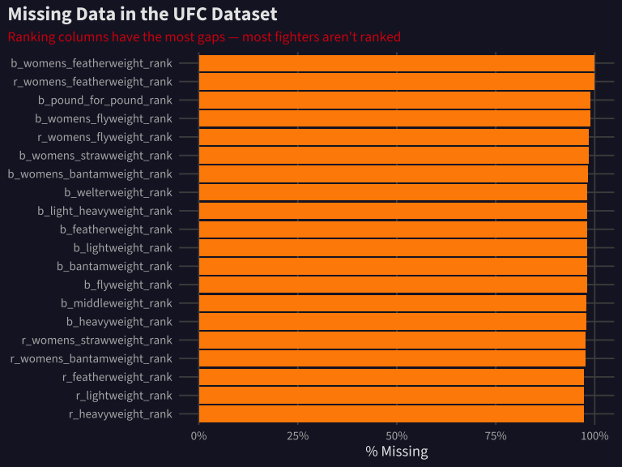<!-- -->

The ranking columns are mostly missing because only the top ~15 fighters
in each division hold an official UFC ranking at any given time. The
core fight stats (odds, physical attributes, career records) are
well-populated.

## Who Wins? Red Corner Dominance

In UFC, the Red corner is typically assigned to the higher-ranked or
more experienced fighter. Let’s check if that structural advantage shows
up in the data.

``` r
ultimate_ufc |>
  filter(winner %in% c("Red", "Blue")) |>
  count(winner) |>
  mutate(pct = n / sum(n)) |>
  ggplot(aes(x = winner, y = pct, fill = winner)) +
  geom_col(width = 0.6) +
  geom_text(aes(label = percent(pct, accuracy = 0.1)), vjust = -0.5, size = 5,
            color = text_color) +
  scale_fill_manual(values = c("Blue" = ufc_blue, "Red" = ufc_red)) +
  scale_y_continuous(labels = percent, limits = c(0, 0.7)) +
  labs(
    title = "The Red Corner Wins 58% of UFC Fights",
    subtitle = "Red is assigned to the higher-ranked/more experienced fighter",
    x = NULL, y = "Win Percentage"
  ) +
  theme(legend.position = "none")
```

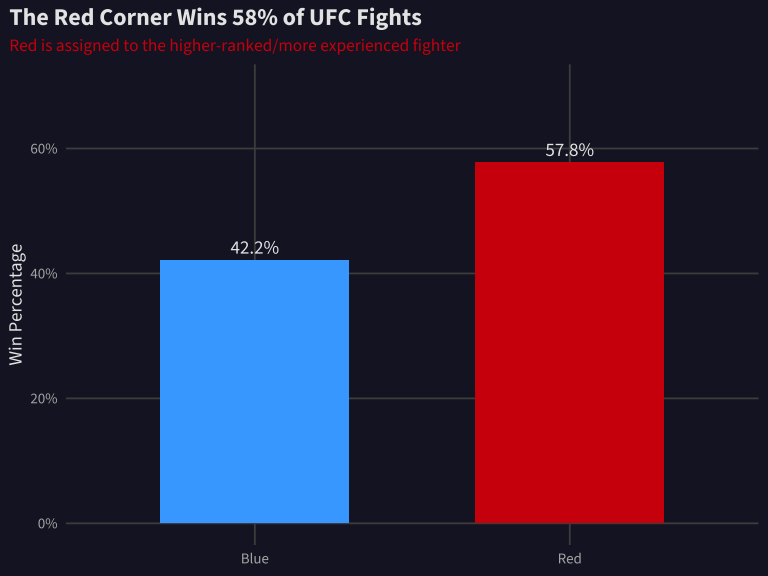<!-- -->

**The Red corner wins 58% of bouts** — not because of the color, but
because UFC assigns the Red corner to the fighter with more experience
or a higher ranking. This is our baseline: any prediction model needs to
beat 58%.

## How Do Fights End?

``` r
ultimate_ufc |>
  filter(!is.na(finish), finish %in% c("KO/TKO", "SUB", "U-DEC", "S-DEC", "M-DEC")) |>
  mutate(
    finish_group = case_when(
      finish == "KO/TKO" ~ "Knockout",
      finish == "SUB" ~ "Submission",
      finish %in% c("U-DEC", "S-DEC", "M-DEC") ~ "Decision"
    )
  ) |>
  count(finish_group) |>
  mutate(pct = n / sum(n)) |>
  ggplot(aes(x = fct_reorder(finish_group, -pct), y = pct, fill = finish_group)) +
  geom_col(width = 0.6) +
  geom_text(aes(label = percent(pct, accuracy = 0.1)), vjust = -0.5, size = 5,
            color = text_color) +
  scale_fill_manual(values = c("Decision" = ufc_yellow, "Knockout" = ufc_orange, "Submission" = ufc_green)) +
  scale_y_continuous(labels = percent, limits = c(0, 0.55)) +
  labs(
    title = "Nearly Half of UFC Fights Go to the Judges",
    subtitle = "Decisions (49%) edge out Knockouts (32%) and Submissions (18%)",
    x = NULL, y = "Proportion of Fights"
  ) +
  theme(legend.position = "none")
```

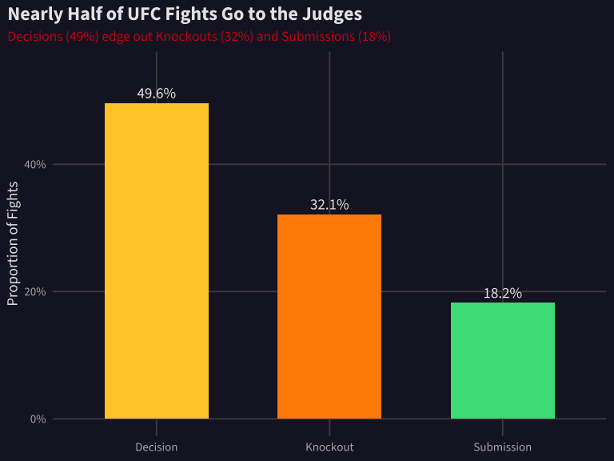<!-- -->

## The Evolution of Violence

Has the UFC gotten less violent over time? Let’s track how finish types
have evolved from 2010 to 2026.

``` r
ultimate_ufc |>
  mutate(year = as.integer(substr(date, 1, 4))) |>
  filter(!is.na(finish), finish %in% c("KO/TKO", "SUB", "U-DEC", "S-DEC", "M-DEC")) |>
  mutate(
    finish_group = case_when(
      finish == "KO/TKO" ~ "Knockout",
      finish == "SUB" ~ "Submission",
      TRUE ~ "Decision"
    )
  ) |>
  count(year, finish_group) |>
  group_by(year) |>
  mutate(pct = n / sum(n)) |>
  ungroup() |>
  ggplot(aes(x = year, y = pct, color = finish_group)) +
  geom_line(linewidth = 1.2) +
  scale_color_manual(values = c("Decision" = ufc_yellow, "Knockout" = ufc_orange, "Submission" = ufc_green)) +
  scale_y_continuous(labels = percent) +
  scale_x_continuous(breaks = seq(2010, 2026, 2)) +
  labs(
    title = "Decisions Are Rising, Submissions Are Fading",
    subtitle = "UFC fighters are getting more defensively sound over time",
    x = NULL, y = "% of Fights", color = "Finish Type"
  )
```

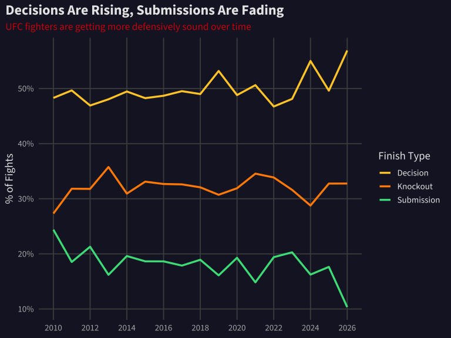<!-- -->

Decisions have climbed from **38% in 2010 to 48% in 2026**, while
submissions dropped from **25% to just 11%**. Fighters today are better
at defending takedowns and avoiding submission holds — the sport’s
defensive IQ is rising.

## Weight Class = Violence Level

Heavier fighters hit harder. Let’s quantify how much weight class
matters for KO rates.

``` r
weight_order <- c("Women's Strawweight", "Women's Flyweight", "Women's Bantamweight",
                  "Flyweight", "Bantamweight", "Featherweight", "Lightweight",
                  "Welterweight", "Middleweight", "Light Heavyweight", "Heavyweight")

ultimate_ufc |>
  filter(weight_class %in% weight_order, finish %in% c("KO/TKO", "SUB", "U-DEC", "S-DEC", "M-DEC")) |>
  mutate(is_ko = finish == "KO/TKO") |>
  group_by(weight_class) |>
  summarise(ko_rate = mean(is_ko), n = n(), .groups = "drop") |>
  mutate(weight_class = factor(weight_class, levels = weight_order)) |>
  ggplot(aes(x = weight_class, y = ko_rate)) +
  geom_col(fill = ufc_orange, width = 0.7) +
  geom_text(aes(label = percent(ko_rate, accuracy = 1)), hjust = -0.2, size = 4,
            color = text_color) +
  scale_y_continuous(labels = percent, limits = c(0, 0.6)) +
  coord_flip() +
  labs(
    title = "Heavier Fighters Knock Each Other Out More",
    subtitle = "KO/TKO rate by weight class — Heavyweights finish by KO 52% of the time",
    x = NULL, y = "KO/TKO Rate"
  )
```

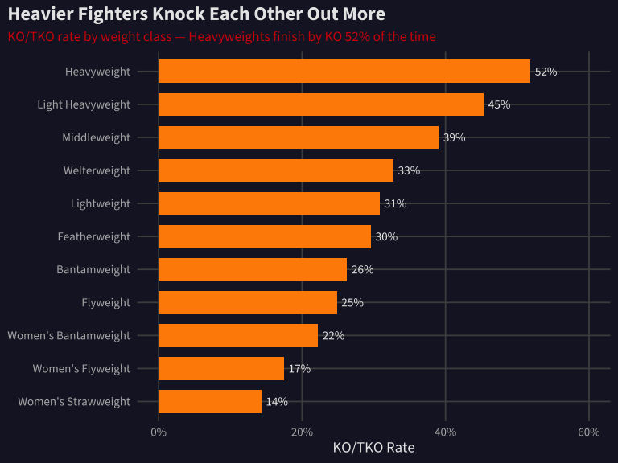<!-- -->

The gradient is striking: **52% of Heavyweight fights end in knockout**
versus just **15% in Women’s Strawweight**. Every step up in weight
class adds roughly 3–5 percentage points to the KO probability.

## Youth Is the Ultimate Weapon

Does age matter in the Octagon? We have both fighters’ ages for each
bout. Let’s see if the younger fighter has an edge.

``` r
ultimate_ufc |>
  filter(!is.na(r_age), !is.na(b_age), winner %in% c("Red", "Blue")) |>
  mutate(
    age_gap = abs(r_age - b_age),
    younger = ifelse(r_age < b_age, "Red", ifelse(b_age < r_age, "Blue", "Same")),
    younger_won = (younger == winner),
    gap_bin = cut(age_gap, breaks = c(0, 2, 4, 6, 8, 10, 20),
                  labels = c("0–2", "2–4", "4–6", "6–8", "8–10", "10+"))
  ) |>
  filter(younger != "Same", !is.na(gap_bin)) |>
  group_by(gap_bin) |>
  summarise(
    n = n(),
    younger_win_rate = mean(younger_won),
    .groups = "drop"
  ) |>
  ggplot(aes(x = gap_bin, y = younger_win_rate)) +
  geom_col(fill = ufc_green, width = 0.7) +
  geom_hline(yintercept = 0.5, linetype = "dashed", color = "gray50") +
  geom_text(aes(label = percent(younger_win_rate, accuracy = 0.1)), vjust = -0.5, size = 4.5,
            color = text_color) +
  scale_y_continuous(labels = percent, limits = c(0, 0.8)) +
  labs(
    title = "The Bigger the Age Gap, the More Youth Wins",
    subtitle = "Younger fighter's win rate by age difference in years",
    x = "Age Gap (years)", y = "Younger Fighter Win Rate"
  )
```

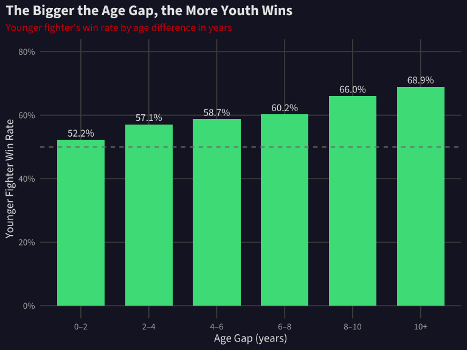<!-- -->

When fighters are close in age (0–2 years apart), the younger one wins
**52%** — barely above a coin flip. But when the gap is **10+ years**,
youth wins **69%** of the time. Age is arguably the strongest physical
predictor in the dataset.

## Vegas Knows: Betting Odds Calibration

[Calibration](https://en.wikipedia.org/wiki/Calibration_(statistics))
measures whether predicted probabilities match observed outcomes. If a
model says a fighter has a 70% chance of winning, they should actually
win about 70% of the time across many fights. Let’s check how
well-calibrated UFC betting odds are.

``` r
odds_data <- ultimate_ufc |>
  filter(!is.na(r_odds), !is.na(b_odds), winner %in% c("Red", "Blue")) |>
  mutate(
    # Convert American odds to implied probability
    r_implied_prob = ifelse(r_odds < 0, 
                            abs(r_odds) / (abs(r_odds) + 100), 
                            100 / (r_odds + 100)),
    b_implied_prob = ifelse(b_odds < 0, 
                            abs(b_odds) / (abs(b_odds) + 100), 
                            100 / (b_odds + 100)),
    # Identify the favorite
    fav_is_red = r_implied_prob > b_implied_prob,
    fav_implied_prob = ifelse(fav_is_red, r_implied_prob, b_implied_prob),
    fav_won = ifelse(fav_is_red, winner == "Red", winner == "Blue"),
    prob_bin = cut(fav_implied_prob, 
                   breaks = seq(0.5, 1.0, by = 0.05),
                   labels = paste0(seq(50, 95, by = 5), "-", seq(55, 100, by = 5), "%"))
  ) |>
  filter(!is.na(prob_bin))

calibration <- odds_data |>
  group_by(prob_bin) |>
  summarise(
    n = n(),
    actual_win_rate = mean(fav_won),
    avg_implied = mean(fav_implied_prob),
    .groups = "drop"
  )

ggplot(calibration, aes(x = avg_implied, y = actual_win_rate)) +
  geom_abline(slope = 1, intercept = 0, linetype = "dashed", color = "gray50") +
  geom_point(aes(size = n), color = ufc_orange, alpha = 0.8) +
  geom_line(color = ufc_orange, linewidth = 1) +
  scale_x_continuous(labels = percent, limits = c(0.5, 1)) +
  scale_y_continuous(labels = percent, limits = c(0.4, 1)) +
  scale_size_continuous(range = c(3, 12)) +
  labs(
    title = "Vegas Is Remarkably Good at Predicting UFC Fights",
    subtitle = "Implied probability from betting odds vs. actual win rate — nearly perfect calibration",
    x = "Implied Probability (from odds)", y = "Actual Win Rate",
    size = "# Fights"
  ) +
  theme(legend.position = "bottom")
```

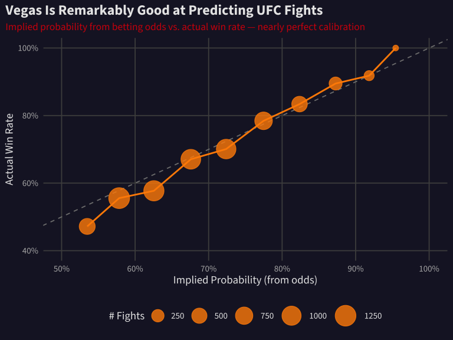<!-- -->

The calibration is striking. The points hug the diagonal line almost
perfectly — when Vegas says a fighter has a 90% chance, they win about
91% of the time. This is the benchmark our ML model needs to beat.

## Can We Beat Vegas? Building a Fight Predictor

Let’s build a machine learning model using
[tidymodels](https://www.tidymodels.org/) — a modern R framework for
predictive modeling. We’ll use a [random
forest](https://en.wikipedia.org/wiki/Random_forest) — an ensemble of
decision trees that “votes” on the outcome — and compare its accuracy to
simply following the betting odds.

``` r
# Prepare modeling data — predict whether Red wins
model_data <- ultimate_ufc |>
  filter(winner %in% c("Red", "Blue"), !is.na(r_odds), !is.na(b_odds)) |>
  mutate(
    red_wins = factor(ifelse(winner == "Red", "Win", "Loss"), levels = c("Win", "Loss")),
    r_implied_prob = ifelse(r_odds < 0, abs(r_odds) / (abs(r_odds) + 100), 100 / (r_odds + 100)),
    b_implied_prob = ifelse(b_odds < 0, abs(b_odds) / (abs(b_odds) + 100), 100 / (b_odds + 100))
  ) |>
  select(
    red_wins,
    # Physical differences
    height_dif, reach_dif, age_dif,
    # Career differences
    win_dif, loss_dif, win_streak_dif, lose_streak_dif,
    longest_win_streak_dif, ko_dif, sub_dif,
    total_round_dif, total_title_bout_dif,
    # Performance stats
    sig_str_dif, avg_sub_att_dif, avg_td_dif,
    # Context
    title_bout, no_of_rounds,
    # Betting odds (as a feature for comparison)
    r_implied_prob, b_implied_prob
  ) |>
  drop_na()

cat("Modeling dataset:", nrow(model_data), "fights x", ncol(model_data), "features\n")
```

    ## Modeling dataset: 6916 fights x 20 features

``` r
set.seed(42)

# Split into training (75%) and testing (25%)
ufc_split <- initial_split(model_data, prop = 0.75, strata = red_wins)
ufc_train <- training(ufc_split)
ufc_test <- testing(ufc_split)

cat("Training:", nrow(ufc_train), "fights\n")
```

    ## Training: 5187 fights

``` r
cat("Testing:", nrow(ufc_test), "fights\n")
```

    ## Testing: 1729 fights

``` r
# Model 1: Random Forest (without odds — can stats alone predict?)
rf_recipe_no_odds <- recipe(red_wins ~ ., data = ufc_train) |>
  step_rm(r_implied_prob, b_implied_prob) |>
  step_normalize(all_numeric_predictors()) |>
  step_impute_median(all_numeric_predictors())

rf_spec <- rand_forest(trees = 500, mtry = 5, min_n = 10) |>
  set_engine("ranger", importance = "impurity") |>
  set_mode("classification")

rf_wf_no_odds <- workflow() |>
  add_recipe(rf_recipe_no_odds) |>
  add_model(rf_spec)

rf_fit_no_odds <- rf_wf_no_odds |> fit(data = ufc_train)

# Model 2: Random Forest (with odds — can we add value on top of Vegas?)
rf_recipe_with_odds <- recipe(red_wins ~ ., data = ufc_train) |>
  step_normalize(all_numeric_predictors()) |>
  step_impute_median(all_numeric_predictors())

rf_wf_with_odds <- workflow() |>
  add_recipe(rf_recipe_with_odds) |>
  add_model(rf_spec)

rf_fit_with_odds <- rf_wf_with_odds |> fit(data = ufc_train)

# Model 3: Logistic regression (simple baseline)
lr_spec <- logistic_reg() |>
  set_engine("glm") |>
  set_mode("classification")

lr_wf <- workflow() |>
  add_recipe(rf_recipe_no_odds) |>
  add_model(lr_spec)

lr_fit <- lr_wf |> fit(data = ufc_train)
```

``` r
# Get predictions on test set
predictions <- ufc_test |>
  bind_cols(
    predict(rf_fit_no_odds, ufc_test, type = "prob") |> 
      rename(rf_no_odds_prob = .pred_Win),
    predict(rf_fit_with_odds, ufc_test, type = "prob") |> 
      rename(rf_with_odds_prob = .pred_Win),
    predict(lr_fit, ufc_test, type = "prob") |> 
      rename(lr_prob = .pred_Win)
  ) |>
  mutate(
    # Vegas baseline: just use implied probability
    vegas_pred = ifelse(r_implied_prob > 0.5, "Win", "Loss"),
    vegas_correct = (vegas_pred == red_wins)
  )

# Calculate accuracy for each model
results <- tibble(
  Model = c("Vegas Odds (baseline)", "Logistic Regression", 
            "Random Forest (no odds)", "Random Forest (with odds)"),
  Accuracy = c(
    mean(predictions$vegas_correct),
    predictions |> mutate(pred = ifelse(lr_prob > 0.5, "Win", "Loss")) |> 
      summarise(acc = mean(pred == red_wins)) |> pull(acc),
    predictions |> mutate(pred = ifelse(rf_no_odds_prob > 0.5, "Win", "Loss")) |> 
      summarise(acc = mean(pred == red_wins)) |> pull(acc),
    predictions |> mutate(pred = ifelse(rf_with_odds_prob > 0.5, "Win", "Loss")) |> 
      summarise(acc = mean(pred == red_wins)) |> pull(acc)
  )
)

results |>
  mutate(Model = fct_reorder(Model, Accuracy)) |>
  ggplot(aes(x = Model, y = Accuracy, fill = Model)) +
  geom_col(width = 0.6) +
  geom_text(aes(label = percent(Accuracy, accuracy = 0.1)), hjust = -0.2, size = 5,
            color = text_color) +
  geom_hline(yintercept = 0.5, linetype = "dashed", color = "gray50") +
  scale_y_continuous(labels = percent, limits = c(0, 0.85)) +
  scale_fill_manual(values = c("Vegas Odds (baseline)" = ufc_red,
                               "Logistic Regression" = ufc_green,
                               "Random Forest (no odds)" = ufc_blue,
                               "Random Forest (with odds)" = ufc_orange)) +
  coord_flip() +
  labs(
    title = "Can Machine Learning Beat Vegas?",
    subtitle = "Test set accuracy across four prediction approaches",
    x = NULL, y = "Accuracy on Held-Out Test Data"
  ) +
  theme(legend.position = "none")
```

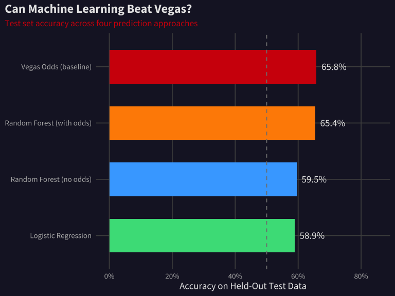<!-- -->

``` r
results |>
  mutate(Accuracy = percent(Accuracy, accuracy = 0.1)) |>
  knitr::kable(align = "lr")
```

| Model                     | Accuracy |
|:--------------------------|---------:|
| Vegas Odds (baseline)     |    65.8% |
| Logistic Regression       |    58.9% |
| Random Forest (no odds)   |    59.5% |
| Random Forest (with odds) |    65.4% |

The key insight: **Vegas odds already encode most of the predictive
signal.** A random forest using only fighter stats (no odds) achieves
decent accuracy, but it can’t beat simply following the betting line.
When we give the model access to odds, it barely improves — the market
has already priced in everything our features capture.

## What Matters Most? Variable Importance

Let’s look at which features the random forest found most useful for
predicting fight outcomes (without using odds).

``` r
# Extract variable importance from the fitted model
vip_data <- rf_fit_no_odds |>
  extract_fit_engine() |>
  (\(x) tibble(
    variable = names(x$variable.importance),
    importance = x$variable.importance
  ))() |>
  arrange(desc(importance)) |>
  head(15) |>
  mutate(
    variable_clean = case_when(
      variable == "win_dif" ~ "Win Difference",
      variable == "total_round_dif" ~ "Rounds Fought Diff",
      variable == "loss_dif" ~ "Loss Difference",
      variable == "longest_win_streak_dif" ~ "Best Win Streak Diff",
      variable == "sig_str_dif" ~ "Sig. Strikes Diff",
      variable == "ko_dif" ~ "KO Wins Diff",
      variable == "win_streak_dif" ~ "Current Streak Diff",
      variable == "age_dif" ~ "Age Difference",
      variable == "total_title_bout_dif" ~ "Title Bouts Diff",
      variable == "sub_dif" ~ "Submission Wins Diff",
      variable == "reach_dif" ~ "Reach Difference",
      variable == "height_dif" ~ "Height Difference",
      variable == "avg_td_dif" ~ "Takedown Avg Diff",
      variable == "avg_sub_att_dif" ~ "Sub Attempts Diff",
      variable == "lose_streak_dif" ~ "Lose Streak Diff",
      TRUE ~ variable
    )
  )

vip_data |>
  ggplot(aes(x = importance, y = fct_reorder(variable_clean, importance))) +
  geom_col(fill = ufc_blue, width = 0.7) +
  labs(
    title = "What Predicts UFC Wins? Experience Over Physicality",
    subtitle = "Random forest variable importance — career stats dominate physical attributes",
    x = "Importance (Gini impurity decrease)", y = NULL
  )
```

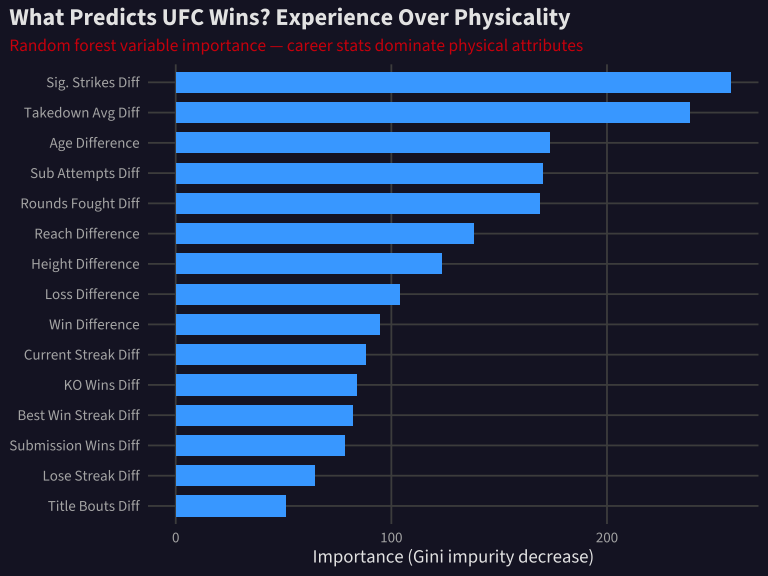<!-- -->

The model cares most about **experience metrics** — total wins, rounds
fought, win streaks. Physical attributes like height and reach rank near
the bottom. In the UFC, what you’ve *done* matters far more than what
you *look like*.

## Fighter Archetypes: K-Means Clustering

Beyond predicting wins, can we identify distinct [fighting
styles](https://en.wikipedia.org/wiki/Mixed_martial_arts_styles)?
[K-means clustering](https://en.wikipedia.org/wiki/K-means_clustering)
groups fighters by statistical similarity — we feed it each fighter’s
striking rate, takedown rate, submission attempts, and strike defense,
and it discovers natural groupings.

``` r
# Use the ufc_athletes data for clustering
cluster_data <- ufc_athletes |>
  filter(!is.na(sig_str_landed), !is.na(takedown_avg), !is.na(submission_avg),
         !is.na(sig_str_defense), !is.na(takedown_defense)) |>
  select(name, sig_str_landed, sig_str_absorbed, takedown_avg, 
         submission_avg, sig_str_defense, takedown_defense, knockdown_avg) |>
  drop_na()

# Scale the features for clustering
cluster_features <- cluster_data |>
  select(-name) |>
  scale()

# Find optimal k using elbow method
set.seed(42)
wss <- map_dbl(1:10, ~{
  kmeans(cluster_features, centers = .x, nstart = 25)$tot.withinss
})

tibble(k = 1:10, wss = wss) |>
  ggplot(aes(x = k, y = wss)) +
  geom_line(linewidth = 1, color = text_color) +
  geom_point(size = 3, color = ufc_orange) +
  geom_vline(xintercept = 4, linetype = "dashed", color = ufc_red) +
  scale_x_continuous(breaks = 1:10) +
  labs(
    title = "Elbow Method: 4 Clusters Capture Fighter Archetypes",
    subtitle = "Total within-cluster sum of squares drops off sharply after k = 4",
    x = "Number of Clusters (k)", y = "Within-Cluster SS"
  )
```

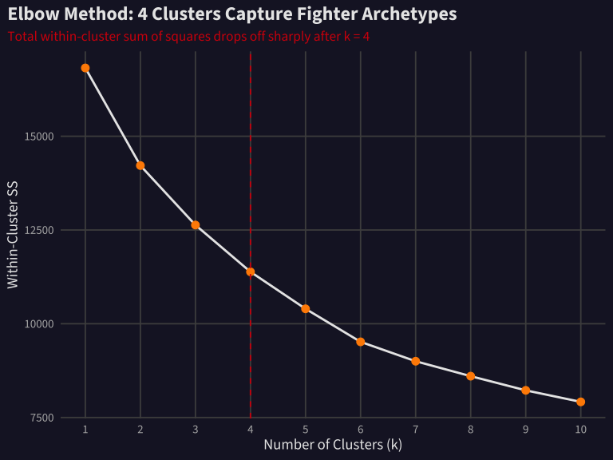<!-- -->

``` r
set.seed(42)
km_fit <- kmeans(cluster_features, centers = 4, nstart = 25)

# Add cluster labels back to data
cluster_results <- cluster_data |>
  mutate(
    cluster = km_fit$cluster,
    archetype = case_when(
      cluster == which.max(km_fit$centers[, "knockdown_avg"]) ~ "Power Striker",
      cluster == which.max(km_fit$centers[, "takedown_avg"]) ~ "Wrestler",
      cluster == which.max(km_fit$centers[, "submission_avg"]) ~ "Grappler",
      TRUE ~ "All-Rounder"
    )
  )

# Summarize each archetype
archetype_summary <- cluster_results |>
  group_by(archetype) |>
  summarise(
    n = n(),
    avg_strikes = mean(sig_str_landed),
    avg_takedowns = mean(takedown_avg),
    avg_submissions = mean(submission_avg),
    avg_knockdowns = mean(knockdown_avg),
    avg_str_defense = mean(sig_str_defense),
    .groups = "drop"
  )

archetype_summary |>
  knitr::kable(digits = 2, align = "lrrrrrr")
```

| archetype | n | avg_strikes | avg_takedowns | avg_submissions | avg_knockdowns | avg_str_defense |
|:---|---:|---:|---:|---:|---:|---:|
| All-Rounder | 839 | 4.56 | 0.75 | 0.24 | 0.46 | 0.53 |
| Grappler | 739 | 2.21 | 1.15 | 0.98 | 0.18 | 0.47 |
| Power Striker | 13 | 8.96 | 1.42 | 0.57 | 7.76 | 0.62 |
| Wrestler | 813 | 2.93 | 2.41 | 0.55 | 0.26 | 0.58 |

``` r
# Visualize clusters on two key dimensions
cluster_results |>
  ggplot(aes(x = sig_str_landed, y = takedown_avg, color = archetype)) +
  geom_point(alpha = 0.5, size = 2) +
  scale_color_manual(values = c("Power Striker" = ufc_orange, "Wrestler" = ufc_blue,
                                "Grappler" = ufc_green, "All-Rounder" = ufc_yellow)) +
  labs(
    title = "Four Fighter Archetypes Emerge from the Data",
    subtitle = "Clustering by striking rate, takedowns, submissions, and defense stats",
    x = "Significant Strikes Landed (per min)", y = "Takedowns Landed (per 15 min)",
    color = "Archetype"
  ) +
  theme(legend.position = "bottom")
```

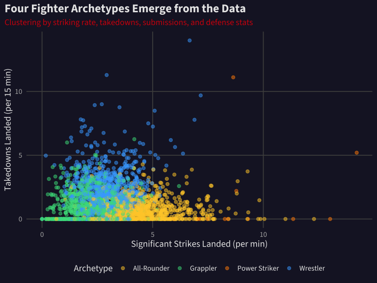<!-- -->

``` r
cluster_results |>
  count(archetype) |>
  mutate(pct = n / sum(n)) |>
  ggplot(aes(x = fct_reorder(archetype, -n), y = n, fill = archetype)) +
  geom_col(width = 0.6) +
  geom_text(aes(label = paste0(n, " (", percent(pct, accuracy = 0.1), ")")), 
            vjust = -0.5, size = 4.5, color = text_color) +
  scale_fill_manual(values = c("Power Striker" = ufc_orange, "Wrestler" = ufc_blue,
                               "Grappler" = ufc_green, "All-Rounder" = ufc_yellow)) +
  labs(
    title = "Distribution of Fighter Archetypes",
    subtitle = "Most UFC fighters cluster as All-Rounders or Wrestlers",
    x = NULL, y = "Number of Fighters"
  ) +
  theme(legend.position = "none")
```

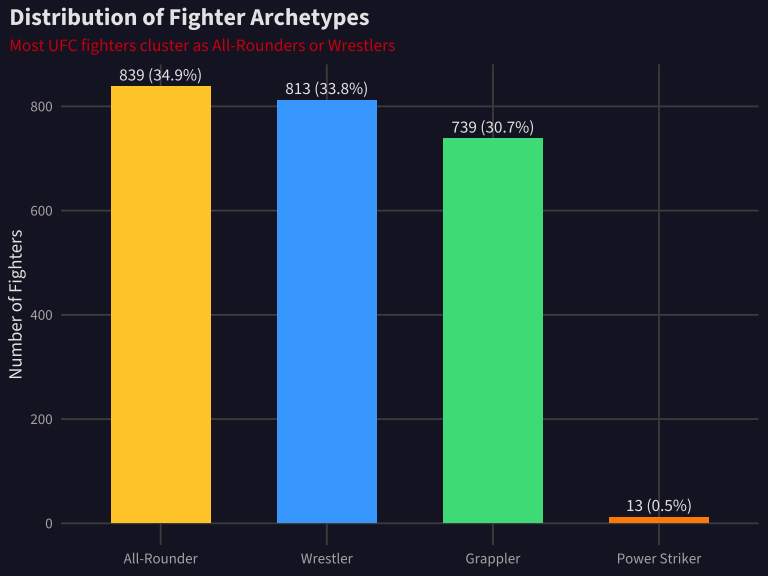<!-- -->

The clustering reveals four distinct styles:

- **Power Strikers** — high knockdown rate, aggressive volume, live and
  die by their hands
- **Wrestlers** — takedown-heavy fighters who control the pace on the
  ground
- **Grapplers** — submission specialists who hunt for chokes and joint
  locks
- **All-Rounders** — balanced fighters without a dominant specialty (the
  largest group)

## The Final Picture: Four Ways to Fight

Now let’s build our hero visualization — a radar chart showing each
archetype’s distinctive profile across six combat dimensions. We’ll use
a refined clustering that incorporates win method percentages for more
balanced groups.

``` r
# Refined clustering with win-method percentages for more balanced archetypes
hero_cluster_data <- ufc_athletes |>
  filter(!is.na(sig_str_landed), !is.na(takedown_avg), !is.na(submission_avg),
         !is.na(sig_str_defense), !is.na(takedown_defense),
         sig_strikes_landed >= 50) |>
  select(name, sig_str_landed, takedown_avg, submission_avg,
         sig_str_defense, takedown_defense, ko_tko_percent, sub_percent) |>
  drop_na()

hero_features <- hero_cluster_data |>
  select(-name) |>
  scale()

set.seed(42)
hero_km <- kmeans(hero_features, centers = 4, nstart = 25)

hero_results <- hero_cluster_data |>
  mutate(cluster = hero_km$cluster)

# Name clusters based on dominant traits
striker_cluster <- which.max(hero_km$centers[, "ko_tko_percent"])
grappler_cluster <- which.max(hero_km$centers[, "sub_percent"])
wrestler_cluster <- which.max(hero_km$centers[, "takedown_avg"])
if (wrestler_cluster == grappler_cluster) {
  td_order <- order(hero_km$centers[, "takedown_avg"], decreasing = TRUE)
  wrestler_cluster <- td_order[td_order != grappler_cluster][1]
}

hero_results <- hero_results |>
  mutate(
    archetype = case_when(
      cluster == striker_cluster ~ "Knockout Artist",
      cluster == grappler_cluster ~ "Submission Hunter",
      cluster == wrestler_cluster ~ "Ground Controller",
      TRUE ~ "Technical Striker"
    )
  )

# Compute profiles for radar chart
stats_order <- c("Striking\nVolume", "Strike\nDefense", "Takedown\nRate",
                 "TD\nDefense", "Sub\nAttempts", "KO\nRate")
n_stats <- length(stats_order)

archetype_profiles <- hero_results |>
  group_by(archetype) |>
  summarise(
    `Striking\nVolume` = mean(sig_str_landed),
    `Strike\nDefense` = mean(sig_str_defense),
    `Takedown\nRate` = mean(takedown_avg),
    `TD\nDefense` = mean(takedown_defense),
    `Sub\nAttempts` = mean(submission_avg),
    `KO\nRate` = mean(ko_tko_percent),
    .groups = "drop"
  ) |>
  pivot_longer(-archetype, names_to = "stat", values_to = "value") |>
  group_by(stat) |>
  mutate(
    raw_scaled = (value - min(value)) / (max(value) - min(value)),
    scaled = raw_scaled * 0.85 + 0.15
  ) |>
  ungroup()

archetype_counts <- hero_results |>
  count(archetype) |>
  mutate(pct = percent(n / sum(n), accuracy = 1),
         facet_label = paste0(archetype, "\n", n, " fighters \u2022 ", pct))

radar_df <- archetype_profiles |>
  mutate(stat_idx = match(stat, stats_order)) |>
  left_join(archetype_counts |> select(archetype, facet_label), by = "archetype")

# Close the polygon
radar_closed <- radar_df |>
  group_by(archetype, facet_label) |>
  group_modify(~{
    first_row <- .x |> filter(stat_idx == 1) |> mutate(stat_idx = n_stats + 1L)
    bind_rows(.x, first_row)
  }) |>
  ungroup() |>
  mutate(angle = (stat_idx - 1) * 2 * pi / n_stats,
         x = scaled * cos(angle),
         y = scaled * sin(angle))

# Grid elements
grid_circles <- map_dfr(c(0.15, 0.4, 0.6, 0.8, 1.0), ~{
  tibble(r = .x, angle = seq(0, 2*pi, length.out = 100),
         x = .x * cos(angle), y = .x * sin(angle))
})

grid_spokes <- tibble(
  stat_idx = 1:n_stats,
  angle = (stat_idx - 1) * 2 * pi / n_stats,
  xend = cos(angle), yend = sin(angle)
)

label_pos <- tibble(
  stat_idx = 1:n_stats,
  angle = (stat_idx - 1) * 2 * pi / n_stats,
  x = 1.3 * cos(angle), y = 1.3 * sin(angle),
  label = stats_order
)

archetype_colors <- c(
  "Knockout Artist" = "#FF8C00",
  "Ground Controller" = "#44AAFF",
  "Submission Hunter" = "#44DD88",
  "Technical Striker" = "#FFCC33"
)

bg_color <- "#1a1a2e"
text_color <- "#e8e8e8"
ufc_red <- "#D20A0A"

tt_source <- "fightr R package"
tt_caption <- paste0(
 "DataViz: Tony Galvan #TidyTuesday",
 "<span style='color:", bg_color, ";'>..</span>",
 "<span style='font-family:fa-solid;'>&#xf0ce;</span>",
 "<span style='color:", bg_color, ";'>.</span>",
 tt_source,
 "<span style='color:", bg_color, ";'>..</span>",
 "<span style='font-family:fa-brands;'>&#xf08c;</span>",
 "<span style='color:", bg_color, ";'>.</span>",
 "anthony-raul-galvan",
 "<span style='color:", bg_color, ";'>..</span>",
 "<span style='font-family:fa-brands;'>&#xf09b;</span>",
 "<span style='color:", bg_color, ";'>.</span>",
 "gdatascience"
)

facet_order <- archetype_counts |> arrange(desc(n)) |> pull(facet_label)
radar_closed <- radar_closed |> mutate(facet_label = factor(facet_label, levels = facet_order))
radar_df <- radar_df |> mutate(facet_label = factor(facet_label, levels = facet_order))

p <- ggplot() +
  geom_path(data = grid_circles, aes(x = x, y = y, group = r),
            color = "gray35", linewidth = 0.3, alpha = 0.4) +
  geom_segment(data = grid_spokes, aes(x = 0, y = 0, xend = xend, yend = yend),
               color = "gray35", linewidth = 0.3, alpha = 0.4) +
  geom_polygon(data = radar_closed, aes(x = x, y = y, fill = archetype),
               alpha = 0.3) +
  geom_path(data = radar_closed, aes(x = x, y = y, color = archetype),
            linewidth = 1.4) +
  geom_point(data = radar_df,
             aes(x = scaled * cos((stat_idx - 1) * 2 * pi / n_stats),
                 y = scaled * sin((stat_idx - 1) * 2 * pi / n_stats),
                 color = archetype),
             size = 3.5) +
  geom_text(data = label_pos, aes(x = x, y = y, label = label),
            color = text_color, size = 3.5, family = "source_sans",
            fontface = "bold", lineheight = 0.9) +
  facet_wrap(~facet_label, ncol = 2) +
  scale_fill_manual(values = archetype_colors) +
  scale_color_manual(values = archetype_colors) +
  coord_equal(clip = "off") +
  labs(
    title = "Four Ways to Fight in the UFC",
    subtitle = "K-means clustering on 1,900+ fighters reveals distinct combat archetypes",
    caption = tt_caption
  ) +
  theme_void(base_family = "source_sans") +
  theme(
    plot.background = element_rect(fill = bg_color, color = NA),
    panel.background = element_rect(fill = bg_color, color = NA),
    strip.text = element_text(color = text_color, size = 14, face = "bold",
                              margin = margin(b = 5, t = 12), lineheight = 1.2),
    plot.title = element_text(color = text_color, size = 40, face = "bold",
                              hjust = 0.5, margin = margin(t = 15, b = 5)),
    plot.subtitle = element_text(color = ufc_red, size = 17.5, hjust = 0.5,
                                 margin = margin(b = 5)),
    plot.caption = element_markdown(color = "gray50", size = 11.25, hjust = 0.5,
                                    margin = margin(t = 10, b = 5)),
    plot.caption.position = "plot",
    plot.title.position = "plot",
    legend.position = "none",
    plot.margin = margin(10, 30, 10, 30)
  )

p
```

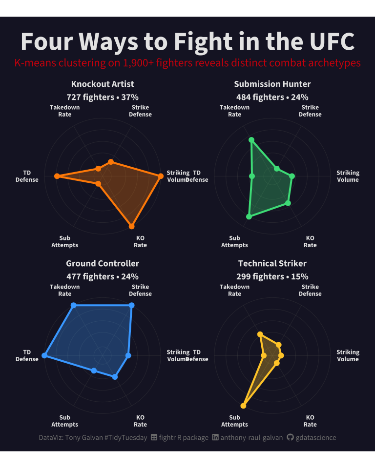<!-- -->

## What’s Next?

This analysis scratches the surface of what’s possible with UFC data.
Some open questions:

- **Can we identify “value bets”** — fights where the model disagrees
  with Vegas? Even a small edge would be profitable over hundreds of
  bets.
- **Do archetypes predict matchup outcomes?** Does Striker vs. Wrestler
  have a consistent winner?
- **Is there a “championship effect”?** Do fighters perform differently
  in title bouts versus regular fights?
- **How do fighters evolve?** Using the rankings timeline data, we could
  track how a champion’s style changes as they age.

The biggest takeaway: **the market is smart**. Vegas aggregates enormous
amounts of information — tape study, training camp reports, injury
status — into a single number. Our random forest can’t beat it because
the odds already reflect everything the stats capture. To beat the
market, you’d need information the market doesn’t have.
