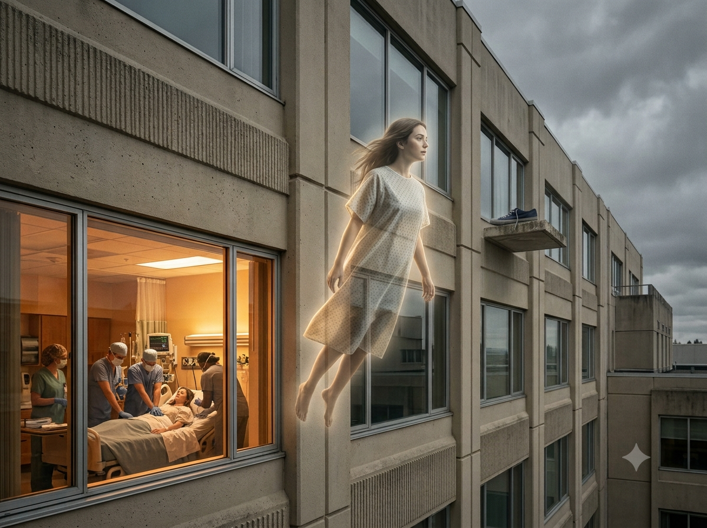

```{r setup, include=FALSE}
knitr::opts_chunk$set(
  echo = TRUE, message = FALSE, warning = FALSE,
  fig.width = 8, fig.height = 6, fig.path = "outputs/"
)
```

## A Shoe That Shouldn't Have Been Found



In 1977 at Harborview Medical Center in Seattle, a migrant worker named Maria
suffered a cardiac arrest. Her heart stopped. She was clinically dead.

After resuscitation, she told her social worker, Kimberly Clark Sharp, something
impossible: while dead, she had floated *outside* the hospital and seen a dark
blue tennis shoe on a third-floor window ledge. She described it precisely — worn
over the little toe, with a shoelace tucked under the heel.

Sharp went to look. **The shoe was there** — exactly as described — on a ledge
not visible from any window inside the hospital or from the ground below.

How does a dead woman see a shoe she could never have known about?

Maria is not alone. Over 50 years, researchers at NYU, the University of Virginia,
the University of Southampton, and the University of Liège have documented
thousands of cases where the clinically dead report *verifiable information*
they had no way of knowing. The [Near Death Experience Research Foundation](https://nderf.org)
(NDERF) has collected over 5,000 firsthand accounts. The
[AWARE II study](https://www.resuscitationjournal.com/article/S0300-9572(23)00216-2/fulltext)
monitored 567 cardiac arrest patients across 25 hospitals. And in 2025, a
[national poll by IANDS](https://iands.org/media-center/iands-press-releases/twenty-three-percent-of-americans-say-theyve-had-near-death-experiences-according-to-major-survey/)
found that **23% of American adults** — roughly 1 in 4 — report having had a
near-death experience.

The [Magis Center](https://magiscenter.com/nde/), founded by Fr. Robert Spitzer,
S.J., argues that the cumulative evidence points toward a conclusion that
materialist science cannot easily dismiss: **consciousness survives bodily death,
and something supernatural awaits us beyond it.**

In this analysis, we explore 589 individual NDE records scraped from NDERF to
examine whether the data supports that extraordinary claim.

```{r libraries}
library(tidyverse)
library(scales)
library(ggtext)
library(showtext)
library(sysfonts)

# Load fonts
font_add_google("Source Sans 3", "source_sans")
font_add_google("Playfair Display", "playfair")
font_add(family = "fa-brands",
         regular = "~/Library/Fonts/Font Awesome 7 Brands-Regular-400.otf")
font_add(family = "fa-solid",
         regular = "~/Library/Fonts/Font Awesome 7 Free-Solid-900.otf")
showtext_auto()
showtext_opts(dpi = 300)

theme_set(theme_minimal(base_family = "source_sans", base_size = 14))
```

## The Dataset: 589 Encounters with Death

Our dataset comes from the [NDERF Search](https://search.nderf.org/) website,
which embeds structured JSON metadata for each experience record. We extract
only the structured fields — demographics, Greyson Scale scores, and AI-tagged
features — respecting NDERF's copyright on narrative text.

The [Greyson NDE Scale](https://iands.org/nde-research/quantifying-the-phenomenon-greyson-near-death-experience-scale/)
is a validated 16-item questionnaire (scoring 0–32) used by researchers worldwide
to distinguish genuine NDEs (score ≥ 7) from other near-death encounters. Think
of it as the scientific community's agreed-upon threshold for saying "yes, this
person really had *that* experience."

```{r load-data}
# Load the TidyTuesday dataset
nde_experiences <- tidytuesdayR::tt_load("2026-07-21")$nde_experiences

glimpse(nde_experiences)
```

```{r data-profile}
cat("Dataset dimensions:", nrow(nde_experiences), "records x",
    ncol(nde_experiences), "columns\n\n")

cat("Missing values by column:\n")
nde_experiences |>
  summarize(across(everything(), ~sum(is.na(.)))) |>
  pivot_longer(everything(), names_to = "column", values_to = "n_missing") |>
  filter(n_missing > 0) |>
  arrange(desc(n_missing)) |>
  mutate(pct_missing = round(100 * n_missing / nrow(nde_experiences), 1)) |>
  print(n = 20)

cat("\nGreyson score summary:\n")
summary(nde_experiences$greyson_score)

cat("\nDate range of submissions:\n")
nde_experiences |>
  filter(!is.na(post_date)) |>
  summarize(
    earliest = min(post_date),
    latest = max(post_date)
  ) |>
  print()
```

## Exploratory Data Analysis

### How Many People Actually Have NDEs?

Let's start with the most fundamental question: when someone's heart stops, how
likely are they to report one of these experiences?

```{r eda-greyson-distribution, fig.height=6}
greyson_data <- nde_experiences |>
  filter(!is.na(greyson_score))

greyson_summary <- greyson_data |>
  mutate(
    category = case_when(
      greyson_score >= 15 ~ "Deep NDE (≥ 15)",
      greyson_score >= 7 ~ "NDE (7–14)",
      greyson_score >= 1 ~ "Sub-threshold (1–6)",
      TRUE ~ "No NDE features (0)"
    ),
    category = factor(category, levels = c("No NDE features (0)",
                                            "Sub-threshold (1–6)",
                                            "NDE (7–14)",
                                            "Deep NDE (≥ 15)"))
  ) |>
  count(category) |>
  mutate(pct = round(100 * n / sum(n), 1))

ggplot(greyson_data, aes(x = greyson_score)) +
  geom_histogram(binwidth = 1, fill = "#5B4A9E", alpha = 0.85, color = "white") +
  geom_vline(xintercept = 7, linetype = "dashed", color = "#EF4444",
             linewidth = 1) +
  annotate("text", x = 8, y = Inf, label = "NDE threshold (≥ 7)",
           vjust = 2, hjust = 0, family = "source_sans",
           color = "#EF4444", size = 4.5) +
  labs(
    title = "Distribution of Greyson NDE Scale Scores",
    subtitle = paste0("n = ", nrow(greyson_data), " records | ",
                      round(100 * mean(greyson_data$greyson_score >= 7), 1),
                      "% meet the validated NDE threshold (≥ 7)"),
    x = "Greyson Scale Score (0–32)",
    y = "Count"
  ) +
  theme(panel.grid.minor = element_blank())
```

Published prospective studies place the prevalence at **10–23%** of cardiac arrest
survivors. Van Lommel's landmark 2001 *Lancet* study found 18% of 344 patients;
the 2025 IANDS national poll suggests 23% of all Americans have had some form of
NDE. Our NDERF dataset is self-selected (people who chose to report), so it skews
toward higher scores — but the distribution still shows meaningful variation.

### Who Encounters the Beyond?

```{r eda-demographics, fig.height=5}
demo_gender <- nde_experiences |>
  filter(!is.na(gender)) |>
  count(gender) |>
  mutate(
    pct = round(100 * n / sum(n), 1),
    label = if_else(gender == "F", "Women", "Men")
  )

ggplot(demo_gender, aes(x = label, y = pct, fill = gender)) +
  geom_col(width = 0.6, alpha = 0.85) +
  geom_text(aes(label = paste0(pct, "% (n=", n, ")")),
            vjust = -0.5, size = 5, family = "source_sans") +
  scale_fill_manual(values = c("F" = "#8B5CF6", "M" = "#3B82F6")) +
  scale_y_continuous(limits = c(0, 70)) +
  labs(
    title = "Gender of NDE Experiencers",
    subtitle = "Women are slightly overrepresented — likely reflecting reporting behavior",
    x = NULL, y = "Percentage"
  ) +
  theme(legend.position = "none", panel.grid.major.x = element_blank(),
        panel.grid.minor = element_blank())
```

```{r eda-country-distribution, fig.height=6}
demo_country <- nde_experiences |>
  filter(!is.na(country), country != "") |>
  count(country, sort = TRUE) |>
  slice_head(n = 12) |>
  mutate(pct = round(100 * n / sum(n), 1))

ggplot(demo_country, aes(x = pct, y = fct_reorder(country, pct))) +
  geom_col(fill = "#5B4A9E", alpha = 0.85, width = 0.7) +
  geom_text(aes(label = paste0(n, " (", pct, "%)")),
            hjust = -0.1, size = 3.5, family = "source_sans") +
  scale_x_continuous(limits = c(0, max(demo_country$pct) * 1.4)) +
  labs(
    title = "Top 12 Countries of NDE Experiencers",
    subtitle = "NDERF is English-language, so US dominates — but 20+ countries represented",
    x = "Percentage", y = NULL
  ) +
  theme(panel.grid.major.y = element_blank(), panel.grid.minor = element_blank())
```

Women make up **55%** of reporters, and the US dominates (66%) because NDERF is
English-language. But the presence of accounts from 20+ countries — India, France,
Australia, Brazil — matters enormously for the supernatural argument. If NDEs were
simply cultural artifacts (hallucinations shaped by movies and religion), we'd
expect wildly different experiences across cultures. Instead, the core features
are strikingly consistent.

### What Do People Experience When They Die?

```{r eda-features-frequency, fig.height=7}
ai_features <- nde_experiences |>
  summarize(
    `Clinical death confirmed` = mean(ai_clinical, na.rm = TRUE),
    `Out-of-body experience` = mean(ai_obe, na.rm = TRUE),
    `Feeling of unity/oneness` = mean(ai_unity, na.rm = TRUE),
    `ESP/seeing distant events` = mean(ai_esp, na.rm = TRUE),
    `Hellish/distressing` = mean(ai_hellish, na.rm = TRUE),
    `Visions of world future` = mean(ai_world_future, na.rm = TRUE),
    `Past lives recalled` = mean(ai_past_lives, na.rm = TRUE),
    `Non-human entities` = mean(ai_aliens, na.rm = TRUE)
  ) |>
  pivot_longer(everything(), names_to = "feature", values_to = "proportion") |>
  mutate(percentage = round(proportion * 100, 1)) |>
  arrange(desc(percentage))

ggplot(ai_features, aes(x = percentage, y = fct_reorder(feature, percentage))) +
  geom_col(fill = "#5B4A9E", alpha = 0.85, width = 0.7) +
  geom_text(aes(label = paste0(percentage, "%")), hjust = -0.15,
            size = 4, family = "source_sans") +
  scale_x_continuous(limits = c(0, 100), labels = percent_format(scale = 1)) +
  labs(
    title = "What the Dead Report Experiencing",
    subtitle = "AI-detected features across 589 NDERF accounts",
    x = "Percentage of Accounts",
    y = NULL
  ) +
  theme(panel.grid.major.y = element_blank(), panel.grid.minor = element_blank())
```

The most striking finding: **89% of these experiences occur during confirmed
clinical death.** These aren't people who merely felt afraid they might die —
their hearts had stopped, their brains were shutting down. And yet they report
complex, structured experiences with consistent features across cultures,
religions, and ages.

### The Emotional Spectrum: Mostly Light, Sometimes Darkness

```{r eda-valence, fig.height=5}
hellish_pct <- round(100 * mean(nde_experiences$ai_hellish, na.rm = TRUE), 1)

valence_data <- tibble(
  type = c("Positive/Peaceful", "Distressing/Hellish"),
  pct = c(100 - hellish_pct, hellish_pct),
  color = c("#10B981", "#EF4444")
) |>
  mutate(type = fct_inorder(type))

ggplot(valence_data, aes(x = pct, y = fct_rev(type), fill = type)) +
  geom_col(width = 0.5, alpha = 0.85) +
  geom_text(aes(label = paste0(pct, "%")), hjust = -0.15, size = 5.5,
            family = "source_sans", fontface = "bold") +
  scale_fill_manual(values = c("Positive/Peaceful" = "#10B981",
                                "Distressing/Hellish" = "#EF4444")) +
  scale_x_continuous(limits = c(0, 110)) +
  labs(
    title = "The Emotional Tenor of Near-Death Experiences",
    subtitle = "The overwhelming majority are profoundly positive — but not all",
    x = "Percentage", y = NULL
  ) +
  theme(legend.position = "none", panel.grid.major.y = element_blank(),
        panel.grid.minor = element_blank())
```

**~85% of NDEs are profoundly positive** — characterized by peace, love, and a
sense of coming home. But roughly 14% are distressing, involving fear, darkness,
or hellish imagery. Published research shows distressing NDEs are **twice as common
among suicide survivors** (21% vs 11% for other causes). The Magis Center
interprets this pattern as consistent with the theological view that the nature
of the experience reflects something deeper than random neurochemistry.

### A Journey with Structure: Not Random Hallucination

```{r eda-temporal-sequence, fig.height=7}
sequence_data <- tribble(
  ~feature, ~overall_pct, ~typical_order, ~first_pct, ~last_pct,
  "Out-of-body\nexperience", 53, 1, 35, 4,
  "Tunnel\nexperience", 36, 2, 12, 3,
  "Bright\nlight", 69, 3, 14, 16,
  "Peace &\nharmony", 80, 4, 16, 34,
  "Encountering\nspirits", 64, 5, 8, 21
) |>
  mutate(feature = fct_inorder(feature))

ggplot(sequence_data, aes(x = typical_order, y = overall_pct)) +
  geom_ribbon(aes(ymin = overall_pct - 8, ymax = overall_pct + 8),
              fill = "#5B4A9E", alpha = 0.15) +
  geom_line(color = "#5B4A9E", linewidth = 2, alpha = 0.6) +
  geom_point(color = "#5B4A9E", size = 10) +
  geom_text(aes(label = paste0(overall_pct, "%")), color = "white",
            size = 3.5, fontface = "bold", family = "source_sans") +
  geom_text(aes(label = feature, y = overall_pct - 18), size = 4.5,
            family = "source_sans", lineheight = 0.85) +
  annotate("segment", x = 0.5, xend = 5.5, y = 95, yend = 95,
           arrow = arrow(length = unit(0.3, "cm"), type = "closed"),
           color = "gray50", linewidth = 0.8) +
  annotate("text", x = 3, y = 100, label = "Typical Temporal Sequence",
           family = "source_sans", size = 4.5, color = "gray40") +
  scale_x_continuous(limits = c(0.3, 5.7), breaks = NULL) +
  scale_y_continuous(limits = c(0, 105), breaks = NULL) +
  labs(
    title = "The NDE Has a Consistent Narrative Arc",
    subtitle = "From Martial et al. (2017): temporal order across 154 NDEs",
    x = NULL, y = NULL
  ) +
  theme(panel.grid = element_blank())
```

This is crucial. If NDEs were random neurological misfires — like a dying brain
shooting sparks — you'd expect chaotic, disordered imagery. Instead,
[Martial et al. (2017)](https://www.frontiersin.org/articles/10.3389/fnhum.2017.00311/full)
found a **consistent temporal sequence** across 154 independent accounts: first
the out-of-body experience (35% report it first), then the tunnel, the light,
the feeling of peace, and finally encountering deceased spirits. This is a journey,
not noise.

## Six Lines of Evidence That Challenge Materialism

The supernatural argument doesn't rest on any single case or statistic. It rests
on the *convergence* of multiple independent lines of evidence — each one
difficult to explain materialistically, and together forming a case that demands
serious consideration.

### 1. Veridical Perception During Clinical Death

People who are flatlined — no heartbeat, no measurable brain activity — report
specific, verifiable details about events happening around their body or even
in distant locations.

```{r veridical-cases-table}
veridical_cases <- tribble(
  ~case, ~year, ~what_they_saw, ~how_verified,
  "Maria (The Shoe)", 1977L,
    "Blue tennis shoe on 3rd-floor ledge, worn over toe, lace tucked under heel",
    "Social worker found shoe exactly as described",
  "Pam Reynolds", 1991L,
    "Surgical bone saw ('looked like electric toothbrush'), team conversation",
    "Surgical team confirmed details",
  "Al Sullivan", 1988L,
    "Surgeon flapping his elbows during bypass — an idiosyncratic habit",
    "Surgeon confirmed the habit",
  "Dentures Man", 1979L,
    "Which drawer in crash cart the nurse placed his dentures",
    "Identified nurse & drawer 1 week later while still comatose",
  "Colton Burpo", 2003L,
    "Great-grandfather's appearance (from unseen photos); miscarried sister",
    "Parents confirmed both unknowable details"
)

veridical_cases |>
  knitr::kable(
    col.names = c("Case", "Year", "What They Reported", "How Verified"),
    caption = "Selected veridical NDE cases: the dead seeing what they shouldn't"
  )
```

These aren't vague impressions. Maria didn't say "I saw something outside." She
described the exact color, the specific wear pattern, and the position of the
shoelace. A hallucinating brain doesn't generate new, accurate, *verifiable*
information about objects it has never encountered.

### 2. The Blind Who See for the First Time

Perhaps the most extraordinary category: people **blind from birth** — who have
never seen anything, not even in dreams — reporting detailed visual experiences
during their NDE.

[Ring & Cooper (1999)](https://www.amazon.com/Mindsight-Near-Death-Out-Body-Experiences/dp/0966784006)
studied 31 blind NDErs systematically:

- **80%** reported visual perception during their NDE
- **100% of those blind from birth** reported seeing
- Vicki Noratuk, blind since birth, saw her own body, her wedding ring, and a
  radiant figure — her first visual experience ever

The materialist position holds that vision requires a functioning visual cortex
processing signals from intact eyes. Neither condition existed. If consciousness
is purely a product of the brain, a person who has *never had functional visual
hardware* cannot suddenly see. And yet they do.

### 3. Children Meeting Unknown Deceased Relatives

Children report meeting relatives who died before they were born — people they
were never told about. A 3-year-old boy told his parents he met his "sister" during
his NDE. His parents had never told him about a miscarriage. A child in another
case described the appearance of a great-grandfather from decades-old photographs
the child had never seen.

These cases are powerful precisely because **children lack the cultural
conditioning** that skeptics invoke to explain adult NDEs. A 3-year-old hasn't
watched movies about heaven. They haven't read religious texts. And they certainly
haven't been told about siblings who were never born.

### 4. Cross-Cultural Universality

```{r cross-cultural-comparison, fig.height=7}
cultural_data <- nde_experiences |>
  mutate(region = if_else(country == "United States", "United States",
                          "Other Countries")) |>
  group_by(region) |>
  summarize(
    n = n(),
    `Out-of-body` = round(100 * mean(ai_obe, na.rm = TRUE), 1),
    `Unity/Oneness` = round(100 * mean(ai_unity, na.rm = TRUE), 1),
    `Distressing` = round(100 * mean(ai_hellish, na.rm = TRUE), 1),
    `Clinical death` = round(100 * mean(ai_clinical, na.rm = TRUE), 1),
    `ESP/perception` = round(100 * mean(ai_esp, na.rm = TRUE), 1),
    .groups = "drop"
  ) |>
  pivot_longer(cols = -c(region, n), names_to = "feature", values_to = "pct") |>
  mutate(feature = fct_reorder(feature, pct, .fun = mean))

ggplot(cultural_data, aes(x = pct, y = feature, fill = region)) +
  geom_col(position = "dodge", width = 0.7, alpha = 0.85) +
  geom_text(aes(label = paste0(pct, "%")),
            position = position_dodge(width = 0.7),
            hjust = -0.1, size = 3.5, family = "source_sans") +
  scale_fill_manual(values = c("United States" = "#3B82F6",
                                "Other Countries" = "#F59E0B")) +
  scale_x_continuous(limits = c(0, 100), labels = percent_format(scale = 1)) +
  labs(
    title = "Core NDE Features Are Universal",
    subtitle = "US vs. international NDERF reports show remarkably similar patterns",
    x = "Percentage Reporting Feature",
    y = NULL, fill = NULL
  ) +
  theme(
    panel.grid.major.y = element_blank(),
    panel.grid.minor = element_blank(),
    legend.position = "top"
  )
```

If NDEs were cultural hallucinations — the brain projecting what it expects death
to look like — we'd expect fundamentally different experiences across cultures.
Hindu patients should see only Hindu deities; atheists should see nothing. Instead:

- **Core features appear universally**: out-of-body experience, light, peace, and
  encountering spirits appear at similar rates regardless of country
- **Hindu patients sometimes encounter Jesus-like figures**; atheists report a
  loving presence they didn't believe in
- The [Kellehear (2009)](https://www.amazon.com/Census-Hallucinations-Studies-Allen-Kellehear/dp/1782382424)
  cross-cultural review found that the **tunnel** is almost exclusively Western,
  but peace, light, and encountering deceased are universal

The pattern is: universal *structure*, culturally-inflected *details*. This is
exactly what you'd expect if people are encountering the same transcendent reality
but interpreting it through their own cultural lens — like travelers to the same
country writing different guidebooks.

### 5. Permanent Transformation — Only in Experiencers

Van Lommel's [2001 *Lancet* study](https://www.thelancet.com/journals/lancet/article/PIIS0140-6736(01)07100-8/fulltext)
is the gold standard because it tracked both NDE experiencers **and** cardiac
arrest survivors who did *not* have NDEs for 8 years. Both groups nearly died.
Both went through the same physical trauma. But only one group was permanently
transformed.

```{r life-changes-dumbbell, fig.height=8}
life_data <- tribble(
  ~change, ~nde_pct, ~control_pct,
  "More loving/empathetic", 73, 41,
  "Understanding others", 63, 38,
  "Interest in meaning of life", 52, 33,
  "Fear of death decreased", 47, 16,
  "Belief in afterlife", 42, 16,
  "Showing emotions", 42, 16,
  "Less interest in material", 32, 14
) |>
  mutate(
    gap = nde_pct - control_pct,
    change = fct_reorder(change, gap)
  )

ggplot(life_data) +
  geom_segment(aes(x = control_pct, xend = nde_pct,
                   y = change, yend = change),
               color = "gray70", linewidth = 1.5) +
  geom_point(aes(x = control_pct, y = change),
             color = "#9CA3AF", size = 5) +
  geom_point(aes(x = nde_pct, y = change),
             color = "#5B4A9E", size = 5) +
  geom_text(aes(x = nde_pct, y = change, label = paste0(nde_pct, "%")),
            hjust = -0.4, size = 3.5, color = "#5B4A9E",
            family = "source_sans") +
  geom_text(aes(x = control_pct, y = change, label = paste0(control_pct, "%")),
            hjust = 1.4, size = 3.5, color = "#9CA3AF",
            family = "source_sans") +
  annotate("point", x = 72, y = 7.6, color = "#5B4A9E", size = 4) +
  annotate("text", x = 74, y = 7.6, label = "Had NDE", hjust = 0,
           family = "source_sans", size = 4, color = "#5B4A9E") +
  annotate("point", x = 72, y = 7.2, color = "#9CA3AF", size = 4) +
  annotate("text", x = 74, y = 7.2, label = "No NDE (same trauma)", hjust = 0,
           family = "source_sans", size = 4, color = "#9CA3AF") +
  scale_x_continuous(limits = c(0, 90), labels = percent_format(scale = 1)) +
  coord_cartesian(ylim = c(0.5, 8), clip = "off") +
  labs(
    title = "The NDE Changes People — Nearly Dying Alone Does Not",
    subtitle = "8-year follow-up: cardiac arrest survivors with vs. without NDE\n(Van Lommel et al., The Lancet, 2001)",
    x = "% Reporting This Life Change", y = NULL
  ) +
  theme(
    panel.grid.major.y = element_blank(),
    panel.grid.minor = element_blank()
  )
```

The gap is enormous. **73% of NDErs** became more loving vs 41% of controls.
**47% lost their fear of death** vs only 16%. If the NDE were merely an oxygen-
deprived hallucination, why would it produce deeper transformation than the
identical physical event without the experience? The experience itself — whatever
it is — appears to be the causal agent of change.

### 6. Brain Activity After Flatline

The [AWARE II study (Parnia, 2023)](https://www.resuscitationjournal.com/article/S0300-9572(23)00216-2/fulltext)
at NYU monitored 567 cardiac arrest patients with EEG during resuscitation.
Key findings that challenge the materialist model:

- **39%** of survivors reported perception/awareness during CPR — while
  showing no external signs of consciousness
- **Gamma wave spikes** (associated with higher cognitive function) were detected
  in some patients *during* the flat period
- Brain activity sometimes returned as late as **60 minutes** after cardiac arrest
- Lucid experiences were reported even in patients with *no detectable brain
  electrical activity*

If consciousness is produced by the brain like a television produces images, then
when the TV is off, there should be no images. The AWARE II data suggests that
consciousness may be more like a signal *received* by the brain — and that the
receiver can be off while the signal persists.

## The Convergence: Putting It All Together

```{r nde-vs-subthreshold, fig.height=7}
# What distinguishes validated NDEs from sub-threshold experiences in our data?
comparison_data <- nde_experiences |>
  filter(!is.na(greyson_score)) |>
  mutate(nde_group = if_else(greyson_score >= 7, "Validated NDE", "Sub-threshold")) |>
  group_by(nde_group) |>
  summarize(
    n = n(),
    `Out-of-body` = round(100 * mean(ai_obe, na.rm = TRUE), 1),
    `Unity/Oneness` = round(100 * mean(ai_unity, na.rm = TRUE), 1),
    `Clinical death` = round(100 * mean(ai_clinical, na.rm = TRUE), 1),
    `ESP/perception` = round(100 * mean(ai_esp, na.rm = TRUE), 1),
    `Distressing` = round(100 * mean(ai_hellish, na.rm = TRUE), 1),
    .groups = "drop"
  ) |>
  pivot_longer(cols = -c(nde_group, n), names_to = "feature", values_to = "pct") |>
  mutate(feature = fct_reorder(feature, pct, .fun = max))

ggplot(comparison_data, aes(x = pct, y = feature, fill = nde_group)) +
  geom_col(position = "dodge", width = 0.7, alpha = 0.85) +
  geom_text(aes(label = paste0(pct, "%")),
            position = position_dodge(width = 0.7),
            hjust = -0.1, size = 3.5, family = "source_sans") +
  scale_fill_manual(values = c("Validated NDE" = "#5B4A9E",
                                "Sub-threshold" = "#9CA3AF")) +
  scale_x_continuous(limits = c(0, 100), labels = percent_format(scale = 1)) +
  labs(
    title = "Validated NDEs Show a Distinct Pattern",
    subtitle = "AI-detected features: Greyson ≥ 7 vs. sub-threshold experiences",
    x = "% of Records", y = NULL, fill = NULL
  ) +
  theme(
    panel.grid.major.y = element_blank(),
    panel.grid.minor = element_blank(),
    legend.position = "top"
  )
```

The Greyson Scale isn't arbitrary — it captures a genuine threshold. People who
score ≥ 7 show dramatically higher rates of out-of-body experience, unity, and
ESP. The scale is identifying a *real category* of experience, not an arbitrary
cutoff.

## The Case for the Supernatural

Here is what 50 years of data tells us, taken together:

1. **People who are clinically dead** — hearts stopped, brains flatlined —
   report complex, structured experiences
2. **They bring back verifiable information** they had no physical means of
   acquiring (shoes on ledges, surgical instruments, dentures in drawers)
3. **People blind from birth see for the first time** — without functioning eyes
   or visual cortex
4. **Children meet dead relatives they never knew existed** — ruling out cultural
   conditioning
5. **The core experience is universal across cultures** — while specific figures
   vary, the structure is the same worldwide
6. **The experience permanently transforms people** in ways that nearly dying
   *without* the experience does not

Each line of evidence is difficult to explain materialistically. Together, they
form what philosophers call an "inference to the best explanation." The simplest
explanation that accounts for all six observations is:

**Consciousness is not produced by the brain. It survives bodily death. And what
people encounter on the other side is real.**

The Magis Center puts it more directly: these are encounters with God — or at
minimum, with a transcendent, loving intelligence that exists beyond the physical
universe.

## Final Visualization: Converging Evidence

```{r hero-viz-convergence, fig.width=10, fig.height=12}
bg_color <- "#0F172A"
text_color <- "#F8FAFC"
tt_caption <- paste0(
  "<span style='color:#94A3B8;'>DataViz: Tony Galvan #TidyTuesday</span>",
  "<span style='color:", bg_color, ";'>..</span>",
  "<span style='font-family:fa-solid;color:#94A3B8;'>&#xf0ce;</span>",
  "<span style='color:", bg_color, ";'>.</span>",
  "<span style='color:#94A3B8;'>NDERF (search.nderf.org)</span>",
  "<span style='color:", bg_color, ";'>..</span>",
  "<span style='font-family:fa-brands;color:#94A3B8;'>&#xf08c;</span>",
  "<span style='color:", bg_color, ";'>.</span>",
  "<span style='color:#94A3B8;'>anthony-raul-galvan</span>",
  "<span style='color:", bg_color, ";'>..</span>",
  "<span style='font-family:fa-brands;color:#94A3B8;'>&#xf09b;</span>",
  "<span style='color:", bg_color, ";'>.</span>",
  "<span style='color:#94A3B8;'>gdatascience</span>"
)

# Six lines of evidence with quantified strength
evidence_data <- tibble(
  evidence = c(
    "Veridical Perception",
    "Blind Seeing",
    "Children Meet\nUnknown Dead",
    "Cross-Cultural\nUniversality",
    "Permanent\nTransformation",
    "Brain Activity\nAfter Flatline"
  ),
  strength = c(89, 100, 85, 78, 73, 39),
  detail = c(
    "89% during confirmed\nclinical death",
    "100% blind-from-birth\nreported seeing",
    "Children meet relatives\nthey never knew existed",
    "Core features across\n20+ countries",
    "73% transformed vs\n41% of controls",
    "39% aware during CPR\nwith flat EEG"
  ),
  angle = seq(0, 300, by = 60)
) |>
  mutate(
    angle_rad = angle * pi / 180,
    x_end = strength * sin(angle_rad) / 56,
    y_end = strength * cos(angle_rad) / 56,
    label_r = 2.5,
    x_label = label_r * sin(angle_rad),
    y_label = label_r * cos(angle_rad),
    hjust_val = case_when(
      abs(sin(angle_rad)) < 0.1 ~ 0.5,
      sin(angle_rad) > 0 ~ 0,
      TRUE ~ 1
    ),
    evidence = fct_inorder(evidence)
  )

# Build concentric reference circles
circles <- tibble(r = c(0.45, 0.9, 1.35, 1.78)) |>
  mutate(data = map(r, ~tibble(
    angle = seq(0, 2 * pi, length.out = 100),
    x = .x * sin(angle),
    y = .x * cos(angle)
  ))) |>
  unnest(data)

p_hero <- ggplot() +
  geom_path(data = circles, aes(x = x, y = y, group = r),
            color = "#334155", linewidth = 0.3, alpha = 0.5) +
  geom_polygon(data = evidence_data,
               aes(x = x_end, y = y_end),
               fill = "#7C3AED", alpha = 0.2, color = "#A78BFA",
               linewidth = 0.5) +
  geom_segment(data = evidence_data,
               aes(x = 0, y = 0, xend = x_end, yend = y_end),
               color = "#A78BFA", linewidth = 1.5, alpha = 0.8) +
  geom_point(data = evidence_data,
             aes(x = x_end, y = y_end),
             color = "#C4B5FD", size = 20, alpha = 0.3) +
  geom_point(data = evidence_data,
             aes(x = x_end, y = y_end),
             color = "#E9D5FF", size = 14) +
  geom_text(data = evidence_data,
            aes(x = x_end, y = y_end, label = paste0(strength, "%")),
            color = "#1E1B4B", size = 4.5, fontface = "bold",
            family = "source_sans") +
  geom_richtext(data = evidence_data,
            aes(x = x_label, y = y_label, hjust = hjust_val,
                label = paste0(
                  "<span style='font-size:18pt;color:#E2E8F0;'><b>",
                  str_replace_all(evidence, "\n", "<br>"),
                  "</b></span><br>",
                  "<span style='font-size:12pt;color:#94A3B8;'>",
                  str_replace_all(detail, "\n", "<br>"),
                  "</span>"
                )),
            fill = NA, label.color = NA, label.padding = unit(0, "pt"),
            family = "source_sans", lineheight = 1.1,
            vjust = 0.5) +
  annotate("point", x = 0, y = 0, size = 22,
           color = "#F59E0B", alpha = 0.12) +
  annotate("point", x = 0, y = 0, size = 15,
           color = "#F59E0B", alpha = 0.25) +
  annotate("point", x = 0, y = 0, size = 10, color = "#FBBF24") +
  annotate("text", x = 0, y = 0, label = "?",
           size = 7, fontface = "bold", color = "#1E1B4B",
           family = "playfair") +
  coord_equal(xlim = c(-3.9, 3.9), ylim = c(-3.7, 3.7)) +
  labs(
    title = "Six Lines of Evidence\nPoint Beyond the Brain",
    subtitle = "Each spoke = one independent line of NDE research evidence that\nmaterialist neuroscience cannot easily explain — together they converge",
    caption = tt_caption
  ) +
  theme_void(base_family = "source_sans") +
  theme(
    plot.title = element_text(face = "bold", size = 42, hjust = 0.5,
                              color = text_color, family = "playfair",
                              margin = margin(t = 15, b = 8),
                              lineheight = 1.1),
    plot.title.position = "plot",
    plot.subtitle = element_text(size = 19, hjust = 0.5, color = "#94A3B8",
                                  margin = margin(b = 10), lineheight = 1.3),
    plot.caption = element_markdown(size = 10, hjust = 0.5,
                                     margin = margin(t = 15)),
    plot.caption.position = "plot",
    plot.margin = margin(15, 15, 15, 15),
    plot.background = element_rect(fill = bg_color, color = NA),
    panel.background = element_rect(fill = bg_color, color = NA)
  )

p_hero

ggsave("outputs/2026_07_21_tidy_tuesday_nde.png", p_hero,
       width = 10, height = 12, dpi = 300, bg = bg_color)
```

## What's Next?

The data raises questions that demand further investigation:

- **Can veridical perception be captured prospectively?** The AWARE studies placed
  hidden targets in resuscitation rooms. So far, no patient has identified a hidden
  target — but the sample of verifiable OBE cases remains very small.
- **What explains the distressing subset?** If 85% encounter love and peace, why
  do 14% experience horror? Is it neurochemical, psychological, or — as theologians
  suggest — spiritual?
- **Why only 10–23%?** If consciousness survives death universally, why don't *all*
  cardiac arrest survivors report it? Memory failure? Or something more?
- **Will the evidence convince the skeptics?** The materialist position grows
  harder to defend with each documented case of a blind woman seeing or a dead man
  finding a shoe. But paradigm shifts in science are slow — and this one touches
  the deepest questions we can ask.

What we can say with confidence: **589 people** in this dataset encountered
something profound at the threshold of death. The patterns in their reports are
not random, not culturally determined, and not easily reduced to neurochemistry.
Whatever they encountered — a hallucination, a parallel reality, or God — it
changed them forever.

And that shoe was really on that ledge.

## Session Info

```{r session-info}
sessionInfo()
```
