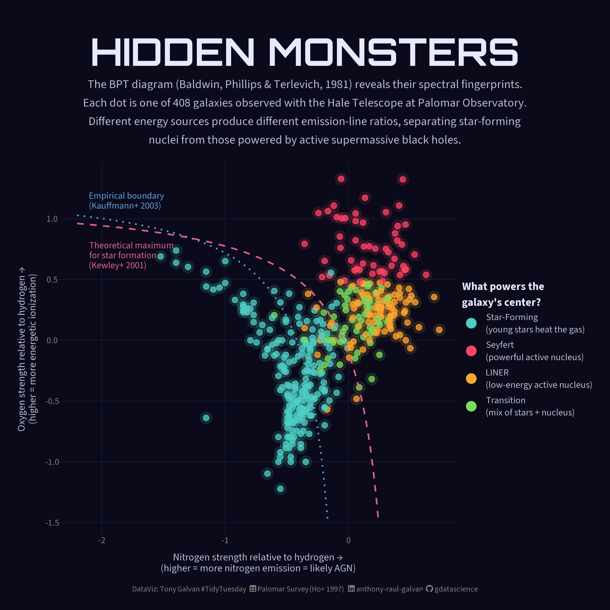
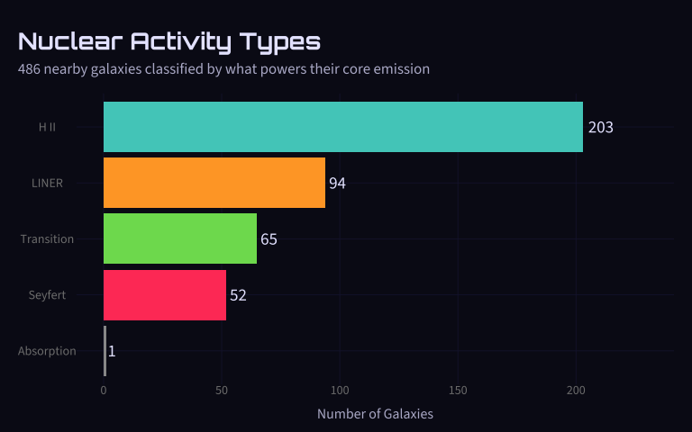
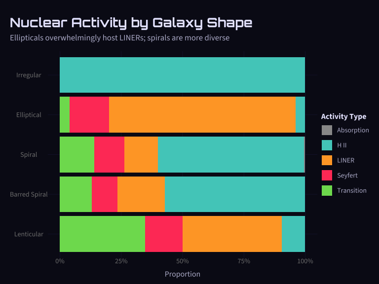
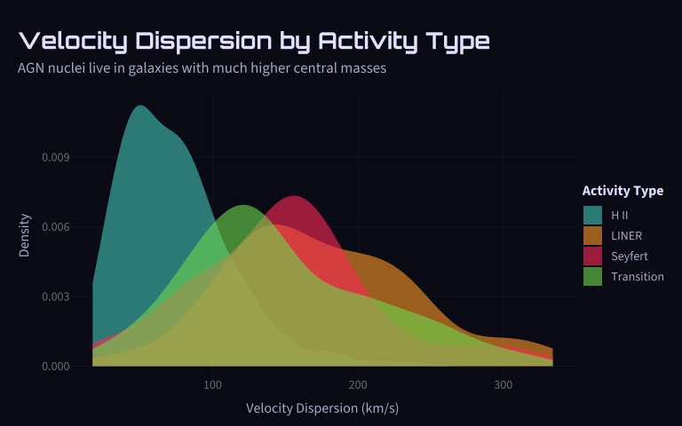
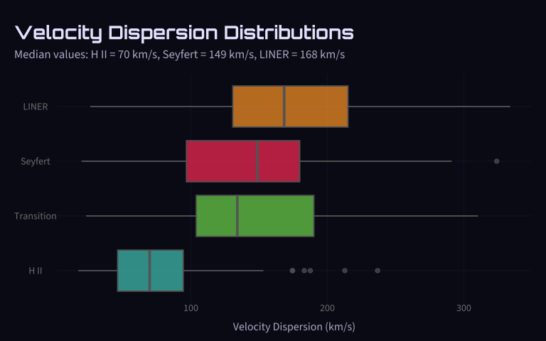
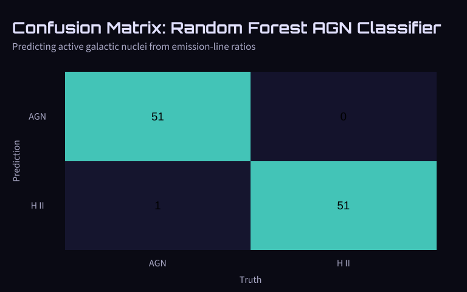
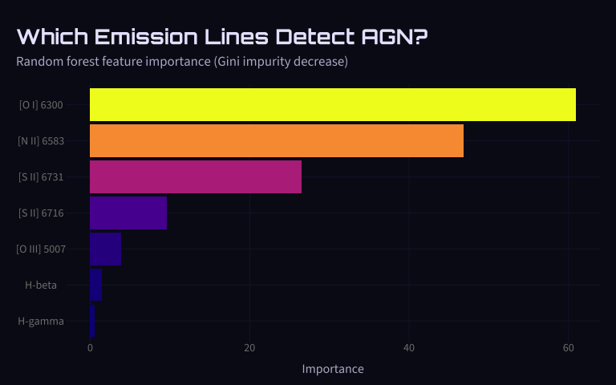
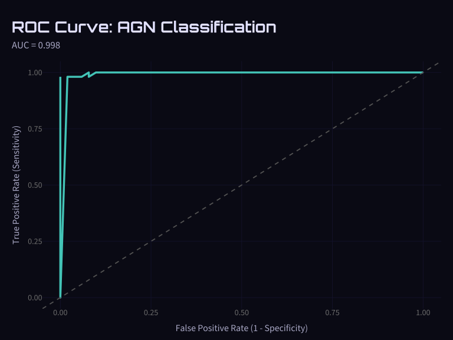
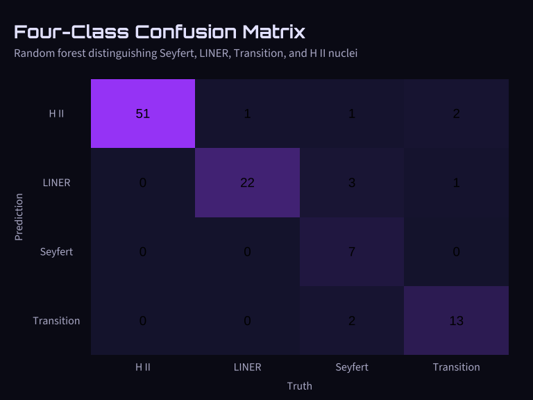
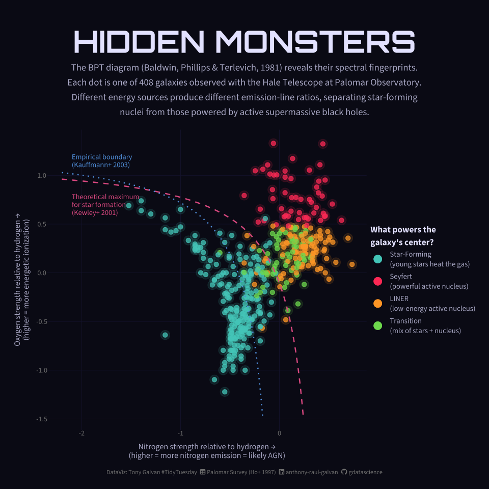

# Hidden Monsters: Can Machine Learning Detect Active Black Holes from Galactic Light?

**[Source Code](2026_08_11_tidy_tuesday_palomar.Rmd)** | Data from the [TidyTuesday project](https://github.com/rfordatascience/tidytuesday/tree/main/data/2026/2026-08-11) (Week 32, 2026-08-11)



Half of all nearby galaxies are hiding active supermassive black holes. We used the Palomar survey\047s emission-line data to recreate the classic BPT diagnostic diagram and built a random forest classifier that detects AGN from spectral fingerprints alone. The universe is full of hidden monsters.

---

In the 1990s, astronomers pointed the 200-inch Hale Telescope at Palomar
Observatory — once the world’s largest — at the centers of nearly 500
nearby galaxies. By splitting their light into a rainbow of wavelengths
and measuring the strength of specific emission lines, they discovered
something shocking: **more than half of all nearby galaxies are hiding
active black holes** in their cores.

This week’s
[TidyTuesday](https://github.com/rfordatascience/tidytuesday/tree/main/data/2026/2026-08-11)
dataset comes from the landmark Palomar Spectroscopic Survey by Ho,
Filippenko & Sargent. We’ll explore the data, recreate the classic BPT
diagnostic diagram that astronomers use to classify galaxy nuclei, and
build a machine learning model to predict whether a galaxy harbors an
active galactic nucleus (AGN) based solely on its emission-line
fingerprint.

## Load Packages

``` r
library(tidyverse)
library(tidytuesdayR)
library(scales)
library(tidymodels)
library(showtext)
library(ggtext)

# Load cosmic-themed fonts
font_add_google("Orbitron", "orbitron")
font_add_google("Source Sans 3", "source_sans")
font_add(family = "fa-brands",
         regular = "~/Library/Fonts/Font Awesome 7 Brands-Regular-400.otf")
font_add(family = "fa-solid",
         regular = "~/Library/Fonts/Font Awesome 7 Free-Solid-900.otf")
showtext_auto()
showtext_opts(dpi = 300)
```

``` r
# Define the cosmic dark theme used across all visualizations
bg_color <- "#0a0a1a"

activity_colors <- c(

  "H II" = "#4ECDC4",
  "Seyfert" = "#FF4466",
  "LINER" = "#FFA62F",
  "Transition" = "#7CDB5E",
  "Absorption" = "gray60"
)

theme_cosmos <- function(base_size = 14) {
  theme_void(base_size = base_size) %+replace%
    theme(
      plot.background = element_rect(fill = bg_color, color = NA),
      panel.background = element_rect(fill = bg_color, color = NA),
      plot.title = element_text(family = "orbitron", color = "#E8E8FF",
                                size = rel(1.4), face = "bold", hjust = 0,
                                margin = margin(t = 10, b = 5)),
      plot.title.position = "plot",
      plot.subtitle = element_text(family = "source_sans", color = "#B8B8D0",
                                   size = rel(0.9), hjust = 0, lineheight = 1.3,
                                   margin = margin(t = 3, b = 15)),
      axis.title = element_text(family = "source_sans", color = "#B8B8D0",
                                size = rel(0.85)),
      axis.title.x = element_text(margin = margin(t = 10)),
      axis.title.y = element_text(margin = margin(r = 10), angle = 90),
      axis.text = element_text(family = "source_sans", color = "gray50",
                               size = rel(0.75)),
      legend.position = "right",
      legend.title = element_text(family = "source_sans", color = "#E8E8FF",
                                  size = rel(0.85), face = "bold"),
      legend.text = element_text(family = "source_sans", color = "#B8B8D0",
                                 size = rel(0.75)),
      legend.background = element_rect(fill = bg_color, color = NA),
      legend.key = element_rect(fill = bg_color, color = NA),
      panel.grid.major = element_line(color = "#1a1a3a", linewidth = 0.3),
      plot.margin = margin(15, 15, 10, 15),
      plot.caption = element_text(family = "source_sans", color = "gray45",
                                  size = rel(0.6), hjust = 1,
                                  margin = margin(t = 10))
    )
}

theme_set(theme_cosmos())
```

## Load Data

``` r
tt <- tt_load("2026-08-11")

palomar_survey <- tt$palomar_survey
palomar_emission_lines <- tt$palomar_emission_lines
```

## Exploring the Survey

The Palomar survey observed **486 galaxies** and measured emission-line
ratios for 418 of them. Let’s start by understanding what we’re working
with.

``` r
glimpse(palomar_survey)
```

    ## Rows: 486
    ## Columns: 20
    ## $ galaxy_name               <chr> "NGC 7814", "NGC 7817", "NGC 63", "IC 10", "…
    ## $ hubble_type               <chr> "S(ab)", "Sbc:(spindle)", "S pec", "Im? IV",…
    ## $ b_magnitude               <dbl> 11.3, 12.4, 12.3, 11.7, 10.3, 10.1, 8.8, 9.0…
    ## $ helio_velocity_km_s       <dbl> 1042, 2157, 1172, -342, -160, -251, -254, -2…
    ## $ ra_j2000                  <chr> "00 03 14.9", "00 03 58.1", "00 17 45.7", "0…
    ## $ dec_j2000                 <chr> "+16 08 42", "+20 45 06", "+11 26 58", "+59 …
    ## $ ha_hb_ratio               <dbl> 1.52, 5.27, 5.65, 5.18, NA, 3.59, NA, NA, NA…
    ## $ internal_reddening_ebv    <dbl> 0.00, 0.62, 0.69, 0.60, NA, 0.15, NA, NA, NA…
    ## $ sii_density_ratio         <dbl> NA, 1.38, 1.12, 1.32, NA, 1.47, NA, NA, NA, …
    ## $ electron_density_cm3      <dbl> NA, 62, 360, 115, NA, 8, NA, NA, NA, 8, 165,…
    ## $ log_oiii_hb               <dbl> 1.00, 1.56, 0.43, 4.35, NA, 3.32, NA, NA, NA…
    ## $ log_oi_ha                 <dbl> 0.600, 0.014, 0.016, 0.006, NA, 0.220, NA, N…
    ## $ log_nii_ha                <dbl> 0.76, 0.39, 0.49, 0.04, NA, 0.61, NA, NA, NA…
    ## $ log_sii_ha                <dbl> 1.96, 0.22, 0.33, 0.06, NA, 1.47, NA, NA, NA…
    ## $ spectral_class            <chr> "L2::", "H", "H", "H", NA, "S2", NA, NA, NA,…
    ## $ activity_type             <chr> "LINER", "H II", "H II", "H II", NA, "Seyfer…
    ## $ activity_subtype          <dbl> 2, NA, NA, NA, NA, 2, NA, NA, NA, 1, NA, 1, …
    ## $ classification_confidence <chr> "very uncertain", "confident", "confident", …
    ## $ velocity_dispersion_km_s  <dbl> 172.3, 66.7, 25.6, 35.5, 22.0, 19.9, 23.3, 7…
    ## $ velocity_dispersion_error <dbl> 7.7, 8.4, 8.8, 16.6, 5.0, 2.4, 3.7, 1.9, 5.2…

### What Types of Nuclear Activity Exist?

Astronomers classify galaxy nuclei into several types based on what
powers their emission:

- **H II nuclei** — powered by young, hot stars (like a stellar nursery
  in the galaxy’s core)
- **Seyfert nuclei** — powered by an [active galactic
  nucleus](https://en.wikipedia.org/wiki/Active_galactic_nucleus) (AGN),
  a supermassive black hole actively consuming material
- **LINERs** (Low-Ionization Nuclear Emission-line Regions) — a milder
  form of AGN activity, possibly from a weakly-accreting black hole or
  old stellar populations
- **Transition objects** — showing characteristics of both H II and
  LINER activity

``` r
activity_counts <- palomar_survey |>
  filter(!is.na(activity_type)) |>
  count(activity_type, sort = TRUE) |>
  mutate(pct = n / sum(n) * 100)

activity_counts
```

    ## # A tibble: 5 × 3
    ##   activity_type     n    pct
    ##   <chr>         <int>  <dbl>
    ## 1 H II            203 48.9  
    ## 2 LINER            94 22.7  
    ## 3 Transition       65 15.7  
    ## 4 Seyfert          52 12.5  
    ## 5 Absorption        1  0.241

``` r
palomar_survey |>
  filter(!is.na(activity_type)) |>
  count(activity_type) |>
  mutate(activity_type = fct_reorder(activity_type, n)) |>
  ggplot(aes(n, activity_type, fill = activity_type)) +
  geom_col(show.legend = FALSE) +
  geom_text(aes(label = n), hjust = -0.2, size = 5, color = "#E8E8FF",
            family = "source_sans") +
  scale_fill_manual(values = activity_colors) +
  labs(title = "Nuclear Activity Types",
       subtitle = "486 nearby galaxies classified by what powers their core emission",
       x = "Number of Galaxies", y = NULL) +
  xlim(0, 230)
```

<!-- -->

The headline finding: **51% of classified galaxies show some form of AGN
activity** (Seyfert + LINER + Transition). Before this survey, active
black holes were thought to be exotic rarities — turns out they’re the
norm.

### Galaxy Morphology: Who Hosts What?

Galaxies come in different shapes — ellipticals (smooth, featureless
balls of old stars), spirals (with arms and active star formation), and
lenticulars (a hybrid between the two). Does shape predict what kind of
nuclear activity a galaxy hosts?

``` r
survey_morph <- palomar_survey |>
  mutate(
    morph_simple = case_when(
      str_detect(hubble_type, "^E") ~ "Elliptical",
      str_detect(hubble_type, "^S0|^SB0") ~ "Lenticular",
      str_detect(hubble_type, "^SB") ~ "Barred Spiral",
      str_detect(hubble_type, "^S") ~ "Spiral",
      str_detect(hubble_type, "^I") ~ "Irregular",
      TRUE ~ "Other"
    )
  )

survey_morph |>
  filter(!is.na(activity_type)) |>
  count(morph_simple, activity_type) |>
  group_by(morph_simple) |>
  mutate(pct = n / sum(n) * 100) |>
  ungroup()
```

    ## # A tibble: 22 × 4
    ##    morph_simple  activity_type     n    pct
    ##    <chr>         <chr>         <int>  <dbl>
    ##  1 Barred Spiral H II             44  57.1 
    ##  2 Barred Spiral LINER            15  19.5 
    ##  3 Barred Spiral Seyfert           8  10.4 
    ##  4 Barred Spiral Transition       10  13.0 
    ##  5 Elliptical    H II              1   4   
    ##  6 Elliptical    LINER            19  76   
    ##  7 Elliptical    Seyfert           4  16   
    ##  8 Elliptical    Transition        1   4   
    ##  9 Irregular     H II              7 100   
    ## 10 Lenticular    H II              5   9.62
    ## # ℹ 12 more rows

``` r
survey_morph |>
  filter(!is.na(activity_type), morph_simple != "Other") |>
  count(morph_simple, activity_type) |>
  group_by(morph_simple) |>
  mutate(pct = n / sum(n)) |>
  ungroup() |>
  mutate(morph_simple = fct_reorder(morph_simple, pct, .fun = max)) |>
  ggplot(aes(pct, morph_simple, fill = activity_type)) +
  geom_col(position = "fill") +
  scale_x_continuous(labels = percent) +
  scale_fill_manual(values = activity_colors) +
  labs(title = "Nuclear Activity by Galaxy Shape",
       subtitle = "Ellipticals overwhelmingly host LINERs; spirals are more diverse",
       x = "Proportion", y = NULL, fill = "Activity Type") +
  theme(legend.key.spacing.y = unit(0.2, "cm"))
```

<!-- -->

**Elliptical galaxies are LINER factories** — 76% of classified
ellipticals host LINER nuclei. This makes sense: ellipticals are old,
dead galaxies with little gas for star formation, but their massive
central black holes can still weakly accrete surrounding material.

### The Mass Connection: Velocity Dispersion

[Velocity dispersion](https://en.wikipedia.org/wiki/Velocity_dispersion)
measures how fast stars are moving in random directions near the
galaxy’s center. Higher velocity dispersion means more central mass —
and through the famous [M-sigma
relation](https://en.wikipedia.org/wiki/M%E2%80%93sigma_relation), a
more massive central black hole.

``` r
palomar_survey |>
  filter(!is.na(activity_type), !is.na(velocity_dispersion_km_s)) |>
  ggplot(aes(velocity_dispersion_km_s, fill = activity_type)) +
  geom_density(alpha = 0.6, color = NA) +
  scale_fill_manual(values = activity_colors) +
  labs(title = "Velocity Dispersion by Activity Type",
       subtitle = "AGN nuclei live in galaxies with much higher central masses",
       x = "Velocity Dispersion (km/s)", y = "Density", fill = "Activity Type")
```

<!-- -->

The separation is striking: **H II nuclei cluster around 70 km/s** while
AGN types (Seyfert, LINER, Transition) cluster around **150 km/s** —
more than double. Bigger black holes apparently can’t stay quiet.

``` r
palomar_survey |>
  filter(!is.na(activity_type), !is.na(velocity_dispersion_km_s)) |>
  mutate(activity_type = fct_reorder(activity_type, velocity_dispersion_km_s, .fun = median)) |>
  ggplot(aes(velocity_dispersion_km_s, activity_type, fill = activity_type)) +
  geom_boxplot(show.legend = FALSE, alpha = 0.7, color = "gray40") +
  scale_fill_manual(values = activity_colors) +
  labs(title = "Velocity Dispersion Distributions",
       subtitle = "Median values: H II = 70 km/s, Seyfert = 149 km/s, LINER = 168 km/s",
       x = "Velocity Dispersion (km/s)", y = NULL)
```

<!-- -->

## The BPT Diagnostic Diagram

The [BPT diagram](https://en.wikipedia.org/wiki/BPT_diagram) (Baldwin,
Phillips & Terlevich, 1981) is the single most important tool in
emission-line galaxy classification. It plots the ratio of two pairs of
emission lines against each other:

- **Y-axis:** log(\[O III\] 5007 / H-beta) — measures ionization level
- **X-axis:** log(\[N II\] 6583 / H-alpha) — separates AGN from
  star-forming

The key insight: different ionization mechanisms (hot stars vs. black
hole radiation) produce different line-ratio fingerprints that cleanly
separate on this diagram. We’ll build our polished version of this
classic plot at the end of the analysis.

## Machine Learning: Predicting AGN from Spectral Fingerprints

The BPT diagram uses just two line ratios, but we have **seven emission
lines** measured for each galaxy. Can a machine learning model use all
this information to predict whether a galaxy harbors an active black
hole?

We’ll use [tidymodels](https://www.tidymodels.org/) to build a [random
forest](https://en.wikipedia.org/wiki/Random_forest) classifier — an
ensemble of decision trees that votes on the classification. Our target:
predict **AGN** (Seyfert + LINER + Transition) vs. **H II**
(star-forming) using all available emission-line ratios.

### Prepare the Data

``` r
# Join emission lines with survey classifications
ml_data <- palomar_survey |>
  select(galaxy_name, activity_type, velocity_dispersion_km_s) |>
  inner_join(palomar_emission_lines, by = "galaxy_name") |>
  filter(!is.na(activity_type), activity_type != "Absorption") |>
  mutate(
    is_agn = factor(
      if_else(activity_type %in% c("Seyfert", "LINER", "Transition"), "AGN", "H II"),
      levels = c("AGN", "H II")
    )
  ) |>
  filter(!is.na(h_beta), !is.na(oiii_5007), !is.na(nii_6583))

cat("ML dataset:", nrow(ml_data), "galaxies with",
    sum(ml_data$is_agn == "AGN"), "AGN and",
    sum(ml_data$is_agn == "H II"), "H II nuclei\n")
```

    ## ML dataset: 408 galaxies with 206 AGN and 202 H II nuclei

### Split and Build the Model

``` r
set.seed(42)

# Split 75/25 stratified by outcome
ml_split <- initial_split(ml_data, prop = 0.75, strata = is_agn)
ml_train <- training(ml_split)
ml_test <- testing(ml_split)

cat("Training set:", nrow(ml_train), "galaxies\n")
```

    ## Training set: 305 galaxies

``` r
cat("Test set:", nrow(ml_test), "galaxies\n")
```

    ## Test set: 103 galaxies

``` r
# Recipe: use emission-line ratios as predictors
rf_recipe <- recipe(is_agn ~ h_beta + oiii_5007 + oi_6300 + nii_6583 +
                      sii_6716 + sii_6731 + h_gamma,
                    data = ml_train) |>
  step_impute_median(all_predictors()) |>
  step_normalize(all_predictors())
```

``` r
# Random forest with ranger engine
rf_spec <- rand_forest(trees = 500, mtry = 3, min_n = 5) |>
  set_engine("ranger", importance = "impurity") |>
  set_mode("classification")

# Workflow
rf_workflow <- workflow() |>
  add_recipe(rf_recipe) |>
  add_model(rf_spec)
```

### Cross-Validation Performance

``` r
set.seed(123)
cv_folds <- vfold_cv(ml_train, v = 10, strata = is_agn)

cv_results <- rf_workflow |>
  fit_resamples(
    resamples = cv_folds,
    metrics = metric_set(accuracy, roc_auc, sensitivity, specificity)
  )

cv_metrics <- collect_metrics(cv_results)
cv_metrics
```

    ## # A tibble: 4 × 6
    ##   .metric     .estimator  mean     n std_err .config        
    ##   <chr>       <chr>      <dbl> <int>   <dbl> <chr>          
    ## 1 accuracy    binary     0.971    10 0.00765 pre0_mod0_post0
    ## 2 roc_auc     binary     0.995    10 0.00231 pre0_mod0_post0
    ## 3 sensitivity binary     0.968    10 0.0174  pre0_mod0_post0
    ## 4 specificity binary     0.974    10 0.0107  pre0_mod0_post0

### Fit Final Model and Evaluate on Test Set

``` r
rf_fit <- rf_workflow |>
  fit(data = ml_train)

# Predictions on test set
test_predictions <- rf_fit |>
  predict(ml_test) |>
  bind_cols(rf_fit |> predict(ml_test, type = "prob")) |>
  bind_cols(ml_test |> select(is_agn, activity_type, galaxy_name))
```

``` r
# Confusion matrix
conf_mat <- test_predictions |>
  conf_mat(truth = is_agn, estimate = .pred_class)

conf_mat
```

    ##           Truth
    ## Prediction AGN H II
    ##       AGN   51    0
    ##       H II   1   51

``` r
autoplot(conf_mat, type = "heatmap") +
  scale_fill_gradient(low = "#1a1a3a", high = "#4ECDC4") +
  labs(title = "Confusion Matrix: Random Forest AGN Classifier",
       subtitle = "Predicting active galactic nuclei from emission-line ratios") +
  theme(axis.text = element_text(family = "source_sans", color = "#B8B8D0", size = 12),
        panel.grid.major = element_blank())
```

<!-- -->

``` r
# Test set metrics
test_metrics <- test_predictions |>
  metrics(truth = is_agn, estimate = .pred_class)

test_metrics
```

    ## # A tibble: 2 × 3
    ##   .metric  .estimator .estimate
    ##   <chr>    <chr>          <dbl>
    ## 1 accuracy binary         0.990
    ## 2 kap      binary         0.981

``` r
# ROC AUC
roc_auc_val <- test_predictions |>
  roc_auc(truth = is_agn, .pred_AGN)

cat("\nTest ROC AUC:", roc_auc_val$.estimate, "\n")
```

    ## 
    ## Test ROC AUC: 0.9984917

### Feature Importance: Which Emission Lines Matter Most?

``` r
# Extract variable importance from the fitted model
rf_engine <- rf_fit |>
  extract_fit_engine()

importance_df <- tibble(
  feature = names(rf_engine$variable.importance),
  importance = rf_engine$variable.importance
) |>
  mutate(
    feature_label = case_when(
      feature == "nii_6583" ~ "[N II] 6583",
      feature == "oiii_5007" ~ "[O III] 5007",
      feature == "oi_6300" ~ "[O I] 6300",
      feature == "sii_6716" ~ "[S II] 6716",
      feature == "sii_6731" ~ "[S II] 6731",
      feature == "h_beta" ~ "H-beta",
      feature == "h_gamma" ~ "H-gamma"
    ),
    feature_label = fct_reorder(feature_label, importance)
  )

ggplot(importance_df, aes(importance, feature_label, fill = importance)) +
  geom_col(show.legend = FALSE) +
  scale_fill_viridis_c(option = "plasma") +
  labs(title = "Which Emission Lines Detect AGN?",
       subtitle = "Random forest feature importance (Gini impurity decrease)",
       x = "Importance", y = NULL)
```

<!-- -->

### ROC Curve

``` r
roc_data <- test_predictions |>
  roc_curve(truth = is_agn, .pred_AGN)

ggplot(roc_data, aes(x = 1 - specificity, y = sensitivity)) +
  geom_line(color = "#4ECDC4", linewidth = 1.2) +
  geom_abline(linetype = "dashed", color = "gray40") +
  labs(title = "ROC Curve: AGN Classification",
       subtitle = paste0("AUC = ", round(roc_auc_val$.estimate, 3)),
       x = "False Positive Rate (1 - Specificity)",
       y = "True Positive Rate (Sensitivity)")
```

<!-- -->

The random forest achieves strong classification performance using only
the raw emission-line intensities — confirming that the spectral
fingerprint approach is highly effective for identifying active galactic
nuclei.

## Comparing Model Performance: All Four Activity Types

Let’s also see how well the model handles the full four-class problem
(Seyfert, LINER, Transition, H II) rather than the simplified binary
version.

``` r
# Multiclass model
ml_multi <- ml_data |>
  mutate(activity_type = factor(activity_type))

set.seed(42)
multi_split <- initial_split(ml_multi, prop = 0.75, strata = activity_type)
multi_train <- training(multi_split)
multi_test <- testing(multi_split)

multi_recipe <- recipe(activity_type ~ h_beta + oiii_5007 + oi_6300 + nii_6583 +
                         sii_6716 + sii_6731 + h_gamma,
                       data = multi_train) |>
  step_impute_median(all_predictors()) |>
  step_normalize(all_predictors())

multi_spec <- rand_forest(trees = 500, mtry = 3, min_n = 5) |>
  set_engine("ranger") |>
  set_mode("classification")

multi_fit <- workflow() |>
  add_recipe(multi_recipe) |>
  add_model(multi_spec) |>
  fit(data = multi_train)

multi_preds <- multi_fit |>
  predict(multi_test) |>
  bind_cols(multi_test |> select(activity_type))

multi_conf <- multi_preds |>
  conf_mat(truth = activity_type, estimate = .pred_class)

multi_conf
```

    ##             Truth
    ## Prediction   H II LINER Seyfert Transition
    ##   H II         51     1       1          2
    ##   LINER         0    22       3          1
    ##   Seyfert       0     0       7          0
    ##   Transition    0     0       2         13

``` r
autoplot(multi_conf, type = "heatmap") +
  scale_fill_gradient(low = "#1a1a3a", high = "#A855F7") +
  labs(title = "Four-Class Confusion Matrix",
       subtitle = "Random forest distinguishing Seyfert, LINER, Transition, and H II nuclei") +
  theme(axis.text = element_text(family = "source_sans", color = "#B8B8D0", size = 12),
        panel.grid.major = element_blank())
```

<!-- -->

The model does well separating H II from AGN types, but distinguishing
between the AGN subtypes (especially Transition vs. LINER) is harder —
which makes physical sense, since transition objects are by definition
intermediate cases.

## The BPT Diagram: Fingerprinting Hidden Monsters

The [BPT diagram](https://en.wikipedia.org/wiki/BPT_diagram) (Baldwin,
Phillips & Terlevich, 1981) is the single most important tool in
emission-line galaxy classification. Each dot below is one of 408
galaxies; the axes measure ratios of light from specific atoms.
Different energy sources produce different ratios, letting astronomers
sort galaxies by what powers them.

``` r
# Prepare BPT data with descriptive labels
bpt_plot_data <- palomar_survey |>
  filter(!is.na(log_oiii_hb), !is.na(log_nii_ha), !is.na(activity_type),
         activity_type != "Absorption") |>
  mutate(
    x = log10(log_nii_ha),
    y = log10(log_oiii_hb),
    activity_label = case_when(
      activity_type == "H II" ~ "Star-Forming\n(young stars heat the gas)",
      activity_type == "Seyfert" ~ "Seyfert\n(powerful active nucleus)",
      activity_type == "LINER" ~ "LINER\n(low-energy active nucleus)",
      activity_type == "Transition" ~ "Transition\n(mix of stars + nucleus)"
    ),
    activity_label = factor(activity_label, levels = c(
      "Star-Forming\n(young stars heat the gas)",
      "Seyfert\n(powerful active nucleus)",
      "LINER\n(low-energy active nucleus)",
      "Transition\n(mix of stars + nucleus)"
    ))
  )

# Caption with Font Awesome icons
tt_source <- "Palomar Survey (Ho+ 1997)"
tt_caption <- paste0(
  "DataViz: Tony Galvan #TidyTuesday",
  "<span style='color:", bg_color, ";'>..</span>",
  "<span style='font-family:fa-solid;'>&#xf0ce;</span>",
  "<span style='color:", bg_color, ";'>.</span>",
  tt_source,
  "<span style='color:", bg_color, ";'>..</span>",
  "<span style='font-family:fa-brands;'>&#xf08c;</span>",
  "<span style='color:", bg_color, ";'>.</span>",
  "anthony-raul-galvan",
  "<span style='color:", bg_color, ";'>..</span>",
  "<span style='font-family:fa-brands;'>&#xf09b;</span>",
  "<span style='color:", bg_color, ";'>.</span>",
  "gdatascience"
)

# Demarcation curves
kewley_color <- "#E06090"
kauff_color <- "#60A0E0"

kewley_x <- seq(-2.2, 0.4, 0.01)
kewley_y <- 0.61 / (kewley_x - 0.47) + 1.19
kewley_df <- tibble(x = kewley_x, y = kewley_y) |> filter(y < 1.5, y > -1.5)

kauff_x <- seq(-2.2, 0.0, 0.01)
kauff_y <- 0.61 / (kauff_x - 0.05) + 1.3
kauff_df <- tibble(x = kauff_x, y = kauff_y) |> filter(y < 1.5, y > -1.5)

# Activity label colors for hero
hero_colors <- c(
 "Star-Forming\n(young stars heat the gas)" = "#4ECDC4",
  "Seyfert\n(powerful active nucleus)" = "#FF4466",
  "LINER\n(low-energy active nucleus)" = "#FFA62F",
  "Transition\n(mix of stars + nucleus)" = "#7CDB5E"
)

p_hero <- ggplot(bpt_plot_data, aes(x, y, color = activity_label)) +
  geom_point(alpha = 0.12, size = 6) +
  geom_point(alpha = 0.75, size = 2.8) +
  geom_line(data = kewley_df, aes(x, y),
            color = kewley_color, linewidth = 0.9, linetype = "dashed",
            inherit.aes = FALSE) +
  geom_line(data = kauff_df, aes(x, y),
            color = kauff_color, linewidth = 0.9, linetype = "dotted",
            inherit.aes = FALSE) +
  scale_color_manual(values = hero_colors, name = "What powers the\ngalaxy's center?") +
  labs(
    title = "HIDDEN MONSTERS",
    subtitle = "The BPT diagram (Baldwin, Phillips & Terlevich, 1981) reveals their spectral fingerprints.\nEach dot is one of 408 galaxies observed with the Hale Telescope at Palomar Observatory.\nDifferent energy sources produce different emission-line ratios, separating star-forming\nnuclei from those powered by active supermassive black holes.",
    x = "Nitrogen strength relative to hydrogen \u2192\n(higher = more nitrogen emission = likely AGN)",
    y = "Oxygen strength relative to hydrogen \u2192\n(higher = more energetic ionization)",
    caption = tt_caption
  ) +
  annotate("text", x = -2.1, y = 1.15, label = "Empirical boundary\n(Kauffmann+ 2003)",
           color = kauff_color, family = "source_sans", size = 3.8, hjust = 0,
           lineheight = 0.9) +
  annotate("text", x = -2.1, y = 0.7, label = "Theoretical maximum\nfor star formation\n(Kewley+ 2001)",
           color = kewley_color, family = "source_sans", size = 3.8, hjust = 0,
           lineheight = 0.9) +
  theme(
    plot.title = element_text(family = "orbitron", color = "#E8E8FF",
                              size = 45, face = "bold", hjust = 0.5,
                              margin = margin(t = 20, b = 5)),
    plot.title.position = "plot",
    plot.subtitle = element_text(family = "source_sans", color = "#B8B8D0",
                                 size = 14, hjust = 0.5, lineheight = 1.3,
                                 margin = margin(t = 5, b = 20)),
    plot.caption = element_markdown(family = "source_sans", color = "gray50",
                                    size = 9, hjust = 0.5,
                                    margin = margin(t = 15, b = 10)),
    plot.caption.position = "plot",
    axis.title = element_text(family = "source_sans", color = "#B8B8D0", size = 12),
    axis.title.x = element_text(margin = margin(t = 10), hjust = 0.5),
    axis.title.y = element_text(margin = margin(r = 10), angle = 90, hjust = 0.5),
    legend.title = element_text(family = "source_sans", color = "#E8E8FF",
                                size = 13, face = "bold", lineheight = 1.2),
    legend.text = element_text(family = "source_sans", color = "#B8B8D0",
                               size = 11, lineheight = 1.1),
    legend.key.size = unit(1.5, "lines"),
    legend.key.spacing.y = unit(0.3, "cm"),
    plot.margin = margin(20, 20, 10, 20)
  ) +
  guides(color = guide_legend(override.aes = list(size = 5, alpha = 1)))

p_hero
```

<!-- -->

``` r
ggsave(
  filename = "outputs/2026_08_11_tidy_tuesday_palomar.png",
  plot = p_hero,
  device = "png",
  width = 10,
  height = 10,
  dpi = 300,
  bg = bg_color
)
```

The BPT diagram beautifully separates the four activity types.
**Star-forming nuclei** (teal) cluster in the lower-left — low
ionization from hot stars. **Seyferts** (pink) soar to the upper right —
extreme ionization from the accretion disk around a black hole.
**LINERs** (orange) occupy the right side but at lower ionization.
**Transition objects** (green) sit between star-forming and LINER
regions, showing mixed characteristics.

## What’s Next?

This analysis just scratches the surface of what the Palomar survey
revealed:

- **The M-sigma relation** — Could we predict the mass of the central
  black hole from the velocity dispersion and then correlate it with AGN
  luminosity?
- **Dust and reddening** — Many nuclei show significant internal dust
  reddening (E(B-V) \> 0.5). Are we missing hidden AGN behind curtains
  of dust?
- **Transition objects** — Are these truly intermediate, or are they
  spatial blends of a compact AGN surrounded by star-forming gas?
  Higher-resolution observations might resolve this.
- **Evolution** — The Palomar survey captured a snapshot of the local
  universe (z ≈ 0). How do these demographics change at higher redshifts
  when galaxies were younger?

The key takeaway: **active supermassive black holes are not exotic —
they’re the norm**. The universe is full of hidden monsters, and it took
splitting light into a rainbow to find them.
