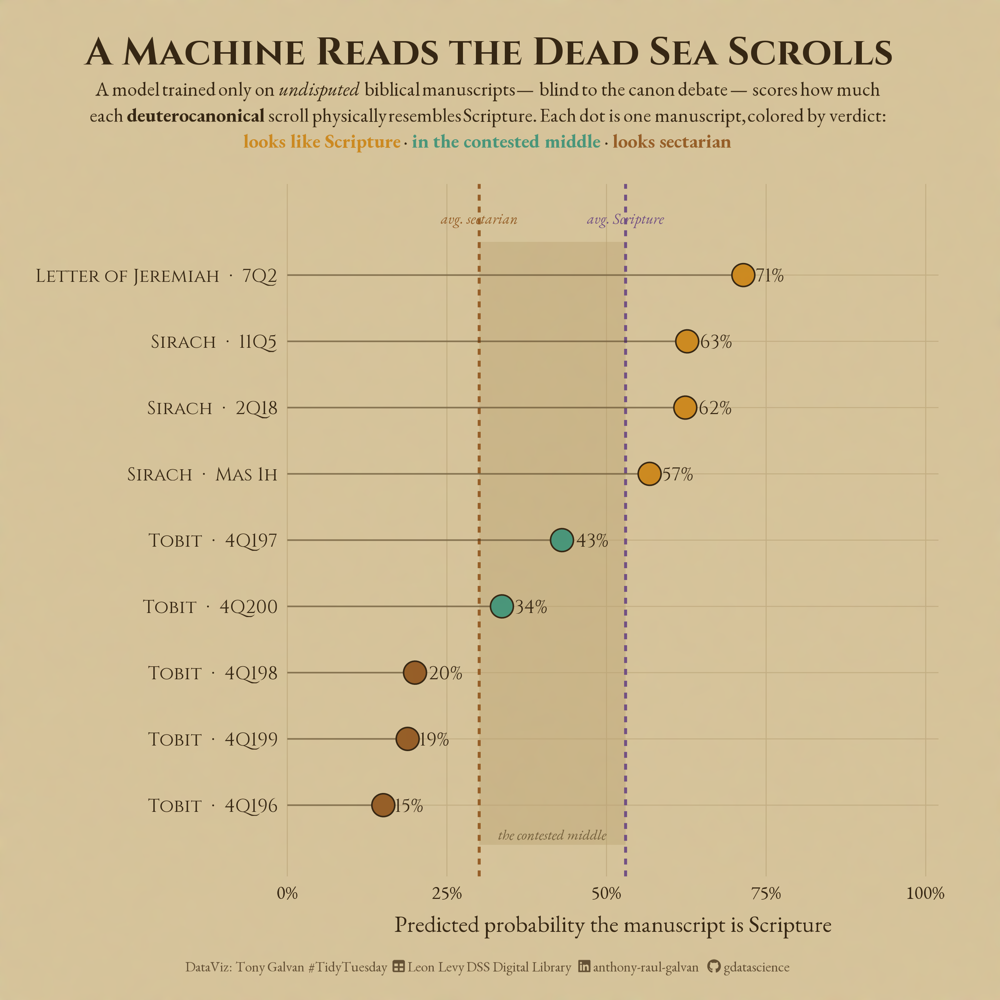

```{r setup, include=FALSE}
knitr::opts_chunk$set(
  echo = TRUE, message = FALSE, warning = FALSE,
  fig.width = 8, fig.height = 6, fig.path = "outputs/", dpi = 200
)
```

In caves above the Dead Sea, between 1947 and 1956, shepherds and archaeologists pulled some 900 manuscripts out of the dark. They are the oldest surviving copies of biblical books by a thousand years — and, alongside them, a whole library of rulebooks, hymns, calendars, and commentaries belonging to the community that hid them.

This week's #TidyTuesday dataset catalogs **809 of those manuscripts**, each tagged with its language, script, writing material, the cave it came from, and — where scholars could identify it — the composition it preserves. That last column opens a door onto one of the oldest arguments in Western religion: *which books count as Scripture?*

Instead of arguing it, we'll do something a little unusual. We'll train a machine learning model to recognize what a "Bible" manuscript physically looks like at Qumran — using only the books everyone agrees on — and then ask it to judge the handful of disputed books caught in the middle. The model has no theology. It only sees parchment, ink, and dust.

```{r load-libraries}
library(tidyverse)
library(scales)
library(tidymodels)
library(showtext)
library(ggtext)
library(vip)

# Thematic fonts: a carved-inscription display face + a readable serif body
font_add_google("Cinzel", "cinzel")
font_add_google("EB Garamond", "garamond")
font_add(family = "fa-brands", regular = "~/Library/Fonts/Font Awesome 7 Brands-Regular-400.otf")
font_add(family = "fa-solid",  regular = "~/Library/Fonts/Font Awesome 7 Free-Solid-900.otf")
showtext_auto()
showtext_opts(dpi = 200)

# --- Ancient-scroll palette ---
parch    <- "#e8dcc0"   # parchment background
ink      <- "#3a2c1a"   # iron-gall ink
umber    <- "#a06a34"
gold     <- "#d99a2b"
teal     <- "#4fa89c"
purple   <- "#7a5aa8"

theme_scroll <- function(base_size = 14) {
  theme_minimal(base_family = "garamond", base_size = base_size) +
    theme(
      plot.background  = element_rect(fill = parch, color = NA),
      panel.background = element_rect(fill = parch, color = NA),
      panel.grid.minor = element_blank(),
      panel.grid.major = element_line(color = "#d3c4a3", linewidth = 0.3),
      axis.ticks = element_blank(),
      text = element_text(color = ink),
      axis.text = element_text(color = ink),
      plot.title = element_text(family = "cinzel", face = "bold", size = base_size + 6, color = ink),
      plot.subtitle = element_text(family = "garamond", size = base_size, color = ink),
      plot.title.position = "plot"
    )
}
theme_set(theme_scroll())
```

```{r load-data}
# The official TidyTuesday CSV. Cached locally to avoid re-downloading.
# Resolve the cache from the repo root so the path works whether knitting
# from the week directory or the project root.
cache_rel <- ".kiro/specs/2026_09_15_tidy_tuesday_dead_sea_scrolls/tt_cache.rds"
cache_path <- if (file.exists(cache_rel)) cache_rel else file.path("../..", cache_rel)
scrolls <- readRDS(cache_path)$dead_sea_scrolls
dim(scrolls)
```

## What's in the collection?

The dataset has **809 rows and 18 columns**. Each row is one manuscript. Beyond the physical description (language, script, material, cave), the catalog carries a scholarly classification of each text's **canon status** — the heart of our story:

- **Protocanonical** — books in *every* Christian Old Testament (Genesis, Isaiah, Psalms...).
- **Deuterocanonical** — books Catholics and Orthodox accept but Protestants place in the "Apocrypha" (Tobit, Sirach, and others). "Deutero-" means "second" — a *second* tier of canon recognized later. ([Britannica overview](https://www.britannica.com/topic/Apocrypha).)
- **Non-canonical** — texts no modern tradition treats as Scripture (sectarian rulebooks, hymns, commentaries).
- **Unidentified** — fragments too damaged to name.

```{r glimpse}
glimpse(scrolls)
```

Let's profile the columns that matter. First, how complete is the data?

```{r missingness}
scrolls |>
  summarise(across(everything(), ~ sum(is.na(.) | . == ""))) |>
  pivot_longer(everything(), names_to = "column", values_to = "missing") |>
  filter(missing > 0) |>
  arrange(desc(missing))
```

Missingness is low and concentrated in exactly the places you'd expect: `keywords` (only richly cataloged manuscripts have them) and a scatter of unknown languages, periods, and caves among the damaged fragments.

### The shape of the library

**Cave 4 dominates everything.** Of 809 manuscripts, two-thirds came from a single cave — a collapsed storage chamber that functioned like a genizah (a repository for worn-out sacred texts).

```{r eda-caves}
scrolls |>
  filter(!is.na(cave)) |>
  count(cave) |>
  mutate(cave = fct_reorder(factor(cave), n)) |>
  ggplot(aes(n, cave)) +
  geom_col(fill = umber, width = 0.75) +
  geom_text(aes(label = n), hjust = -0.2, family = "cinzel", size = 4, color = ink) +
  scale_x_continuous(expand = expansion(mult = c(0, 0.12))) +
  labs(title = "Cave 4 held two-thirds of the scrolls",
       subtitle = "Manuscript count by Qumran cave",
       x = "Manuscripts", y = "Cave") +
  theme(panel.grid.major.y = element_blank())
```

**The collection is mostly *not* the Bible.** A common summary of the scrolls is "about a quarter biblical, the rest everything else." The data agrees: biblical books (protocanonical plus deuterocanonical) are a minority. This was a working religious library — rulebooks, prayers, and retellings outnumber Scripture.

```{r eda-content}
scrolls |>
  count(content_category, sort = TRUE) |>
  mutate(pct = n / sum(n),
         content_category = fct_reorder(content_category, n)) |>
  ggplot(aes(n, content_category)) +
  geom_col(fill = ink, width = 0.75) +
  geom_text(aes(label = sprintf("%d  (%.0f%%)", n, 100 * pct)),
            hjust = -0.1, family = "garamond", size = 3.6, color = ink) +
  scale_x_continuous(expand = expansion(mult = c(0, 0.18))) +
  labs(title = "A library, not a Bible",
       subtitle = "Manuscripts by content category",
       x = "Manuscripts", y = NULL) +
  theme(panel.grid.major.y = element_blank())
```

**Hebrew is the language of Scripture — and that will matter later.** Most manuscripts are Hebrew, with a substantial Aramaic minority (the everyday language of the region) and a little Greek.

```{r eda-language}
scrolls |>
  filter(!is.na(language), language != "") |>
  count(language, sort = TRUE) |>
  mutate(language = fct_reorder(language, n)) |>
  ggplot(aes(n, language)) +
  geom_col(fill = purple, width = 0.7) +
  geom_text(aes(label = n), hjust = -0.2, family = "cinzel", size = 4, color = ink) +
  scale_x_continuous(expand = expansion(mult = c(0, 0.12))) +
  labs(title = "Overwhelmingly Hebrew",
       subtitle = "Language of the manuscripts",
       x = "Manuscripts", y = NULL) +
  theme(panel.grid.major.y = element_blank())
```

**Most were written in the two centuries around the turn of the era.** Paleographers (scholars who date handwriting styles) assign each manuscript to a period. The Herodian and Hasmonean periods — roughly 150 BCE to 70 CE — account for the bulk.

```{r eda-period}
period_levels <- c("Early Hellenistic", "Hellenistic-Roman", "Hasmonean", "Herodian", "Roman")
scrolls |>
  filter(period %in% period_levels) |>
  count(period) |>
  mutate(period = factor(period, levels = period_levels)) |>
  ggplot(aes(period, n)) +
  geom_col(fill = gold, width = 0.75) +
  geom_text(aes(label = n), vjust = -0.4, family = "cinzel", size = 4, color = ink) +
  scale_y_continuous(expand = expansion(mult = c(0, 0.12))) +
  labs(title = "Written around the turn of the era",
       subtitle = "Paleographic period (earliest to latest)",
       x = NULL, y = "Manuscripts") +
  theme(panel.grid.major.x = element_blank())
```

**Do biblical and non-biblical texts differ physically?** This is the question the model will formalize. As a first look, compare writing material across canon status. Parchment (animal skin) was costlier and more durable than papyrus.

```{r eda-material}
scrolls |>
  filter(canon_status %in% c("Protocanonical", "Deuterocanonical", "Non-canonical"),
         material %in% c("Parchment", "Papyrus")) |>
  count(canon_status, material) |>
  group_by(canon_status) |>
  mutate(pct = n / sum(n)) |>
  ungroup() |>
  ggplot(aes(canon_status, pct, fill = material)) +
  geom_col(width = 0.65) +
  geom_text(aes(label = percent(pct, accuracy = 1)),
            position = position_stack(vjust = 0.5), family = "cinzel", color = "white", size = 4) +
  scale_fill_manual(values = c(Parchment = umber, Papyrus = gold)) +
  scale_y_continuous(labels = percent) +
  labs(title = "Scripture leaned toward durable parchment",
       subtitle = "Material by canon status (parchment vs. papyrus)",
       x = NULL, y = NULL, fill = NULL) +
  theme(panel.grid.major.x = element_blank(), legend.position = "top")
```

Protocanonical books skew even more heavily toward parchment than non-canonical texts — a hint that the community invested more durable material in books it valued most. But it's only a hint. Can a model do better by combining *all* the physical clues at once?

## The idea: teach a machine what "Scripture" looks like

Here's the design. We train a classifier on the manuscripts whose status *nobody disputes*:

- Label every **protocanonical** manuscript as **"Scripture."**
- Label the clearly non-biblical texts (sectarian rulebooks, liturgy, documentary, wisdom, and other non-biblical works) as **"Not-Scripture."**
- **Hold the deuterocanonical and parabiblical books out of training entirely.**

The model learns only from physical and scribal features — language, script type, material, paleographic period, cave, and the number of catalog images (a rough proxy for how much of the manuscript survives). It never sees a title or a word of text.

Then we ask it the question that started 2,000 years of debate: *shown only its physical profile, does this model — which has never seen a disputed book — think Tobit, Sirach, and the Letter of Jeremiah look like Scripture?*

> **A note on the "Letter of Jeremiah."** The disputed manuscript here (7Q2) is the *Letter of Jeremiah*, a short deuterocanonical text — **not** the prophetic book of Jeremiah, which is protocanonical and appears separately in the data. In Catholic Bibles the Letter of Jeremiah forms **chapter 6 of Baruch**; in the Orthodox/Septuagint tradition it often stands alone, which is why the catalog lists it on its own. The rest of Baruch, incidentally, was not found among the scrolls at all.

We'll use a [random forest](https://en.wikipedia.org/wiki/Random_forest) — a model that grows hundreds of decision trees on random slices of the data and lets them vote. It's a good fit here because it handles categorical features and interactions without much fuss. We build it with [tidymodels](https://www.tidymodels.org/), R's modern modeling framework.

```{r ml-prep}
set.seed(1947)  # the year the first scrolls were found

# Fill missing categoricals with an explicit "Unknown" level, zero-fill image counts
prep_features <- function(d) {
  d |>
    mutate(
      language    = fct_na_value_to_level(factor(language), "Unknown"),
      script_type = fct_na_value_to_level(factor(script_type), "Unknown"),
      material    = fct_na_value_to_level(factor(material), "Unknown"),
      period      = fct_na_value_to_level(factor(period), "Unknown"),
      cave        = fct_na_value_to_level(factor(cave), "Unknown"),
      num_images  = replace_na(num_images, 0)
    )
}
model_df <- prep_features(scrolls)

# The undisputed training pool
train_pool <- model_df |>
  mutate(label = case_when(
    canon_status == "Protocanonical" ~ "Scripture",
    content_category %in% c("Sectarian", "Liturgical", "Documentary",
                            "Other Non-biblical", "Wisdom Literature") ~ "Not-Scripture",
    TRUE ~ NA_character_
  )) |>
  filter(!is.na(label)) |>
  mutate(label = factor(label, levels = c("Scripture", "Not-Scripture")))

count(train_pool, label)
```

### How well can physical traits alone predict Scripture?

Before trusting the model's verdict, we check how well it actually performs — using [5-fold cross-validation](https://en.wikipedia.org/wiki/Cross-validation_(statistics)), which repeatedly trains on 80% of the undisputed books and tests on the held-out 20%.

```{r ml-cv}
rf_spec <- rand_forest(trees = 500) |>
  set_engine("ranger", importance = "permutation") |>
  set_mode("classification")

rec <- recipe(label ~ language + script_type + material + period + cave + num_images,
              data = train_pool)
wf <- workflow() |> add_model(rf_spec) |> add_recipe(rec)

folds <- vfold_cv(train_pool, v = 5, strata = label)
cv_res <- fit_resamples(wf, folds, metrics = metric_set(roc_auc, accuracy))
collect_metrics(cv_res) |> select(.metric, mean, std_err)
```

The model lands around **0.69 AUC** — [AUC](https://developers.google.com/machine-learning/crash-course/classification/roc-and-auc) (area under the ROC curve) runs from 0.5 (coin flip) to 1.0 (perfect). So: **meaningfully better than chance, but far from certain.** That's the honest reality — a scroll's physical shell only partly signals whether it's Scripture. We'll read the results as *suggestive*, not proof.

### Which physical traits give a manuscript away?

We fit the final model on all the undisputed books and ask which features it leaned on most.

```{r ml-fit}
final_fit <- fit(wf, train_pool)
```

```{r vip, fig.width = 8, fig.height = 5}
final_fit |>
  extract_fit_parsnip() |>
  vip::vi() |>
  mutate(Variable = recode(Variable,
    period = "Paleographic period", cave = "Cave",
    material = "Material", language = "Language",
    num_images = "Fragment size (images)", script_type = "Script type"),
    Variable = fct_reorder(Variable, Importance)) |>
  ggplot(aes(Importance, Variable)) +
  geom_col(fill = umber, width = 0.7) +
  labs(title = "What signals \u201cScripture\u201d?",
       subtitle = "Permutation importance of each physical feature",
       x = "Importance", y = NULL) +
  theme(panel.grid.major.y = element_blank())
```

**Period and cave matter most, followed by material and language.** That fits the history: biblical books cluster in particular caves and skew toward parchment and Hebrew. Notably, language carries real weight — and Hebrew is the tell. Hold that thought.

### The verdict on the disputed books

Now the moment of the whole exercise. We score the nine deuterocanonical manuscripts and, for context, compute the average score of the undisputed Scripture and the sectarian texts as reference lines.

```{r ml-score}
score <- function(d) bind_cols(d, predict(final_fit, d, type = "prob"))
proto_mean <- mean(score(filter(model_df, canon_status == "Protocanonical"))$.pred_Scripture)
sect_mean  <- mean(score(filter(model_df, content_category == "Sectarian"))$.pred_Scripture)

deutero_scored <- score(filter(model_df, canon_status == "Deuterocanonical")) |>
  transmute(manuscript_id, book = biblical_book, language, material, cave,
            p_scripture = .pred_Scripture) |>
  arrange(desc(p_scripture))
deutero_scored

sprintf("Reference means -> Scripture: %.2f | Sectarian: %.2f", proto_mean, sect_mean)
```

Read that table slowly, because it tells a subtler story than a simple "yes" or "no."

- **Sirach and the Letter of Jeremiah score *above* the average undisputed Bible.** All three copies of Sirach and the lone Letter of Jeremiah look, to a model that never saw them, like Scripture. The strongest case in the whole Apocrypha debate — Sirach, quoted approvingly across ancient Judaism and early Christianity — is exactly what the model flags as most Bible-like.
- **Tobit sits in the murky middle, and mostly *below* the Scripture line.** Why? Look at the `language` column: Tobit at Qumran is overwhelmingly **Aramaic**, and the model learned that Hebrew is a strong Scripture signal. So Tobit's physical fingerprint reads more like the Aramaic parabiblical literature than like a Hebrew Bible scroll.

The takeaway isn't that the machine "proves" the deuterocanon. It's that **there is no crisp physical line.** The disputed books land in precisely the ambiguous zone — some looking like Bibles, some looking like something else — that mirrors the genuine, unsettled state of the canon at Qumran. A community that had cleanly separated "Scripture" from "apocrypha" would have left a physical fingerprint. This one didn't.

## The hero image

Here's the whole verdict in one view, built on aged parchment. Each dot is one deuterocanonical manuscript; its position is the model's predicted probability that the manuscript is Scripture. The dashed lines mark the two reference averages, and the shaded band between them is the "contested middle."

```{r hero, fig.width = 9, fig.height = 9, dpi = 300}
showtext_opts(dpi = 300)  # match the ggsave dpi for this one plot

deut <- deutero_scored |>
  arrange(p_scripture) |>
  mutate(lab = paste0(book, "  \u00b7  ", manuscript_id),
         ypos = row_number(),
         verdict = case_when(
           p_scripture >= proto_mean ~ "bible",
           p_scripture >= sect_mean  ~ "middle",
           TRUE                      ~ "sect"))

cap <- paste0(
  "DataViz: Tony Galvan #TidyTuesday",
  "<span style='color:", parch, ";'>..</span>",
  "<span style='font-family:fa-solid;'>&#xf0ce;</span>",
  "<span style='color:", parch, ";'>.</span>",
  "Leon Levy DSS Digital Library",
  "<span style='color:", parch, ";'>..</span>",
  "<span style='font-family:fa-brands;'>&#xf08c;</span>",
  "<span style='color:", parch, ";'>.</span>",
  "anthony-raul-galvan",
  "<span style='color:", parch, ";'>..</span>",
  "<span style='font-family:fa-brands;'>&#xf09b;</span>",
  "<span style='color:", parch, ";'>.</span>",
  "gdatascience")

subtitle <- paste0(
  "A model trained only on *undisputed* biblical manuscripts &mdash; blind to the canon debate &mdash; scores how much<br>",
  "each **deuterocanonical** scroll physically resembles Scripture. Each dot is one manuscript, colored by verdict:<br>",
  "<span style='color:", gold, ";'>**looks like Scripture**</span>",
  "<span style='color:", ink, ";'> \u2003\u00b7\u2003 </span>",
  "<span style='color:", teal, ";'>**in the contested middle**</span>",
  "<span style='color:", ink, ";'> \u2003\u00b7\u2003 </span>",
  "<span style='color:", umber, ";'>**looks sectarian**</span>")

p_hero <- ggplot(deut, aes(p_scripture, ypos)) +
  annotate("rect", xmin = sect_mean, xmax = proto_mean, ymin = 0.4, ymax = 9.5,
           fill = "#c9b48a", alpha = 0.4) +
  annotate("text", x = mean(c(sect_mean, proto_mean)), y = 0.55, label = "the contested middle",
           family = "garamond", fontface = "italic", size = 3.3, color = "#7a6a4c") +
  geom_vline(xintercept = proto_mean, color = purple, linewidth = 0.9, linetype = "22") +
  geom_vline(xintercept = sect_mean, color = umber, linewidth = 0.9, linetype = "22") +
  annotate("text", x = sect_mean, y = 9.85, label = "avg. sectarian",
           family = "garamond", fontface = "italic", size = 3.4, color = umber) +
  annotate("text", x = proto_mean, y = 9.85, label = "avg. Scripture",
           family = "garamond", fontface = "italic", size = 3.4, color = purple) +
  geom_segment(aes(x = 0, xend = p_scripture, yend = ypos), color = ink, linewidth = 0.5, alpha = 0.45) +
  geom_point(aes(fill = verdict), shape = 21, size = 6.5, color = ink, stroke = 0.7) +
  geom_text(aes(label = percent(p_scripture, accuracy = 1)),
            hjust = -0.45, family = "cinzel", size = 4.2, color = ink) +
  scale_fill_manual(values = c(bible = gold, middle = teal, sect = umber), guide = "none") +
  scale_x_continuous(labels = percent, limits = c(0, 1), breaks = seq(0, 1, 0.25),
                     expand = expansion(mult = c(0, 0.02))) +
  scale_y_continuous(breaks = deut$ypos, labels = deut$lab) +
  coord_cartesian(ylim = c(0.4, 9.9), clip = "off") +
  labs(title = "A Machine Reads the Dead Sea Scrolls", subtitle = subtitle,
       x = "Predicted probability the manuscript is Scripture", y = NULL, caption = cap) +
  theme_scroll(base_size = 15) +
  theme(
    panel.grid = element_blank(),
    axis.text.y = element_text(family = "cinzel", size = 12, color = ink),
    plot.title = element_text(family = "cinzel", face = "bold", size = 25, hjust = 0.5, color = ink, margin = margin(b = 6)),
    plot.subtitle = element_markdown(family = "garamond", size = 12.5, hjust = 0.5, color = ink,
                                     lineheight = 1.35, margin = margin(b = 20)),
    plot.caption = element_markdown(size = 9, color = "#6b5b45", hjust = 0.5, margin = margin(t = 14)),
    plot.caption.position = "plot",
    axis.title.x = element_text(margin = margin(t = 8)),
    plot.margin = margin(24, 40, 16, 24))

# Save base, then composite a subtle parchment texture with magick.
# Write the intermediate to a temp file (knit working dir varies).
base_png <- tempfile(fileext = ".png")
ggsave(base_png, plot = p_hero, width = 9, height = 9, dpi = 300, bg = parch)

img <- magick::image_read(base_png)
info <- magick::image_info(img)
set.seed(7)
texture <- magick::image_blank(info$width, info$height, color = parch) |>
  magick::image_noise(noisetype = "Gaussian") |>
  magick::image_blur(0, 12)
aged <- magick::image_composite(img, texture, operator = "multiply") |>
  magick::image_modulate(brightness = 104)
magick::image_write(aged, "outputs/2026_09_15_tidy_tuesday_dead_sea_scrolls.png")

showtext_opts(dpi = 200)  # restore for any later chunks

```

## Caveats worth stating plainly

Good analysis is honest about its limits:

- **Only nine manuscripts are in question.** This is a portrait of *these specific scrolls*, not a population-level statistic. Read it as a lens, not a proof.
- **The features are proxies.** Parchment, Hebrew, and a Herodian date correlate with "treated as important," but they don't *measure* canonical status directly. The model tests **physical indistinguishability** — which happens to be exactly the claim the canon-was-not-settled argument makes.
- **The labels come from modern categories.** "Protocanonical" and "deuterocanonical" are later theological distinctions projected back onto a community that wouldn't have used them. That's the point: the physical evidence predates the categories.
- **The model is modest** (AUC ~0.69). A scroll's shell only partly signals its status — appropriately humble for a 2,000-year-old question.

## What's next?

A few threads worth pulling:

- **The 110 unidentified fragments.** The same model could hazard a best guess at what each damaged, nameless scroll once was — giving a voice to the silent pieces of the collection.
- **Cave-by-cave fingerprints.** Do distinct scribal "profiles" cluster by cave? A [correspondence analysis](https://en.wikipedia.org/wiki/Correspondence_analysis) might reveal whether Cave 4 differs in character from the smaller caves.
- **The Aramaic question.** Tobit's low score hinges on language. A model that treats Aramaic Scripture more carefully — or that weighs content over container — might read Tobit differently.

The scrolls kept their secrets in the dark for two millennia. It turns out a random forest, handed nothing but their physical description, arrives at the same uncomfortable place the historians did: the line between Scripture and everything else was never as clean as anyone later claimed.

---

*Data: the [TidyTuesday Dead Sea Scrolls dataset](https://github.com/rfordatascience/tidytuesday/tree/main/data/2026/2026-09-15), curated from the [Leon Levy Dead Sea Scrolls Digital Library](https://www.deadseascrolls.org.il/) (Israel Antiquities Authority). Built in R with tidyverse, tidymodels, and ggplot2. Kiro did the heavy lifting — data profiling, the classifier, the themed visualizations, and the writing — while I steered the story and design.*
