# Always in Season... to Commit Fraud

**[Source Code](2026_10_06_tidy_tuesday_avocado_oil.Rmd)** | Data from the [TidyTuesday project](https://github.com/rfordatascience/tidytuesday/tree/main/data/2026/2026-10-06) (Week 40, 2026-10-06)

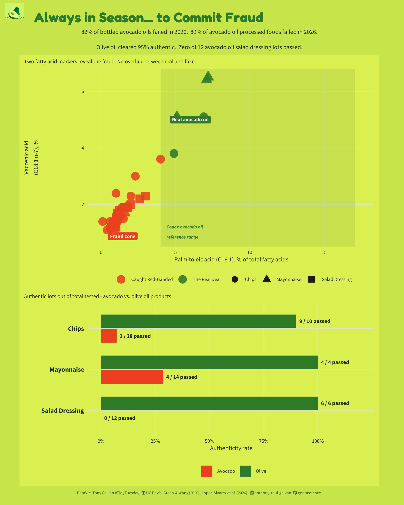

UC Davis researchers tested 37 avocado oil products in 2026 and found 89% failed authenticity testing -- including zero of 12 salad dressing lots. Six years earlier, 82% of bottled avocado oils were rancid or outright fake. Meanwhile olive oil, regulated for decades, cleared 95% authentic. Kiro built the full analysis including a tidymodels logistic regression fraud classifier trained on fatty acid chemical fingerprints.

---

You grabbed the avocado oil chips. The front of the bag says “Made with
100% Pure Avocado Oil.” You paid extra for it. There’s a good chance you
were lied to.

UC Davis researchers tested 37 avocado oil chip, mayonnaise, and salad
dressing products in 2026 — two lots of each — and found that **89% of
the avocado-labeled samples failed authenticity testing**. Every single
salad dressing labeled “made with avocado oil” failed. Every lot. Not
one passed. Six years earlier, the same research group found that **82%
of bottled avocado oils** were either rancid before their expiration
date or outright replaced with cheaper oils.

Meanwhile, olive oil — a category with decades of regulation and legal
standards — cleared 95% authentic across the same chip, mayo, and
dressing tests.

This is not a rounding error. It’s a market where consumers are
systematically paying a premium for a product they are not receiving.
And the chemistry tells the story with unusual precision.

``` r
library(tidyverse)
library(scales)
library(tidymodels)
library(showtext)
library(ggtext)
library(patchwork)
library(vip)
library(broom)

# Avocados From Mexico palette
avo_lime    <- "#C8E64C"   # bright lime green (outer background)
avo_green   <- "#2D7A27"   # deep avocado green
avo_red     <- "#E8401C"   # bold orange-red
avo_dark    <- "#1A2E0A"   # dark charcoal/near-black
avo_yellow  <- "#F5C518"   # warm yellow accent
avo_panel   <- "#DCF050"   # panel background (slightly darker lime)

font_add_google("Fredoka", "fredoka")
font_add_google("Source Sans 3", "source_sans")
font_add(family = "fa-brands",
         regular = "C:/Users/tonyg/Downloads/fontawesome-free-7.3.1-desktop/fontawesome-free-7.3.1-desktop/otfs/Font Awesome 7 Brands-Regular-400.otf")
font_add(family = "fa-solid",
         regular = "C:/Users/tonyg/Downloads/fontawesome-free-7.3.1-desktop/fontawesome-free-7.3.1-desktop/otfs/Font Awesome 7 Free-Solid-900.otf")
showtext_auto()
showtext_opts(dpi = 200)

theme_avo <- function(base_size = 13) {
  theme_minimal(base_family = "source_sans", base_size = base_size) +
    theme(
      plot.background  = element_rect(fill = avo_panel, color = NA),
      panel.background = element_rect(fill = avo_panel, color = NA),
      panel.grid.minor = element_blank(),
      panel.grid.major = element_line(color = "#d8e8b0", linewidth = 0.4),
      axis.ticks       = element_blank(),
      text             = element_text(color = avo_dark),
      axis.text        = element_text(color = avo_dark, size = 11),
      plot.title       = element_text(
        family = "fredoka", face = "bold", size = base_size + 5,
        color = avo_green, hjust = 0
      ),
      plot.subtitle    = element_text(size = base_size - 1, color = avo_dark, hjust = 0),
      plot.caption     = element_text(size = 8, color = "gray50", hjust = 0.5),
      plot.title.position = "plot",
      legend.background = element_rect(fill = avo_panel, color = NA)
    )
}
theme_set(theme_avo())
```

``` r
# Load from local cache
cache_path <- ".kiro/specs/2026_10_06_tidy_tuesday_avocado_oil/tt_cache.rds"
if (!file.exists(cache_path)) {
  cache_path <- file.path("../..", cache_path)
}
tt <- readRDS(cache_path)
bottles <- tt$avocado_oil_bottles
foods   <- tt$avocado_oil_processed_foods
```

## The Datasets

Two studies, six years apart, both from UC Davis.
**`avocado_oil_bottles`** (22 rows) is a 2020 survey of bottled avocado
oils bought online and in stores, with full chemical fingerprints: fatty
acid percentages, sterol composition, and vitamin E content.
**`avocado_oil_processed_foods`** (74 rows) is a 2026 study of processed
foods — chips, mayonnaise, and salad dressings — each product tested in
two separately purchased lots. The 74 rows represent 37 products times
two lots each.

``` r
glimpse(bottles)
```

    ## Rows: 22
    ## Columns: 35
    ## $ sample_code                 <chr> "EV1", "EV2", "EV3", "EV4", "EV5", "EV6", ~
    ## $ grade_labeled               <chr> "extra virgin", "extra virgin", "extra vir~
    ## $ purchasing_method           <chr> "Online", "In store", "In store", "In stor~
    ## $ expiration_date             <chr> "Oct-21", "Jun-21", "Feb-21", "Sep-20", "J~
    ## $ product_origin              <chr> "California", "California", "Mexico", "Cal~
    ## $ cost_per_fl_oz              <dbl> 2.23, 1.29, 0.65, 1.53, 1.57, 0.49, 2.35, ~
    ## $ packaging_type              <chr> "Dark glass", "Dark glass", "Dark glass", ~
    ## $ oxidized                    <lgl> TRUE, TRUE, NA, TRUE, TRUE, NA, TRUE, TRUE~
    ## $ purity_result               <chr> "pure", "pure", "adulterated", "pure", "pu~
    ## $ adulterant                  <chr> NA, NA, "soybean oil", NA, NA, "soybean oi~
    ## $ alpha_tocopherol_mg_kg      <dbl> 155.2, 116.0, 87.3, 120.7, 143.3, 95.9, 14~
    ## $ gamma_beta_tocopherol_mg_kg <dbl> NA, NA, 412.5, NA, NA, 581.3, NA, 108.8, N~
    ## $ delta_tocopherol_mg_kg      <dbl> NA, NA, 145.6, NA, NA, 229.0, NA, NA, NA, ~
    ## $ total_tocopherols_mg_kg     <dbl> 155.2, 116.0, 645.4, 120.7, 143.3, 906.2, ~
    ## $ c14_0_pct                   <dbl> NA, 0.1, 0.1, 0.1, 0.1, 0.1, NA, NA, NA, N~
    ## $ c16_0_palmitic_pct          <dbl> 16.5, 15.6, 10.9, 15.5, 15.6, 10.4, 16.0, ~
    ## $ c16_1_palmitoleic_pct       <dbl> 6.9, 6.5, 0.1, 6.4, 6.4, 0.1, 6.6, 1.7, 5.~
    ## $ c18_0_stearic_pct           <dbl> 0.5, 0.5, 4.0, 0.5, 0.5, 3.8, 0.5, 2.3, 1.~
    ## $ c18_1_oleic_pct             <dbl> 55.6, 61.0, 21.4, 59.3, 58.6, 19.7, 62.4, ~
    ## $ c18_2_linoleic_pct          <dbl> 19.2, 15.2, 54.4, 17.0, 17.5, 55.4, 13.4, ~
    ## $ c18_3_linolenic_pct         <dbl> 1.2, 1.0, 8.2, 1.1, 1.1, 9.8, 0.9, 0.5, 0.~
    ## $ c20_0_pct                   <dbl> NA, NA, 0.3, NA, NA, 0.4, NA, 0.3, 0.2, 0.~
    ## $ c20_1_pct                   <dbl> 0.1, 0.2, 0.2, 0.2, 0.2, 0.2, 0.2, 0.3, 0.~
    ## $ c22_0_pct                   <dbl> NA, NA, 0.3, NA, NA, 0.3, NA, 0.4, 0.2, 0.~
    ## $ c24_0_pct                   <dbl> NA, NA, 0.1, NA, NA, 0.1, NA, 0.2, 0.1, 0.~
    ## $ brassicasterol_pct          <dbl> 0.4, NA, NA, NA, NA, NA, NA, NA, NA, NA, N~
    ## $ campesterol_pct             <dbl> 5.5, 5.4, 20.3, 5.6, 5.8, 23.3, 6.3, 8.6, ~
    ## $ stigmasterol_pct            <dbl> 0.8, NA, 15.8, 0.6, 0.6, 15.0, NA, 4.6, 1.~
    ## $ delta7_campesterol_pct      <dbl> NA, NA, NA, NA, NA, NA, NA, NA, NA, NA, NA~
    ## $ clerosterol_pct             <dbl> 1.9, 1.9, NA, 1.8, 1.9, NA, 1.9, 0.9, 1.2,~
    ## $ beta_sitosterol_pct         <dbl> 85.6, 86.8, 56.3, 86.0, 85.4, 55.2, 86.3, ~
    ## $ delta5_avenasterol_pct      <dbl> 5.7, 5.8, 2.7, 6.0, 6.3, 3.8, 5.6, 4.5, 4.~
    ## $ delta7_stigmasterol_pct     <dbl> NA, NA, 2.8, NA, NA, 1.5, NA, 4.3, 1.5, 2.~
    ## $ delta7_avenasterol_pct      <dbl> NA, NA, 2.1, NA, NA, 1.3, NA, 1.4, NA, NA,~
    ## $ total_sterols_mg_kg         <dbl> 5955, 4670, 2601, 5649, 5245, 3306, 4263, ~

``` r
glimpse(foods)
```

    ## Rows: 74
    ## Columns: 45
    ## $ sample_number                 <dbl> 1, 2, 3, 4, 5, 6, 7, 8, 9, 10, 11, 12, 1~
    ## $ product_id                    <dbl> 1, 1, 2, 2, 3, 3, 4, 4, 5, 5, 6, 6, 7, 7~
    ## $ lot                           <dbl> 1, 2, 1, 2, 1, 2, 1, 2, 1, 2, 1, 2, 1, 2~
    ## $ category                      <chr> "chips", "chips", "chips", "chips", "chi~
    ## $ oil_type                      <chr> "avocado", "avocado", "olive", "olive", ~
    ## $ declared_oil                  <chr> "Avocado Oil", "Avocado Oil", "Olive Oil~
    ## $ front_label                   <chr> "Avocado Oil", "Avocado Oil", "Olive Oil~
    ## $ other_ingredients             <chr> "potatoes, sea salt", "potatoes, sea sal~
    ## $ package_size_oz               <dbl> 5.25, 22.00, 6.50, 6.50, 6.00, 6.00, 6.2~
    ## $ retail_price_usd              <dbl> 3.99, 6.59, 3.99, 4.79, 4.99, 4.99, 4.99~
    ## $ purchase_location             <chr> "Online", "CA retail", "CA retail", "CA ~
    ## $ authentic                     <lgl> FALSE, FALSE, FALSE, TRUE, FALSE, TRUE, ~
    ## $ c6_0_pct                      <lgl> NA, NA, NA, NA, NA, NA, NA, NA, NA, NA, ~
    ## $ c8_0_pct                      <lgl> NA, NA, NA, NA, NA, NA, NA, NA, NA, NA, ~
    ## $ c10_0_pct                     <lgl> NA, NA, NA, NA, NA, NA, NA, NA, NA, NA, ~
    ## $ c12_0_pct                     <lgl> NA, NA, NA, NA, NA, NA, NA, NA, NA, NA, ~
    ## $ c14_0_pct                     <dbl> NA, NA, NA, NA, NA, 0.1, NA, NA, NA, NA,~
    ## $ c16_0_palmitic_pct            <dbl> 8.1, 8.7, 7.8, 12.1, 14.2, 14.1, 12.3, 1~
    ## $ c16_1_palmitoleic_pct         <dbl> 1.0, 1.0, 1.0, 0.9, 2.3, 4.9, 1.2, 1.2, ~
    ## $ c17_0_pct                     <dbl> NA, NA, NA, 0.1, 0.1, NA, 0.1, 0.1, NA, ~
    ## $ c17_1_pct                     <dbl> 0.1, NA, 0.1, 0.1, 0.1, 0.1, 0.1, 0.1, 0~
    ## $ c18_0_stearic_pct             <dbl> 2.6, 2.5, 2.6, 3.0, 2.7, 1.3, 3.8, 3.8, ~
    ## $ c18_1_oleic_pct               <dbl> 74.2, 72.2, 71.8, 70.5, 69.5, 65.0, 71.0~
    ## $ c18_1n7_vaccenic_pct          <dbl> 1.6, 1.5, 1.5, 2.3, 3.0, 3.8, 2.3, 2.3, ~
    ## $ c18_2_linoleic_pct            <dbl> 12.4, 14.2, 15.1, 11.4, 9.7, 13.5, 9.8, ~
    ## $ c18_3_linolenic_pct           <dbl> 0.3, 0.4, 0.3, 0.7, 0.6, 0.6, 0.9, 0.9, ~
    ## $ c20_0_pct                     <dbl> 0.3, 0.3, 0.3, 0.5, 0.4, 0.2, 0.4, 0.4, ~
    ## $ c20_1_pct                     <dbl> 0.3, 0.2, 0.3, 0.3, 0.2, 0.2, 0.2, 0.2, ~
    ## $ c20_2_pct                     <lgl> NA, NA, NA, NA, NA, NA, NA, NA, NA, NA, ~
    ## $ c22_0_pct                     <dbl> 0.6, 0.5, 0.7, 0.2, 0.1, 0.2, 0.1, 0.1, ~
    ## $ c24_1_pct                     <lgl> NA, NA, NA, NA, NA, NA, NA, NA, NA, NA, ~
    ## $ brassicasterol_pct            <dbl> 0.3, NA, 0.2, 0.3, NA, NA, 0.4, NA, NA, ~
    ## $ methylene_cholesterol_pct     <dbl> 0.4, 0.5, 0.5, 1.1, 0.3, 0.3, 0.3, 0.5, ~
    ## $ campesterol_pct               <dbl> 9.8, 11.5, 9.6, 4.0, 5.9, 7.0, 5.5, 5.6,~
    ## $ campestanol_pct               <dbl> 0.7, 0.8, 0.7, 0.3, 0.3, 0.5, NA, NA, 0.~
    ## $ stigmasterol_pct              <dbl> 6.6, 7.0, 7.0, 1.8, 1.6, 1.7, 3.5, 3.5, ~
    ## $ delta7_campesterol_pct        <dbl> 1.2, 1.3, 1.4, 0.2, NA, 0.6, NA, NA, 0.4~
    ## $ clerosterol_pct               <dbl> 0.5, 0.5, 0.5, 1.2, 0.9, 1.3, 0.4, 0.4, ~
    ## $ beta_sitosterol_pct           <dbl> 68.0, 64.8, 67.0, 80.3, 81.7, 78.6, 82.9~
    ## $ sitostanol_pct                <dbl> 0.2, 0.6, 0.5, NA, 1.6, 1.3, NA, NA, 2.7~
    ## $ delta5_avenasterol_pct        <dbl> 2.6, 3.2, 4.0, 10.3, 3.2, 4.9, 6.4, 7.2,~
    ## $ delta5_24_stigmastadienol_pct <dbl> 1.3, 1.1, 0.2, NA, 0.6, 2.5, NA, NA, 0.6~
    ## $ delta7_stigmastenol_pct       <dbl> 5.5, 5.8, 5.9, NA, 3.5, NA, NA, NA, NA, ~
    ## $ delta7_avenasterol_pct        <dbl> 3.0, 2.8, 2.4, 0.6, 0.5, 1.2, 0.6, 0.7, ~
    ## $ apparent_beta_sitosterol_pct  <dbl> NA, NA, 72.3, 91.8, NA, NA, 89.7, 89.8, ~

## EDA: The Bottled Oil Market (2020)

### Who’s selling what

``` r
bottles |>
  count(grade_labeled, purity_result) |>
  mutate(
    grade_labeled = str_to_title(grade_labeled),
    purity_result = factor(
      purity_result,
      levels = c("pure", "suspected", "adulterated"),
      labels = c("Pure", "Suspected", "Adulterated")
    )
  ) |>
  ggplot(aes(x = n, y = fct_rev(grade_labeled), fill = purity_result)) +
  geom_col(position = "fill", width = 0.65) +
  geom_text(
    aes(label = n),
    position = position_fill(vjust = 0.5),
    color = "white", family = "source_sans", size = 5, fontface = "bold"
  ) +
  scale_fill_manual(
    values = c("Pure" = avo_green, "Suspected" = avo_yellow, "Adulterated" = avo_red),
    name = NULL
  ) +
  scale_x_continuous(labels = percent_format()) +
  labs(
    title = "Adulteration is not confined to cheap grades",
    subtitle = "Purity result by labeled grade. Even \"extra virgin\" bottles were caught.",
    x = "Share of samples", y = NULL
  ) +
  theme(legend.position = "top")
```

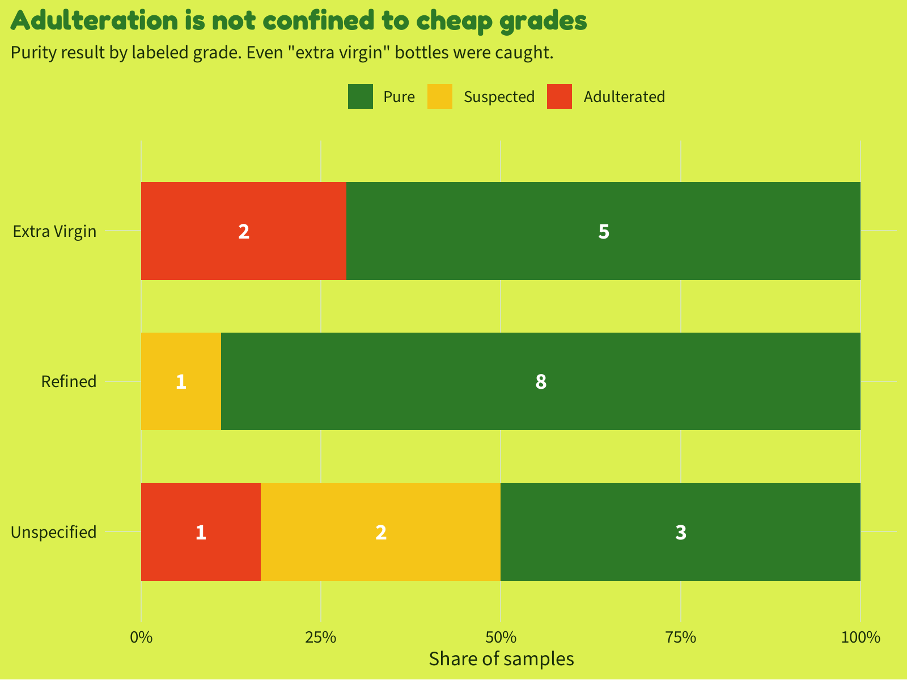<!-- -->

“Extra virgin” is a label with no legal definition for avocado oil in
the US — and it shows. Two of the seven extra virgin bottles in the 2020
study contained soybean oil.

### Price vs. purity: you get what you pay for, sort of

``` r
bottles |>
  mutate(
    purity_result = factor(
      purity_result,
      levels = c("adulterated", "suspected", "pure"),
      labels = c("Adulterated", "Suspected", "Pure")
    )
  ) |>
  ggplot(aes(x = purity_result, y = cost_per_fl_oz, fill = purity_result)) +
  geom_boxplot(width = 0.5, outlier.shape = NA, alpha = 0.8, color = avo_dark) +
  geom_jitter(width = 0.15, size = 2.5, color = avo_dark, alpha = 0.7) +
  scale_fill_manual(
    values = c("Pure" = avo_green, "Suspected" = avo_yellow, "Adulterated" = avo_red),
    guide = "none"
  ) +
  scale_y_continuous(labels = dollar_format()) +
  labs(
    title = "Adulterated oils are cheaper — but not reliably",
    subtitle = "Price per fl oz by purity result. Some pure oils cost less than $0.50.",
    x = NULL, y = "Price per fl oz"
  )
```

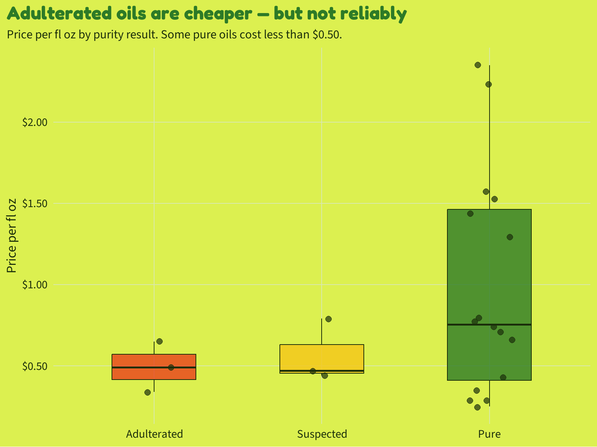<!-- -->

Adulterated oils cluster at the low end (mean \$0.49/oz vs. \$0.98/oz
for pure), but the range for pure oils is enormous — from \$0.25 to
\$2.35. Paying more is no guarantee. The two most expensive bottles
tested (\$2.23 and \$2.35) both came back pure, but so did the \$0.25
bottle.

### The oxidation problem: pure but stale

``` r
bottles |>
  filter(purity_result == "pure") |>
  count(oxidized) |>
  mutate(
    label = case_when(
      oxidized ~ "Oxidized before expiration",
      !oxidized ~ "Fresh at time of test",
      TRUE ~ "Not assessed"
    ),
    pct = n / sum(n)
  ) |>
  ggplot(aes(x = "", y = pct, fill = label)) +
  geom_col(width = 0.4) +
  geom_text(
    aes(label = paste0(label, "\n", n, " samples (", percent(pct, 1), ")")),
    position = position_stack(vjust = 0.5),
    family = "source_sans", size = 4.5, color = "white", fontface = "bold"
  ) +
  scale_fill_manual(values = c(
    "Oxidized before expiration" = avo_red,
    "Fresh at time of test"      = avo_green
  ), guide = "none") +
  scale_y_continuous(labels = percent_format()) +
  coord_flip() +
  labs(
    title = "Even the pure oils were mostly rancid",
    subtitle = "14 of 16 pure avocado oil bottles were oxidized before their expiration date",
    x = NULL, y = NULL
  ) +
  theme(axis.text = element_blank(), panel.grid = element_blank())
```

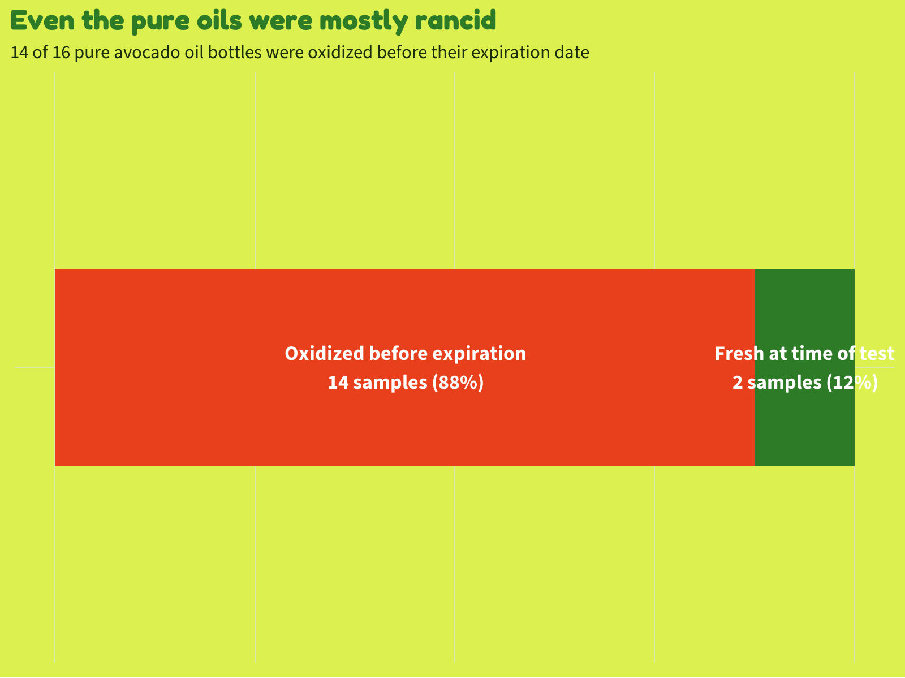<!-- -->

This is the detail that should unsettle you. Being pure is not enough.
Of the 16 pure bottled oils, **14 were already oxidized** — showing
elevated free fatty acid or peroxide levels that signal rancidity —
before the printed best-by date. Only two samples (R3, made by Chosen
Foods, and R5) passed both tests: pure avocado oil *and* not yet rancid.

### Key chemical markers

Chemists detect avocado oil fraud using [fatty acid
profiling](https://en.wikipedia.org/wiki/Fatty_acid_profile) — measuring
the proportions of individual fatty acid chains in the oil. Authentic
avocado oil has a characteristic fingerprint: high [palmitoleic
acid](https://en.wikipedia.org/wiki/Palmitoleic_acid) (C16:1, typically
5-9%), a dominant [oleic acid](https://en.wikipedia.org/wiki/Oleic_acid)
peak (C18:1, 55-70%), and moderate [linoleic
acid](https://en.wikipedia.org/wiki/Linoleic_acid) (C18:2, 9-20%).
Soybean oil has almost no palmitoleic acid, about 50% linoleic acid, and
high [linolenic
acid](https://en.wikipedia.org/wiki/Alpha-Linolenic_acid) (C18:3, above
3%).

``` r
bottles |>
  select(purity_result, c16_1_palmitoleic_pct, c18_1_oleic_pct, 
         c18_2_linoleic_pct, beta_sitosterol_pct) |>
  pivot_longer(-purity_result, names_to = "marker", values_to = "pct") |>
  filter(!is.na(pct)) |>
  mutate(
    purity_result = factor(
      purity_result,
      levels = c("pure", "suspected", "adulterated"),
      labels = c("Pure", "Suspected", "Adulterated")
    ),
    marker = case_when(
      marker == "c16_1_palmitoleic_pct"  ~ "Palmitoleic acid\n(C16:1) %",
      marker == "c18_1_oleic_pct"        ~ "Oleic acid\n(C18:1) %",
      marker == "c18_2_linoleic_pct"     ~ "Linoleic acid\n(C18:2) %",
      marker == "beta_sitosterol_pct"    ~ "Beta-sitosterol\n(sterol) %"
    )
  ) |>
  ggplot(aes(x = purity_result, y = pct, fill = purity_result)) +
  geom_boxplot(width = 0.6, outlier.shape = NA, alpha = 0.85, color = avo_dark) +
  geom_jitter(width = 0.12, size = 2, color = avo_dark, alpha = 0.7) +
  scale_fill_manual(
    values = c("Pure" = avo_green, "Suspected" = avo_yellow, "Adulterated" = avo_red),
    guide = "none"
  ) +
  facet_wrap(~ marker, scales = "free_y") +
  labs(
    title = "Chemistry catches the fraud",
    subtitle = "Four key markers separate pure from adulterated. The separation on palmitoleic acid is near-perfect.",
    x = NULL, y = "Percent of total"
  ) +
  theme(strip.text = element_text(family = "source_sans", size = 10, color = avo_dark, face = "bold"))
```

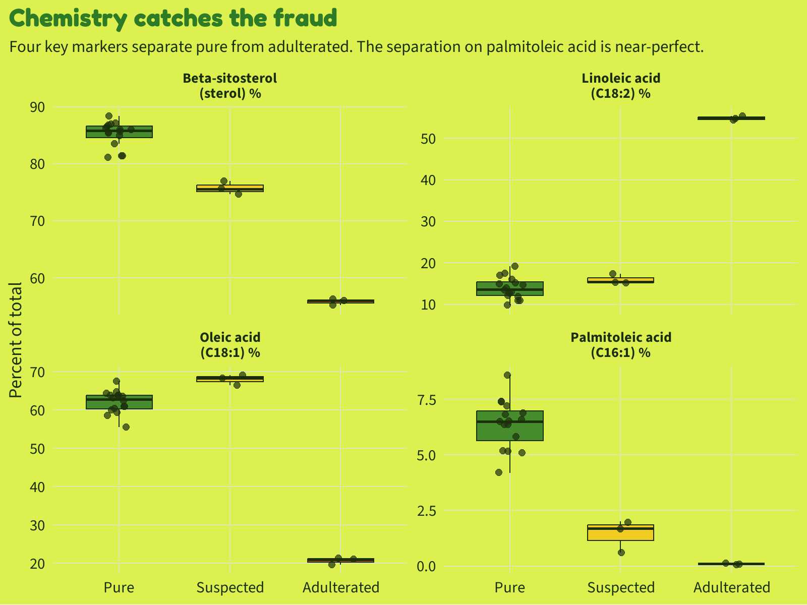<!-- -->

The palmitoleic acid panel is striking: every pure sample sits between
5% and 8%. Every adulterated sample sits near 0%. There is no overlap.
The suspected samples fall in between — consistent with partial
substitution using high-oleic sunflower or safflower oil, which has less
palmitoleic acid than avocado but more than soybean.

## EDA: Processed Foods (2026)

### Avocado oil is nearly gone from the supply chain

``` r
foods |>
  group_by(oil_type, category) |>
  summarise(
    n = n(),
    n_authentic = sum(authentic, na.rm = TRUE),
    pct_authentic = mean(authentic, na.rm = TRUE),
    .groups = "drop"
  ) |>
  mutate(
    oil_type = str_to_title(oil_type),
    category = str_to_title(str_replace(category, "_", " ")),
    label = paste0(n_authentic, "/", n, "\n(", percent(pct_authentic, 1), ")")
  ) |>
  ggplot(aes(
    x = category,
    y = pct_authentic,
    fill = interaction(oil_type, pct_authentic > 0.5)
  )) +
  geom_col(width = 0.6, show.legend = FALSE) +
  geom_text(
    aes(label = label, y = pmax(pct_authentic - 0.04, 0)),
    vjust = 1, family = "source_sans", fontface = "bold",
    size = 4.2, color = "white"
  ) +
  scale_fill_manual(values = c(
    "Avocado.FALSE" = avo_red,
    "Avocado.TRUE"  = avo_green,
    "Olive.FALSE"   = "#c0392b",
    "Olive.TRUE"    = avo_green
  )) +
  scale_y_continuous(labels = percent_format(), limits = c(0, 1.08)) +
  facet_wrap(~ oil_type, ncol = 2) +
  labs(
    title = "Olive oil: 95% authentic. Avocado oil: 11%.",
    subtitle = "Authenticity rate by product category. Every avocado oil salad dressing failed.",
    x = NULL, y = "Authentic lots"
  ) +
  theme(strip.text = element_text(
    family = "fredoka", size = 14, color = avo_dark, face = "bold"
  ))
```

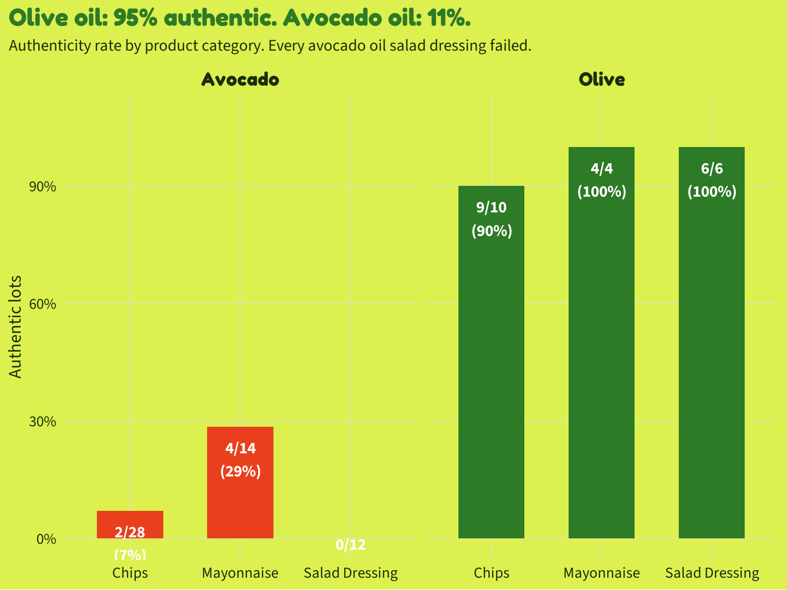<!-- -->

The contrast is the story. Olive oil products are nearly always what
they say. Avocado oil products almost never are. Zero of 12 avocado oil
salad dressing lots passed. Two of 28 avocado oil chip lots passed. Four
of 14 avocado mayo lots passed — the “best” category, still 71% failure.

### Does paying more help?

``` r
foods |>
  filter(oil_type == "avocado") |>
  mutate(
    price_per_oz = retail_price_usd / package_size_oz,
    auth_label   = if_else(authentic, "Authentic", "Failed")
  ) |>
  ggplot(aes(x = auth_label, y = price_per_oz, fill = auth_label)) +
  geom_boxplot(width = 0.5, outlier.shape = NA, alpha = 0.85, color = avo_dark) +
  geom_jitter(width = 0.15, size = 2.5, alpha = 0.7, color = avo_dark) +
  scale_fill_manual(
    values = c("Authentic" = avo_green, "Failed" = avo_red),
    guide  = "none"
  ) +
  scale_y_continuous(labels = dollar_format()) +
  labs(
    title = "Authentic avocado products cost more",
    subtitle = "Price per oz for avocado oil products. But paying more is still no guarantee.",
    x = NULL, y = "Price per oz (avocado products only)"
  )
```

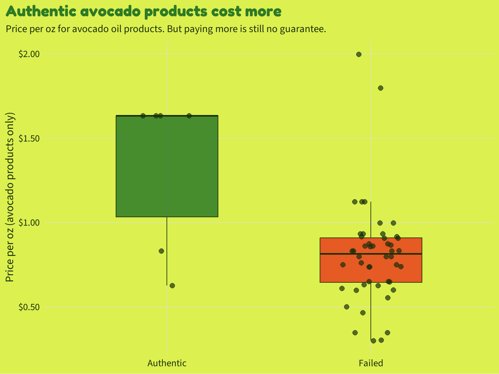<!-- -->

The six authentic avocado lots cost a mean of \$1.33/oz; the 48 failed
lots cost \$0.81/oz. But as with bottled oils, there is real overlap —
some cheap products are authentic and some expensive ones are not. Price
is a signal, not a guarantee.

### Batch-to-batch consistency

``` r
foods |>
  group_by(product_id, oil_type, category) |>
  summarise(
    lots_tested  = n(),
    lots_passed  = sum(authentic, na.rm = TRUE),
    consistent   = lots_tested == lots_passed | lots_passed == 0,
    outcome      = case_when(
      lots_passed == lots_tested ~ "Both lots authentic",
      lots_passed == 0           ~ "Both lots failed",
      TRUE                       ~ "Mixed (1 pass, 1 fail)"
    ),
    .groups = "drop"
  ) |>
  count(oil_type, outcome) |>
  mutate(
    oil_type = str_to_title(oil_type),
    outcome  = factor(outcome, levels = c(
      "Both lots authentic", "Mixed (1 pass, 1 fail)", "Both lots failed"
    ))
  ) |>
  ggplot(aes(y = fct_rev(outcome), x = n, fill = outcome)) +
  geom_col(width = 0.65) +
  geom_text(aes(label = n), hjust = -0.3, family = "source_sans", size = 5, color = avo_dark) +
  scale_fill_manual(
    values = c(
      "Both lots authentic"      = avo_green,
      "Mixed (1 pass, 1 fail)"   = avo_yellow,
      "Both lots failed"         = avo_red
    ),
    guide = "none"
  ) +
  scale_x_continuous(expand = expansion(mult = c(0, 0.15))) +
  facet_wrap(~ oil_type) +
  labs(
    title = "Fraud is consistent within brands",
    subtitle = "For each of 37 products, both lots were tested. Most fraudulent products failed both times.",
    x = "Number of products", y = NULL
  ) +
  theme(strip.text = element_text(
    family = "fredoka", size = 14, color = avo_dark, face = "bold"
  ))
```

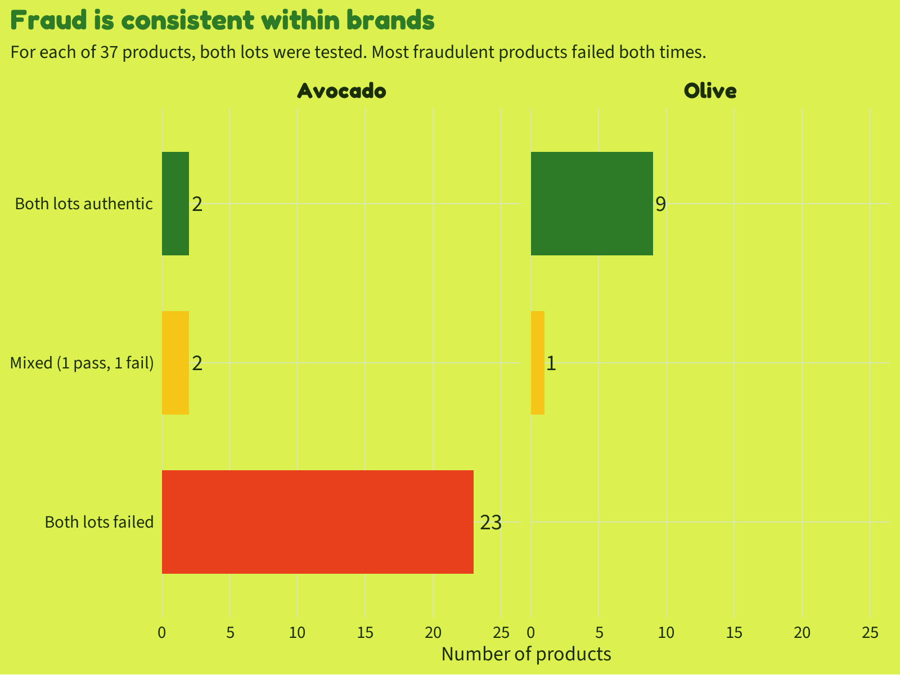<!-- -->

If a product’s oil is being substituted, it tends to fail both lots —
this is not a manufacturing accident but a systematic ingredient switch.
Only 3 of 27 avocado oil products had mixed results (one lot passing,
one failing), suggesting the fraud is baked in at the supplier level,
not a one-off batch error.

## Building a Fraud Detector: Logistic Regression on Chemical Fingerprints

We have the chemical data — can a model learn to classify authentic from
fraudulent using only fatty acid and sterol measurements? This is
exactly what regulators would want: an automated screen that flags
suspect products for further testing.

[Logistic regression](https://en.wikipedia.org/wiki/Logistic_regression)
is a classification algorithm that estimates the probability that an
observation belongs to one of two categories — here, “authentic” or
“fraudulent.” Unlike a black-box model, it gives us interpretable
coefficients: each fatty acid’s coefficient tells us how strongly that
marker pushes toward or away from authentic. We’ll train it on the
processed foods dataset (74 rows, avocado products only) and use
[leave-one-out
cross-validation](https://en.wikipedia.org/wiki/Cross-validation_(statistics)#Leave-one-out_cross-validation)
to estimate how well it generalizes.

LOOCV is appropriate here because the dataset is tiny: with 54 avocado
samples, holding out a full 20% test set (11 rows) would leave us with
very little training data. Instead, we train 54 separate models, each
leaving one sample out, and check whether each left-out sample was
correctly classified.

``` r
# Focus on avocado oil products only (the fraud problem)
# Use fatty acid markers that are most discriminatory
avo_foods <- foods |>
  filter(oil_type == "avocado") |>
  select(
    authentic,
    c16_1_palmitoleic_pct,
    c18_1n7_vaccenic_pct,
    c18_1_oleic_pct,
    c18_2_linoleic_pct,
    c18_3_linolenic_pct,
    c18_0_stearic_pct,
    beta_sitosterol_pct,
    campesterol_pct,
    stigmasterol_pct
  ) |>
  # Drop rows with any missing values in our predictors
  drop_na() |>
  mutate(authentic = factor(if_else(authentic, "authentic", "fraudulent"),
                            levels = c("authentic", "fraudulent")))

cat("Training samples:", nrow(avo_foods), "\n")
```

    ## Training samples: 54

``` r
cat("Authentic:", sum(avo_foods$authentic == "authentic"), "\n")
```

    ## Authentic: 6

``` r
cat("Fraudulent:", sum(avo_foods$authentic == "fraudulent"), "\n")
```

    ## Fraudulent: 48

``` r
# Build a tidymodels logistic regression workflow
log_spec <- logistic_reg(engine = "glm")

log_recipe <- recipe(authentic ~ ., data = avo_foods) |>
  step_normalize(all_numeric_predictors())

log_wf <- workflow() |>
  add_model(log_spec) |>
  add_recipe(log_recipe)

# Leave-one-out cross-validation via manual loop
# (LOO splits are not supported by tune::fit_resamples; we iterate directly)
set.seed(42)
n <- nrow(avo_foods)
loo_preds <- map_dfr(seq_len(n), function(i) {
  train_data <- avo_foods[-i, ]
  test_data  <- avo_foods[ i, ]
  fit <- log_wf |> fit(train_data)
  pred_class <- predict(fit, test_data)$.pred_class
  pred_prob  <- predict(fit, test_data, type = "prob")$.pred_authentic
  tibble(
    .row        = i,
    truth       = test_data$authentic,
    .pred_class = pred_class,
    .pred_authentic = pred_prob
  )
})

# Accuracy and AUC
acc <- mean(loo_preds$.pred_class == loo_preds$truth)
cat(sprintf("LOO Accuracy: %.1f%%\n", acc * 100))
```

    ## LOO Accuracy: 98.1%

``` r
roc_auc(loo_preds, truth = truth, .pred_authentic) |> print()
```

    ## # A tibble: 1 x 3
    ##   .metric .estimator .estimate
    ##   <chr>   <chr>          <dbl>
    ## 1 roc_auc binary             1

``` r
# Confusion matrix from LOO predictions
conf_mat(loo_preds, truth = truth, estimate = .pred_class) |>
  autoplot(type = "heatmap") +
  scale_fill_gradient(low = avo_panel, high = avo_green) +
  labs(
    title = "Confusion matrix: LOO cross-validation",
    subtitle = "How often did the model correctly classify each left-out sample?"
  ) +
  theme(
    axis.text = element_text(size = 12),
    legend.position = "none"
  )
```

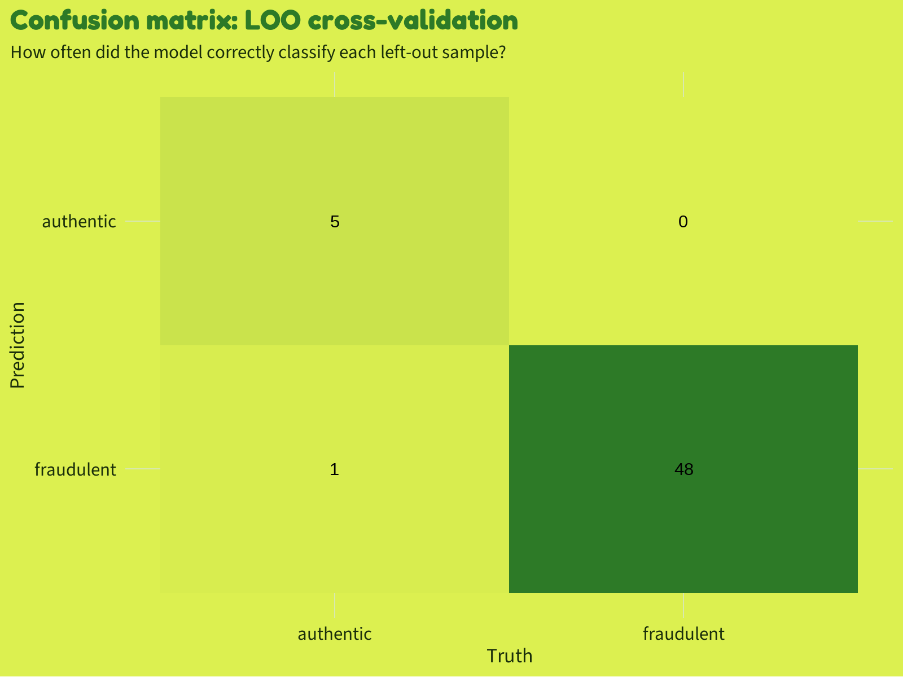<!-- -->

``` r
# Fit the full model on all data to get variable importance
full_fit <- log_wf |> fit(avo_foods)

# Extract the underlying glm model for variable importance
full_fit |>
  extract_fit_parsnip() |>
  vip(
    num_features = 9,
    aesthetics   = list(fill = avo_green, color = avo_dark, alpha = 0.9)
  ) +
  labs(
    title = "Palmitoleic acid carries the most signal",
    subtitle = "Variable importance from logistic regression (normalized coefficients).\nHigher = stronger predictor of authenticity.",
    x = "Importance", y = NULL
  ) +
  theme(axis.text.y = element_text(size = 12))
```

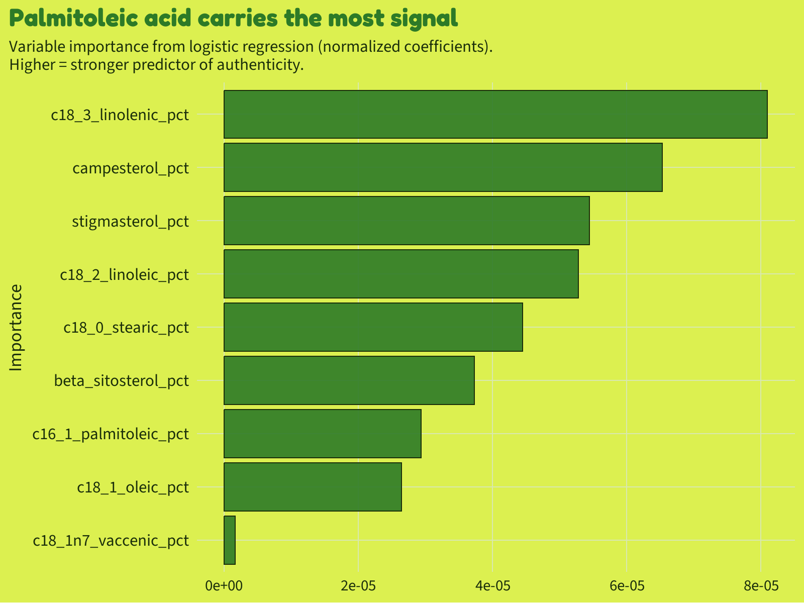<!-- -->

Palmitoleic acid (C16:1) dominates the model — and that makes chemical
sense. Avocado oil is one of the very few common cooking oils with
substantial palmitoleic acid. Soybean and sunflower oil have essentially
none. When you see C16:1 above 4%, you’re almost certainly looking at
real avocado oil. When it’s near zero, you’re not.

Vaccenic acid (C18:1 n-7) comes in second. Like palmitoleic, it’s a
fatty acid present at meaningful levels in avocado oil (~4-6%) but much
lower in commodity vegetable oils (~1-2%). Together, these two markers
are the chemical signature of the avocado.

``` r
# Scatter plot in the palmitoleic / vaccenic space — the clearest visual
foods |>
  filter(oil_type == "avocado") |>
  mutate(
    auth_label = if_else(authentic, "Authentic avocado oil", "Fraudulent / adulterated"),
    category   = str_to_title(str_replace(category, "_", " "))
  ) |>
  filter(!is.na(c16_1_palmitoleic_pct), !is.na(c18_1n7_vaccenic_pct)) |>
  ggplot(aes(
    x     = c16_1_palmitoleic_pct,
    y     = c18_1n7_vaccenic_pct,
    color = auth_label,
    shape = category
  )) +
  geom_point(size = 4, alpha = 0.85, stroke = 1.2) +
  # Avocado oil Codex reference ranges
  annotate("rect",
    xmin = 4.0, xmax = 17.1,
    ymin = 0,   ymax = Inf,
    fill = avo_green, alpha = 0.07
  ) +
  annotate("text",
    x = 4.2, y = 6.5,
    label = "Codex range\nfor avocado oil",
    hjust = 0, family = "source_sans", size = 3.5, color = avo_green, fontface = "italic"
  ) +
  scale_color_manual(
    values = c(
      "Authentic avocado oil"      = avo_green,
      "Fraudulent / adulterated"   = avo_red
    ),
    name = NULL
  ) +
  scale_shape_manual(
    values = c("Chips" = 16, "Mayonnaise" = 17, "Salad Dressing" = 15),
    name   = "Category"
  ) +
  labs(
    title    = "The chemical fingerprint of fraud",
    subtitle = "Avocado oil products in fatty acid space. The two clusters barely overlap.",
    x        = "Palmitoleic acid (C16:1), % of total fatty acids",
    y        = "Vaccenic acid (C18:1 n-7), % of total fatty acids",
    caption  = "Data: UC Davis / Lopez-Alvarez et al. (2026), Applied Food Research"
  ) +
  theme(legend.position = "bottom")
```

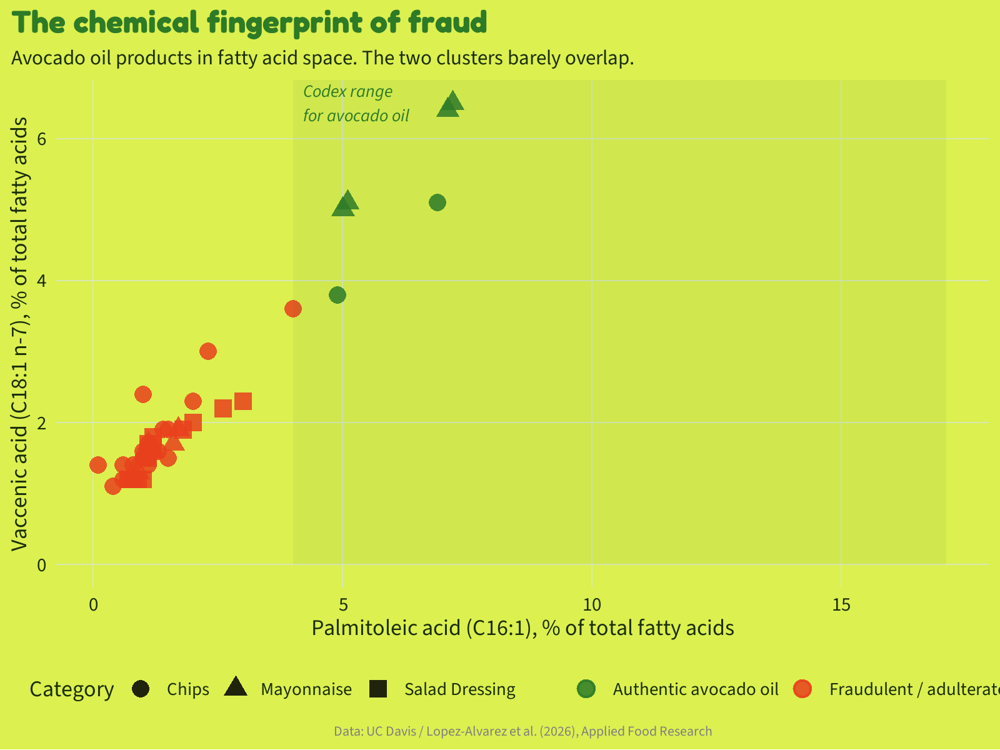<!-- -->

The scatter is almost perfectly separated. Authentic avocado products
sit in the upper-right, with both palmitoleic and vaccenic acid well
above the fraud cluster. The fraudulent samples compress into the
lower-left corner. The shaded region is the [Codex
Alimentarius](https://en.wikipedia.org/wiki/Codex_Alimentarius)
reference range — the international food safety standard for avocado
oil. Most fraudulent samples are far outside it.

## The Hero Chart: Chemical Fingerprint

``` r
# Avocado oil chemical fingerprint hero chart
# Combined: scatter (palmitoleic vs vaccenic) + category authenticity bars

# Panel 1: Chemical fingerprint scatter
p1 <- foods |>
  filter(oil_type == "avocado") |>
  mutate(
    auth_label = if_else(authentic, "The Real Deal", "Caught Red-Handed"),
    category   = str_to_title(str_replace(category, "_", " "))
  ) |>
  filter(!is.na(c16_1_palmitoleic_pct), !is.na(c18_1n7_vaccenic_pct)) |>
  ggplot(aes(
    x     = c16_1_palmitoleic_pct,
    y     = c18_1n7_vaccenic_pct,
    color = auth_label,
    shape = category
  )) +
  annotate("rect",
    xmin = 4.0, xmax = 17.1, ymin = -Inf, ymax = Inf,
    fill = avo_green, alpha = 0.13
  ) +
  annotate("text",
    x = 4.4, y = 0.8,
    label = "Codex avocado oil\nreference range",
    hjust = 0, vjust = 0, family = "source_sans", size = 3.5,
    color = avo_green, fontface = "bold.italic"
  ) +
  geom_point(size = 5.5, alpha = 0.88, stroke = 0.5) +
  annotate("label",
    x = 6.0, y = 5.0,
    label = "Real avocado oil", hjust = 0.5, size = 3.8,
    family = "source_sans", fontface = "bold",
    fill = avo_green, color = "white", label.size = 0,
    label.padding = unit(0.22, "lines")
  ) +
  annotate("label",
    x = 1.45, y = 0.88,
    label = "Fraud zone", hjust = 0.5, size = 3.9,
    family = "source_sans", fontface = "bold",
    fill = avo_red, color = "white", label.size = 0,
    label.padding = unit(0.22, "lines")
  ) +
  scale_color_manual(
    values = c("The Real Deal" = avo_green, "Caught Red-Handed" = avo_red),
    name   = NULL
  ) +
  scale_shape_manual(
    values = c("Chips" = 16, "Mayonnaise" = 17, "Salad Dressing" = 15),
    name   = NULL
  ) +
  scale_x_continuous(limits = c(0, 17.5)) +
  labs(
    subtitle = "Two fatty acid markers reveal the fraud. No overlap between real and fake.",
    x = "Palmitoleic acid (C16:1), % of total fatty acids",
    y = "Vaccenic acid\n(C18:1 n-7), %"
  ) +
  theme(
    legend.position  = "bottom",
    legend.box       = "horizontal",
    legend.margin    = margin(2, 0, 0, 0),
    legend.spacing.x = unit(6, "pt")
  ) +
  guides(
    color = guide_legend(override.aes = list(size = 5), order = 1),
    shape = guide_legend(override.aes = list(size = 4), order = 2)
  )

# Panel 2: Authenticity rates by category + oil type
p2_data <- foods |>
  group_by(oil_type, category) |>
  summarise(
    n             = n(),
    n_auth        = sum(authentic, na.rm = TRUE),
    pct_authentic = mean(authentic, na.rm = TRUE),
    .groups       = "drop"
  ) |>
  mutate(
    oil_label = str_to_title(oil_type),
    cat_label = str_to_title(str_replace(category, "_", " ")),
    bar_label = paste0(n_auth, " / ", n, " passed")
  )

p2 <- ggplot(p2_data, aes(
    x    = pct_authentic,
    y    = fct_rev(cat_label),
    fill = oil_label
  )) +
  geom_col(position = position_dodge(width = 0.72), width = 0.65) +
  geom_text(
    aes(label = bar_label, x = pct_authentic + 0.014),
    position = position_dodge(width = 0.72),
    hjust    = 0, family = "source_sans",
    fontface = "bold", size = 4.2, color = avo_dark
  ) +
  scale_fill_manual(
    values = c("Avocado" = avo_red, "Olive" = avo_green),
    name   = NULL
  ) +
  scale_x_continuous(
    labels = percent_format(),
    limits = c(0, 1.2),
    breaks = c(0, 0.25, 0.5, 0.75, 1.0)
  ) +
  labs(
    subtitle = "Authentic lots out of total tested - avocado vs. olive oil products",
    x = "Authenticity rate",
    y = NULL
  ) +
  theme(
    legend.position = "bottom",
    axis.text.y     = element_text(size = 14, face = "bold")
  )

# Build caption with Font Awesome icons
bg_color   <- avo_lime
tt_caption <- paste0(
  "DataViz: Tony Galvan  #TidyTuesday",
  "<span style='color:", bg_color, ";'>..</span>",
  "<span style='font-family:fa-solid;'>&#xf0ce;</span>",
  "<span style='color:", bg_color, ";'>.</span>",
  "UC Davis: Green & Wang (2020), Lopez-Alvarez et al. (2026)",
  "<span style='color:", bg_color, ";'>..</span>",
  "<span style='font-family:fa-brands;'>&#xf08c;</span>",
  "<span style='color:", bg_color, ";'>.</span>",
  "anthony-raul-galvan",
  "<span style='color:", bg_color, ";'>..</span>",
  "<span style='font-family:fa-brands;'>&#xf09b;</span>",
  "<span style='color:", bg_color, ";'>.</span>",
  "gdatascience"
)

# Combine
hero <- (p1 / p2) +
  plot_layout(heights = c(1.15, 0.85)) +
  plot_annotation(
    title    = "   Always in Season... to Commit Fraud",
    subtitle = paste0(
      "82% of bottled avocado oils failed in 2020.  89% of avocado oil processed foods failed in 2026.\n",
      "Olive oil cleared 95% authentic.  Zero of 12 avocado oil salad dressing lots passed."
    ),
    caption  = tt_caption,
    theme    = theme(
      plot.title    = element_text(
        family = "fredoka", size = 30, face = "bold",
        color  = avo_green, hjust = 0
      ),
      plot.subtitle = element_text(
        family = "source_sans", size = 13,
        color  = avo_dark, hjust = 0.5, lineheight = 1.4
      ),
      plot.caption  = element_markdown(
        family = "source_sans", size = 9,
        color  = "#3a5a20", hjust = 0.5
      ),
      plot.background = element_rect(fill = avo_lime, color = NA),
      plot.margin   = margin(18, 36, 14, 28)
    )
  )

hero
```

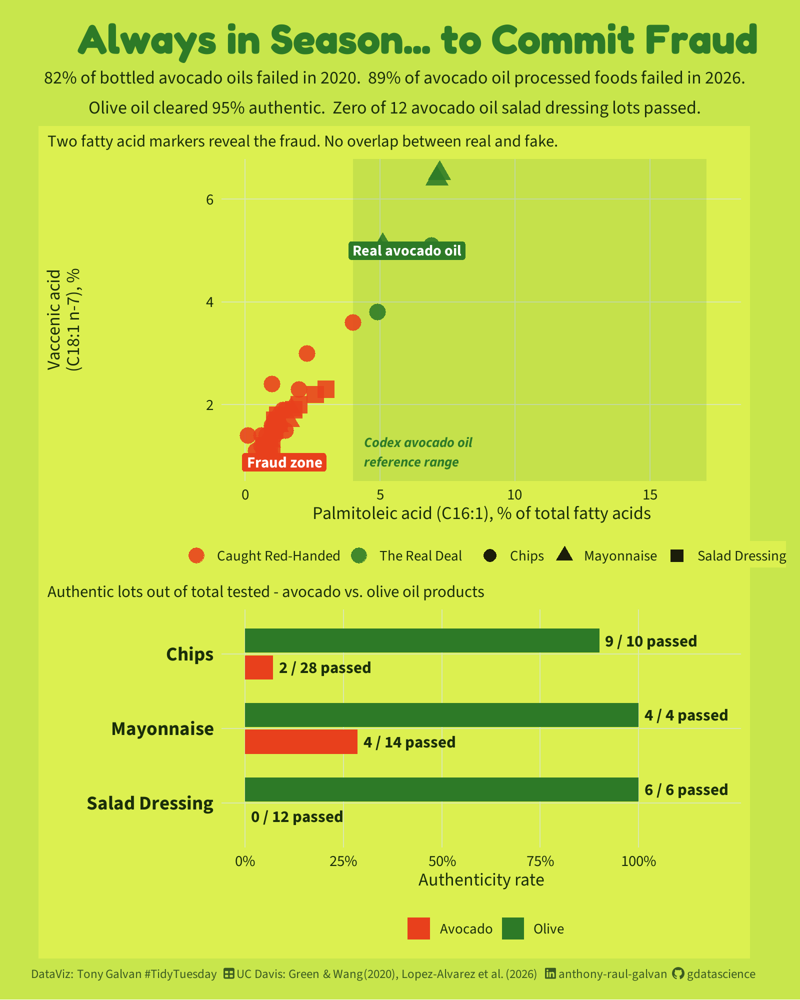<!-- -->

## What’s Next?

A few open threads worth chasing:

- **The regulation question.** The case for federal avocado oil
  standards writes itself in this data. What would effective regulation
  look like — mandatory fatty acid profiling at import? Random lot
  testing? The olive oil comparison is the cleanest possible argument.

- **Supply chain vs. retailer fraud.** The lot-level data shows that
  fraud is usually consistent within brands (both lots fail together),
  which points upstream to ingredient suppliers rather than retailers
  mislabeling at the store. Has anything changed since the 2026 study?

- **What about the olive oil outlier?** One olive chip lot failed.
  That’s worth looking at — which product was it, and what went wrong?

- **The oxidation puzzle.** If 87% of pure bottled avocado oils are
  rancid before expiration, something is broken in the storage and
  distribution chain even for legitimate products. Is the problem light
  exposure (clear plastic packaging), heat, or shelf life estimates?

The chemistry is clear enough to detect fraud reliably. The market just
hasn’t been held accountable yet.
