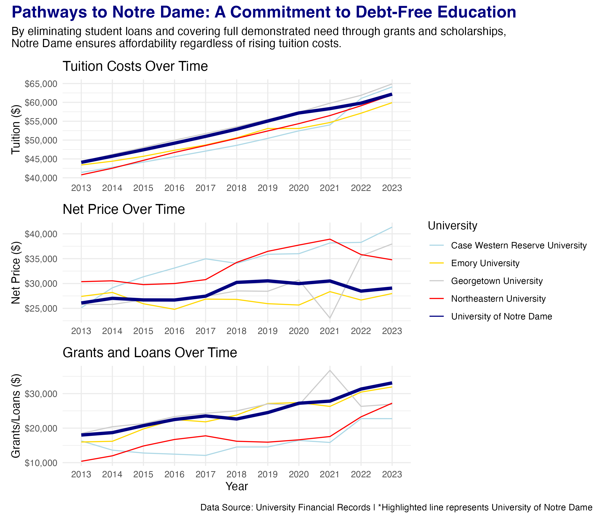
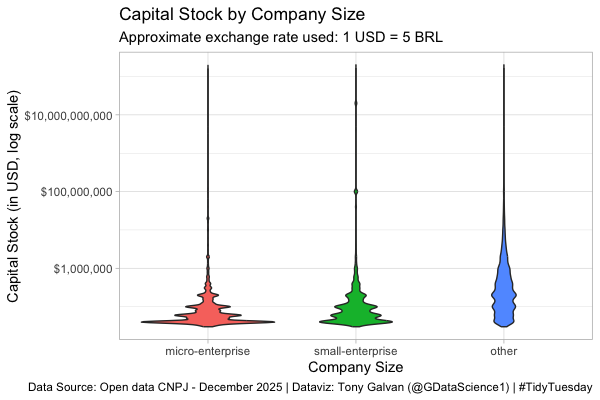
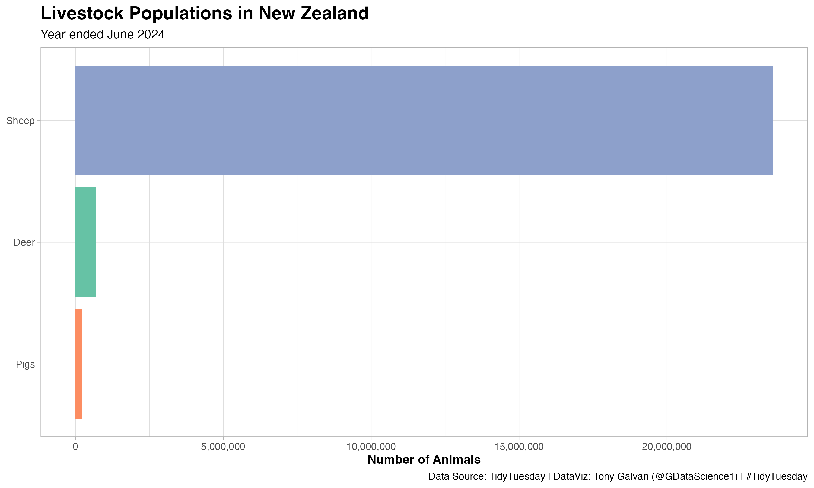
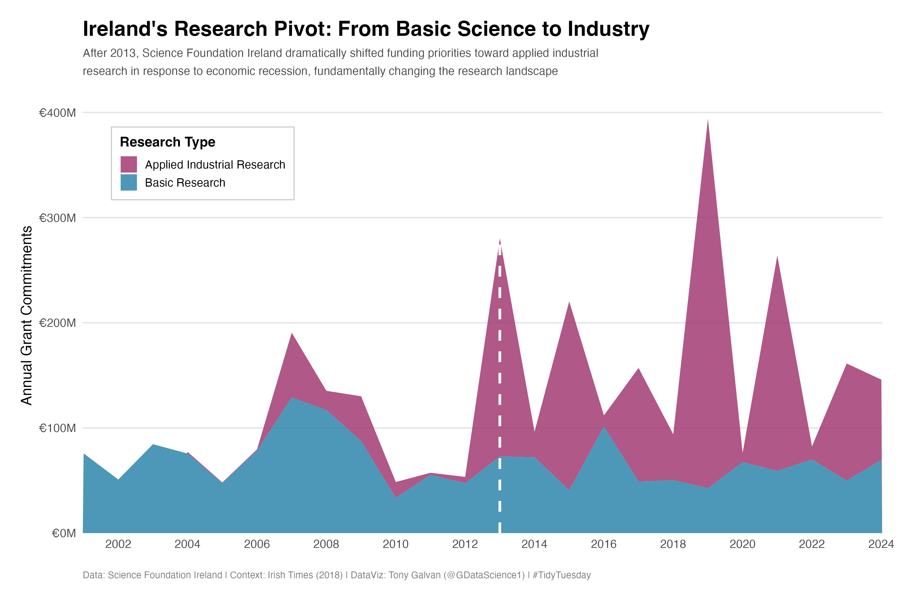
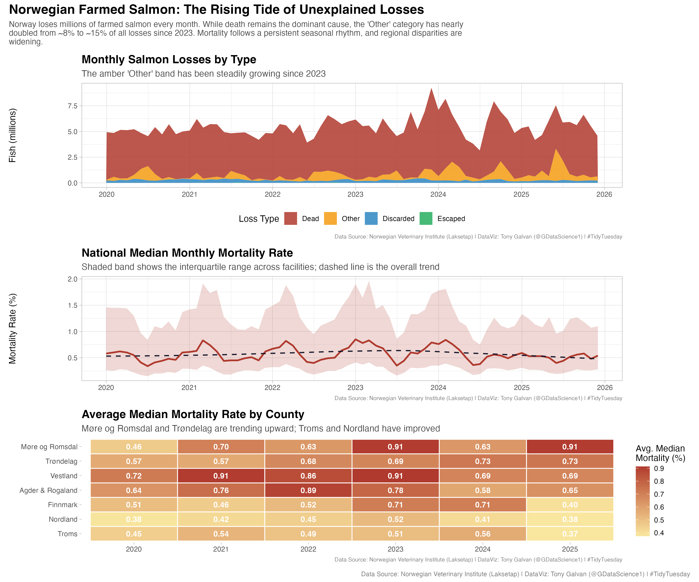
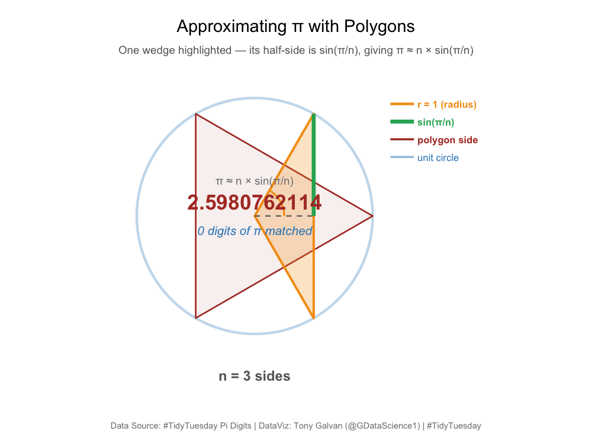
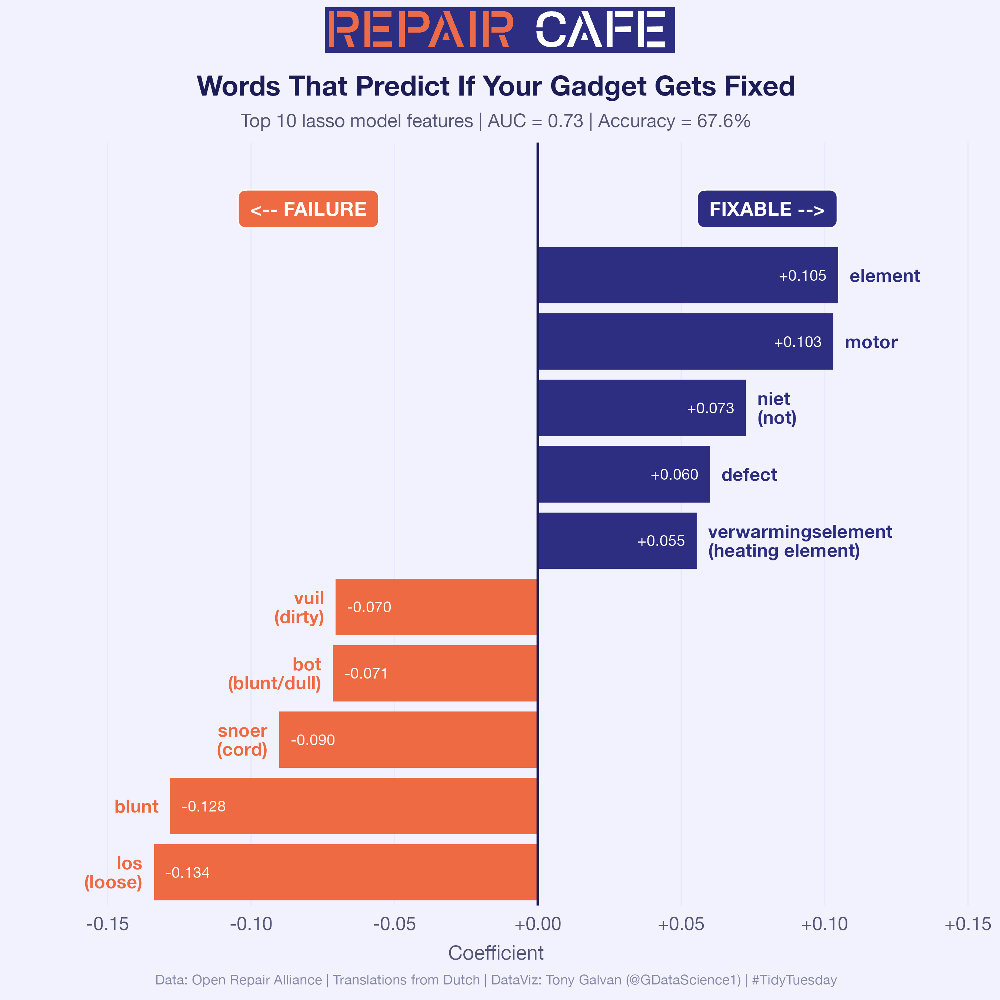
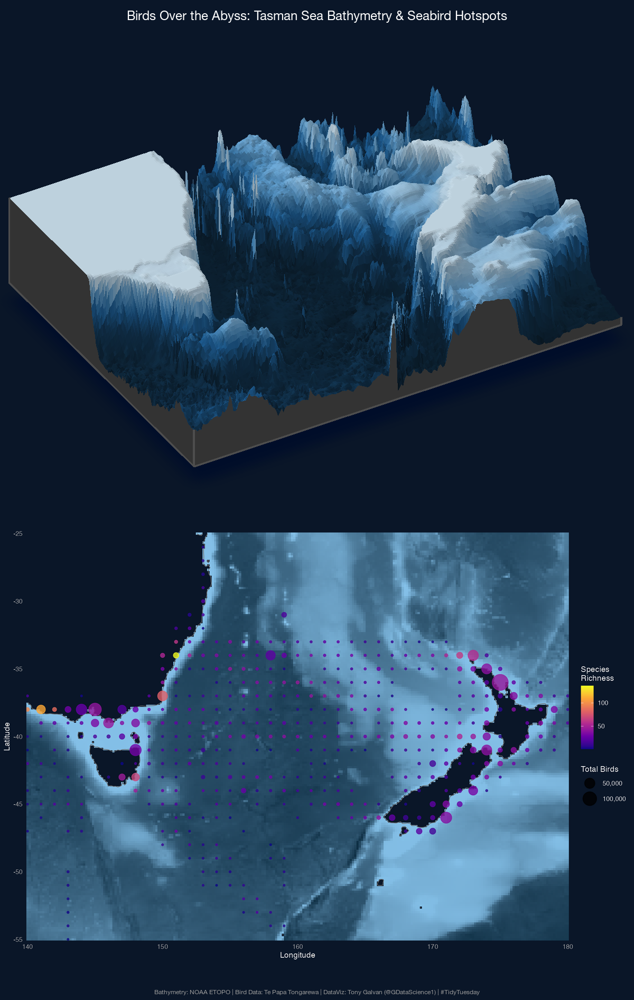
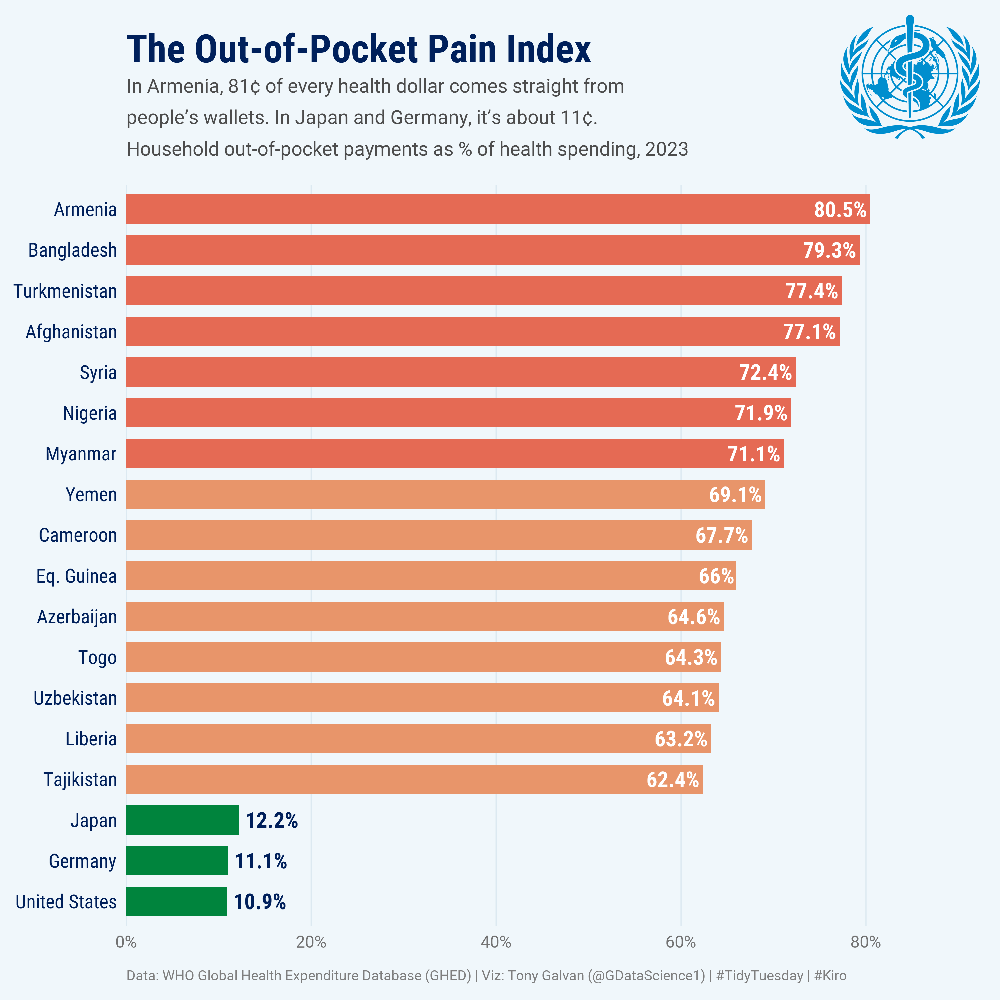

# 2026

**11 analyses** from the [TidyTuesday](https://github.com/rfordatascience/tidytuesday) project.

---

## January

<table>
<tr>
<td></td>
<td></td>
</tr>
<tr>
<td align="center"><a href="2026_01_06/">Nd</a></td>
<td align="center"><a href="2026_01_27/">Companies</a></td>
</tr>
</table>

## February

<table>
<tr>
<td></td>
<td></td>
</tr>
<tr>
<td align="center"><a href="2026_02_17/">Feb 17</a></td>
<td align="center"><a href="2026_02_24/">Grants</a></td>
</tr>
</table>

## March

<table>
<tr>
<td></td>
<td></td>
</tr>
<tr>
<td align="center"><a href="2026_03_17/">Fish</a></td>
<td align="center"><a href="2026_03_24/">Pi</a></td>
</tr>
</table>

## April

<table>
<tr>
<td></td>
<td></td>
<td></td>
<td></td>
</tr>
<tr>
<td align="center"><a href="2026_04_07/">Repairs</a></td>
<td align="center"><a href="2026_04_14/">Seabirds</a></td>
<td align="center"><a href="2026_04_21/">Health Spending</a></td>
<td align="center"><a href="2026_04_28/">Tariffs</a></td>
</tr>
</table>

## May

<table>
<tr>
<td></td>
</tr>
<tr>
<td align="center"><a href="2026_05_06/">Italian Industry</a></td>
</tr>
</table>
