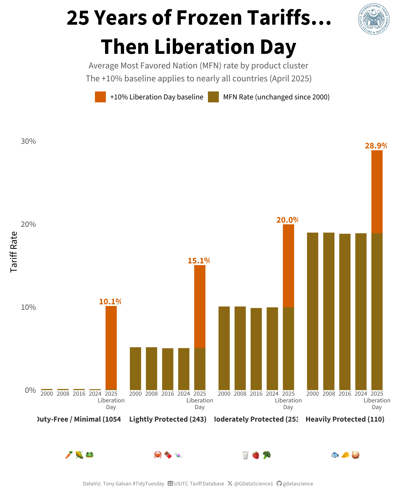

```{r setup, include=FALSE}
knitr::opts_chunk$set(echo = TRUE, warning = FALSE, message = FALSE)
```

If you've ever wondered why imported cheese costs what it does, or why sugar prices in the U.S. seem stubbornly high, the answer might be hiding in the Harmonized Tariff Schedule. This week's TidyTuesday dataset pulls back the curtain on **U.S. agricultural tariffs** — the taxes levied on everything from live animals to beverages as they cross the border. The data spans nearly three decades (1997–2025) and covers thousands of product lines across 24 HTS chapters.

What I found surprised me: tariff rates vary wildly by product category, trade agreements carve out dramatically different deals, and the transition from NAFTA to USMCA reshaped the landscape in ways that are still playing out.

```{r libraries}
library(tidyverse)
library(tidytuesdayR)
library(lubridate)
library(scales)
library(showtext)
library(ggtext)
library(magick)
library(ragg)

# Load Google Font via showtext (for inline plots and element_markdown captions)
font_add_google("Source Sans 3", "source_sans")

# Register Font Awesome for icon captions (used with ggtext element_markdown)
font_add(
  family = "fa-brands",
  regular = "~/Library/Fonts/Font Awesome 6 Brands-Regular-400.otf"
)
font_add(
  family = "fa-solid",
  regular = "~/Library/Fonts/Font Awesome 6 Free-Solid-900.otf"
)

showtext_auto()
showtext_opts(dpi = 300)

# Colors
bg_color <- "white"
txt_color <- "#333333"
tt_source <- "USITC Tariff Database"

# Build the icon-rich caption (rendered via element_markdown + showtext)
tt_caption <- paste0(
  "DataViz: Tony Galvan #TidyTuesday",
  "<span style='color:", bg_color, ";'>..</span>",
  "<span style='font-family:fa-solid;'>&#xf0ce;</span>",
  "<span style='color:", bg_color, ";'>.</span>",
  tt_source,
  "<span style='color:", bg_color, ";'>..</span>",
  "<span style='font-family:fa-brands;'>&#xe61b;</span>",
  "<span style='color:", bg_color, ";'>.</span>",
  "@GDataScience1",
  "<span style='color:", bg_color, ";'>..</span>",
  "<span style='font-family:fa-brands;'>&#xf09b;</span>",
  "<span style='color:", bg_color, ";'>.</span>",
  "gdatascience"
)

theme_set(
  theme_light(base_family = "source_sans") +
    theme(
      plot.title = element_text(face = "bold", size = 32),
      plot.subtitle = element_text(size = 20, color = "gray40"),
      plot.caption = element_markdown(size = 12, color = "gray50", hjust = 0.5),
      plot.caption.position = "plot",
      axis.title = element_text(size = 16),
      axis.text = element_text(size = 14),
      legend.text = element_text(size = 14),
      strip.text = element_text(size = 16, face = "bold"),
      panel.grid = element_blank(),
      panel.border = element_blank(),
      axis.ticks = element_blank()
    )
)
```

```{r load-data}
tt <- readRDS(".kiro/specs/2026_04_28_tidy_tuesday_tariffs/tt_cache.rds")

agreements <- tt$agreements
tariff <- tt$tariff_agricultural
codes <- tt$tariff_codes
quantity_codes <- tt$quantity_codes
```

## The Tariff Landscape: Not All Food Is Created Equal

The first thing that jumps out is how unevenly tariffs are distributed across agricultural sectors. Some chapters — like live animals and oil seeds — face minimal barriers, while meat, vegetables, and dairy products carry significantly higher rates.

To get a clean picture, I filtered to Most Favored Nation (MFN) rates — the standard tariff that applies to WTO members — and focused on ad valorem (percentage-based) rates below 100% to exclude sentinel values in the data.

```{r chapter-rates, fig.width=8, fig.height=10}
chapter_names <- c(
  "1" = "Live Animals", "2" = "Meat", "3" = "Fish & Seafood",
  "4" = "Dairy & Eggs", "5" = "Other Animal Products",
  "6" = "Live Plants", "7" = "Vegetables", "8" = "Fruits & Nuts",
  "9" = "Coffee, Tea & Spices", "10" = "Cereals",
  "11" = "Milling Products", "12" = "Oil Seeds",
  "13" = "Lac, Gums & Resins", "14" = "Vegetable Plaiting",
  "15" = "Fats & Oils", "16" = "Meat Preparations",
  "17" = "Sugar", "18" = "Cocoa", "19" = "Cereal Preparations",
  "20" = "Vegetable Preparations", "21" = "Misc Food Preparations",
  "22" = "Beverages", "23" = "Animal Feed", "24" = "Tobacco"
)

# Earth-tone palette for agriculture
ag_colors <- c(
  "high" = "#8B4513",
  "low" = "#DAA520"
)

chapter_rates <- tariff %>%
  filter(
    agreement == "mfn",
    ad_val_rate > 0,
    ad_val_rate < 1,
    year(begin_effective_date) >= 2020
  ) %>%
  mutate(
    chapter = as.integer(substr(hts8, 1, 2)),
    chapter_name = chapter_names[as.character(chapter)]
  ) %>%
  group_by(chapter, chapter_name) %>%
  summarise(
    avg_rate = mean(ad_val_rate),
    median_rate = median(ad_val_rate),
    n_products = n_distinct(hts8),
    .groups = "drop"
  )

chapter_rates %>%
  mutate(chapter_name = fct_reorder(chapter_name, avg_rate)) %>%
  ggplot(aes(x = avg_rate, y = chapter_name)) +
  geom_col(aes(fill = avg_rate), show.legend = FALSE) +
  geom_text(
    aes(label = paste0(round(avg_rate * 100, 1), "%")),
    hjust = -0.1, size = 5, family = "source_sans"
  ) +
  scale_x_continuous(
    labels = percent_format(),
    expand = expansion(mult = c(0, 0.15))
  ) +
  scale_fill_gradient(low = "#DAA520", high = "#8B4513") +
  labs(
    title = "Meat and Vegetables Face the Highest\nU.S. Agricultural Tariffs",
    subtitle = "Average MFN ad valorem tariff rate by HTS chapter (2020–2025)",
    x = "Average Tariff Rate",
    y = NULL,
    caption = tt_caption
  )
```

**Meat leads the pack at 15.6%**, followed by vegetables (12.0%) and dairy & eggs (11.7%). At the other end, lac/gums/resins and oil seeds sit below 3%. The pattern makes intuitive sense — the U.S. protects its domestic producers most heavily in sectors where American farmers compete directly with imports.

## The Column 2 Premium: What Non-Market Economies Pay

The U.S. maintains two tiers of tariff rates. MFN rates apply to most trading partners, but **Column 2 rates** — reserved for non-market economy countries — are dramatically higher. This two-tier system is one of the oldest tools in U.S. trade policy.

```{r col2-vs-mfn, fig.width=8, fig.height=7}
col2_mfn <- tariff %>%
  filter(
    agreement %in% c("mfn", "col2"),
    ad_val_rate > 0,
    ad_val_rate < 1,
    year(begin_effective_date) >= 2020
  ) %>%
  mutate(
    chapter = as.integer(substr(hts8, 1, 2)),
    section = case_when(
      chapter <= 5 ~ "I. Live Animals &\nAnimal Products",
      chapter <= 14 ~ "II. Vegetable\nProducts",
      chapter <= 15 ~ "III. Fats & Oils",
      chapter <= 24 ~ "IV. Prepared\nFoodstuffs"
    )
  ) %>%
  left_join(agreements %>% select(agreement, agreement_full), by = "agreement") %>%
  group_by(section, agreement_full) %>%
  summarise(
    avg_rate = mean(ad_val_rate),
    .groups = "drop"
  )

col2_mfn %>%
  ggplot(aes(x = section, y = avg_rate, fill = agreement_full)) +
  geom_col(position = "dodge", width = 0.7) +
  geom_text(
    aes(label = paste0(round(avg_rate * 100, 1), "%")),
    position = position_dodge(width = 0.7),
    vjust = -0.5, size = 5, family = "source_sans"
  ) +
  scale_y_continuous(
    labels = percent_format(),
    expand = expansion(mult = c(0, 0.15))
  ) +
  scale_fill_manual(
    values = c("Column 2 Rates" = "#8B4513", "Most Favored Nation (MFN)" = "#2E6B4F"),
    name = NULL
  ) +
  labs(
    title = "Column 2 Rates Are 2–3x Higher Than MFN\nAcross All Sectors",
    subtitle = "Average ad valorem tariff rate by HTS section and rate type (2020–2025)",
    x = NULL,
    y = "Average Tariff Rate",
    caption = tt_caption
  ) +
  theme(legend.position = "top")
```

Column 2 rates run **2 to 3 times higher** than MFN rates in every section. For animal products, the gap is especially stark — Column 2 averages around 25% compared to MFN's ~11%. These rates affect a small number of countries today, but they represent the maximum tariff ceiling the U.S. can impose.

## The Free Trade Advantage: How Much Do Agreements Actually Save?

The U.S. has negotiated free trade agreements with dozens of countries, and the agricultural sector is where these deals have the most visible impact. By 2020, most major FTAs had phased in nearly complete duty-free access for agricultural products.

```{r duty-free-by-agreement, fig.width=8, fig.height=8}
duty_free <- tariff %>%
  filter(
    year(begin_effective_date) >= 2020,
    !agreement %in% c("mfn", "col2")
  ) %>%
  group_by(agreement) %>%
  summarise(
    total_products = n_distinct(hts8),
    duty_free = n_distinct(
      hts8[ad_val_rate == 0 & (specific_rate == 0 | is.na(specific_rate))]
    ),
    .groups = "drop"
  ) %>%
  mutate(pct_duty_free = duty_free / total_products) %>%
  filter(total_products >= 50) %>%
  left_join(agreements %>% select(agreement, agreement_full), by = "agreement") %>%
  mutate(
    label = coalesce(agreement_full, agreement),
    label = str_replace(label, " Free Trade Agreement", " FTA"),
    label = str_replace(label, " Trade Promotion Agreement", " TPA"),
    label = str_replace(label, "Dominican Republic-Central America FTA \\(DR-CAFTA\\)", "DR-CAFTA"),
    label = str_replace(label, "United States-Mexico-Canada Agreement \\(USMCA\\)", "USMCA"),
    label = str_replace(label, "Korea-United States FTA \\(KORUS\\)", "KORUS FTA"),
    label = str_replace(label, "North American FTA \\(NAFTA\\)", "NAFTA"),
    label = str_replace(label, "-United States", ""),
    label = str_replace(label, "Caribbean Basin Initiative \\(CBI\\)", "CBI"),
    label = str_replace(label, "Generalized System of Preferences \\(GSP\\)", "GSP")
  )

duty_free %>%
  mutate(label = fct_reorder(label, pct_duty_free)) %>%
  ggplot(aes(x = pct_duty_free, y = label)) +
  geom_col(aes(fill = pct_duty_free), show.legend = FALSE) +
  geom_text(
    aes(label = paste0(round(pct_duty_free * 100, 1), "%")),
    hjust = -0.1, size = 5, family = "source_sans"
  ) +
  scale_x_continuous(
    labels = percent_format(),
    limits = c(0, 1.08),
    expand = c(0, 0)
  ) +
  scale_fill_gradient(low = "#DAA520", high = "#2E6B4F") +
  labs(
    title = "Most Trade Agreements Grant Nearly\nComplete Duty-Free Access",
    subtitle = "% of agricultural products with zero tariff by trade agreement (2020–2025)",
    x = "% of Products Duty-Free",
    y = NULL,
    caption = tt_caption
  )
```

The numbers are striking: **USMCA, CBI, and several bilateral FTAs grant 100% or near-100% duty-free access** for agricultural products. Even agreements with lower percentages — like Australia (90%) and Colombia (85%) — still cover the vast majority of product lines. The outlier is Japan, where only **47.9%** of covered products are duty-free, reflecting the more limited scope of the 2020 U.S.-Japan trade agreement.

## From NAFTA to USMCA: A Trade Policy Transition

One of the most interesting stories in this data is the transition from NAFTA to USMCA, which took effect on July 1, 2020. The data captures this shift clearly — NAFTA's separate Canada and Mexico tracks gave way to a unified USMCA framework.

```{r nafta-usmca, fig.width=8, fig.height=7}
nafta_usmca <- tariff %>%
  filter(agreement %in% c("canada", "mexico", "usmca", "usmca+")) %>%
  mutate(
    year = year(begin_effective_date),
    agreement_label = case_when(
      agreement == "canada" ~ "NAFTA (Canada)",
      agreement == "mexico" ~ "NAFTA (Mexico)",
      agreement == "usmca" ~ "USMCA",
      agreement == "usmca+" ~ "USMCA+"
    )
  ) %>%
  filter(year >= 1997) %>%
  count(year, agreement_label) %>%
  mutate(
    era = if_else(
      agreement_label %in% c("NAFTA (Canada)", "NAFTA (Mexico)"),
      "NAFTA Era", "USMCA Era"
    )
  )

nafta_usmca %>%
  ggplot(aes(x = year, y = n, fill = agreement_label)) +
  geom_col(position = "stack", width = 0.8) +
  geom_vline(xintercept = 2020, linetype = "dashed", color = "gray40", linewidth = 0.8) +
  annotate(
    "text", x = 2019.8, y = max(nafta_usmca %>% group_by(year) %>%
      summarise(total = sum(n)) %>% pull(total)) * 0.9,
    label = "USMCA\ntakes effect", hjust = 1, size = 5,
    color = "gray40", family = "source_sans"
  ) +
  scale_fill_manual(
    values = c(
      "NAFTA (Canada)" = "#DAA520",
      "NAFTA (Mexico)" = "#8B4513",
      "USMCA" = "#2E6B4F",
      "USMCA+" = "#5B8C5A"
    ),
    name = NULL
  ) +
  scale_x_continuous(breaks = seq(1997, 2024, by = 3)) +
  scale_y_continuous(labels = comma_format()) +
  labs(
    title = "The NAFTA-to-USMCA Transition Reshaped\nNorth American Agricultural Trade",
    subtitle = "Number of tariff line entries by agreement and year",
    x = NULL,
    y = "Tariff Line Entries",
    caption = tt_caption
  ) +
  theme(legend.position = "top")
```

The transition is visible in the data: NAFTA's Mexico track dominated from 1997 through 2019, with Canada's separate track disappearing after 1997 (as most Canadian agricultural products had already achieved duty-free status). When USMCA launched in 2020, it brought a unified framework — plus a new "USMCA+" tier for enhanced preferential rates on select products.

## The Big Picture: MFN Rates by Section Over Time

Finally, let's zoom out and look at how MFN tariff rates have evolved across the four major agricultural sections from 2000 to 2024. This mirrors the approach from the TidyTuesday example plot, using a small-multiples design to highlight each section against the backdrop of all others.

```{r section-trends, fig.width=8, fig.height=8}
tariff_with_years <- tariff %>%
  mutate(
    begin_year = year(begin_effective_date),
    end_year = year(end_effective_date)
  )

tariff_hts_agreement <- tariff %>%
  distinct(hts8, agreement)

tariff_years <- tariff_hts_agreement %>%
  crossing(year = 2000:2024)

rates_by_year <- tariff_years %>%
  left_join(
    tariff_with_years,
    join_by(hts8, agreement, year >= begin_year, year <= end_year)
  ) %>%
  filter(!is.na(ad_val_rate))

rates_clean <- rates_by_year %>%
  distinct(hts8, agreement, year, ad_val_rate, specific_rate)

section_rates <- rates_clean %>%
  filter(ad_val_rate > 0, ad_val_rate < 1) %>%
  left_join(agreements, by = "agreement") %>%
  filter(agreement_full == "Most Favored Nation (MFN)") %>%
  mutate(
    chapter = as.integer(substr(hts8, 1, 2)),
    section = case_when(
      chapter <= 5 ~ "I. Live Animals & Animal Products",
      chapter <= 14 ~ "II. Vegetable Products",
      chapter <= 15 ~ "III. Animal/Vegetable Fats & Oils",
      chapter <= 24 ~ "IV. Prepared Foodstuffs"
    )
  ) %>%
  group_by(year, section) %>%
  summarise(
    avg_rate = mean(ad_val_rate),
    n_products = n(),
    .groups = "drop"
  ) %>%
  filter(n_products >= 10)

section_colors <- c(
  "I. Live Animals & Animal Products" = "#8B4513",
  "II. Vegetable Products" = "#2E6B4F",
  "III. Animal/Vegetable Fats & Oils" = "#DAA520",
  "IV. Prepared Foodstuffs" = "#4A7C59"
)

bg_data <- section_rates %>% select(year, section, avg_rate)

section_rates %>%
  ggplot() +
  geom_line(
    data = bg_data,
    aes(x = year, y = avg_rate, group = section),
    color = "grey75", linewidth = 0.6, alpha = 0.6
  ) +
  geom_line(
    aes(x = year, y = avg_rate, color = section),
    linewidth = 1.2, show.legend = FALSE
  ) +
  geom_point(
    aes(x = year, y = avg_rate, color = section),
    size = 2, alpha = 0.7, show.legend = FALSE
  ) +
  scale_color_manual(values = section_colors) +
  facet_wrap(~section, ncol = 2) +
  scale_x_continuous(breaks = seq(2000, 2024, by = 6)) +
  scale_y_continuous(labels = percent_format()) +
  labs(
    title = "MFN Tariff Rates Have Remained\nRemarkably Stable Over 25 Years",
    subtitle = "Average MFN ad valorem rate by HTS section (2000–2024)\nGrey lines show other sections for comparison",
    x = NULL,
    y = "Average Tariff Rate",
    caption = tt_caption
  )
```

The most striking takeaway? **MFN rates have barely budged in 25 years.** Live animals and animal products consistently sit at the top around 10–12%, while fats & oils hover near 5%. The stability suggests that tariff liberalization in agriculture has happened almost entirely through bilateral trade agreements, not through across-the-board MFN reductions.

## Four Tiers of Protection: Clustering 25 Years of Tariff Trajectories

The section-level view above hints at stability, but what does it look like at the individual product level? To find out, I built a 25-year MFN rate trajectory for each of the **1,660 products** with complete data from 2000 to 2024, then used k-means clustering to group them by the shape and level of their rate paths.

```{r clustering, fig.width=8, fig.height=10}
# Build product-level MFN trajectories (2000-2024)
tariff_mfn <- tariff %>%
  filter(agreement == "mfn", ad_val_rate >= 0, ad_val_rate < 1) %>%
  mutate(
    begin_year = year(begin_effective_date),
    end_year = year(end_effective_date)
  )

product_years <- tariff_mfn %>%
  distinct(hts8) %>%
  crossing(tibble(year = 2000:2024))

trajectories <- product_years %>%
  left_join(
    tariff_mfn,
    join_by(hts8, year >= begin_year, year <= end_year)
  ) %>%
  group_by(hts8, year) %>%
  summarise(rate = mean(ad_val_rate, na.rm = TRUE), .groups = "drop")

# Pivot wide and keep only complete trajectories
wide <- trajectories %>%
  pivot_wider(names_from = year, values_from = rate, names_prefix = "y") %>%
  filter(complete.cases(.))

mat <- as.matrix(wide[, -1])

# K-means with k=4
set.seed(42)
km <- kmeans(mat, centers = 4, nstart = 25, iter.max = 50)
wide$cluster <- km$cluster

# Sort clusters by average rate level and assign descriptive labels
cluster_order <- wide %>%
  mutate(avg_rate = rowMeans(across(starts_with("y")))) %>%
  group_by(cluster) %>%
  summarise(mean_rate = mean(avg_rate), n = n(), .groups = "drop") %>%
  arrange(mean_rate) %>%
  mutate(
    tier = row_number(),
    label = case_when(
      tier == 1 ~ paste0("Duty-Free / Minimal (", n, ")"),
      tier == 2 ~ paste0("Lightly Protected (", n, ")"),
      tier == 3 ~ paste0("Moderately Protected (", n, ")"),
      tier == 4 ~ paste0("Heavily Protected (", n, ")")
    )
  )

cluster_map <- cluster_order %>% select(cluster, label, tier)

# Build long-format data for plotting
cluster_trajectories <- trajectories %>%
  inner_join(wide %>% select(hts8, cluster), by = "hts8") %>%
  left_join(cluster_map, by = "cluster")

# Compute cluster averages
cluster_avg <- cluster_trajectories %>%
  group_by(label, tier, year) %>%
  summarise(avg_rate = mean(rate), .groups = "drop")

# End-of-line labels (at year 2024)
end_labels <- cluster_avg %>%
  filter(year == 2024)

tier_colors <- c(
  "1" = "#4A7C59",
  "2" = "#DAA520",
  "3" = "#C67B30",
  "4" = "#8B4513"
)

# Single-panel spaghetti plot with direct labels
cluster_trajectories %>%
  ggplot() +
  geom_line(
    aes(x = year, y = rate, group = hts8),
    color = "grey85", linewidth = 0.1, alpha = 0.3
  ) +
  geom_line(
    data = cluster_avg,
    aes(x = year, y = avg_rate, color = factor(tier)),
    linewidth = 2.5, show.legend = FALSE
  ) +
  geom_label(
    data = end_labels,
    aes(x = 2024, y = avg_rate, label = label, color = factor(tier)),
    hjust = 1, vjust = -0.6, size = 4.5, family = "source_sans",
    fontface = "bold", linewidth = 0, fill = "white", alpha = 0.85,
    show.legend = FALSE
  ) +
  scale_color_manual(values = tier_colors) +
  scale_x_continuous(breaks = seq(2000, 2024, by = 4)) +
  scale_y_continuous(labels = percent_format(), expand = expansion(mult = c(0.02, 0.08))) +
  labs(
    title = "25 Years of Frozen Tariffs",
    subtitle = "1,660 U.S. agricultural products clustered by MFN rate trajectory (2000\u20132024)\nGrey = individual products | Bold = cluster average (k-means, k=4)",
    x = NULL,
    y = "MFN Tariff Rate",
    caption = tt_caption
  )
```

```{r bar-chart-data}
# Prepare data for the Liberation Day bar chart (used in save-image)
snapshot_years <- c(2000, 2008, 2016, 2024)
bar_data <- trajectories %>%
  inner_join(wide %>% select(hts8, cluster), by = "hts8") %>%
  left_join(cluster_map, by = "cluster") %>%
  filter(year %in% snapshot_years) %>%
  group_by(short_label = label, tier, year) %>%
  summarise(avg_rate = mean(rate), .groups = "drop") %>%
  mutate(year_label = as.character(year), liberation_add = 0)

liberation_data <- bar_data %>%
  filter(year == 2024) %>%
  mutate(year_label = "2025\nLiberation\nDay", year = 2025, liberation_add = 0.10)

all_data <- bind_rows(bar_data, liberation_data) %>%
  mutate(
    short_label = factor(short_label, levels = rev(
      cluster_order %>% arrange(desc(mean_rate)) %>% pull(label)
    )),
    year_label = factor(year_label, levels = c(
      "2000", "2008", "2016", "2024", "2025\nLiberation\nDay"
    ))
  )

stacked <- all_data %>%
  select(short_label, year_label, avg_rate, liberation_add) %>%
  pivot_longer(cols = c(avg_rate, liberation_add),
               names_to = "component", values_to = "value") %>%
  filter(value > 0) %>%
  mutate(
    component = case_when(
      component == "avg_rate" ~ "MFN Rate (unchanged since 2000)",
      component == "liberation_add" ~ "+10% Liberation Day baseline"
    ),
    component = factor(component, levels = c(
      "+10% Liberation Day baseline", "MFN Rate (unchanged since 2000)"
    ))
  )
```

The result is striking: **all four tiers are essentially flat lines.** The clustering separates products by rate level — not by trajectory shape — because there is almost no trajectory to speak of. The 110 "Heavily Protected" products (tuna, dates, dried onions, dairy) have sat at ~19% for a quarter century. The 1,054 "Duty-Free or Minimal" products haven't moved either.

Of the 1,660 products tracked, only **351 experienced any rate change at all**, and the largest swing was just 3 percentage points. Zero products moved from tariffed to duty-free or vice versa under MFN. The tariff schedule is, for all practical purposes, frozen in place.

## What's Next?

This dataset opens up several threads worth pulling:

- **Which specific products are the "holdouts"** — the ones that remain heavily tariffed even under the most generous FTAs?
- **How do specific rates (per-unit tariffs) compare** to ad valorem rates? Sugar, in particular, relies heavily on specific rates that don't show up in percentage-based analysis.
- **What happened to tariff rates after 2025?** With the current administration's tariff policies making headlines, the next update to this dataset could tell a very different story — and the flat baselines we've established here would make any structural break immediately visible.

The data makes one thing clear: U.S. agricultural trade policy is a patchwork of deals, exceptions, and historical compromises. The headline MFN rates haven't changed much, but the real action is in the bilateral agreements that now cover the vast majority of actual trade.

## From R to Instagram: Designing the Final Visualization

The visualization above was built entirely in R — k-means clustering, ggplot2 bar charts, Font Awesome icon captions, and color emoji composited via `magick`. Here's the R-generated version:

```{r save-r-version}
# Save the R-generated version to the specs folder for reference
spec_dir <- ".kiro/specs/2026_04_28_tidy_tuesday_tariffs"
seal <- image_read(file.path(spec_dir, "usitc_seal.png"))

# Render color emoji PNGs using ragg (Apple Color Emoji support)
showtext_auto(FALSE)
emoji_list <- list(
  free = "\U0001F955 \U0001F33D \U0001F438",
  light = "\U0001F980 \U0001F36B \U0001F36C",
  moderate = "\U0001F95B \U0001F353 \U0001F966",
  heavy = "\U0001F41F \U0001F9C0 \U0001F9C5"
)
for (nm in names(emoji_list)) {
  p_emoji <- ggplot() +
    annotate("text", x = 0.5, y = 0.5, label = emoji_list[[nm]], size = 6) +
    scale_x_continuous(limits = c(0, 1), expand = expansion(mult = 0.5)) +
    scale_y_continuous(limits = c(0, 1), expand = expansion(mult = 0.5)) +
    coord_cartesian(clip = "off") +
    theme_void() +
    theme(plot.margin = margin(30, 30, 30, 30))
  ggsave(
    file.path(spec_dir, paste0("emoji_", nm, "_final.png")),
    p_emoji, device = ragg::agg_png,
    width = 4, height = 2, dpi = 150, bg = "transparent"
  )
  img <- image_read(file.path(spec_dir, paste0("emoji_", nm, "_final.png")))
  img <- image_trim(img) %>% image_border("transparent", "10x10")
  image_write(img, file.path(spec_dir, paste0("emoji_", nm, "_final.png")))
}
showtext_auto(TRUE)

# Build the base bar chart
r_version <- stacked %>%
  ggplot(aes(x = year_label, y = value, fill = component)) +
  geom_col(width = 0.7, color = NA) +
  geom_text(
    data = all_data %>% filter(liberation_add > 0),
    aes(x = year_label, y = avg_rate + liberation_add,
        label = percent(avg_rate + liberation_add, accuracy = 0.1)),
    inherit.aes = FALSE, vjust = -0.3, size = 4.5,
    family = "source_sans", fontface = "bold", color = "#D55E00"
  ) +
  facet_wrap(~short_label, nrow = 1, strip.position = "bottom") +
  scale_y_continuous(labels = percent_format(), expand = expansion(mult = c(0, 0.15))) +
  scale_fill_manual(
    values = c(
      "MFN Rate (unchanged since 2000)" = "#8B6914",
      "+10% Liberation Day baseline" = "#D55E00"
    ),
    name = NULL
  ) +
  labs(
    title = "25 Years of Frozen Tariffs\u2026\nThen Liberation Day",
    subtitle = "Average Most Favored Nation (MFN) rate by product cluster\nThe +10% baseline applies to nearly all countries (April 2025)",
    x = NULL, y = "Tariff Rate",
    caption = tt_caption
  ) +
  theme_light(base_family = "source_sans") +
  theme(
    plot.title = element_text(face = "bold", size = 32, hjust = 0.5, lineheight = 1.1),
    plot.title.position = "plot",
    plot.subtitle = element_text(size = 13, color = "gray35", lineheight = 1.2, hjust = 0.5),
    plot.caption = element_markdown(size = 8, color = "gray50", hjust = 0.5,
                                     margin = margin(t = 80)),
    plot.caption.position = "plot",
    axis.title.y = element_text(size = 14),
    axis.text.x = element_text(size = 9),
    axis.text.y = element_text(size = 12),
    strip.text.x.bottom = element_text(size = 11, face = "bold", color = "#333333",
                                        margin = margin(t = 5, b = 5)),
    strip.placement = "outside",
    strip.background = element_rect(fill = "transparent", color = NA),
    legend.position = "top",
    legend.text = element_text(size = 11),
    panel.grid = element_blank(),
    panel.border = element_blank(),
    axis.ticks = element_blank(),
    panel.spacing = unit(0.5, "lines"),
    plot.margin = margin(15, 15, 15, 15)
  )

ggsave(
  file.path(spec_dir, "_base_v3.png"),
  r_version, device = "png", width = 8, height = 10, dpi = 300, bg = "white"
)

# Composite emojis + seal
base_img <- image_read(file.path(spec_dir, "_base_v3.png"))
r_raster <- as.raster(base_img)
n_rows <- nrow(r_raster)

caption_start <- n_rows
for (row in seq(n_rows, n_rows - 200, by = -1)) {
  nw <- which(r_raster[row, ] != "#ffffffff")
  if (length(nw) > 10) caption_start <- row
}

strip_end <- 0
in_gap <- FALSE
for (row in seq(caption_start - 1, 1, by = -5)) {
  nw <- which(r_raster[row, ] != "#ffffffff")
  if (length(nw) == 0) {
    in_gap <- TRUE
  } else if (in_gap && length(nw) > 10) {
    strip_end <- row
    break
  }
}

emoji_y <- round((strip_end + caption_start) / 2) - 20
centers <- c(480, 1016, 1552, 2087)
seal_resized <- image_resize(seal, "200x200")

result <- base_img
for (i in seq_along(names(emoji_list))) {
  nm <- names(emoji_list)[i]
  e <- image_read(file.path(spec_dir, paste0("emoji_", nm, "_final.png"))) %>%
    image_resize("200x")
  e_info <- image_info(e)
  x_off <- centers[i] - round(e_info$width / 2)
  result <- image_composite(result, e,
    offset = paste0("+", x_off, "+", emoji_y), operator = "over")
}

result <- image_composite(result, seal_resized, offset = "+2160+15", operator = "over")
image_write(result, file.path(spec_dir, "r_version_final.png"))
```

Here's the R-generated version — it tells the story clearly with the data, but the light background and emoji icons don't quite have the visual punch needed for social media:

```{r show-r-version, echo=FALSE, fig.cap="R-generated version: The four clusters of frozen tariff rates with Liberation Day's +10% spike shown in orange. Emoji icons represent products in each tier."}
knitr::include_graphics(file.path(spec_dir, "r_version_final.png"))
```

The chart makes the core story immediately visible: **the brown bars are all the same height within each cluster** — 2000, 2008, 2016, and 2024 are virtually identical. Then the orange-tipped Liberation Day bar breaks the pattern. The "Heavily Protected" cluster jumps from 18.9% to 28.9%, while even the "Duty-Free / Minimal" products that had near-zero rates for 25 years suddenly face a 10.1% tariff.

But for social media sharing, I wanted something more polished — dark background, product photography instead of emoji, and an editorial magazine aesthetic. I used **Google Nano Banana Pro** to transform the R-generated chart into the final version.

The process:

1. **Built the analysis and base visualization in R** using Kiro — data exploration, k-means clustering, ggplot2 bar chart with Liberation Day overlay
2. **Exported the R version** as a reference image showing the data, layout, and story structure
3. **Wrote a detailed design prompt** for Google Nano Banana Pro specifying: dark background, product photography in circular cutouts replacing emoji, glowing Liberation Day bars, editorial typography, and Instagram-ready format
4. **Nano Banana Pro generated the final infographic** — preserving the data accuracy while adding the visual polish that makes it shareable

Here's the final version:

```{r show-final-version, echo=FALSE, fig.cap="Final version by Google Nano Banana Pro: Dark editorial aesthetic with product photography, glowing Liberation Day bars, and USITC seal."}

```

The transformation is dramatic. The dark navy background creates contrast that makes the glowing orange Liberation Day bars feel urgent — almost like a warning signal. The product photography (tuna cans, cheese wedges, strawberries, carrots) makes each cluster immediately relatable in a way that emoji couldn't. And the editorial typography gives it the credibility of a Bloomberg or Economist graphic.

The data is identical in both versions — the same four clusters, the same frozen rates, the same Liberation Day spike. But the presentation shift from "R output" to "designed infographic" is the difference between a chart that informs and one that stops someone mid-scroll.

```{r final-image-note, eval=FALSE}
# The final shareable image (2026_04_28_tidy_tuesday_tariffs.png) was generated
# by Google Nano Banana Pro based on the R version above.
# It is already saved in the repo root.
```
