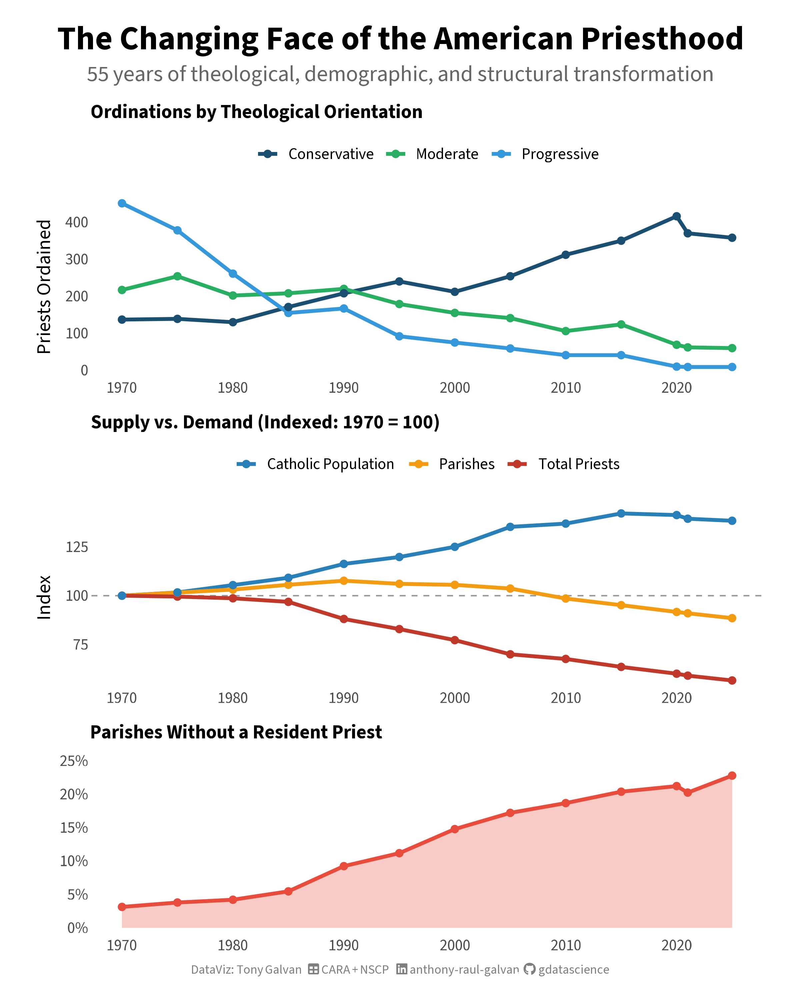

# The Changing Face of the American Priesthood

**[Source Code](catholic_priests.Rmd)** | Data from [CARA](https://cara.georgetown.edu/frequently-requested-church-statistics/) (Georgetown) and the [National Study of Catholic Priests](https://catholicproject.catholic.edu/national-study-of-catholic-priests/) (Catholic University of America)

Combining CARA's longitudinal Church statistics with the NSCP's theological orientation data to tell the full story of a priesthood in transition — from the theological inversion (progressive ordinations collapsed from 451/year in 1970 to just 9 in 2025) to the structural workforce crisis (44% fewer priests serving 38% more Catholics). Inspired by a [viral visualization](https://x.com/ryanburge/status/2046569709009555937) from Ryan Burge and a [reply](https://x.com/SeamusNua/status/2046581326610895348) from @SeamusNua.

---

## Analysis Highlights

### Three Stories in One

1. **The Theological Inversion** — In 1970, 56% of newly ordained priests identified as progressive. By 2025, 84% are conservative. The crossover happened around 1993.

2. **The Workforce Crisis** — Catholic population grew 38% since 1970 while priests declined 44%. Nearly 1 in 4 parishes now lacks a resident priest.

3. **The Parish Consolidation Wave** — Parishes without a resident pastor grew from 571 (1970) to 3,674 (2025).

### Machine Learning

Using tidymodels to forecast and understand the decline:
- **Linear regression** shows priests declining at ~532/year
- **Polynomial regression** captures the deceleration (steepest losses behind us)
- **Random forest** identifies time and population growth as the strongest drivers
- **Logistic growth curve** pinpoints the theological inflection point at ~1993

## Data Sources

- **CARA Frequently Requested Church Statistics** — Downloaded directly from [cara.georgetown.edu](https://cara.georgetown.edu/s/CARAFrequentlyRequested-y3mw.xlsx) (Excel, no local copy stored)
- **NSCP theological orientation data** — Via [Ryan Burge](https://x.com/ryanburge/status/2046569709009555937) from the National Study of Catholic Priests (2022)
