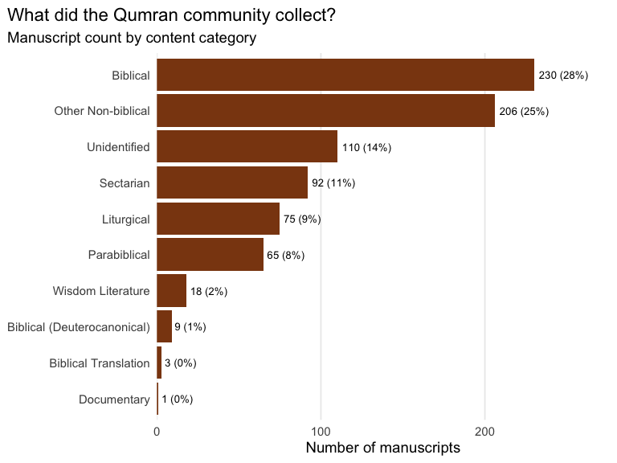
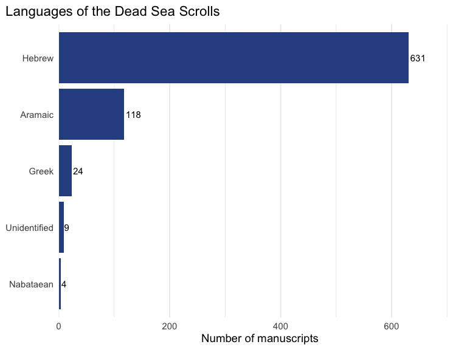
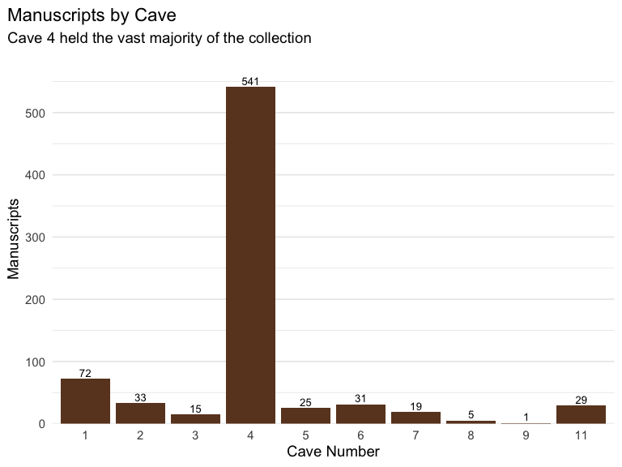
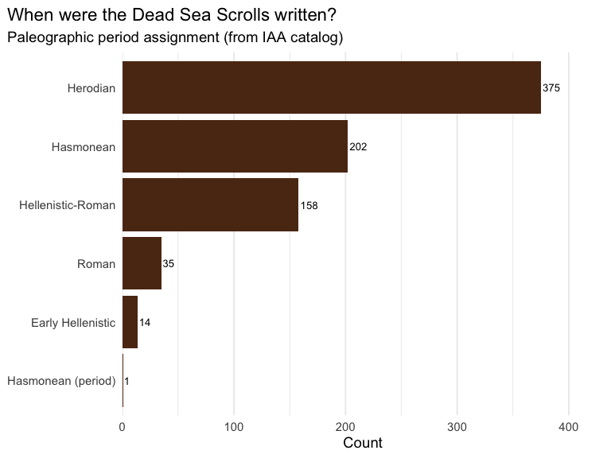
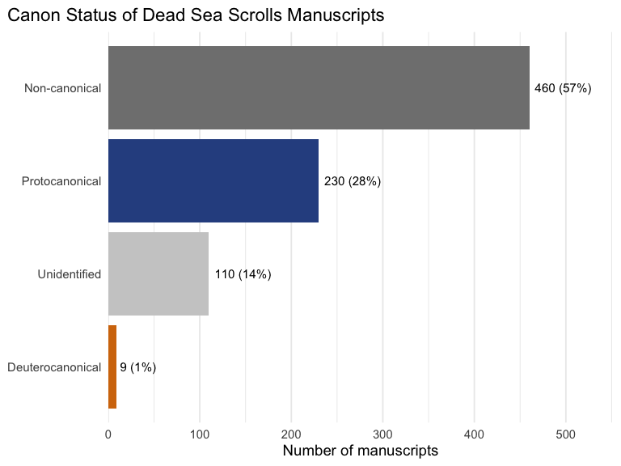
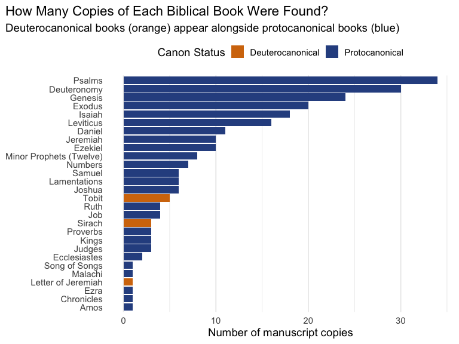
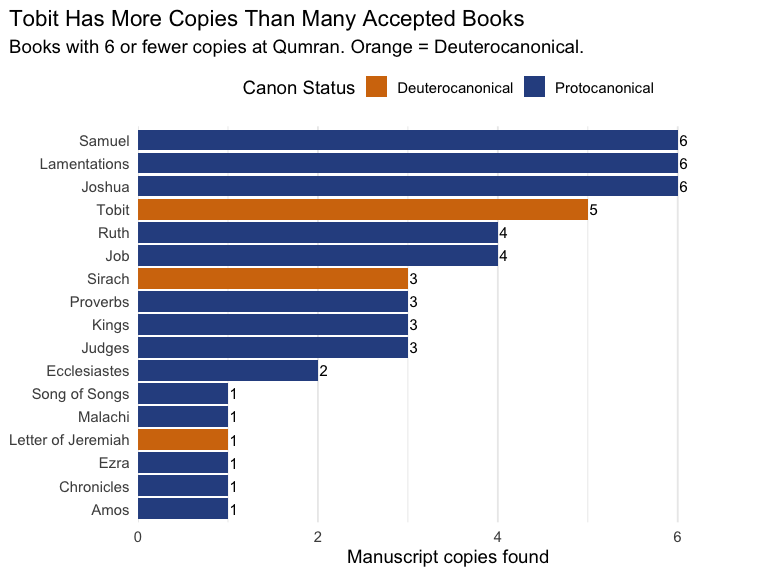
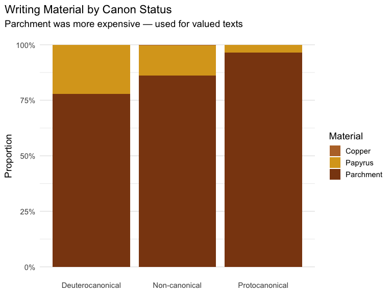
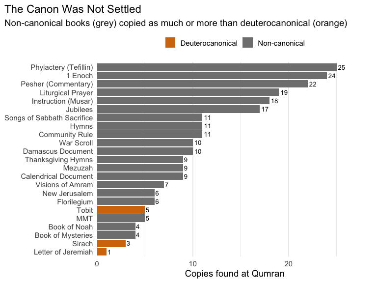

Was the Old Testament Canon Settled? What the Dead Sea Scrolls Tell Us
================
2026-08-03

One of the most persistent claims in Protestant apologetics is that the
Old Testament canon was “settled” long before Jesus — and that the
39-book Protestant canon reflects what first-century Jews universally
accepted as Scripture. The deuterocanonical books (Tobit, Sirach,
Wisdom, Baruch, 1–2 Maccabees, and additions to Daniel and Esther) are
dismissed as “apocrypha” — late additions the Catholic Church supposedly
tacked on at the Council of Trent.

But what if the physical evidence tells a different story?

The Dead Sea Scrolls, discovered between 1947 and 1956 in caves near
Qumran, give us the closest look we have at what Jewish communities
actually *used* as Scripture in the centuries before and during the time
of Jesus. These aren’t theological arguments — they’re archaeological
data. Let’s see what they say.

## Building the Dataset

Our dataset of **809 manuscripts** is sourced primarily from the [Leon
Levy Dead Sea Scrolls Digital
Library](https://www.deadseascrolls.org.il/) — the official catalog
maintained by the Israel Antiquities Authority (IAA). For manuscripts
the IAA marks as “Unidentified,” we supplement with scholarly
identifications from Wikipedia’s [List of the Dead Sea
Scrolls](https://en.wikipedia.org/wiki/List_of_the_Dead_Sea_Scrolls)
(citing Fitzmyer 2008 and the *Discoveries in the Judaean Desert*
publication series). The dataset covers all 11 Qumran caves plus Masada,
Wadi Murabba’at, and Nahal Hever.

``` r
library(tidyverse)
library(scales)
library(httr)
library(jsonlite)
library(rvest)

theme_set(theme_minimal(base_size = 14) +
          theme(plot.title.position = "plot"))
```

``` r
# Query the Leon Levy Dead Sea Scrolls Digital Library API
# per manuscript ID for all known caves (DJD numbering)
cave_ranges <- list(
  list(prefix = "1Q", start = 1, end = 72),
  list(prefix = "2Q", start = 1, end = 33),
  list(prefix = "3Q", start = 1, end = 15),
  list(prefix = "4Q", start = 1, end = 576),
  list(prefix = "5Q", start = 1, end = 25),
  list(prefix = "6Q", start = 1, end = 31),
  list(prefix = "7Q", start = 1, end = 19),
  list(prefix = "8Q", start = 1, end = 5),
  list(prefix = "9Q", start = 1, end = 1),
  list(prefix = "10Q", start = 1, end = 1),
  list(prefix = "11Q", start = 1, end = 31)
)

fetch_manuscript <- function(ms_id) {
  url <- sprintf("https://www.deadseascrolls.org.il/api/search?t=manuscript&q=%s",
                 URLencode(ms_id))
  resp <- tryCatch(
    GET(url, add_headers(`User-Agent` = "Mozilla/5.0 (R/tidytuesday)"), timeout(10)),
    error = function(e) NULL)
  if (is.null(resp) || status_code(resp) != 200) return(NULL)
  data <- content(resp, as = "text", encoding = "UTF-8") |> fromJSON(flatten = TRUE)
  if (data$length == 0) return(NULL)
  exact <- data$results |> filter(manuscript_number == ms_id)
  if (nrow(exact) > 0) return(exact[1, ])
  data$results[1, ]
}

all_manuscripts <- list()
for (cave in cave_ranges) {
  ids <- sprintf("%s%d", cave$prefix, cave$start:cave$end)
  cave_results <- compact(map(ids, ~ { Sys.sleep(0.08); fetch_manuscript(.x) }))
  if (length(cave_results) > 0) all_manuscripts[[cave$prefix]] <- bind_rows(cave_results)
}

# Non-Qumran sites: paginated text search
fetch_all_pages <- function(query) {
  first_url <- sprintf(
    "https://www.deadseascrolls.org.il/api/search?t=manuscript&q=%s&page=1",
    URLencode(query))
  resp <- tryCatch(GET(first_url,
    add_headers(`User-Agent` = "Mozilla/5.0 (R/tidytuesday)"),
    timeout(10)), error = function(e) NULL)
  if (is.null(resp) || status_code(resp) != 200) return(tibble())
  data <- content(resp, as = "text", encoding = "UTF-8") |> fromJSON(flatten = TRUE)
  if (data$length == 0) return(tibble())
  results <- data$results
  total_pages <- as.integer(data$totalpages)
  if (total_pages > 1) {
    for (p in 2:total_pages) {
      Sys.sleep(0.3)
      url <- sprintf(
        "https://www.deadseascrolls.org.il/api/search?t=manuscript&q=%s&page=%d",
        URLencode(query), p)
      r <- tryCatch(GET(url,
        add_headers(`User-Agent` = "Mozilla/5.0 (R/tidytuesday)"),
        timeout(10)), error = function(e) NULL)
      if (!is.null(r) && status_code(r) == 200) {
        pd <- content(r, as = "text", encoding = "UTF-8") |> fromJSON(flatten = TRUE)
        if (length(pd$results) > 0) results <- bind_rows(results, pd$results)
      }
    }
  }
  results
}

non_qumran_queries <- c("Mas", "Mur", "XHev", "5/6Hev", "8Hev")
for (q in non_qumran_queries) {
  Sys.sleep(0.5)
  site_results <- fetch_all_pages(q)
  if (nrow(site_results) > 0) all_manuscripts[[q]] <- site_results
}

leon_levy <- bind_rows(all_manuscripts) |>
  distinct(manuscript_number, .keep_all = TRUE) |>
  transmute(
    manuscript_id = manuscript_number,
    short_name = short_name,
    composition = composition_name,
    composition_type = composition_type,
    language = script_language,
    script_type = script_type,
    material = material,
    period = period,
    site = site,
    site_parent = if_else(!is.na(site_parent) & site_parent != "", site_parent,
                          str_extract(site, "^[^,]+")),
    cave = as.integer(str_extract(manuscript_number, "^(\\d+)(?=Q)")),
    num_images = num_images,
    keywords = if_else(is.na(keywords) | keywords == "", NA_character_, keywords)
  )
```

``` r
# Supplement unidentified manuscripts with Wikipedia identifications
page <- read_html("https://en.wikipedia.org/wiki/List_of_the_Dead_Sea_Scrolls")
tables <- page |> html_elements("table.wikitable")
raw_tables <- map(tables, ~ tryCatch(html_table(.x, fill = TRUE), error = function(e) NULL)) |>
  compact()

cave_assignments <- c(1, 2, 3, 4, 4, 4, 4, 5, 6, 7, 8, 9, 10, 11, NA, NA, NA)
wiki <- map2_dfr(raw_tables, seq_along(raw_tables), function(df, idx) {
  names(df) <- c("identifier", "scroll_name", "alt_identifier",
                 "bible_association", "language", "date_script", "description", "reference")
  df |> mutate(across(everything(), as.character), cave = cave_assignments[idx])
}) |>
  filter(!str_detect(identifier,
    "^Qumran Cave|^Fragment or scroll|^Wadi|^Nahal|^Masada$"), identifier != "")

wiki_lookup <- wiki |>
  filter(!is.na(alt_identifier), !str_detect(alt_identifier, "[\u2013-]\\d")) |>
  select(alt_identifier, scroll_name_wiki = scroll_name, description_wiki = description) |>
  distinct(alt_identifier, .keep_all = TRUE)

scrolls <- leon_levy |>
  left_join(wiki_lookup, by = c("manuscript_id" = "alt_identifier")) |>
  mutate(composition = if_else(
    composition == "Unidentified" & !is.na(scroll_name_wiki),
    scroll_name_wiki, composition))
```

``` r
# Canon status enrichment via pattern matching
biblical_books <- tribble(
  ~pattern, ~book, ~canon_status, ~bible_section, ~testament,
  "(?i)genesis apocryphon|\\bapGen", "Genesis Apocryphon", "Non-canonical", "Pseudepigrapha", "Non-biblical",
  "(?i)\\benoch|\\bEn[- ]|\\b1 ?En", "1 Enoch", "Non-canonical", "Pseudepigrapha", "Non-biblical",
  "(?i)\\bjubilees|\\bjub\\b", "Jubilees", "Non-canonical", "Pseudepigrapha", "Non-biblical",
  "(?i)\\bgiants\\b", "Book of Giants", "Non-canonical", "Pseudepigrapha", "Non-biblical",
  "(?i)\\btemple scroll", "Temple Scroll", "Non-canonical", "Sectarian", "Non-biblical",
  "(?i)community rule|serekh|rule of the community", "Community Rule", "Non-canonical", "Sectarian", "Non-biblical",
  "(?i)war scroll|milhamah|sefer ha-milhamah|rule of war", "War Scroll", "Non-canonical", "Sectarian", "Non-biblical",
  "(?i)hodayot|thanksgiving hymn", "Thanksgiving Hymns", "Non-canonical", "Sectarian", "Non-biblical",
  "(?i)damascus|\\bCD\\b", "Damascus Document", "Non-canonical", "Sectarian", "Non-biblical",
  "(?i)\\bnoah\\b", "Book of Noah", "Non-canonical", "Pseudepigrapha", "Non-biblical",
  "(?i)testament of levi|\\bTLevi|\\bALD|aramaic levi", "Aramaic Levi Document", "Non-canonical", "Pseudepigrapha", "Non-biblical",
  "(?i)testament of qahat|\\bTKohath|\\bTQahat", "Testament of Qahat", "Non-canonical", "Pseudepigrapha", "Non-biblical",
  "(?i)new jerusalem", "New Jerusalem", "Non-canonical", "Pseudepigrapha", "Non-biblical",
  "(?i)copper scroll", "Copper Scroll", "Non-canonical", "Documentary", "Non-biblical",
  "(?i)pesher|\\bpHab|\\bpNah|\\bpMic|\\bpZeph|\\bpPs|\\bpIsa|\\bpHos", "Pesher (Commentary)", "Non-canonical", "Sectarian", "Non-biblical",
  "(?i)phylacter|\\bphyl|\\btefillin", "Phylactery (Tefillin)", "Non-canonical", "Liturgical", "Non-biblical",
  "(?i)mezuz", "Mezuzah", "Non-canonical", "Liturgical", "Non-biblical",
  "(?i)\\bMMT\\b|miqsat", "MMT", "Non-canonical", "Sectarian", "Non-biblical",
  "(?i)\\binstruction\\b|sapiential", "Instruction (Musar)", "Non-canonical", "Wisdom", "Non-biblical",
  "(?i)mysteries|\\bMyst", "Book of Mysteries", "Non-canonical", "Sectarian", "Non-biblical",
  "(?i)songs of.*sabbath|angelic liturgy|\\bShir", "Songs of Sabbath Sacrifice", "Non-canonical", "Liturgical", "Non-biblical",
  "(?i)\\bflorilegium|\\beschat", "Florilegium", "Non-canonical", "Sectarian", "Non-biblical",
  "(?i)\\btestimonia\\b", "Testimonia", "Non-canonical", "Sectarian", "Non-biblical",
  "(?i)\\bvisions of amram|\\bamram", "Visions of Amram", "Non-canonical", "Pseudepigrapha", "Non-biblical",
  "(?i)\\brule of the blessing|benediction", "Rule of the Blessing", "Non-canonical", "Sectarian", "Non-biblical",
  "(?i)\\btargum\\b", "Targum", "Non-canonical", "Biblical Translation", "Non-biblical",
  "(?i)\\bcalendar|\\bcalendric|\\botot\\b", "Calendrical Document", "Non-canonical", "Sectarian", "Non-biblical",
  "(?i)\\btobit\\b|\\btob\\b|papTobit", "Tobit", "Deuterocanonical", "Deuterocanonical", "OT",
  "(?i)\\bsirach\\b|\\bben sira", "Sirach", "Deuterocanonical", "Deuterocanonical", "OT",
  "(?i)letter of jeremiah|epist.*jeremiah|\\bEpJer", "Letter of Jeremiah", "Deuterocanonical", "Deuterocanonical", "OT",
  "(?i)\\bgenesis\\b|\\bGen[- e]|paleo.?Gen", "Genesis", "Protocanonical", "Torah", "OT",
  "(?i)\\bexodus\\b|\\bExod[- u]", "Exodus", "Protocanonical", "Torah", "OT",
  "(?i)\\bleviticus\\b|\\bLev[- i]|paleoLev", "Leviticus", "Protocanonical", "Torah", "OT",
  "(?i)\\bnumbers\\b|\\bNum[- b]", "Numbers", "Protocanonical", "Torah", "OT",
  "(?i)\\bdeuteronomy\\b|\\bDeut[- e]", "Deuteronomy", "Protocanonical", "Torah", "OT",
  "(?i)\\bjoshua\\b", "Joshua", "Protocanonical", "Nevi'im", "OT",
  "(?i)\\bjudges\\b", "Judges", "Protocanonical", "Nevi'im", "OT",
  "(?i)\\bsamuel\\b", "Samuel", "Protocanonical", "Nevi'im", "OT",
  "(?i)\\bkings\\b", "Kings", "Protocanonical", "Nevi'im", "OT",
  "(?i)\\bisaiah\\b", "Isaiah", "Protocanonical", "Nevi'im", "OT",
  "(?i)\\bjeremiah\\b", "Jeremiah", "Protocanonical", "Nevi'im", "OT",
  "(?i)\\bezekiel\\b", "Ezekiel", "Protocanonical", "Nevi'im", "OT",
  "(?i)\\bhosea\\b", "Hosea", "Protocanonical", "Nevi'im", "OT",
  "(?i)\\bjoel\\b", "Joel", "Protocanonical", "Nevi'im", "OT",
  "(?i)\\bamos\\b", "Amos", "Protocanonical", "Nevi'im", "OT",
  "(?i)\\bjonah\\b", "Jonah", "Protocanonical", "Nevi'im", "OT",
  "(?i)\\bmicah\\b", "Micah", "Protocanonical", "Nevi'im", "OT",
  "(?i)\\bnahum\\b", "Nahum", "Protocanonical", "Nevi'im", "OT",
  "(?i)\\bhabakkuk\\b", "Habakkuk", "Protocanonical", "Nevi'im", "OT",
  "(?i)\\bzephaniah\\b", "Zephaniah", "Protocanonical", "Nevi'im", "OT",
  "(?i)\\bhaggai\\b", "Haggai", "Protocanonical", "Nevi'im", "OT",
  "(?i)\\bzechariah\\b", "Zechariah", "Protocanonical", "Nevi'im", "OT",
  "(?i)\\bmalachi\\b", "Malachi", "Protocanonical", "Nevi'im", "OT",
  "(?i)minor prophets|twelve prophets", "Minor Prophets (Twelve)", "Protocanonical", "Nevi'im", "OT",
  "(?i)\\bpsalm", "Psalms", "Protocanonical", "Ketuvim", "OT",
  "(?i)\\bproverbs\\b", "Proverbs", "Protocanonical", "Ketuvim", "OT",
  "(?i)\\bjob\\b", "Job", "Protocanonical", "Ketuvim", "OT",
  "(?i)song of s|canticles", "Song of Songs", "Protocanonical", "Ketuvim", "OT",
  "(?i)\\becclesiastes\\b|\\bqoh", "Ecclesiastes", "Protocanonical", "Ketuvim", "OT",
  "(?i)\\blamentations\\b", "Lamentations", "Protocanonical", "Ketuvim", "OT",
  "(?i)\\besther\\b", "Esther", "Protocanonical", "Ketuvim", "OT",
  "(?i)\\bdaniel\\b", "Daniel", "Protocanonical", "Ketuvim", "OT",
  "(?i)\\bezra\\b", "Ezra", "Protocanonical", "Ketuvim", "OT",
  "(?i)\\bnehemiah\\b", "Nehemiah", "Protocanonical", "Ketuvim", "OT",
  "(?i)\\bchronicles\\b", "Chronicles", "Protocanonical", "Ketuvim", "OT",
  "(?i)\\bruth\\b", "Ruth", "Protocanonical", "Ketuvim", "OT",
  "(?i)\\bhymn|\\bhymnic", "Hymns", "Non-canonical", "Liturgical", "Non-biblical",
  "(?i)prayer|festival prayer", "Liturgical Prayer", "Non-canonical", "Liturgical", "Non-biblical"
)

identify_book <- function(composition, short_name, wiki_desc) {
  search_text <- paste(composition, short_name, wiki_desc, sep = " ")
  for (i in seq_len(nrow(biblical_books))) {
    if (str_detect(search_text, biblical_books$pattern[i])) {
      return(tibble(biblical_book = biblical_books$book[i],
                    canon_status = biblical_books$canon_status[i],
                    bible_section = biblical_books$bible_section[i],
                    testament = biblical_books$testament[i]))
    }
  }
  if (str_detect(search_text, "(?i)unident"))
    return(tibble(biblical_book = NA_character_, canon_status = "Unidentified",
                  bible_section = "Unidentified", testament = "Unknown"))
  tibble(biblical_book = NA_character_, canon_status = "Non-canonical",
         bible_section = "Other", testament = "Non-biblical")
}

book_info <- pmap_dfr(list(scrolls$composition,
                           replace_na(scrolls$short_name, ""),
                           replace_na(scrolls$description_wiki, "")),
                      identify_book)
scrolls <- scrolls |>
  mutate(
    biblical_book = book_info$biblical_book,
    canon_status = book_info$canon_status,
    bible_section = book_info$bible_section,
    testament = book_info$testament
  )

# Final cleanup
scrolls <- scrolls |>
  mutate(
    content_category = case_when(
      canon_status == "Protocanonical" ~ "Biblical",
      canon_status == "Deuterocanonical" ~ "Biblical (Deuterocanonical)",
      bible_section == "Pseudepigrapha" ~ "Parabiblical",
      bible_section == "Sectarian" ~ "Sectarian",
      bible_section == "Liturgical" ~ "Liturgical",
      bible_section == "Wisdom" ~ "Wisdom Literature",
      bible_section == "Documentary" ~ "Documentary",
      bible_section == "Biblical Translation" ~ "Biblical Translation",
      bible_section == "Unidentified" ~ "Unidentified",
      TRUE ~ "Other Non-biblical"
    ),
    language = case_when(
      str_detect(language, "(?i)hebrew") ~ "Hebrew",
      str_detect(language, "(?i)aramaic") ~ "Aramaic",
      str_detect(language, "(?i)greek") ~ "Greek",
      str_detect(language, "(?i)nabat") ~ "Nabataean",
      TRUE ~ language
    )
  ) |>
  select(-scroll_name_wiki, -description_wiki)
```

``` r
cat(sprintf("Manuscripts: %d\nCaves: %s\nLanguages: %s\n",
            nrow(scrolls),
            paste(sort(unique(scrolls$cave[!is.na(scrolls$cave)])), collapse = ", "),
            paste(names(sort(table(scrolls$language), decreasing = TRUE)), collapse = ", ")))
```

    ## Manuscripts: 809
    ## Caves: 1, 2, 3, 4, 5, 6, 7, 8, 9, 11
    ## Languages: Hebrew, Aramaic, Greek, , Unidentified, Nabataean

## Exploring the Collection

The Dead Sea Scrolls are often described as “about 40% biblical, 30%
parabiblical, and 30% sectarian.” Does our data reflect that?

``` r
scrolls |>
  count(content_category, sort = TRUE) |>
  mutate(pct = n / sum(n)) |>
  ggplot(aes(x = reorder(content_category, n), y = n)) +
  geom_col(fill = "#8B4513") +
  geom_text(aes(label = sprintf("%d (%.0f%%)", n, pct * 100)), hjust = -0.1, size = 3.5) +
  coord_flip() +
  labs(title = "What did the Qumran community collect?",
       subtitle = "Manuscript count by content category",
       x = NULL, y = "Number of manuscripts") +
  scale_y_continuous(expand = expansion(mult = c(0, 0.2))) +
  theme(panel.grid.major.y = element_blank(), panel.grid.minor = element_blank())
```

<!-- -->

``` r
scrolls |>
  filter(!is.na(language), language != "") |>
  count(language, sort = TRUE) |>
  ggplot(aes(x = reorder(language, n), y = n)) +
  geom_col(fill = "#2E5090") +
  geom_text(aes(label = n), hjust = -0.1, size = 4) +
  coord_flip() +
  labs(title = "Languages of the Dead Sea Scrolls", x = NULL, y = "Number of manuscripts") +
  scale_y_continuous(expand = expansion(mult = c(0, 0.15))) +
  theme(panel.grid.major.y = element_blank())
```

<!-- -->

``` r
scrolls |>
  filter(!is.na(cave)) |>
  count(cave) |>
  ggplot(aes(x = factor(cave), y = n)) +
  geom_col(fill = "#6B4226") +
  geom_text(aes(label = n), vjust = -0.3, size = 3.5) +
  labs(title = "Manuscripts by Cave",
       subtitle = "Cave 4 held the vast majority of the collection",
       x = "Cave Number", y = "Manuscripts") +
  scale_y_continuous(expand = expansion(mult = c(0, 0.1))) +
  theme(panel.grid.major.x = element_blank())
```

<!-- -->

``` r
scrolls |>
  filter(!is.na(period), period != "") |>
  count(period, sort = TRUE) |>
  mutate(period = fct_reorder(period, n)) |>
  ggplot(aes(x = period, y = n)) +
  geom_col(fill = "#5C3317") +
  geom_text(aes(label = n), hjust = -0.1, size = 3.5) +
  coord_flip() +
  labs(title = "When were the Dead Sea Scrolls written?",
       subtitle = "Paleographic period assignment (from IAA catalog)",
       x = NULL, y = "Count") +
  scale_y_continuous(expand = expansion(mult = c(0, 0.15))) +
  theme(panel.grid.major.y = element_blank())
```

<!-- -->

## The Canon Question: What Books Did They Copy?

Now let’s get to the core question. If the Old Testament canon was truly
“settled” before Jesus, we’d expect to see a clear distinction between
the 39 protocanonical books and everything else. Let’s look at what the
Qumran community actually chose to copy.

``` r
scrolls |>
  count(canon_status, sort = TRUE) |>
  mutate(pct = n / sum(n)) |>
  ggplot(aes(x = reorder(canon_status, n), y = n, fill = canon_status)) +
  geom_col() +
  geom_text(aes(label = sprintf("%d (%.0f%%)", n, pct * 100)), hjust = -0.1, size = 4) +
  coord_flip() +
  scale_fill_manual(values = c("Protocanonical" = "#2E5090", "Non-canonical" = "#808080",
                               "Unidentified" = "#CCCCCC", "Deuterocanonical" = "#D4760A")) +
  labs(title = "Canon Status of Dead Sea Scrolls Manuscripts",
       x = NULL, y = "Number of manuscripts") +
  scale_y_continuous(expand = expansion(mult = c(0, 0.2))) +
  theme(panel.grid.major.y = element_blank(), legend.position = "none")
```

<!-- -->

## The Key Comparison: Copy Counts by Book

This is the most telling analysis. If a community considers a book
sacred Scripture, they copy it. More copies = more use, more authority,
more demand.

``` r
book_counts <- scrolls |>
  filter(!is.na(biblical_book),
         canon_status %in% c("Protocanonical", "Deuterocanonical")) |>
  count(biblical_book, canon_status, sort = TRUE)

book_counts |>
  mutate(biblical_book = fct_reorder(biblical_book, n)) |>
  ggplot(aes(x = biblical_book, y = n, fill = canon_status)) +
  geom_col() +
  coord_flip() +
  scale_fill_manual(values = c("Protocanonical" = "#2E5090", "Deuterocanonical" = "#D4760A")) +
  labs(title = "How Many Copies of Each Biblical Book Were Found?",
       subtitle = "Deuterocanonical books (orange) appear alongside protocanonical books (blue)",
       x = NULL, y = "Number of manuscript copies", fill = "Canon Status") +
  theme(panel.grid.major.y = element_blank(), legend.position = "top")
```

<!-- -->

``` r
comparison <- book_counts |>
  filter(n <= 6) |>
  mutate(biblical_book = fct_reorder(biblical_book, n))

comparison |>
  ggplot(aes(x = biblical_book, y = n, fill = canon_status)) +
  geom_col() +
  geom_text(aes(label = n), hjust = -0.2, size = 4) +
  coord_flip() +
  scale_fill_manual(values = c("Protocanonical" = "#2E5090", "Deuterocanonical" = "#D4760A")) +
  labs(title = "Tobit Has More Copies Than Many Accepted Books",
       subtitle = "Books with 6 or fewer copies at Qumran. Orange = Deuterocanonical.",
       x = NULL, y = "Manuscript copies found", fill = "Canon Status") +
  scale_y_continuous(expand = expansion(mult = c(0, 0.15))) +
  theme(panel.grid.major.y = element_blank(), legend.position = "top")
```

<!-- -->

## The Deuterocanonical Books at Qumran: A Closer Look

``` r
scrolls |>
  filter(canon_status == "Deuterocanonical") |>
  select(manuscript_id, biblical_book, cave, language, material, period) |>
  knitr::kable(
    caption = "All deuterocanonical manuscripts found in the Dead Sea Scrolls",
    col.names = c("Manuscript ID", "Book", "Cave", "Language", "Material", "Period")
  )
```

| Manuscript ID | Book               | Cave | Language | Material  | Period    |
|:--------------|:-------------------|-----:|:---------|:----------|:----------|
| 2Q18          | Sirach             |    2 | Hebrew   | Parchment | Herodian  |
| 4Q196         | Tobit              |    4 | Aramaic  | Papyrus   | Hasmonean |
| 4Q197         | Tobit              |    4 | Aramaic  | Parchment | Herodian  |
| 4Q198         | Tobit              |    4 | Aramaic  | Parchment | Hasmonean |
| 4Q199         | Tobit              |    4 | Aramaic  | Parchment | Hasmonean |
| 4Q200         | Tobit              |    4 | Hebrew   | Parchment | Herodian  |
| 7Q2           | Letter of Jeremiah |    7 | Greek    | Papyrus   | Hasmonean |
| 11Q5          | Sirach             |   11 | Hebrew   | Parchment | Herodian  |
| Mas 1h        | Sirach             |   NA | Hebrew   | Parchment | Roman     |

All deuterocanonical manuscripts found in the Dead Sea Scrolls

Key observations:

- **Tobit**: 5 copies — 4 in Aramaic, 1 in Hebrew. Found in Cave 4.
  Having copies in *two languages* suggests active use and translation,
  not peripheral status.
- **Sirach (Ben Sira)**: Found in Cave 2 (Hebrew) and Cave 11 (embedded
  in the Great Psalms Scroll alongside canonical psalms).
- **Letter of Jeremiah**: Found in Cave 7 in Greek. A book Protestants
  reject but that was physically present at Qumran.

## Were Deuterocanonical Books Treated Differently?

If there was a recognized distinction between “canonical” and
“apocryphal” books, we’d expect differences in storage, materials, or
scribal treatment.

``` r
deutero_caves <- scrolls |>
  filter(canon_status == "Deuterocanonical") |> pull(cave) |> unique() |> sort()

scrolls |>
  filter(cave %in% deutero_caves, canon_status == "Protocanonical") |>
  count(cave, biblical_book) |>
  group_by(cave) |>
  summarise(proto_books = n(), proto_copies = sum(n), .groups = "drop") |>
  knitr::kable(
    caption = "Protocanonical books found in the same caves as deuterocanonical texts",
    col.names = c("Cave", "Distinct Books", "Total Copies"))
```

| Cave | Distinct Books | Total Copies |
|-----:|---------------:|-------------:|
|    2 |              9 |           17 |
|    4 |             22 |          156 |
|    7 |              1 |            1 |
|   11 |              4 |            9 |

Protocanonical books found in the same caves as deuterocanonical texts

The deuterocanonical books were found in the same caves that held
Genesis, Exodus, Isaiah, and Psalms. No separate storage, no “apocrypha
section.”

``` r
scrolls |>
  filter(canon_status %in% c("Protocanonical", "Deuterocanonical", "Non-canonical"),
         !is.na(material), material != "") |>
  count(canon_status, material) |>
  group_by(canon_status) |>
  mutate(pct = n / sum(n)) |>
  ggplot(aes(x = canon_status, y = pct, fill = material)) +
  geom_col(position = "fill") +
  scale_y_continuous(labels = percent) +
  scale_fill_manual(values = c("Parchment" = "#8B4513", "Papyrus" = "#DAA520",
                               "Copper" = "#B87333", "Stone" = "#A9A9A9")) +
  labs(title = "Writing Material by Canon Status",
       subtitle = "Parchment was more expensive — used for valued texts",
       x = NULL, y = "Proportion", fill = "Material") +
  theme(panel.grid.major.x = element_blank())
```

<!-- -->

## The “Non-Canonical” Elephant in the Room

Several books that *no* Christian tradition considers canonical were
copied *more frequently* than some protocanonical books.

``` r
high_copy_works <- scrolls |>
  filter(!is.na(biblical_book)) |>
  count(biblical_book, canon_status, sort = TRUE) |>
  filter((canon_status == "Non-canonical" & n >= 4) | canon_status == "Deuterocanonical") |>
  mutate(biblical_book = fct_reorder(biblical_book, n))

high_copy_works |>
  ggplot(aes(x = biblical_book, y = n, fill = canon_status)) +
  geom_col() +
  geom_text(aes(label = n), hjust = -0.2, size = 3.5) +
  coord_flip() +
  scale_fill_manual(values = c("Non-canonical" = "#808080", "Deuterocanonical" = "#D4760A")) +
  labs(title = "The Canon Was Not Settled",
       subtitle = "Non-canonical books (grey) copied as much or more than deuterocanonical (orange)",
       x = NULL, y = "Copies found at Qumran", fill = NULL) +
  scale_y_continuous(expand = expansion(mult = c(0, 0.15))) +
  theme(panel.grid.major.y = element_blank(), legend.position = "top")
```

<!-- -->

**Jubilees** has 7+ copies. **1 Enoch** has 5+. These are books that
*neither* Protestants *nor* Catholics include in their canon (except
Ethiopian Orthodox for Enoch). The Qumran community did not operate with
a fixed canon.

## Putting It All Together

### Finding 1: The deuterocanonical books were physically present at Qumran

Tobit, Sirach, and the Letter of Jeremiah were found in the same caves,
on the same materials, written by the same scribal traditions as
Genesis, Isaiah, and Psalms.

### Finding 2: Tobit was copied MORE than many “accepted” books

With 5 copies, Tobit exceeds Job, Ruth, Joshua, Judges, Kings, and
Proverbs — books Protestants accept without question.

### Finding 3: There was no two-tier system

Same caves. Same parchment. Same scribal periods. No physical
distinction between protocanonical and deuterocanonical.

### Finding 4: The “settled canon” narrative requires ignoring Jubilees and Enoch

Canon decisions were made by communities of faith, not by pre-existing
“obvious” lists. The Catholic position — that the canon was
authoritatively defined by the Church — is exactly what the data
supports.

``` r
scrolls |>
  filter(!is.na(biblical_book)) |>
  count(biblical_book, canon_status, sort = TRUE) |>
  filter(n >= 3) |>
  mutate(category = case_when(
    canon_status == "Protocanonical" ~ "Protestant + Catholic Canon",
    canon_status == "Deuterocanonical" ~ "Catholic Canon Only",
    canon_status == "Non-canonical" ~ "No Modern Canon")) |>
  select(Book = biblical_book, Copies = n, `Canon Status` = category) |>
  knitr::kable(caption = "Books with 3+ copies at Qumran, by modern canonical status")
```

| Book                       | Copies | Canon Status                |
|:---------------------------|-------:|:----------------------------|
| Psalms                     |     34 | Protestant + Catholic Canon |
| Deuteronomy                |     30 | Protestant + Catholic Canon |
| Phylactery (Tefillin)      |     25 | No Modern Canon             |
| 1 Enoch                    |     24 | No Modern Canon             |
| Genesis                    |     24 | Protestant + Catholic Canon |
| Pesher (Commentary)        |     22 | No Modern Canon             |
| Exodus                     |     20 | Protestant + Catholic Canon |
| Liturgical Prayer          |     19 | No Modern Canon             |
| Instruction (Musar)        |     18 | No Modern Canon             |
| Isaiah                     |     18 | Protestant + Catholic Canon |
| Jubilees                   |     17 | No Modern Canon             |
| Leviticus                  |     16 | Protestant + Catholic Canon |
| Community Rule             |     11 | No Modern Canon             |
| Daniel                     |     11 | Protestant + Catholic Canon |
| Hymns                      |     11 | No Modern Canon             |
| Songs of Sabbath Sacrifice |     11 | No Modern Canon             |
| Damascus Document          |     10 | No Modern Canon             |
| Ezekiel                    |     10 | Protestant + Catholic Canon |
| Jeremiah                   |     10 | Protestant + Catholic Canon |
| War Scroll                 |     10 | No Modern Canon             |
| Calendrical Document       |      9 | No Modern Canon             |
| Mezuzah                    |      9 | No Modern Canon             |
| Thanksgiving Hymns         |      9 | No Modern Canon             |
| Minor Prophets (Twelve)    |      8 | Protestant + Catholic Canon |
| Numbers                    |      7 | Protestant + Catholic Canon |
| Visions of Amram           |      7 | No Modern Canon             |
| Florilegium                |      6 | No Modern Canon             |
| Joshua                     |      6 | Protestant + Catholic Canon |
| Lamentations               |      6 | Protestant + Catholic Canon |
| New Jerusalem              |      6 | No Modern Canon             |
| Samuel                     |      6 | Protestant + Catholic Canon |
| MMT                        |      5 | No Modern Canon             |
| Tobit                      |      5 | Catholic Canon Only         |
| Book of Mysteries          |      4 | No Modern Canon             |
| Book of Noah               |      4 | No Modern Canon             |
| Job                        |      4 | Protestant + Catholic Canon |
| Ruth                       |      4 | Protestant + Catholic Canon |
| Aramaic Levi Document      |      3 | No Modern Canon             |
| Judges                     |      3 | Protestant + Catholic Canon |
| Kings                      |      3 | Protestant + Catholic Canon |
| Proverbs                   |      3 | Protestant + Catholic Canon |
| Sirach                     |      3 | Catholic Canon Only         |
| Targum                     |      3 | No Modern Canon             |
| Temple Scroll              |      3 | No Modern Canon             |

Books with 3+ copies at Qumran, by modern canonical status

## Data Sources

- **Primary source**: [Leon Levy Dead Sea Scrolls Digital
  Library](https://www.deadseascrolls.org.il/) — official catalog of the
  Israel Antiquities Authority. Queried per-manuscript-ID for all 11
  Qumran caves (771 manuscripts).
- **Supplementary source**: Wikipedia’s [List of the Dead Sea
  Scrolls](https://en.wikipedia.org/wiki/List_of_the_Dead_Sea_Scrolls),
  which synthesizes Fitzmyer (2008) *A Guide to the Dead Sea Scrolls and
  Related Literature* and the *Discoveries in the Judaean Desert* series
  (40 volumes, Oxford University Press).
- **Canon classifications**: Based on the Catholic canon (73 books)
  vs. Protestant canon (66 books). “Deuterocanonical” = books in the
  Catholic Old Testament but not the Protestant one.
