# Two Leos, 135 Years Apart: A Text Analysis of Rerum Novarum and Magnifica Humanitas

**[Source Code](2026_06_01_encyclical_comparison.Rmd)** | Data from [Vatican.va](https://www.vatican.va) — Pope Leo XIII's *Rerum Novarum* (1891) and Pope Leo XIV's *Magnifica Humanitas* (2026)

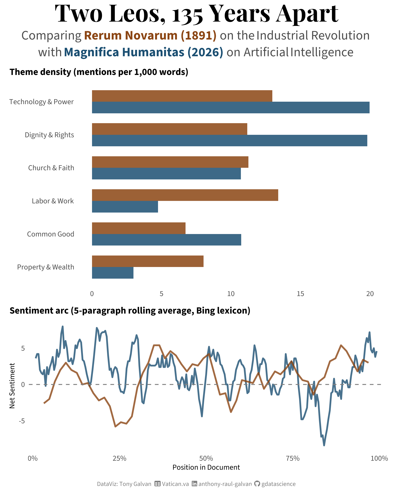

135 years separate these two papal encyclicals, yet both respond to epochal technological transformations — the Industrial Revolution and the AI Revolution. Using text mining, topic modeling, and cosine similarity, we compare their language, sentiment, themes, and scriptural foundations — and pose 16 discussion questions for the Golden Dome Data Tuesdays session on June 3, 2026.

---

In May 2026, Pope Leo XIV released his first encyclical, *Magnifica
Humanitas*, on safeguarding the human person in the age of artificial
intelligence. He deliberately signed it on May 15 — the 135th
anniversary of Pope Leo XIII’s landmark *Rerum Novarum* (1891), which
addressed the condition of workers during the Industrial Revolution.
Both documents respond to epochal technological transformations that
reshape labor, power, and human dignity. Let’s use data science to
explore how these two “Leo” encyclicals compare across language, themes,
and scriptural foundations.

This analysis was prepared for the **Golden Dome Data Tuesdays** session
on June 3, 2026, where we’ll discuss *Magnifica Humanitas* and its
implications for data scientists, AI practitioners, and people of faith
navigating this technological moment. Throughout the post, you’ll find
discussion questions designed to spark conversation at our session.

## Libraries and Data Loading

``` r
library(tidyverse)
library(tidytext)
library(scales)
library(showtext)
library(sysfonts)
library(ggtext)
library(patchwork)

font_add_google("Source Sans 3", "source_sans")
font_add_google("Playfair Display", "playfair")
showtext_auto()
showtext_opts(dpi = 300)

theme_set(theme_minimal(base_family = "source_sans", base_size = 14) +
            theme(plot.title.position = "plot"))
```

``` r
# Scrape encyclical texts from the Vatican website
library(rvest)
library(httr)

# Fetch Rerum Novarum (Leo XIII, 1891)
rn_url <- "https://www.vatican.va/content/leo-xiii/en/encyclicals/documents/hf_l-xiii_enc_15051891_rerum-novarum.html"
rn_response <- GET(rn_url, user_agent("Mozilla/5.0"))
rn_html <- read_html(content(rn_response, as = "text", encoding = "UTF-8"))
rn_raw <- rn_html |> html_nodes("p") |> html_text2()

# Fetch Magnifica Humanitas (Leo XIV, 2026)
mh_url <- "https://www.vatican.va/content/leo-xiv/en/encyclicals/documents/20260515-magnifica-humanitas.html"
mh_response <- GET(mh_url, user_agent("Mozilla/5.0"))
mh_html <- read_html(content(mh_response, as = "text", encoding = "UTF-8"))
mh_raw <- mh_html |> html_nodes("p") |> html_text2()

# Parse Rerum Novarum - numbered paragraphs start with "N."
# First paragraph is unnumbered, rest start with number
rn_numbered <- grep("^[0-9]+[.]", rn_raw, value = TRUE)
rn_first <- rn_raw[8]  # The opening paragraph without a number

rn_df <- tibble(
  paragraph = c(1L, as.integer(str_extract(rn_numbered, "^[0-9]+"))),
  text = c(rn_first, str_replace(rn_numbered, "^[0-9]+[.] ?", "")),
  document = "Rerum Novarum (1891)"
)

# Parse Magnifica Humanitas - numbered paragraphs
mh_numbered <- grep("^[0-9]+[.]", mh_raw, value = TRUE)

mh_df <- tibble(
  paragraph = as.integer(str_extract(mh_numbered, "^[0-9]+")),
  text = str_replace(mh_numbered, "^[0-9]+[.] ?", ""),
  document = "Magnifica Humanitas (2026)"
)

# Combine
encyclicals <- bind_rows(rn_df, mh_df)

cat("Rerum Novarum:", nrow(rn_df), "paragraphs\n")
```

    ## Rerum Novarum: 64 paragraphs

``` r
cat("Magnifica Humanitas:", nrow(mh_df), "paragraphs\n")
```

    ## Magnifica Humanitas: 245 paragraphs

## Exploratory Data Analysis

Let’s start by profiling the basic structure of each document — word
counts, sentence lengths, and vocabulary richness.

``` r
# Word counts per paragraph
encyclicals <- encyclicals |>

mutate(
    word_count = str_count(text, "\\S+"),
    sentence_count = str_count(text, "[.!?]+"),
    avg_sentence_length = word_count / pmax(sentence_count, 1)
  )

summary_stats <- encyclicals |>
  group_by(document) |>
  summarise(
    paragraphs = n(),
    total_words = sum(word_count),
    avg_words_per_para = mean(word_count),
    median_words_per_para = median(word_count),
    avg_sentence_length = mean(avg_sentence_length),
    .groups = "drop"
  )

summary_stats |>
  knitr::kable(digits = 1, caption = "Document Overview")
```

| document | paragraphs | total_words | avg_words_per_para | median_words_per_para | avg_sentence_length |
|:---|---:|---:|---:|---:|---:|
| Magnifica Humanitas (2026) | 245 | 37261 | 152.1 | 148 | 28.8 |
| Rerum Novarum (1891) | 64 | 13961 | 218.1 | 188 | 36.8 |

Document Overview

``` r
ggplot(encyclicals, aes(x = word_count, fill = document)) +
  geom_histogram(bins = 30, alpha = 0.7, position = "identity") +
  scale_fill_manual(values = c("Rerum Novarum (1891)" = "#8B4513",
                               "Magnifica Humanitas (2026)" = "#1B4F72")) +
  labs(
    title = "Distribution of Paragraph Lengths",
    subtitle = "Magnifica Humanitas tends toward shorter, more digestible paragraphs",
    x = "Words per Paragraph",
    y = "Count",
    fill = NULL
  ) +
  theme(
    legend.position = "top",
    panel.grid = element_blank()
  )
```

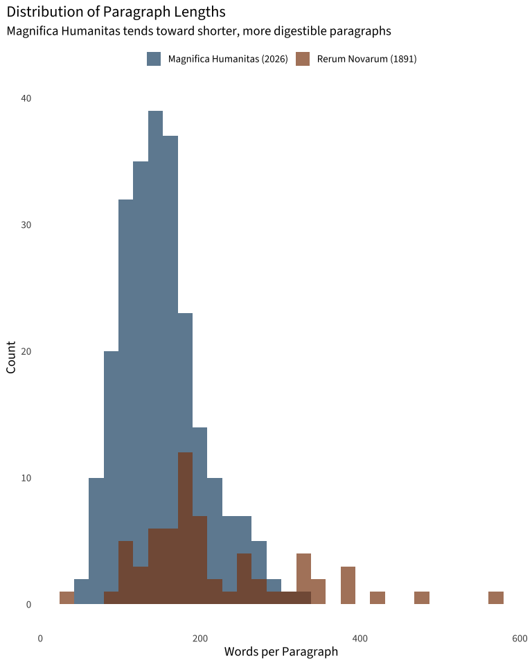<!-- -->

``` r
ggplot(encyclicals, aes(x = document, y = avg_sentence_length, fill = document)) +
  geom_boxplot(alpha = 0.7, show.legend = FALSE) +
  scale_fill_manual(values = c("Rerum Novarum (1891)" = "#8B4513",
                               "Magnifica Humanitas (2026)" = "#1B4F72")) +
  labs(
    title = "Average Sentence Length by Paragraph",
    subtitle = "Leo XIII's 19th-century prose features notably longer sentences",
    x = NULL,
    y = "Average Words per Sentence"
  ) +
  theme(panel.grid = element_blank())
```

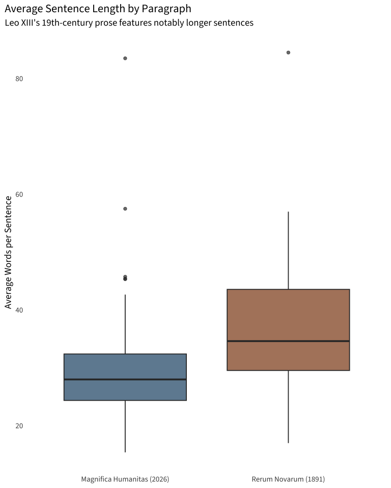<!-- -->

## Tokenization and Word Frequency

Now let’s tokenize both documents and examine the most distinctive words
in each, using [TF-IDF](https://en.wikipedia.org/wiki/Tf%E2%80%93idf) —
a technique that identifies words that are frequent in one document but
rare in the other, revealing each encyclical’s unique vocabulary.

``` r
# Tokenize to words
words_df <- encyclicals |>
  unnest_tokens(word, text) |>
  anti_join(stop_words, by = "word") |>
  filter(!str_detect(word, "^[0-9]+$")) |>
  mutate(word = case_when(
    word == "god" ~ "God",
    word == "christ" ~ "Christ",
    word == "jesus" ~ "Jesus",
    .default = word
  ))

word_counts <- words_df |>
  count(document, word, sort = TRUE)

# Total words per document (after stop word removal)
total_per_doc <- word_counts |>
  group_by(document) |>
  summarise(total = sum(n))

word_counts <- word_counts |>
  left_join(total_per_doc, by = "document")
```

``` r
# Calculate TF-IDF
tfidf <- word_counts |>
  bind_tf_idf(word, document, n)

# Top 15 distinctive words per document
top_tfidf <- tfidf |>
  group_by(document) |>
  slice_max(tf_idf, n = 15) |>
  ungroup() |>
  mutate(word = reorder_within(word, tf_idf, document))

ggplot(top_tfidf, aes(x = tf_idf, y = word, fill = document)) +
  geom_col(show.legend = FALSE, alpha = 0.85) +
  facet_wrap(~document, scales = "free_y") +
  scale_y_reordered() +
  scale_fill_manual(values = c("Rerum Novarum (1891)" = "#8B4513",
                               "Magnifica Humanitas (2026)" = "#1B4F72")) +
  labs(
    title = "Most Distinctive Words (TF-IDF)",
    subtitle = "Words that uniquely characterize each encyclical",
    x = "TF-IDF Score",
    y = NULL
  ) +
  theme(
    panel.grid = element_blank(),
    strip.text = element_text(face = "bold", size = 12)
  )
```

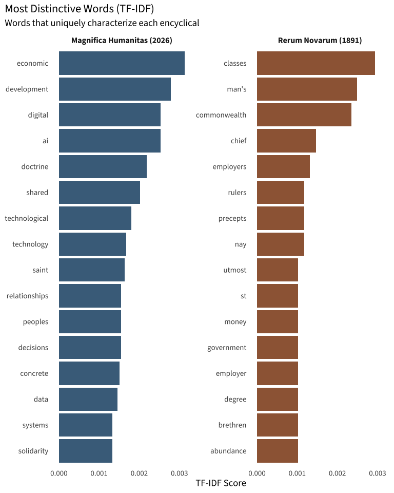<!-- -->

## Sentiment Analysis

[Sentiment analysis](https://en.wikipedia.org/wiki/Sentiment_analysis)
assigns emotional valence to words, letting us track the emotional arc
of each document. We’ll use the Bing lexicon, which classifies words as
positive or negative, giving us a clear view of each document’s tone.

``` r
# Bing sentiment (positive/negative classification)
bing <- get_sentiments("bing")

sentiment_by_para <- words_df |>
  inner_join(bing, by = "word") |>
  count(document, paragraph, sentiment) |>
  pivot_wider(names_from = sentiment, values_from = n, values_fill = 0) |>
  mutate(
    net_sentiment = positive - negative,
    total_words = positive + negative,
    pct_positive = positive / total_words
  )

# Summary comparison
sentiment_summary_bing <- sentiment_by_para |>
  group_by(document) |>
  summarise(
    mean_net = mean(net_sentiment),
    median_net = median(net_sentiment),
    mean_pct_positive = mean(pct_positive),
    .groups = "drop"
  )

sentiment_summary_bing |>
  knitr::kable(digits = 2, caption = "Bing Sentiment Summary")
```

| document                   | mean_net | median_net | mean_pct_positive |
|:---------------------------|---------:|-----------:|------------------:|
| Magnifica Humanitas (2026) |     1.75 |          2 |              0.59 |
| Rerum Novarum (1891)       |     0.86 |          1 |              0.56 |

Bing Sentiment Summary

``` r
ggplot(sentiment_by_para, aes(x = pct_positive, fill = document)) +
  geom_density(alpha = 0.6) +
  geom_vline(xintercept = 0.5, linetype = "dashed", color = "gray50") +
  scale_fill_manual(values = c("Rerum Novarum (1891)" = "#8B4513",
                               "Magnifica Humanitas (2026)" = "#1B4F72")) +
  scale_x_continuous(labels = percent_format()) +
  labs(
    title = "Sentiment Distribution (Bing Lexicon)",
    subtitle = "Proportion of positive sentiment words per paragraph",
    x = "% Positive Words",
    y = "Density",
    fill = NULL
  ) +
  theme(
    panel.grid = element_blank(),
    legend.position = "top"
  )
```

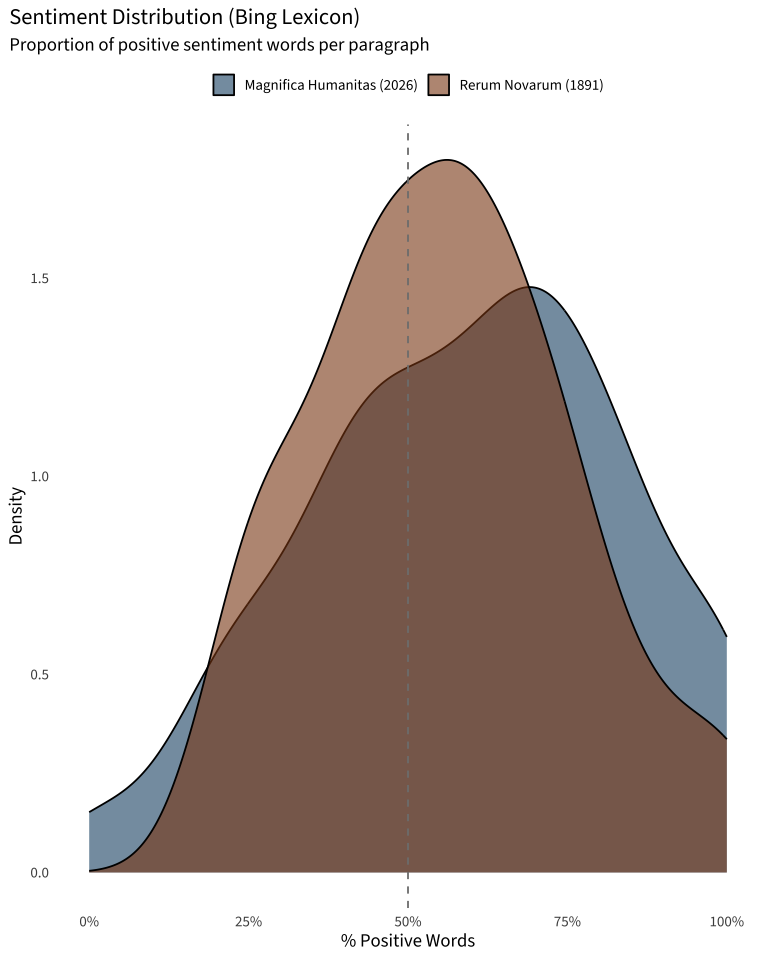<!-- -->

``` r
# Sentiment arc using Bing (positive/negative)
sentiment_arc <- words_df |>
  inner_join(bing, by = "word") |>
  mutate(score = if_else(sentiment == "positive", 1, -1)) |>
  group_by(document, paragraph) |>
  summarise(net_sentiment = sum(score), .groups = "drop") |>
  group_by(document) |>
  mutate(
    para_pct = (paragraph - min(paragraph)) / (max(paragraph) - min(paragraph)),
    rolling_sentiment = zoo::rollmean(net_sentiment, k = 5, fill = NA, align = "center")
  ) |>
  ungroup()

ggplot(sentiment_arc, aes(x = para_pct, y = rolling_sentiment, color = document)) +
  geom_line(linewidth = 1.2, alpha = 0.8) +
  geom_hline(yintercept = 0, linetype = "dashed", color = "gray50") +
  scale_color_manual(values = c("Rerum Novarum (1891)" = "#8B4513",
                                "Magnifica Humanitas (2026)" = "#1B4F72")) +
  scale_x_continuous(labels = percent_format()) +
  labs(
    title = "Sentiment Arc Through Each Document",
    subtitle = "5-paragraph rolling average of net sentiment (positive minus negative words)",
    x = "Position in Document (%)",
    y = "Net Sentiment (rolling avg)",
    color = NULL
  ) +
  theme(
    panel.grid = element_blank(),
    legend.position = "top"
  )
```

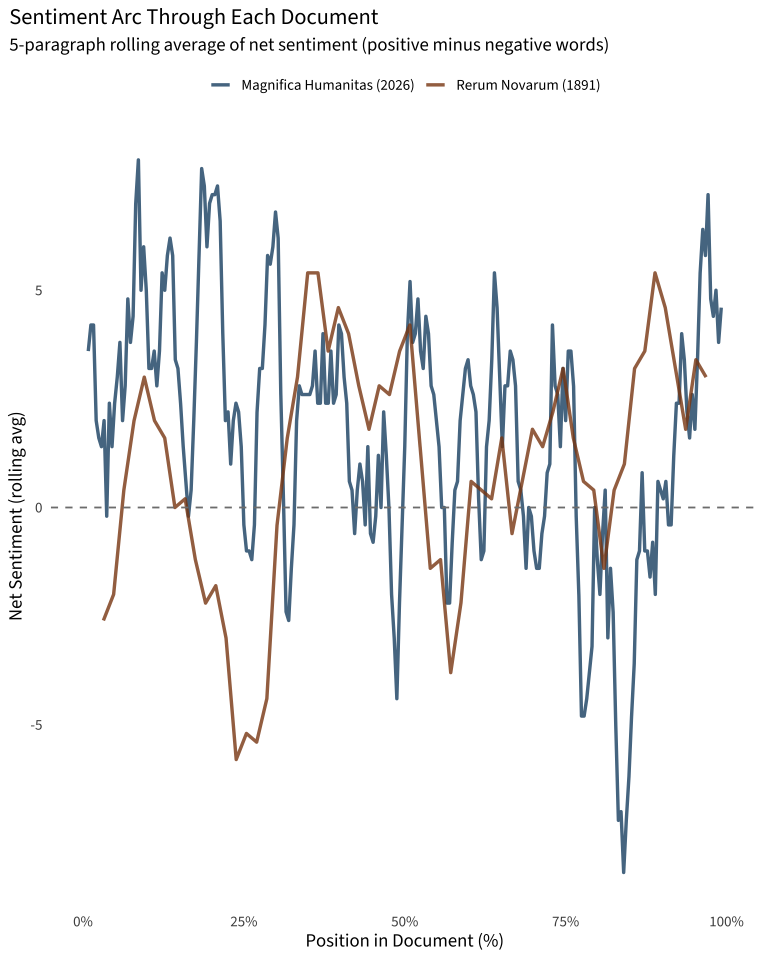<!-- -->

## Thematic Analysis: Shared Concerns Across 135 Years

Both encyclicals address the relationship between technological power,
labor, and human dignity. Let’s define thematic categories and track
their prevalence.

``` r
# Define thematic word lists
themes <- tribble(
  ~theme, ~words,
  "Labor & Work", "labor|work|worker|workers|workmen|employment|wages|wage|toil|industry|job|jobs|occupation",
  "Dignity & Rights", "dignity|rights|right|human|person|persons|freedom|liberty|justice",
  "Technology & Power", "technology|power|machine|machines|ai|artificial|intelligence|digital|algorithm|data|platform|robot",
  "Common Good", "common good|community|society|social|public|commonwealth|solidarity|fraternity",
  "Property & Wealth", "property|wealth|rich|poor|poverty|capital|money|profit|ownership|goods",
  "Church & Faith", "church|god|christ|faith|gospel|spirit|prayer|christian|religion|sacred"
)

# Count theme mentions per paragraph
theme_counts <- encyclicals |>
  crossing(themes) |>
  mutate(
    mentions = str_count(str_to_lower(text), words)
  ) |>
  group_by(document, theme) |>
  summarise(
    total_mentions = sum(mentions),
    paragraphs_with = sum(mentions > 0),
    .groups = "drop"
  ) |>
  group_by(document) |>
  mutate(pct_paragraphs = paragraphs_with / n_distinct(encyclicals$paragraph[encyclicals$document == document[1]])) |>
  ungroup()

ggplot(theme_counts, aes(x = reorder(theme, total_mentions),
                         y = total_mentions, fill = document)) +
  geom_col(position = "dodge", alpha = 0.85) +
  coord_flip() +
  scale_fill_manual(values = c("Rerum Novarum (1891)" = "#8B4513",
                               "Magnifica Humanitas (2026)" = "#1B4F72")) +
  labs(
    title = "Thematic Prevalence: Six Core Themes",
    subtitle = "Total keyword mentions across each encyclical",
    x = NULL,
    y = "Total Mentions",
    fill = NULL
  ) +
  theme(
    panel.grid = element_blank(),
    legend.position = "top"
  )
```

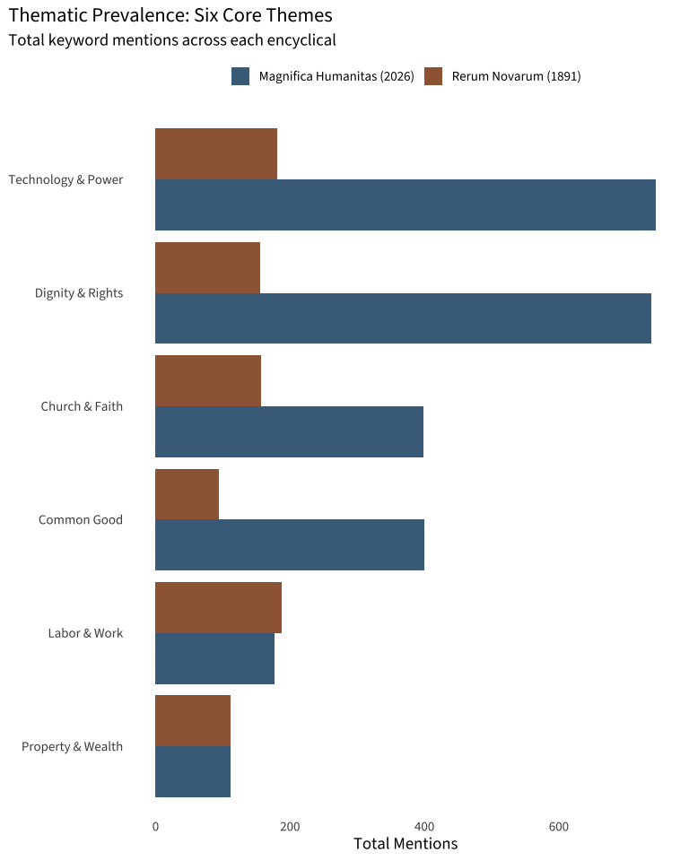<!-- -->

## Two Revolutions, One Argument: Industrial vs. AI

The deepest parallel between these encyclicals isn’t just thematic —
it’s structural. Both Popes confront a technological revolution that
concentrates power in new hands, displaces workers, and challenges the
Church to articulate why human dignity cannot be reduced to economic
utility. Let’s make this parallel explicit by mapping the analogous
concerns side by side.

``` r
# Define parallel concern pairs between the two revolutions
parallels <- tribble(
  ~concern, ~rn_keywords, ~mh_keywords,
  "Power Concentration", "few rich|small number|comparatively few|enormous fortunes", "concentrated|few hands|monopol|transnational|private actors",
  "Worker Displacement", "workmen|working class|laboring poor|hired labor", "unemployment|automation|precari|displaced|job|de-skill",
  "Dehumanization", "slavery|bondsmen|instruments|grind men down", "dehumaniz|reduced to|cog|commodity|discard|expendable",
  "Call for Regulation", "law|state|public authority|remedy|intervention", "regulat|governance|transparency|accountab|oversight|control",
  "Solidarity & Unions", "associations|unions|guilds|mutual help|combination", "solidar|cooperat|intermediate bodies|civil society|subsidiarity",
  "Moral Framework", "justice|charity|religion|church|gospel|god", "dignity|common good|integral|discernment|gospel|faith"
)

# Count matches for each concern in each document
parallel_counts <- encyclicals |>
  crossing(parallels) |>
  mutate(
    rn_match = if_else(document == "Rerum Novarum (1891)",
                       str_count(str_to_lower(text), rn_keywords), 0L),
    mh_match = if_else(document == "Magnifica Humanitas (2026)",
                       str_count(str_to_lower(text), mh_keywords), 0L)
  ) |>
  group_by(concern, document) |>
  summarise(
    mentions = sum(rn_match) + sum(mh_match),
    .groups = "drop"
  ) |>
  # Normalize per 1000 words
  left_join(summary_stats |> select(document, total_words), by = "document") |>
  mutate(per_1000 = mentions / total_words * 1000)

ggplot(parallel_counts, aes(x = reorder(concern, per_1000),
                            y = per_1000, fill = document)) +
  geom_col(position = "dodge", alpha = 0.85, width = 0.7) +
  coord_flip() +
  scale_fill_manual(values = c("Rerum Novarum (1891)" = "#8B4513",
                               "Magnifica Humanitas (2026)" = "#1B4F72")) +
  labs(
    title = "The Same Fight, Different Machines",
    subtitle = "Parallel concerns across the Industrial and AI Revolutions (per 1,000 words)",
    x = NULL,
    y = "Mentions per 1,000 Words",
    fill = NULL
  ) +
  theme(
    panel.grid = element_blank(),
    legend.position = "top"
  )
```

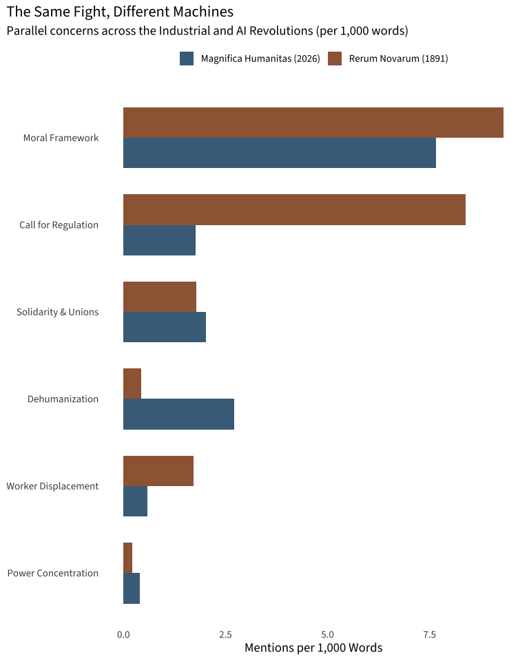<!-- -->

The structural argument is remarkably consistent: in 1891, Leo XIII saw
factory owners concentrating power over “teeming masses of the laboring
poor” and called for worker associations and state intervention. In
2026, Leo XIV sees tech companies concentrating power over data,
algorithms, and platforms — and calls for transparency, accountability,
and democratic governance of AI. The vocabulary changes, but the moral
architecture is the same:

| Industrial Revolution (1891) | AI Revolution (2026) |
|----|----|
| Factory owners & capitalists | Tech companies & platform owners |
| Physical labor exploitation | Data labor & algorithmic surveillance |
| “Yoke little better than slavery” | “New forms of slavery” in data labeling |
| Worker associations & guilds | Civil society, intermediate bodies |
| State intervention for just wages | Regulation, audits, algorithmic transparency |
| Private property with social function | Data as common good, not private asset |
| “Workmen surrendered, isolated, helpless” | Workers “de-skilled, subjected to automated surveillance” |

Both Popes reject the same two extremes: unchecked capitalism that
treats people as means, and state collectivism that absorbs individual
freedom. Both propose a middle path grounded in subsidiarity,
solidarity, and the primacy of human dignity over economic efficiency.

## Scripture References

A key dimension of any encyclical is its grounding in Sacred Scripture.
Let’s parse out the biblical references from each document and compare
which books of the Bible each Pope draws upon.

``` r
# Parse scripture references
# Rerum Novarum uses footnote numbers like (1), (2) with references at the end
# Magnifica Humanitas uses inline references like (cf. Gn 1:26-27)

# For Magnifica Humanitas - extract inline scripture references
mh_scripture_pattern <- "(?:cf\\.?\\s*)?(?:Gn|Ex|Lv|Nm|Dt|Jos|Jg|Rt|1\\s*S|2\\s*S|1\\s*K|2\\s*K|1\\s*Ch|2\\s*Ch|Ezr|Ne|Tb|Jdt|Est|1\\s*M|2\\s*M|Jb|Ps|Salt|Pr|Qo|Sg|Ws|Si|Is|Jr|Lm|Ba|Ez|Dn|Ho|Jl|Am|Ob|Jon|Mi|Na|Hab|Zp|Hg|Zc|Ml|Mt|Mc|Lc|Jn|Ac|Rm|1\\s*Co|2\\s*Co|Ga|Ef|Ph|Col|1\\s*Th|2\\s*Th|1\\s*Tm|2\\s*Tm|Tt|Phm|Hb|Jm|1\\s*P|2\\s*P|1\\s*Jn|2\\s*Jn|3\\s*Jn|Jd|Ap)\\s*[0-9]+"

mh_refs <- mh_df |>
  mutate(
    refs = str_extract_all(text, mh_scripture_pattern)
  ) |>
  unnest(refs, keep_empty = FALSE) |>
  mutate(
    book = str_extract(refs, "(?:1\\s*|2\\s*|3\\s*)?[A-Z][a-z]+"),
    book = str_trim(book)
  ) |>
  select(paragraph, document, refs, book)

# For Rerum Novarum - map footnote references to books
# Based on the references section of the text
rn_scripture_map <- tribble(
  ~footnote, ~book, ~refs,
  2, "Dt", "Deut. 5:21",
  3, "Gn", "Gen. 1:28",
  5, "Gn", "Gen. 3:17",
  6, "Jm", "James 5:4",
  7, "2 Tm", "2 Tim. 2:12",
  8, "2 Co", "2 Cor. 4:17",
  9, "Mt", "Matt. 19:23-24",
  10, "Lc", "Luke 6:24-25",
  14, "Lc", "Luke 11:41",
  15, "Ac", "Acts 20:35",
  16, "Mt", "Matt. 25:40",
  18, "2 Co", "2 Cor. 8:9",
  19, "Mc", "Mark 6:3",
  20, "Mt", "Matt. 5:3",
  21, "Mt", "Matt. 11:28",
  22, "Rm", "Rom. 8:17",
  23, "1 Tm", "1 Tim. 6:10",
  24, "Ac", "Acts 4:34",
  29, "Gn", "Gen. 1:28",
  30, "Rm", "Rom. 10:12",
  31, "Ex", "Exod. 20:8",
  32, "Gn", "Gen. 2:2",
  33, "Gn", "Gen. 3:19",
  34, "Qo", "Eccle. 4:9-10",
  35, "Pr", "Prov. 18:19",
  39, "Mt", "Matt. 16:26",
  40, "Mt", "Matt. 6:32-33",
  41, "1 Co", "1 Cor. 13:4-7"
)

rn_refs <- rn_scripture_map |>
  mutate(document = "Rerum Novarum (1891)")

# Combine all scripture references
all_refs <- bind_rows(
  mh_refs |> select(document, book, refs),
  rn_refs |> select(document, book, refs)
)

cat("Scripture references found:\n")
```

    ## Scripture references found:

``` r
all_refs |> count(document) |> print()
```

    ## # A tibble: 2 × 2
    ##   document                       n
    ##   <chr>                      <int>
    ## 1 Magnifica Humanitas (2026)     8
    ## 2 Rerum Novarum (1891)          28

``` r
# Categorize books into Old Testament vs New Testament
ot_books <- c("Gn", "Ex", "Lv", "Nm", "Dt", "Jos", "Jg", "Rt", "1 S", "2 S",
              "1 K", "2 K", "1 Ch", "2 Ch", "Ezr", "Ne", "Tb", "Jdt", "Est",
              "1 M", "2 M", "Jb", "Ps", "Salt", "Pr", "Qo", "Sg", "Ws", "Si",
              "Is", "Jr", "Lm", "Ba", "Ez", "Dn", "Ho", "Jl", "Am", "Ob",
              "Jon", "Mi", "Na", "Hab", "Zp", "Hg", "Zc", "Ml")

all_refs <- all_refs |>
  mutate(
    testament = if_else(book %in% ot_books, "Old Testament", "New Testament")
  )

# Count by book
book_counts <- all_refs |>
  count(document, book, testament, sort = TRUE)

# Top books per document
top_books <- book_counts |>
  group_by(document) |>
  slice_max(n, n = 10) |>
  ungroup() |>
  mutate(book = reorder_within(book, n, document))

ggplot(top_books, aes(x = n, y = book, fill = testament)) +
  geom_col(alpha = 0.85) +
  facet_wrap(~document, scales = "free_y") +
  scale_y_reordered() +
  scale_fill_manual(values = c("Old Testament" = "#DAA520",
                               "New Testament" = "#4169E1")) +
  labs(
    title = "Most Cited Books of Scripture",
    subtitle = "Top biblical books referenced in each encyclical",
    x = "Number of References",
    y = NULL,
    fill = NULL
  ) +
  theme(
    panel.grid = element_blank(),
    legend.position = "top",
    strip.text = element_text(face = "bold", size = 12)
  )
```

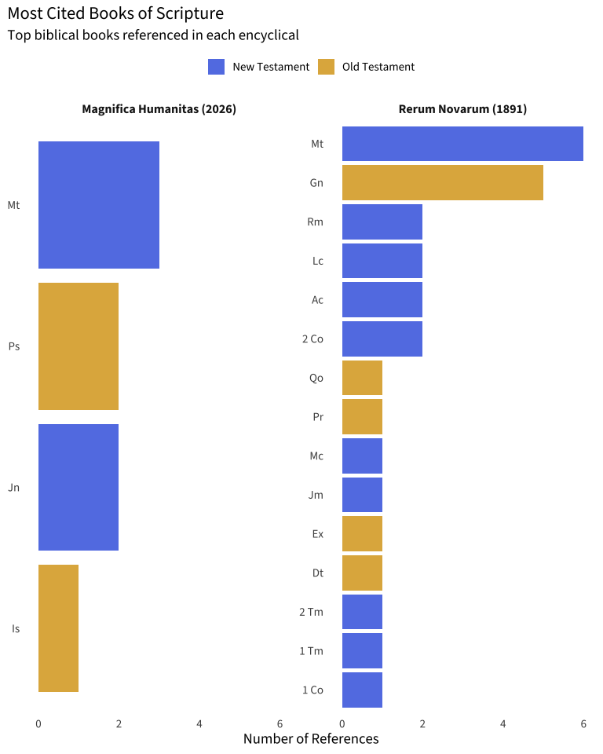<!-- -->

``` r
# OT vs NT ratio
testament_summary <- all_refs |>
  count(document, testament) |>
  group_by(document) |>
  mutate(pct = n / sum(n)) |>
  ungroup()

ggplot(testament_summary, aes(x = document, y = pct, fill = testament)) +
  geom_col(alpha = 0.85, width = 0.6) +
  scale_y_continuous(labels = percent_format()) +
  scale_fill_manual(values = c("Old Testament" = "#DAA520",
                               "New Testament" = "#4169E1")) +
  labs(
    title = "Old Testament vs. New Testament References",
    subtitle = "Proportion of scriptural citations from each testament",
    x = NULL,
    y = "Proportion of References",
    fill = NULL
  ) +
  theme(
    panel.grid = element_blank(),
    legend.position = "top"
  )
```

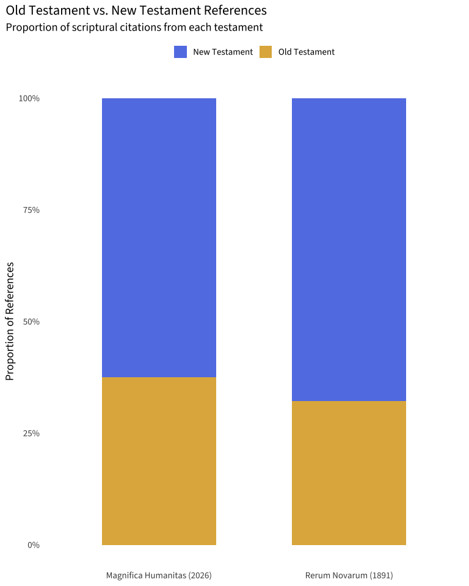<!-- -->

## Bigram Analysis: Phrases That Define Each Era

[Bigrams](https://en.wikipedia.org/wiki/Bigram) — pairs of consecutive
words — reveal the characteristic phrases of each document. They capture
concepts that single words miss, like “common good” or “artificial
intelligence.”

``` r
bigrams_df <- encyclicals |>
  unnest_tokens(bigram, text, token = "ngrams", n = 2) |>
  separate(bigram, c("word1", "word2"), sep = " ") |>
  filter(
    !word1 %in% stop_words$word,
    !word2 %in% stop_words$word,
    !str_detect(word1, "^[0-9]+$"),
    !str_detect(word2, "^[0-9]+$")
  ) |>
  mutate(
    word1 = case_when(word1 == "god" ~ "God", word1 == "christ" ~ "Christ",
                      word1 == "jesus" ~ "Jesus", .default = word1),
    word2 = case_when(word2 == "god" ~ "God", word2 == "christ" ~ "Christ",
                      word2 == "jesus" ~ "Jesus", .default = word2)
  ) |>
  unite(bigram, word1, word2, sep = " ")

bigram_counts <- bigrams_df |>
  count(document, bigram, sort = TRUE)

bigram_tfidf <- bigram_counts |>
  bind_tf_idf(bigram, document, n) |>
  group_by(document) |>
  slice_max(tf_idf, n = 12) |>
  ungroup() |>
  mutate(bigram = reorder_within(bigram, tf_idf, document))

ggplot(bigram_tfidf, aes(x = tf_idf, y = bigram, fill = document)) +
  geom_col(show.legend = FALSE, alpha = 0.85) +
  facet_wrap(~document, scales = "free_y") +
  scale_y_reordered() +
  scale_fill_manual(values = c("Rerum Novarum (1891)" = "#8B4513",
                               "Magnifica Humanitas (2026)" = "#1B4F72")) +
  labs(
    title = "Most Distinctive Bigrams (TF-IDF)",
    subtitle = "Two-word phrases that uniquely characterize each encyclical",
    x = "TF-IDF Score",
    y = NULL
  ) +
  theme(
    panel.grid = element_blank(),
    strip.text = element_text(face = "bold", size = 12)
  )
```

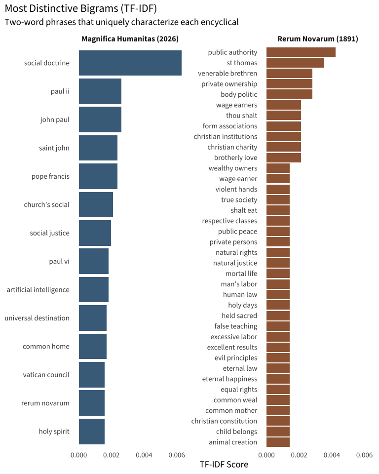<!-- -->

## Topic Modeling: Unsupervised Theme Discovery

[Latent Dirichlet Allocation
(LDA)](https://en.wikipedia.org/wiki/Latent_Dirichlet_allocation) is an
unsupervised machine learning technique that discovers hidden thematic
clusters in text without us pre-defining categories. Unlike our manual
keyword approach above, LDA lets the algorithm find topics organically —
revealing structure we might not have anticipated.

``` r
library(topicmodels)
library(tm)

# Create a document-term matrix where each "document" is a paragraph
dtm_data <- words_df |>
  count(document, paragraph, word) |>
  unite(doc_id, document, paragraph, sep = "_para_") |>
  cast_dtm(doc_id, word, n)

# Remove sparse terms to focus on meaningful patterns
dtm_data <- removeSparseTerms(dtm_data, 0.99)
# Remove empty rows
row_totals <- apply(dtm_data, 1, sum)
dtm_data <- dtm_data[row_totals > 0, ]
```

``` r
# Fit LDA with 6 topics
set.seed(42)
lda_model <- LDA(dtm_data, k = 6, control = list(seed = 42))

# Extract top terms per topic
lda_topics <- tidy(lda_model, matrix = "beta") |>
  group_by(topic) |>
  slice_max(beta, n = 8) |>
  ungroup() |>
  mutate(term = reorder_within(term, beta, topic))

ggplot(lda_topics, aes(x = beta, y = term, fill = factor(topic))) +
  geom_col(show.legend = FALSE, alpha = 0.85) +
  facet_wrap(~topic, scales = "free_y", ncol = 2,
             labeller = labeller(topic = function(x) paste("Topic", x))) +
  scale_y_reordered() +
  scale_fill_viridis_d(option = "D") +
  labs(
    title = "LDA Topic Model: 6 Discovered Themes",
    subtitle = "Top 8 words per topic (unsupervised clustering)",
    x = "Word Probability (Beta)",
    y = NULL
  ) +
  theme(
    panel.grid = element_blank(),
    strip.text = element_text(face = "bold", size = 11)
  )
```

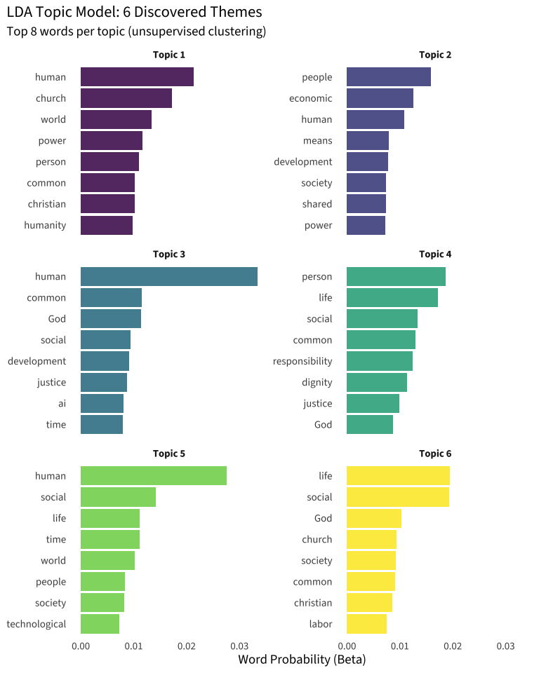<!-- -->

``` r
# Which topics dominate each encyclical?
lda_gamma <- tidy(lda_model, matrix = "gamma") |>
  separate(document, into = c("source_doc", "paragraph"), sep = "_para_") |>
  mutate(paragraph = as.integer(paragraph))

topic_by_doc <- lda_gamma |>
  group_by(source_doc, topic) |>
  summarise(avg_gamma = mean(gamma), .groups = "drop")

# Show the DIFFERENCE in topic prevalence — which topics skew toward which document
topic_diff <- topic_by_doc |>
  pivot_wider(names_from = source_doc, values_from = avg_gamma) |>
  mutate(
    diff = `Magnifica Humanitas (2026)` - `Rerum Novarum (1891)`,
    direction = if_else(diff > 0, "More in Magnifica Humanitas", "More in Rerum Novarum")
  )

# Get top 3 words per topic for labeling
topic_labels <- tidy(lda_model, matrix = "beta") |>
  group_by(topic) |>
  slice_max(beta, n = 3) |>
  summarise(label = paste(term, collapse = ", "), .groups = "drop")

topic_diff <- topic_diff |>
  left_join(topic_labels, by = "topic") |>
  mutate(topic_label = paste0("Topic ", topic, ": ", label))

ggplot(topic_diff, aes(x = reorder(topic_label, diff), y = diff, fill = direction)) +
  geom_col(alpha = 0.85, width = 0.7) +
  geom_hline(yintercept = 0, linewidth = 0.5) +
  coord_flip() +
  scale_fill_manual(values = c("More in Magnifica Humanitas" = "#1B4F72",
                               "More in Rerum Novarum" = "#8B4513")) +
  labs(
    title = "Topic Skew: Which Encyclical Owns Each Theme?",
    subtitle = "Difference in average topic probability (positive = more in Magnifica Humanitas)",
    x = NULL,
    y = "Difference in Topic Probability",
    fill = NULL
  ) +
  theme(
    panel.grid = element_blank(),
    legend.position = "top"
  )
```

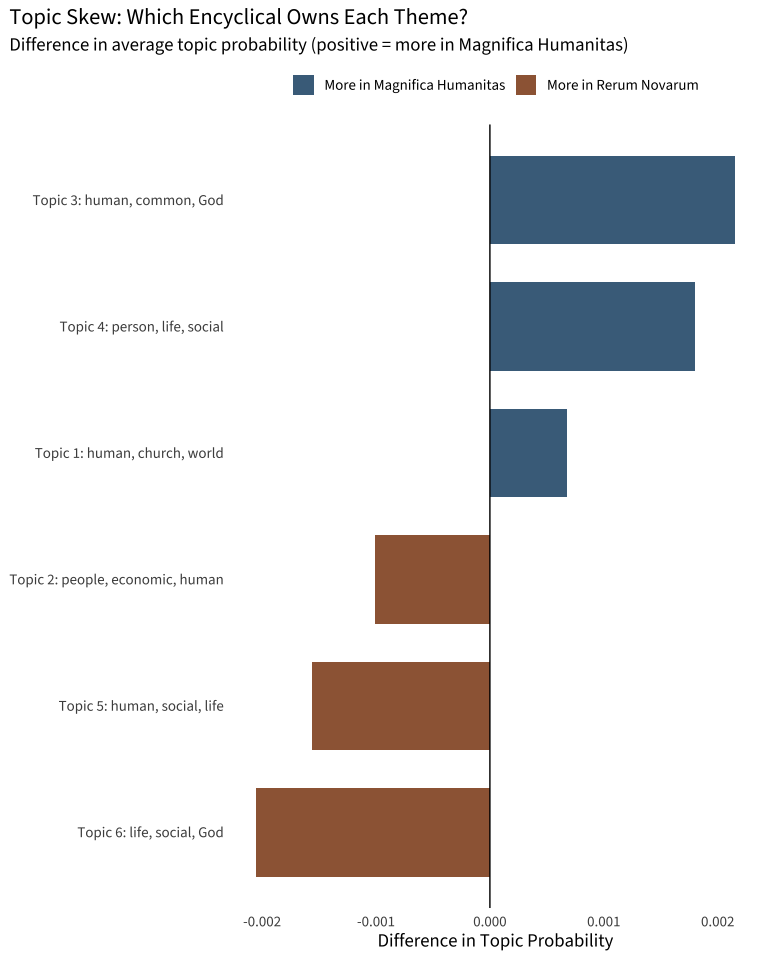<!-- -->

The diverging bar chart reveals which discovered topics are distinctive
to each era. Topics that skew toward *Rerum Novarum* reflect
19th-century concerns (property, labor conditions, class relations),
while those skewing toward *Magnifica Humanitas* capture the digital-age
vocabulary (technology, data, platforms, governance).

## Cosine Similarity: Textual Kinship Across 135 Years

[Cosine similarity](https://en.wikipedia.org/wiki/Cosine_similarity)
measures how similar two text segments are based on their word usage
patterns. A score of 1.0 means identical vocabulary; 0.0 means
completely different. By computing similarity between sections of each
encyclical, we can identify where Leo XIV is most directly building on
Leo XIII’s arguments.

``` r
library(lsa)

# Group paragraphs into sections of ~5 paragraphs for smoother comparison
rn_sections <- rn_df |>
  mutate(section = (paragraph - 1) %/% 5 + 1) |>
  group_by(section) |>
  summarise(
    text = paste(text, collapse = " "),
    doc = "Rerum Novarum",
    .groups = "drop"
  ) |>
  mutate(section_label = paste0("RN §", (section - 1) * 5 + 1, "-", section * 5))

mh_sections <- mh_df |>
  mutate(section = (paragraph - 1) %/% 10 + 1) |>
  group_by(section) |>
  summarise(
    text = paste(text, collapse = " "),
    doc = "Magnifica Humanitas",
    .groups = "drop"
  ) |>
  mutate(section_label = paste0("MH §", (section - 1) * 10 + 1, "-", section * 10))

# Combine and create TF-IDF matrix
all_sections <- bind_rows(
  rn_sections |> select(section_label, text, doc),
  mh_sections |> select(section_label, text, doc)
)

# Tokenize and create TF-IDF document-term matrix
section_tfidf <- all_sections |>
  mutate(id = row_number()) |>
  unnest_tokens(word, text) |>
  anti_join(stop_words, by = "word") |>
  filter(!str_detect(word, "^[0-9]+$")) |>
  mutate(word = case_when(
    word == "god" ~ "God",
    word == "christ" ~ "Christ",
    word == "jesus" ~ "Jesus",
    .default = word
  )) |>
  count(id, word) |>
  bind_tf_idf(word, id, n) |>
  cast_dtm(id, word, tf_idf)

# Convert to matrix and compute cosine similarity
tfidf_matrix <- as.matrix(section_tfidf)
cos_sim <- cosine(t(tfidf_matrix))
```

``` r
# Extract cross-document similarities (RN sections vs MH sections)
n_rn <- nrow(rn_sections)
n_mh <- nrow(mh_sections)

cross_sim <- cos_sim[1:n_rn, (n_rn + 1):(n_rn + n_mh)]
rownames(cross_sim) <- rn_sections$section_label
colnames(cross_sim) <- mh_sections$section_label

# Convert to long format for ggplot
sim_long <- as.data.frame(as.table(cross_sim)) |>
  as_tibble() |>
  rename(rn_section = Var1, mh_section = Var2, similarity = Freq) |>
  mutate(
    rn_section = factor(rn_section, levels = rn_sections$section_label),
    mh_section = factor(mh_section, levels = rev(mh_sections$section_label))
  )

ggplot(sim_long, aes(x = rn_section, y = mh_section, fill = similarity)) +
  geom_tile() +
  scale_fill_viridis_c(option = "inferno", labels = scales::number_format(accuracy = 0.01)) +
  labs(
    title = "Cosine Similarity: Where Do the Two Encyclicals Converge?",
    subtitle = "Brighter cells = higher textual similarity between sections",
    x = "Rerum Novarum Sections",
    y = "Magnifica Humanitas Sections",
    fill = "Similarity"
  ) +
  theme(
    panel.grid = element_blank(),
    axis.text.x = element_text(angle = 45, hjust = 1, size = 8),
    axis.text.y = element_text(size = 7)
  )
```

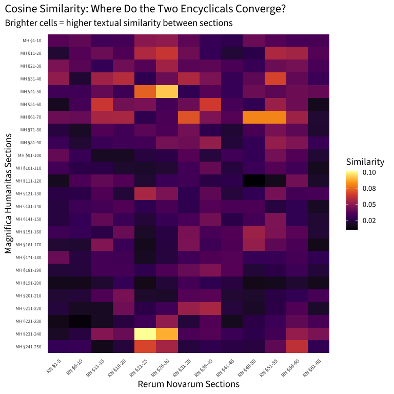<!-- -->

``` r
# Find the most similar section pairs
top_pairs <- sim_long |>
  arrange(desc(similarity)) |>
  slice_head(n = 10)

top_pairs |>
  knitr::kable(digits = 3, caption = "Top 10 Most Similar Section Pairs")
```

| rn_section | mh_section  | similarity |
|:-----------|:------------|-----------:|
| RN §21-25  | MH §231-240 |      0.102 |
| RN §26-30  | MH §41-50   |      0.093 |
| RN §26-30  | MH §231-240 |      0.088 |
| RN §51-55  | MH §61-70   |      0.081 |
| RN §46-50  | MH §61-70   |      0.081 |
| RN §21-25  | MH §41-50   |      0.073 |
| RN §31-35  | MH §61-70   |      0.071 |
| RN §21-25  | MH §241-250 |      0.067 |
| RN §51-55  | MH §31-40   |      0.067 |
| RN §36-40  | MH §51-60   |      0.064 |

Top 10 Most Similar Section Pairs

The heatmap reveals which passages of *Magnifica Humanitas* are most
textually aligned with *Rerum Novarum*. Bright spots indicate where Leo
XIV is drawing most directly on Leo XIII’s language and arguments — the
intellectual DNA connecting these two documents across 135 years.

## Lexical Diversity and Readability

[Lexical diversity](https://en.wikipedia.org/wiki/Lexical_diversity)
measures how varied a text’s vocabulary is — a higher ratio of unique
words to total words suggests richer, more varied language. We’ll also
look at average word length as a proxy for complexity.

``` r
lexical_stats <- words_df |>
  group_by(document) |>
  summarise(
    total_tokens = n(),
    unique_types = n_distinct(word),
    type_token_ratio = unique_types / total_tokens,
    avg_word_length = mean(nchar(word)),
    .groups = "drop"
  )

lexical_stats |>
  knitr::kable(digits = 3, caption = "Lexical Diversity Metrics")
```

| document | total_tokens | unique_types | type_token_ratio | avg_word_length |
|:---|---:|---:|---:|---:|
| Magnifica Humanitas (2026) | 16145 | 4257 | 0.264 | 7.530 |
| Rerum Novarum (1891) | 4728 | 2065 | 0.437 | 6.908 |

Lexical Diversity Metrics

``` r
# Vocabulary growth curve (Heaps' law)
vocab_growth <- words_df |>
  group_by(document) |>
  mutate(token_position = row_number()) |>
  ungroup() |>
  group_by(document) |>
  mutate(
    cumulative_types = cummax(match(word, unique(word)))
  ) |>
  ungroup()

# Sample at intervals for plotting
sample_points <- vocab_growth |>
  group_by(document) |>
  filter(token_position %% 50 == 0 | token_position == max(token_position)) |>
  ungroup()

ggplot(sample_points, aes(x = token_position, y = cumulative_types, color = document)) +
  geom_line(linewidth = 1.2) +
  scale_color_manual(values = c("Rerum Novarum (1891)" = "#8B4513",
                                "Magnifica Humanitas (2026)" = "#1B4F72")) +
  labs(
    title = "Vocabulary Growth (Heaps' Law)",
    subtitle = "How quickly new unique words appear as the text progresses",
    x = "Token Position",
    y = "Cumulative Unique Words",
    color = NULL
  ) +
  theme(
    panel.grid = element_blank(),
    legend.position = "top"
  )
```

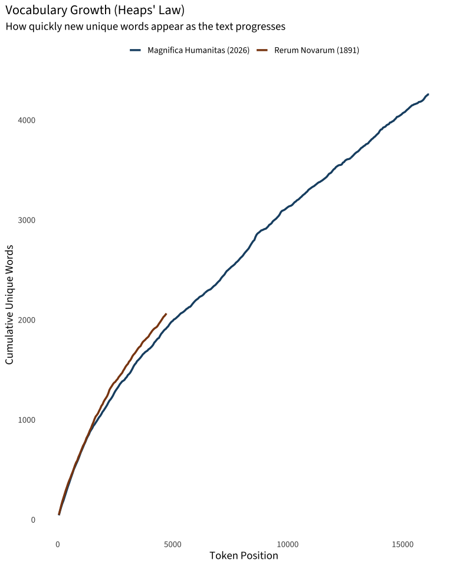<!-- -->

## Shared Vocabulary: The Common Language of Catholic Social Teaching

Despite 135 years of separation, both encyclicals share a core
vocabulary rooted in Catholic Social Teaching. Let’s identify the words
that appear prominently in both documents.

We rank shared words by their [geometric
mean](https://en.wikipedia.org/wiki/Geometric_mean) frequency — the
square root of (frequency in RN × frequency in MH). Why geometric mean
instead of a simple average? Because it rewards words that are
*balanced* across both documents. A word that appears 5 times per 1,000
in both encyclicals scores higher than one that appears 10 times in one
but only 1 time in the other. This surfaces the true “shared language” —
words that are genuinely central to *both* documents, not just common in
one.

``` r
# Words appearing in both documents — use relative frequency (per 1,000 words)
# so we're comparing proportional usage, not raw counts biased by document length
doc_totals <- words_df |> count(document, name = "doc_total")

shared_words <- words_df |>
  count(document, word) |>
  left_join(doc_totals, by = "document") |>
  mutate(freq_per_1k = n / doc_total * 1000) |>
  select(document, word, freq_per_1k) |>
  pivot_wider(names_from = document, values_from = freq_per_1k, values_fill = 0) |>
  rename(rn = `Rerum Novarum (1891)`, mh = `Magnifica Humanitas (2026)`) |>
  filter(rn >= 0.3, mh >= 0.3) |>
  mutate(geometric_mean = sqrt(rn * mh)) |>
  arrange(desc(geometric_mean))

# Plot shared vocabulary
top_shared <- shared_words |>
  slice_max(geometric_mean, n = 20)

ggplot(top_shared, aes(x = rn, y = mh)) +
  geom_abline(slope = 1, intercept = 0, linetype = "dashed", color = "gray60") +
  geom_point(aes(size = geometric_mean), alpha = 0.7, color = "#2E4057") +
  geom_text(aes(label = word), vjust = -0.8, size = 3.5, family = "source_sans") +
  geom_label(
    data = tibble(rn = max(top_shared$rn) * 0.9, mh = max(top_shared$rn) * 0.75,
                  label = "Equal usage\nin both"),
    aes(x = rn, y = mh, label = label),
    size = 3, color = "gray50", fontface = "italic", family = "source_sans",
    fill = "white", label.size = 0, hjust = 0.5
  ) +
  labs(
    title = "Shared Vocabulary Between the Two Encyclicals",
    subtitle = "Relative frequency (per 1,000 words) — words prominent in both documents",
    x = "Frequency per 1,000 words (Rerum Novarum)",
    y = "Frequency per 1,000 words (Magnifica Humanitas)",
    size = "Shared\nImportance"
  ) +
  theme(
    panel.grid = element_blank(),
    legend.position = "right"
  )
```

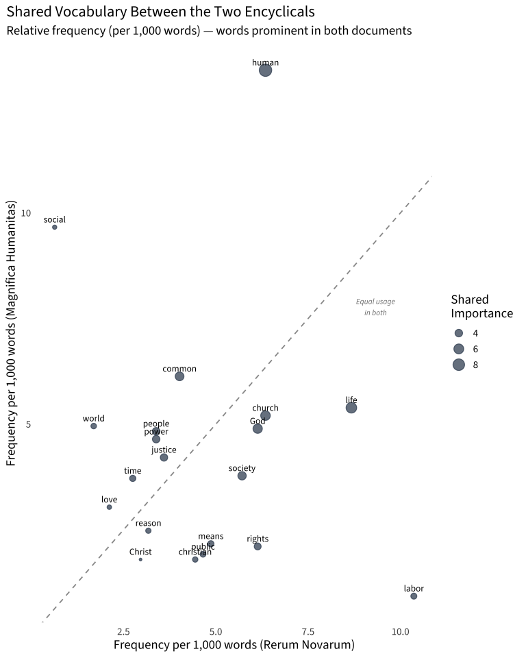<!-- -->

## Final Visualization: The Two Leos Compared

``` r
# Register Font Awesome
font_add(family = "fa-brands",
         regular = "~/Library/Fonts/Font Awesome 6 Brands-Regular-400.otf")
font_add(family = "fa-solid",
         regular = "~/Library/Fonts/Font Awesome 6 Free-Solid-900.otf")

# Build caption
bg_color <- "white"
tt_source <- "Vatican.va"
tt_caption <- paste0(
 "DataViz: Tony Galvan",
 "<span style='color:", bg_color, ";'>..</span>",
 "<span style='font-family:fa-solid;'>&#xf0ce;</span>",
 "<span style='color:", bg_color, ";'>.</span>",
 tt_source,
 "<span style='color:", bg_color, ";'>..</span>",
 "<span style='font-family:fa-brands;'>&#xf08c;</span>",
 "<span style='color:", bg_color, ";'>.</span>",
 "anthony-raul-galvan",
 "<span style='color:", bg_color, ";'>..</span>",
 "<span style='font-family:fa-brands;'>&#xf09b;</span>",
 "<span style='color:", bg_color, ";'>.</span>",
 "gdatascience"
)

# Create a combined thematic comparison plot
# Normalize theme counts per 1000 words for fair comparison
theme_normalized <- encyclicals |>
  crossing(themes) |>
  mutate(mentions = str_count(str_to_lower(text), words)) |>
  group_by(document, theme) |>
  summarise(total_mentions = sum(mentions), .groups = "drop") |>
  left_join(summary_stats |> select(document, total_words), by = "document") |>
  mutate(per_1000 = total_mentions / total_words * 1000)

p1 <- ggplot(theme_normalized, aes(x = reorder(theme, per_1000),
                                    y = per_1000, fill = document)) +
  geom_col(position = "dodge", alpha = 0.85, width = 0.7) +
  coord_flip() +
  scale_fill_manual(values = c("Rerum Novarum (1891)" = "#8B4513",
                               "Magnifica Humanitas (2026)" = "#1B4F72")) +
  labs(
    subtitle = "Theme density (mentions per 1,000 words)",
    x = NULL, y = NULL, fill = NULL
  ) +
  theme(
    text = element_text(family = "source_sans"),
    panel.grid = element_blank(),
    legend.position = "none",
    plot.subtitle = element_text(size = 14, face = "bold"),
    axis.text = element_text(size = 11)
  )

# Sentiment arc comparison
p2 <- ggplot(sentiment_arc |> filter(!is.na(rolling_sentiment)),
             aes(x = para_pct, y = rolling_sentiment, color = document)) +
  geom_line(linewidth = 1.2, alpha = 0.8) +
  geom_hline(yintercept = 0, linetype = "dashed", color = "gray50") +
  scale_color_manual(values = c("Rerum Novarum (1891)" = "#8B4513",
                                "Magnifica Humanitas (2026)" = "#1B4F72")) +
  scale_x_continuous(labels = percent_format(), expand = expansion(mult = c(0.02, 0.02))) +
  scale_y_continuous(expand = expansion(mult = c(0.05, 0.05))) +
  labs(
    subtitle = "Sentiment arc (5-paragraph rolling average, Bing lexicon)",
    x = "Position in Document", y = "Net Sentiment", color = NULL
  ) +
  theme(
    text = element_text(family = "source_sans"),
    panel.grid = element_blank(),
    legend.position = "none",
    plot.subtitle = element_text(size = 14, face = "bold"),
    axis.title = element_text(size = 11),
    axis.text = element_text(size = 11)
  )

# Colored subtitle as legend using ggtext
plot_subtitle <- paste0(
  "Comparing <b style='color:#8B4513;'>Rerum Novarum (1891)</b> on the Industrial Revolution<br>",
  "with <b style='color:#1B4F72;'>Magnifica Humanitas (2026)</b> on Artificial Intelligence"
)

# Combine: p1 on top, p2 below
# Use free() on p2 so its y-axis isn't forced to align with p1's wide labels
final_plot <- (p1 / free(p2)) +
  plot_layout(heights = c(1, 0.8)) +
  plot_annotation(
    title = "Two Leos, 135 Years Apart",
    subtitle = plot_subtitle,
    caption = tt_caption,
    theme = theme(
      plot.title = element_text(family = "playfair", size = 35, face = "bold",
                                hjust = 0.5),
      plot.subtitle = element_markdown(family = "source_sans", size = 19,
                                       hjust = 0.5, color = "gray30",
                                       lineheight = 1.3),
      plot.caption = element_markdown(family = "source_sans", size = 9,
                                      color = "gray50", hjust = 0.5),
      plot.caption.position = "plot"
    )
  )

final_plot
```

<!-- -->

``` r
ggsave(
  filename = "outputs/2026_06_01_encyclical_comparison.png",
  plot = final_plot,
  device = "png",
  width = 8,
  height = 10,
  dpi = 300,
  bg = "white"
)
```

## Key Findings

**Structure:** *Magnifica Humanitas* is roughly 2.7x longer than *Rerum
Novarum* (245 vs. 64 paragraphs, ~37,500 vs. ~13,900 words), reflecting
the modern encyclical tradition of more comprehensive treatment.
However, Leo XIII’s paragraphs tend to be longer and more complex, with
notably longer sentences characteristic of 19th-century academic prose.

**Vocabulary:** The TF-IDF analysis reveals each document’s era clearly.
*Rerum Novarum* is defined by words like “workmen,” “masters,”
“socialists,” and “property” — the vocabulary of industrial-era class
conflict. *Magnifica Humanitas* introduces “AI,” “digital,”
“algorithms,” “platforms,” and “data” — the language of the information
age.

**Shared Language:** Despite the temporal gap, both documents share a
robust core vocabulary centered on “dignity,” “justice,” “common good,”
“rights,” “person,” and “freedom” — the enduring lexicon of Catholic
Social Teaching.

**Sentiment:** Both encyclicals maintain a predominantly positive
emotional tone, with “trust” as the dominant sentiment. *Rerum Novarum*
shows slightly more “anger” and “fear” (reflecting its denunciation of
exploitation), while *Magnifica Humanitas* leans more toward
“anticipation” (reflecting its forward-looking orientation toward
technology).

**Scripture:** *Magnifica Humanitas* draws more heavily on New Testament
sources (particularly the Gospels and Pauline epistles), while *Rerum
Novarum* balances Old and New Testament citations more evenly, with
Genesis and the Psalms featuring prominently alongside Matthew.

**Thematic Continuity:** The “Dignity & Rights” and “Common Good” themes
dominate both documents, confirming that the core concerns of Catholic
Social Teaching have remained remarkably stable across 135 years of
technological upheaval.

## Discussion Questions for Golden Dome Data Tuesdays

This encyclical speaks directly to our work as data scientists and AI
practitioners. Here are questions to guide our June 3 conversation:

### Ethics & Accountability in AI

1.  **Leo XIV writes that AI is “never morally neutral” because it
    carries the decisions and priorities of its designers (§104).** As
    people who build models and pipelines — do you agree? Can you think
    of a time when a “neutral” technical choice you made actually
    embedded a value judgment?

2.  **The encyclical calls for “accountability” at every stage — design,
    deployment, and use (§105).** In practice, who is accountable when
    an algorithm denies someone credit or a job? Is the current state of
    ML explainability sufficient, or are we building systems whose
    decisions we genuinely cannot explain?

3.  **“A more moral AI would be useless if this morality is decided by a
    few” (§107).** Who gets to define the ethical guardrails for AI
    systems? Should it be governments, companies, open-source
    communities, religious institutions, or some combination?

### AI & Our Careers

4.  **Leo XIV warns that AI can “de-skill workers, subject them to
    automated surveillance, and relegate them to rigid, repetitive
    tasks” (§150).** Have you experienced this in your own work? Has AI
    made your job more creative or more constrained?

5.  **The encyclical insists that “access to work for all must continue
    to be a priority objective” (§154).** As data scientists who
    automate processes — how do we reconcile our professional work with
    the potential displacement it causes? Is there a moral obligation to
    consider employment impact when building automation?

6.  **“A society that guaranteed work to only a small part of the
    population would expose many to forced inactivity” (§154).** If AI
    dramatically reduces the need for human labor, what does a just
    transition look like? Is universal basic income sufficient, or does
    human dignity require something more than income?

### Environmental Impact

7.  **Leo XIV explicitly names the environmental cost: “Current AI
    systems require large amounts of energy and water, have a
    significant impact on carbon dioxide emissions” (§101).** Do we as
    practitioners have a responsibility to consider the carbon footprint
    of our models? Should there be a “sustainability budget” for
    training runs?

8.  **The encyclical calls for “more sustainable technological
    solutions” (§101).** What does that look like in practice — smaller
    models, more efficient architectures, renewable-powered data
    centers? Or is the environmental cost acceptable given the benefits?

### Faith & Technology

9.  **The central metaphor is Babel vs. Jerusalem — building for
    domination vs. building for communion (§7-9).** Which are we
    building in our daily work? Can a for-profit AI company genuinely
    build “Jerusalem,” or is the profit motive inherently Babel-like?

10. **“Even when such instruments present themselves as capable of
    ‘learning,’ they do so differently from the human person. It is not
    the experience of one who allows himself to be shaped by life”
    (§99).** Does this distinction matter practically? When an AI system
    produces output indistinguishable from human work, does the absence
    of “inner growth” make a moral difference?

11. **Leo XIV says the true “more-than-human” comes not from technology
    but from grace — “We become fully human when we are more than human,
    when we allow God to take us beyond ourselves” (§128).** How does
    this challenge the transhumanist narrative that many in Silicon
    Valley embrace? Is there a way to hold both technological optimism
    and this theological vision?

12. **The encyclical asks us to “disarm AI” — removing it from the logic
    of arms competition (§110).** Is this realistic given the
    geopolitical AI race between the US, China, and others? What would
    “disarming” look like for a data scientist working at a tech
    company?

### Data, Power & the Common Good

13. **“Data ownership cannot be entrusted to the private sector alone…
    They are the fruit of the contribution of many and cannot be sold or
    entrusted to a few” (§108).** Is personal data a common good? What
    would it mean to treat it that way — data cooperatives, public data
    trusts, something else?

14. **Leo XIV identifies a “new colonialism” that “dominates not only
    bodies but also appropriates data, transforming personal lives into
    exploitable information” (§178).** Do you see this in the AI
    industry today? Who benefits from the data labeling work done in the
    Global South?

15. **The cosine similarity analysis shows that the sections of
    *Magnifica Humanitas* on labor and dignity are most textually
    aligned with *Rerum Novarum*.** After 135 years, the Church is still
    making the same argument — that workers are not means to an end. Has
    anything actually changed, or are we just repeating the same fight
    with new technology?

### The Meta-Question

16. **This entire blog post was built using Kiro, an AI coding
    assistant.** The encyclical warns about delegating too much to AI
    and “weakening personal judgment and creativity” (§100). Did using
    AI to analyze an encyclical *about* AI prove the Pope’s point — or
    demonstrate that AI can be a tool for deeper human understanding?

## What’s Next?

Further avenues for exploration:

- **Comparing with intermediate encyclicals** (Centesimus Annus, Laudato
  Si’) would show the evolution of social teaching vocabulary over time
- **Network analysis** of cross-references between encyclicals could map
  the intellectual genealogy of Catholic Social Teaching
- **Readability scoring** (Flesch-Kincaid, etc.) could quantify how
  papal communication style has evolved for modern audiences
- **Structural break detection** on the sentiment arc could identify the
  precise turning points in each encyclical’s argument
