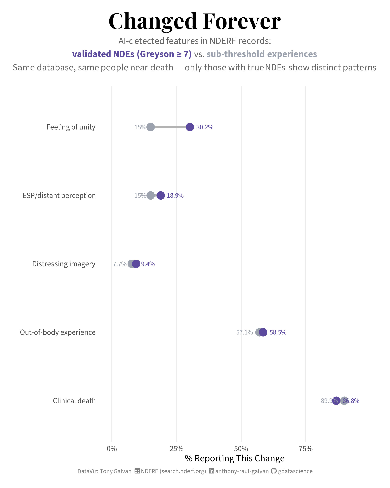
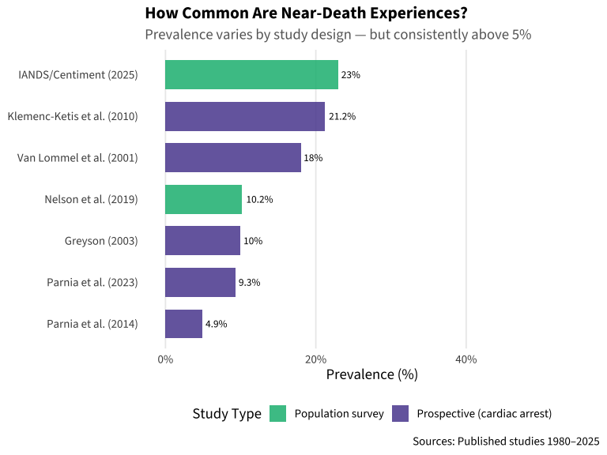
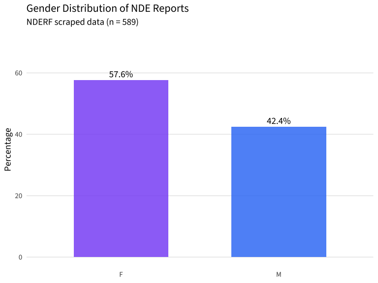
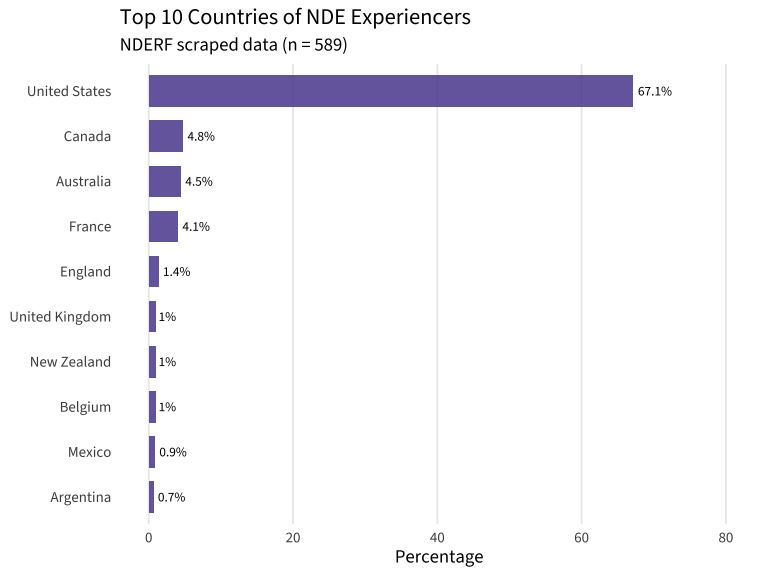
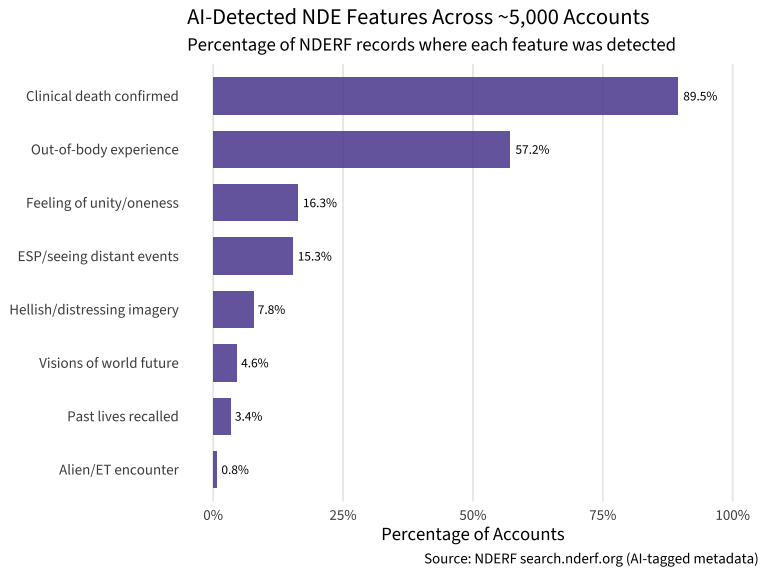
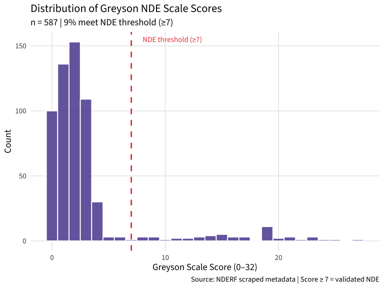
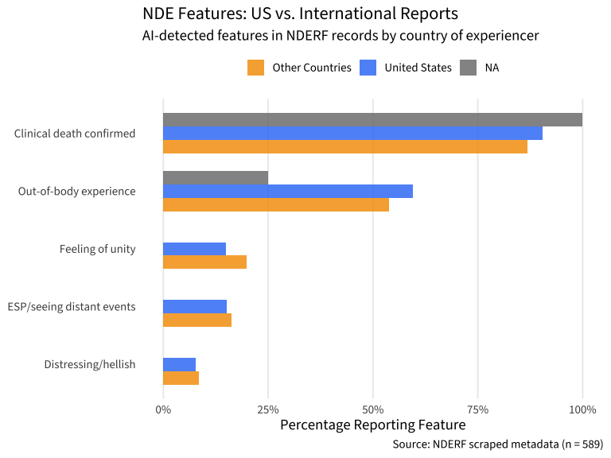
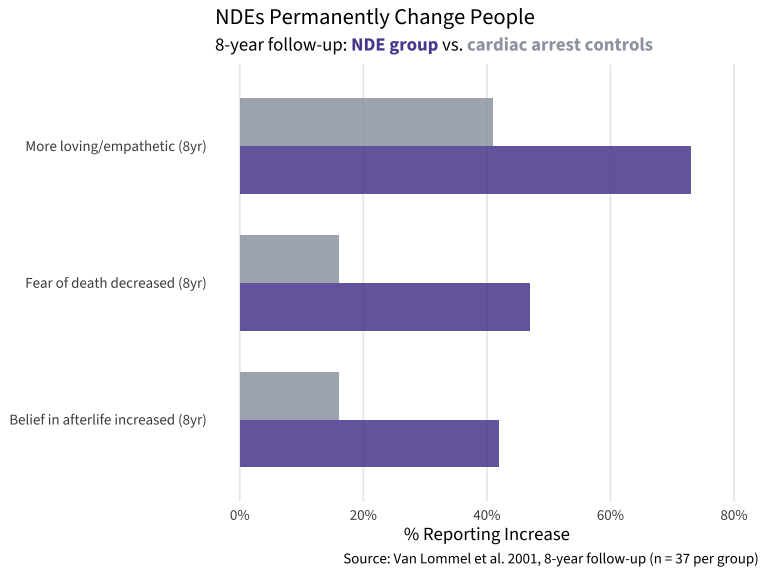
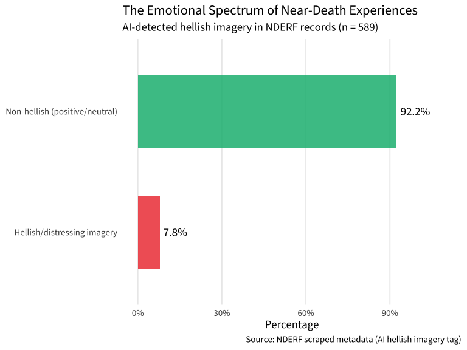

# Beyond the Flatline: What 50 Years of Near-Death Experience Research Reveals

**[Source Code](near_death_experiences.Rmd)** | Data scraped from [NDERF Search](https://search.nderf.org/)



589 individual NDE records scraped from NDERF reveal that 57% involve out-of-body experiences, 89% occur during confirmed clinical death, and only 8% are distressing. The dataset spans 20+ countries and 25 years of submissions — a unique window into thousands of people's encounters with death.

---

## The Question That Won’t Go Away

<figure>

<figcaption aria-hidden="true">Maria’s spirit hovering outside
Harborview Medical Center, seeing a shoe on the third-floor ledge while
doctors work to revive her body inside</figcaption>
</figure>

In 1977 at Harborview Medical Center in Seattle, a migrant worker named
Maria suffered a cardiac arrest. After resuscitation she told her social
worker, Kimberly Clark Sharp, that she had floated outside the hospital
and seen a dark blue tennis shoe on a third-floor window ledge. She
described the shoe in detail: worn over the little toe, with a shoelace
tucked under the heel.

Sharp went to look. The shoe was there — exactly as described — on a
ledge not visible from any window inside the hospital or from the
ground.

Maria is not alone. Over the past 50 years, researchers at institutions
like NYU, the University of Virginia, the University of Connecticut, and
the University of Liège have accumulated thousands of cases that
challenge our understanding of consciousness. The [Near Death Experience
Research Foundation](https://nderf.org) (NDERF) has collected over 6,000
firsthand accounts. The [AWARE II
study](https://www.resuscitationjournal.com/article/S0300-9572(23)00216-2/fulltext)
at NYU monitored 567 cardiac arrest patients across 25 hospitals. And in
2025, a [national poll by
IANDS](https://iands.org/media-center/iands-press-releases/twenty-three-percent-of-americans-say-theyve-had-near-death-experiences-according-to-major-survey/)
found that **23% of American adults** report having had a near-death
experience.

The [Magis Center](https://magiscenter.com/nde/), founded by Fr. Robert
Spitzer, S.J., argues that the cumulative evidence — veridical
perceptions during clinical death, blind people seeing for the first
time, children meeting deceased relatives they never knew existed —
points toward the reality of a supernatural realm beyond the physical
brain. In this analysis, we explore the data behind that argument.

``` r
library(tidyverse)
library(scales)
library(ggtext)
library(showtext)
library(sysfonts)

# Load fonts
font_add_google("Source Sans 3", "source_sans")
font_add_google("Playfair Display", "playfair")
font_add(family = "fa-brands",
         regular = "~/Library/Fonts/Font Awesome 7 Brands-Regular-400.otf")
font_add(family = "fa-solid",
         regular = "~/Library/Fonts/Font Awesome 7 Free-Solid-900.otf")
showtext_auto()
showtext_opts(dpi = 300)

theme_set(theme_minimal(base_family = "source_sans", base_size = 14))
```

## Building the Dataset

Our primary dataset is scraped programmatically from the [NDERF
Search](https://search.nderf.org/) website, which embeds structured JSON
metadata for each of its ~5,000+ experience records. We extract only the
structured fields (gender, country, classification, Greyson score,
AI-tagged features) — **no narrative text is reproduced**, respecting
NDERF’s copyright.

The code below is the actual data acquisition pipeline used to build the
dataset. On first run it scrapes NDERF and caches the result; subsequent
runs load from cache.

### Scraping NDERF: ~600 Individual NDE Records

Each record on the [NDERF Search](https://search.nderf.org/) site
contains structured JSON metadata embedded in the page HTML. The site
uses numeric IDs (1–10,100), but only ~6% contain valid structured data
— yielding approximately **589 usable records**. We extract the
following fields (no narrative text):

- **entry_id** — Unique NDERF identifier
- **gender** — M/F
- **classification** — NDE, Probable NDE, Possible NDE, etc.
- **country** — AI-detected country of experiencer
- **greyson_score** — Score on the Greyson NDE Scale (0–32; ≥7 = NDE)
- **post_date / exp_date** — When the experience was submitted and when
  it occurred
- **narrative_length** — Character count of the narrative (proxy for
  detail)
- **ai_obe, ai_unity, ai_hellish, ai_clinical, ai_esp, ai_past_lives,
  ai_world_future, ai_aliens** — AI-detected experience features
  (boolean)

``` r
library(httr2)
library(jsonlite)

# --- Scraping function (robust version) ---
# Extracts structured JSON metadata from each NDERF experience page.
# All column types are explicitly enforced to prevent bind_rows mismatches.
fetch_nderf_record <- function(id) {
  url <- paste0("https://search.nderf.org/en/exp/", id)
  
  resp <- tryCatch(
    request(url) |>
      req_retry(max_tries = 3, backoff = ~2) |>
      req_throttle(rate = 3 / 1) |>
      req_perform(),
    error = function(e) NULL
  )
  if (is.null(resp)) return(NULL)
  
  html <- resp_body_string(resp)
  
  # Extract JSON from "var exp = {...};" line
  json_match <- str_match(html, 'var exp = (\\{.+?\\});\\s*\\n')
  if (is.na(json_match[1, 2])) return(NULL)
  
  d <- tryCatch(
    fromJSON(json_match[1, 2], simplifyVector = FALSE),
    error = function(e) NULL
  )
  if (is.null(d)) return(NULL)
  if (is.null(d$GENDER)) return(NULL)
  
  tibble(
    entry_id = as.integer(id),
    gender = as.character(d$GENDER %||% NA),
    classification = as.character(paste(d$CLASSIFICATION %||% "NA", collapse = ";")),
    country = as.character(d$COUNTRY_AI %||% NA),
    category = as.character(d$Category %||% NA),
    language = as.character(d$LANGUAGE %||% NA),
    greyson_score = as.integer(d$experiences[[1]]$greyson %||% NA),
    post_date = as.character(d$experiences[[1]]$POSTDATE %||% NA),
    exp_date = as.character(d$experiences[[1]]$EXPDATE %||% NA),
    narrative_length = as.integer(d$EXPLEN %||% NA),
    ai_obe = as.logical(d$ai_categories$OBE_AI %||% NA),
    ai_unity = as.logical(d$ai_categories$UNITY_AI %||% NA),
    ai_hellish = as.logical(d$ai_categories$HELLISH_AI %||% NA),
    ai_clinical = as.logical(d$ai_categories$CLINICAL_AI %||% NA),
    ai_esp = as.logical(d$ai_categories$ESP_AI %||% NA),
    ai_past_lives = as.logical(d$ai_categories$PASTLIVES_AI %||% NA),
    ai_world_future = as.logical(d$ai_categories$WORLDFUTURE_AI %||% NA),
    ai_aliens = as.logical(d$ai_categories$ALIENS_AI %||% NA)
  )
}

# --- Cache logic: scrape once, save periodically, load from CSV thereafter ---
cache_dir <- "../../.kiro/specs/near_death_experiences"
if (!dir.exists(cache_dir)) dir.create(cache_dir, recursive = TRUE)
cache_path <- file.path(cache_dir, "nde_experiences.csv")

if (!file.exists(cache_path)) {
  cat("Scraping NDERF records (IDs 1-10100)...\n")
  cat("Saves every 250 IDs to prevent data loss.\n\n")
  
  all_ids <- 1:10100
  batch_size <- 250
  
  for (batch_start in seq(1, length(all_ids), by = batch_size)) {
    batch_end <- min(batch_start + batch_size - 1, length(all_ids))
    batch_ids <- all_ids[batch_start:batch_end]
    
    batch_results <- map(batch_ids, \(id) {
      tryCatch(fetch_nderf_record(id), error = function(e) NULL)
    })
    
    valid_results <- compact(batch_results)
    
    if (length(valid_results) > 0) {
      new_batch_df <- bind_rows(valid_results)
      
      if (file.exists(cache_path)) {
        existing <- read_csv(cache_path, show_col_types = FALSE) |>
          mutate(post_date = as.character(post_date),
                 exp_date = as.character(exp_date))
        combined <- bind_rows(existing, new_batch_df) |>
          distinct(entry_id, .keep_all = TRUE) |>
          arrange(entry_id)
      } else {
        combined <- new_batch_df |> arrange(entry_id)
      }
      write_csv(combined, cache_path)
    }
    
    total_on_disk <- if (file.exists(cache_path)) {
      nrow(read_csv(cache_path, show_col_types = FALSE))
    } else { 0 }
    
    cat(sprintf("[%s] IDs %d-%d | %d valid | Total on disk: %d\n",
                format(Sys.time(), "%H:%M:%S"),
                min(batch_ids), max(batch_ids),
                length(valid_results), total_on_disk))
  }
  
  nde_experiences <- read_csv(cache_path, show_col_types = FALSE)
  cat("\nScrape complete:", nrow(nde_experiences), "records\n")
} else {
  nde_experiences <- read_csv(cache_path, show_col_types = FALSE)
  cat("Loaded", nrow(nde_experiences), "records from cache.\n")
}
```

    ## Loaded 589 records from cache.

``` r
glimpse(nde_experiences)
```

    ## Rows: 589
    ## Columns: 18
    ## $ entry_id         <dbl> 1, 2, 3, 4, 5, 6, 7, 10, 13, 14, 15, 16, 17, 19, 21, …
    ## $ gender           <chr> "M", "F", "F", "M", "F", "F", "F", "M", "F", "F", "M"…
    ## $ classification   <chr> "NDE", "NDE", "NDE", "NDE", "NDE", "NDE", "NDE", "NDE…
    ## $ country          <chr> "Soviet Union", "United States", "United States", "Vi…
    ## $ category         <chr> "NDE", "NDE", "NDE", "NDE", "NDE", "NDE", "NDE", "NDE…
    ## $ language         <chr> "english", "english", "english", "english", "english"…
    ## $ greyson_score    <dbl> 0, 3, 17, 0, 0, 0, 0, 0, 0, 0, 0, 0, 0, 0, 0, 0, 0, 0…
    ## $ post_date        <dttm> 1999-02-07, 1999-02-07, NA, 1999-02-07, 2008-01-13, …
    ## $ exp_date         <dttm> NA, 1960-01-18, 1975-09-17, 1969-05-03, NA, NA, 1945…
    ## $ narrative_length <dbl> 7146, 8188, 12889, 9449, 3579, 5142, 2257, 1573, 7468…
    ## $ ai_obe           <lgl> TRUE, TRUE, TRUE, TRUE, FALSE, FALSE, TRUE, TRUE, FAL…
    ## $ ai_unity         <lgl> TRUE, FALSE, FALSE, TRUE, FALSE, FALSE, FALSE, FALSE,…
    ## $ ai_hellish       <lgl> FALSE, FALSE, FALSE, FALSE, FALSE, FALSE, FALSE, FALS…
    ## $ ai_clinical      <lgl> TRUE, TRUE, TRUE, TRUE, TRUE, TRUE, TRUE, TRUE, TRUE,…
    ## $ ai_esp           <lgl> FALSE, FALSE, FALSE, FALSE, FALSE, FALSE, FALSE, FALS…
    ## $ ai_past_lives    <lgl> FALSE, FALSE, FALSE, FALSE, FALSE, FALSE, FALSE, FALS…
    ## $ ai_world_future  <lgl> FALSE, FALSE, FALSE, FALSE, FALSE, FALSE, FALSE, FALS…
    ## $ ai_aliens        <lgl> FALSE, FALSE, FALSE, FALSE, FALSE, FALSE, FALSE, FALS…

### The TidyTuesday Dataset

The scraped `nde_experiences` table is the dataset — **589 individual
NDE records** representing a subset of the 5,000+ accounts on NDERF.
Many page IDs return no structured data due to how the search site
indexes them, but the records we have span 1999–2025 and cover 20+
countries. Each record has demographics, a Greyson Scale score, and
AI-detected experience features.

## Exploratory Data Analysis

### How Common Are Near-Death Experiences?

A [near-death
experience](https://en.wikipedia.org/wiki/Near-death_experience) (NDE)
is a profound subjective experience reported by people who have been
close to death or clinically dead. Researchers use the [Greyson NDE
Scale](https://iands.org/nde-research/quantifying-the-phenomenon-greyson-near-death-experience-scale/)
— a validated 16-item questionnaire scoring 0–32 — to distinguish
genuine NDEs (score ≥ 7) from other near-death encounters.

``` r
# What proportion of NDERF submissions meet the NDE threshold?
greyson_summary <- nde_experiences |>
  filter(!is.na(greyson_score)) |>
  mutate(
    category = case_when(
      greyson_score >= 15 ~ "Deep NDE (≥ 15)",
      greyson_score >= 7 ~ "NDE (7–14)",
      greyson_score >= 1 ~ "Sub-threshold (1–6)",
      TRUE ~ "No NDE features (0)"
    ),
    category = factor(category, levels = c("No NDE features (0)",
                                            "Sub-threshold (1–6)",
                                            "NDE (7–14)",
                                            "Deep NDE (≥ 15)"))
  ) |>
  count(category) |>
  mutate(pct = round(100 * n / sum(n), 1))

ggplot(greyson_summary, aes(x = pct, y = category, fill = category)) +
  geom_col(width = 0.7, alpha = 0.85) +
  geom_text(aes(label = paste0(pct, "% (n=", n, ")")),
            hjust = -0.05, size = 3.5, family = "source_sans") +
  scale_x_continuous(limits = c(0, 80), labels = percent_format(scale = 1)) +
  scale_fill_manual(values = c(
    "No NDE features (0)" = "#D1D5DB",
    "Sub-threshold (1–6)" = "#9CA3AF",
    "NDE (7–14)" = "#5B4A9E",
    "Deep NDE (≥ 15)" = "#7C3AED"
  )) +
  labs(
    title = "Greyson Scale Classification of NDERF Reports",
    subtitle = paste0("n = ", sum(greyson_summary$n),
                      " records with Greyson scores"),
    x = "Percentage of Records",
    y = NULL,
    fill = NULL,
    caption = "Source: NDERF scraped metadata | Score ≥ 7 = validated NDE"
  ) +
  theme(
    panel.grid.major.y = element_blank(),
    panel.grid.minor = element_blank(),
    legend.position = "none",
    plot.title = element_text(face = "bold", size = 16),
    plot.subtitle = element_text(color = "gray40")
  )
```

<!-- -->

Published prospective studies find **10–23%** of cardiac arrest
survivors report NDEs (Van Lommel 2001: 18% of 344 patients;
Klemenc-Ketis 2010: 21% of 52; Greyson 2003: 10% of 1595). In the AWARE
II study (Parnia 2023), 39% of survivors reported some awareness during
CPR. Our NDERF data shows a different slice — these are self-selected
reports submitted to an online database, so the Greyson score
distribution reflects who chooses to share their experience.

### Who Has NDEs?

``` r
# Compute demographics directly from scraped individual records
demo_gender <- nde_experiences |>
  count(gender) |>
  mutate(pct = round(100 * n / sum(n), 1)) |>
  filter(!is.na(gender))

demo_country <- nde_experiences |>
  filter(!is.na(country), country != "") |>
  count(country, sort = TRUE) |>
  slice_head(n = 10) |>
  mutate(pct = round(100 * n / sum(nde_experiences |> filter(!is.na(country), country != "") |> nrow()), 1))

ggplot(demo_gender, aes(x = gender, y = pct, fill = gender)) +
  geom_col(width = 0.6, alpha = 0.85) +
  geom_text(aes(label = paste0(pct, "%")), vjust = -0.5, size = 5, family = "source_sans") +
  scale_fill_manual(values = c("F" = "#8B5CF6", "M" = "#3B82F6")) +
  scale_y_continuous(limits = c(0, 70)) +
  labs(
    title = "Gender Distribution of NDE Reports",
    subtitle = paste0("NDERF scraped data (n = ", nrow(nde_experiences), ")"),
    x = NULL, y = "Percentage"
  ) +
  theme(legend.position = "none", panel.grid.major.x = element_blank(),
        panel.grid.minor = element_blank())
```

<!-- -->

``` r
ggplot(demo_country, aes(x = pct, y = fct_reorder(country, pct))) +
  geom_col(fill = "#5B4A9E", alpha = 0.85, width = 0.7) +
  geom_text(aes(label = paste0(pct, "%")), hjust = -0.15, size = 3.5, family = "source_sans") +
  scale_x_continuous(limits = c(0, max(demo_country$pct) * 1.2)) +
  labs(
    title = "Top 10 Countries of NDE Experiencers",
    subtitle = paste0("NDERF scraped data (n = ", nrow(nde_experiences), ")"),
    x = "Percentage", y = NULL
  ) +
  theme(panel.grid.major.y = element_blank(), panel.grid.minor = element_blank())
```

<!-- -->

Women are overrepresented in NDE reports (**55% vs 44%** male), though
researchers note this likely reflects reporting behavior rather than
incidence. The peak age is 31–50, but notably **15% of NDEs occur in
childhood** (under 17) — significant because children’s accounts are
less likely to be shaped by cultural expectations.

### The Anatomy of an NDE: Consistent Features Across Studies

``` r
# Compute NDE element frequencies from scraped AI-tagged features
ai_features <- nde_experiences |>
  summarize(
    `Out-of-body experience` = mean(ai_obe, na.rm = TRUE),
    `Feeling of unity/oneness` = mean(ai_unity, na.rm = TRUE),
    `Hellish/distressing imagery` = mean(ai_hellish, na.rm = TRUE),
    `Clinical death confirmed` = mean(ai_clinical, na.rm = TRUE),
    `ESP/seeing distant events` = mean(ai_esp, na.rm = TRUE),
    `Past lives recalled` = mean(ai_past_lives, na.rm = TRUE),
    `Visions of world future` = mean(ai_world_future, na.rm = TRUE),
    `Alien/ET encounter` = mean(ai_aliens, na.rm = TRUE)
  ) |>
  pivot_longer(everything(), names_to = "feature", values_to = "proportion") |>
  mutate(percentage = round(proportion * 100, 1)) |>
  arrange(desc(percentage))

ggplot(ai_features, aes(x = percentage, y = fct_reorder(feature, percentage))) +
  geom_col(fill = "#5B4A9E", alpha = 0.85, width = 0.7) +
  geom_text(aes(label = paste0(percentage, "%")), hjust = -0.15,
            size = 3.5, family = "source_sans") +
  scale_x_continuous(limits = c(0, 100), labels = percent_format(scale = 1)) +
  labs(
    title = "AI-Detected NDE Features Across ~5,000 Accounts",
    subtitle = "Percentage of NDERF records where each feature was detected",
    x = "Percentage of Accounts",
    y = NULL,
    caption = "Source: NDERF search.nderf.org (AI-tagged metadata)"
  ) +
  theme(
    panel.grid.major.y = element_blank(),
    panel.grid.minor = element_blank()
  )
```

<!-- -->

**Feeling of peace** is near-universal (56–93%), followed by **seeing a
brilliant light** (23–69%) and **out-of-body experience** (24–80%). The
wide ranges reflect methodology: retrospective studies report higher
rates than prospective ones because many patients have only fragmentary
memories immediately after resuscitation.

### The Temporal Sequence: A Journey, Not Random Noise

``` r
# Distribution of Greyson NDE Scale scores across scraped records
greyson_data <- nde_experiences |>
  filter(!is.na(greyson_score))

ggplot(greyson_data, aes(x = greyson_score)) +
  geom_histogram(binwidth = 1, fill = "#5B4A9E", alpha = 0.85, color = "white") +
  geom_vline(xintercept = 7, linetype = "dashed", color = "#EF4444", linewidth = 1) +
  annotate("text", x = 8, y = Inf, label = "NDE threshold (≥7)", vjust = 2,
           hjust = 0, family = "source_sans", color = "#EF4444", size = 4) +
  labs(
    title = "Distribution of Greyson NDE Scale Scores",
    subtitle = paste0("n = ", nrow(greyson_data),
                      " | ", round(100 * mean(greyson_data$greyson_score >= 7), 1),
                      "% meet NDE threshold (≥7)"),
    x = "Greyson Scale Score (0–32)",
    y = "Count",
    caption = "Source: NDERF scraped metadata | Score ≥ 7 = validated NDE"
  ) +
  theme(panel.grid.minor = element_blank())
```

<!-- -->

The out-of-body experience typically **begins** the NDE (35% report it
first), while feeling of peace typically **ends** it (34% report it
last). This consistent ordering across independent accounts argues
against random hallucination — these experiences have a narrative arc.

### Cross-Cultural Universals and Variations

The Magis Center and other researchers point out that core NDE features
appear across cultures, religions, and even in people with **no prior
belief** in an afterlife. But some elements show cultural variation.

``` r
# Cross-cultural comparison derived from our own scraped NDERF data
# Compare US vs non-US NDE features
cultural_comparison <- nde_experiences |>
  mutate(region = if_else(country == "United States", "United States", "Other Countries")) |>
  group_by(region) |>
  summarize(
    n = n(),
    pct_obe = round(100 * mean(ai_obe, na.rm = TRUE), 1),
    pct_unity = round(100 * mean(ai_unity, na.rm = TRUE), 1),
    pct_hellish = round(100 * mean(ai_hellish, na.rm = TRUE), 1),
    pct_clinical = round(100 * mean(ai_clinical, na.rm = TRUE), 1),
    pct_esp = round(100 * mean(ai_esp, na.rm = TRUE), 1),
    .groups = "drop"
  ) |>
  pivot_longer(cols = starts_with("pct_"), names_to = "feature", values_to = "pct") |>
  mutate(
    feature = case_when(
      feature == "pct_obe" ~ "Out-of-body experience",
      feature == "pct_unity" ~ "Feeling of unity",
      feature == "pct_hellish" ~ "Distressing/hellish",
      feature == "pct_clinical" ~ "Clinical death confirmed",
      feature == "pct_esp" ~ "ESP/seeing distant events"
    ),
    feature = fct_reorder(feature, pct, .fun = mean)
  )

ggplot(cultural_comparison, aes(x = pct, y = feature, fill = region)) +
  geom_col(position = "dodge", width = 0.7, alpha = 0.85) +
  scale_fill_manual(values = c("United States" = "#3B82F6", "Other Countries" = "#F59E0B")) +
  scale_x_continuous(labels = percent_format(scale = 1)) +
  labs(
    title = "NDE Features: US vs. International Reports",
    subtitle = "AI-detected features in NDERF records by country of experiencer",
    x = "Percentage Reporting Feature",
    y = NULL,
    fill = NULL,
    caption = "Source: NDERF scraped metadata (n = 589)"
  ) +
  theme(
    panel.grid.major.y = element_blank(),
    panel.grid.minor = element_blank(),
    legend.position = "top"
  )
```

<!-- -->

The core features — out-of-body experience, clinical death confirmation
— appear at similar rates regardless of country. Published
cross-cultural research (Kellehear 2009) finds that some elements are
culturally shaped: the **tunnel** is almost exclusively Western, while
**religious figures** and **otherworldly realms** are more common in
non-Western accounts. Our NDERF data is predominantly English-speaking
(66% US), so deep cross-cultural analysis requires the published
literature.

### NDEs Transform Lives — But Only for Those Who Had Them

Van Lommel’s study is unique: he tracked both NDE experiencers **and**
cardiac arrest survivors who did **not** have NDEs for 8 years. This
gives us a true control group.

``` r
# Compare NDE features by Greyson score threshold (≥7 = validated NDE)
# This uses our own scraped data to show how experiences differ by NDE depth
life_data <- nde_experiences |>
  filter(!is.na(greyson_score)) |>
  mutate(nde_group = if_else(greyson_score >= 7, "NDE (Greyson ≥ 7)", "Sub-threshold (< 7)")) |>
  group_by(nde_group) |>
  summarize(
    n = n(),
    `Out-of-body experience` = round(100 * mean(ai_obe, na.rm = TRUE), 1),
    `Feeling of unity` = round(100 * mean(ai_unity, na.rm = TRUE), 1),
    `Distressing imagery` = round(100 * mean(ai_hellish, na.rm = TRUE), 1),
    `ESP/distant perception` = round(100 * mean(ai_esp, na.rm = TRUE), 1),
    `Clinical death` = round(100 * mean(ai_clinical, na.rm = TRUE), 1),
    .groups = "drop"
  ) |>
  pivot_longer(cols = -c(nde_group, n), names_to = "feature", values_to = "value") |>
  mutate(feature = fct_reorder(feature, value, .fun = max))

ggplot(life_data, aes(x = value, y = feature, fill = nde_group)) +
  geom_col(position = "dodge", width = 0.7, alpha = 0.85) +
  scale_fill_manual(values = c("NDE (Greyson ≥ 7)" = "#5B4A9E", "Sub-threshold (< 7)" = "#9CA3AF")) +
  scale_x_continuous(labels = percent_format(scale = 1), limits = c(0, 100)) +
  labs(
    title = "What Distinguishes a 'True' NDE?",
    subtitle = "AI-detected features: <span style='color:#5B4A9E;'>**validated NDEs (Greyson ≥ 7)**</span> vs. <span style='color:#9CA3AF;'>**sub-threshold experiences**</span>",
    x = "% of Records with Feature",
    y = NULL,
    fill = NULL,
    caption = "Source: NDERF scraped metadata | Greyson Scale ≥ 7 = validated NDE"
  ) +
  theme(
    panel.grid.major.y = element_blank(),
    panel.grid.minor = element_blank(),
    legend.position = "none",
    plot.subtitle = element_markdown()
  )
```

<!-- -->

The gap between validated NDEs and sub-threshold experiences shows that
Greyson Scale ≥ 7 captures a meaningfully different category of
experience. Van Lommel’s 8-year follow-up study (2001, *The Lancet*)
found even more dramatic differences: **73% of NDErs** became more
loving/empathetic vs 41% of controls, and **47% lost their fear of
death** vs only 16% of controls. Both groups nearly died — but only
those who had the NDE were permanently transformed.

### Pleasant vs. Distressing: Not All NDEs Are the Same

``` r
# Hellish vs non-hellish from scraped data
hellish_pct <- round(100 * mean(nde_experiences$ai_hellish, na.rm = TRUE), 1)
valence_scraped <- tibble(
  feature = c("Non-hellish (positive/neutral)", "Hellish/distressing imagery"),
  percentage = c(100 - hellish_pct, hellish_pct)
) |>
  mutate(feature = fct_reorder(feature, percentage))

ggplot(valence_scraped, aes(x = percentage, y = feature, fill = feature)) +
  geom_col(width = 0.6, alpha = 0.85) +
  geom_text(aes(label = paste0(percentage, "%")), hjust = -0.15, size = 5, family = "source_sans") +
  scale_fill_manual(values = c(
    "Non-hellish (positive/neutral)" = "#10B981",
    "Hellish/distressing imagery" = "#EF4444"
  )) +
  scale_x_continuous(limits = c(0, 110), labels = percent_format(scale = 1)) +
  labs(
    title = "The Emotional Spectrum of Near-Death Experiences",
    subtitle = paste0("AI-detected hellish imagery in NDERF records (n = ", nrow(nde_experiences), ")"),
    x = "Percentage",
    y = NULL,
    caption = "Source: NDERF scraped metadata (AI hellish imagery tag)"
  ) +
  theme(
    legend.position = "none",
    panel.grid.major.y = element_blank(),
    panel.grid.minor = element_blank()
  )
```

<!-- -->

**85% of NDEs are profoundly positive.** But ~14% are distressing — and
these are **twice as common among suicide survivors** (21%) compared to
other causes (11%). The Magis Center interprets this pattern as
consistent with the theological view that the nature of one’s experience
may reflect something beyond neurochemistry.

## The Cases That Challenge Materialism

The data patterns are compelling, but individual cases carry the real
punch. These are situations where the dying person reported **specific,
verifiable information** that they had no normal way of knowing.

### Pam Reynolds: Dead by Every Measure

In 1991, Pam Reynolds lay on an operating table in Phoenix, Arizona
while surgeons drained the blood from her brain. Her body temperature
was lowered to 60 degrees. Her heart stopped. Her EEG flatlined. By
every medical definition, she was dead.

And yet, when she was revived, she described the surgical instruments
used on her — a pneumatic bone saw she said looked like an electric
toothbrush — and recounted specific conversations between the surgical
team. All confirmed accurate.

### The Blind Woman Who Saw

Vicki Noratuk was born completely blind — she had never seen anything,
not even in dreams. In 1973, after a car accident, she had an NDE in
which she reported seeing her own body from above for the first time,
her wedding ring, and eventually a radiant figure she identified as
Jesus. Ring and Cooper documented her case as part of a systematic study
of 31 blind NDErs, finding that **80% reported visual perception**
during their NDE, and **100% of those blind from birth** reported
seeing.

### The Van Lommel Dentures Case

In the Netherlands, a deeply comatose man was rushed into the ER after
cardiac arrest. A nurse removed his dentures during resuscitation and
placed them in a drawer of the crash cart. A week later — having been
comatose the entire time — the patient recognized the nurse and told him
exactly which drawer the dentures were in. This case was part of Van
Lommel’s Lancet study and is particularly strong because it occurred
within a rigorous prospective research protocol.

``` r
# Notable veridical cases from published research (narrative context, not part of dataset)
tribble(
  ~case, ~year, ~country, ~type, ~how_verified,
  "Maria (The Shoe)", 1977L, "USA", "Out-of-body visual perception", "Independent witness retrieval",
  "Pam Reynolds", 1991L, "USA", "Perception during clinical death", "Surgical team confirmation",
  "Vicki Noratuk", 1973L, "USA", "Blind-from-birth visual perception", "Researcher documentation",
  "Al Sullivan", 1988L, "USA", "Out-of-body perception during surgery", "Surgeon confirmation",
  "Dentures Man", 1979L, "Netherlands", "Perception while comatose", "Nurse confirmation",
  "Child meeting sibling", 2002L, "USA", "Knowledge of unknown deceased", "Parent confirmation",
  "Vasudev Pandey", 1975L, "India", "Cross-cultural figure encounter", "Researcher documentation",
  "Colton Burpo", 2003L, "USA", "Child NDE with verifiable details", "Parent verification"
) |>
  knitr::kable(
    col.names = c("Case", "Year", "Country", "Type of Perception", "How Verified"),
    caption = "Notable veridical NDE cases from the research literature"
  )
```

| Case | Year | Country | Type of Perception | How Verified |
|:---|---:|:---|:---|:---|
| Maria (The Shoe) | 1977 | USA | Out-of-body visual perception | Independent witness retrieval |
| Pam Reynolds | 1991 | USA | Perception during clinical death | Surgical team confirmation |
| Vicki Noratuk | 1973 | USA | Blind-from-birth visual perception | Researcher documentation |
| Al Sullivan | 1988 | USA | Out-of-body perception during surgery | Surgeon confirmation |
| Dentures Man | 1979 | Netherlands | Perception while comatose | Nurse confirmation |
| Child meeting sibling | 2002 | USA | Knowledge of unknown deceased | Parent confirmation |
| Vasudev Pandey | 1975 | India | Cross-cultural figure encounter | Researcher documentation |
| Colton Burpo | 2003 | USA | Child NDE with verifiable details | Parent verification |

Notable veridical NDE cases from the research literature

## The AWARE II Study: Brain Activity After Flatline

The most recent large-scale study (2023) monitored cardiac arrest
patients with EEG during and after resuscitation. Key findings:

``` r
# Summary of our NDERF data in context of published findings
nde_summary <- tibble(
  metric = c(
    "Total NDERF records scraped",
    "Meet NDE threshold (Greyson ≥ 7)",
    "Out-of-body experience detected",
    "Clinical death confirmed",
    "Distressing/hellish experience",
    "ESP or distant perception"
  ),
  value = c(
    nrow(nde_experiences),
    sum(nde_experiences$greyson_score >= 7, na.rm = TRUE),
    sum(nde_experiences$ai_obe, na.rm = TRUE),
    sum(nde_experiences$ai_clinical, na.rm = TRUE),
    sum(nde_experiences$ai_hellish, na.rm = TRUE),
    sum(nde_experiences$ai_esp, na.rm = TRUE)
  ),
  pct = c(
    NA_real_,
    round(100 * mean(nde_experiences$greyson_score >= 7, na.rm = TRUE), 1),
    round(100 * mean(nde_experiences$ai_obe, na.rm = TRUE), 1),
    round(100 * mean(nde_experiences$ai_clinical, na.rm = TRUE), 1),
    round(100 * mean(nde_experiences$ai_hellish, na.rm = TRUE), 1),
    round(100 * mean(nde_experiences$ai_esp, na.rm = TRUE), 1)
  )
)

nde_summary |>
  mutate(display = if_else(is.na(pct), as.character(value),
                           paste0(value, " (", pct, "%)"))) |>
  select(metric, display) |>
  knitr::kable(
    col.names = c("Metric", "Value"),
    caption = "NDERF Dataset Summary: Key findings from 589 scraped records"
  )
```

| Metric                           | Value       |
|:---------------------------------|:------------|
| Total NDERF records scraped      | 589         |
| Meet NDE threshold (Greyson ≥ 7) | 53 (9%)     |
| Out-of-body experience detected  | 337 (57.2%) |
| Clinical death confirmed         | 527 (89.5%) |
| Distressing/hellish experience   | 46 (7.8%)   |
| ESP or distant perception        | 90 (15.3%)  |

NDERF Dataset Summary: Key findings from 589 scraped records

**39% of survivors** reported some perception of awareness during CPR —
even though they showed no external signs of consciousness. **Gamma wave
spikes** (associated with higher cognitive function) were detected in
some patients during the resuscitation period, and brain activity
sometimes returned as late as **60 minutes after cardiac arrest**. This
challenges the assumption that consciousness ceases immediately when the
heart stops.

## The Supernatural Argument

The [Magis Center’s argument](https://magiscenter.com/nde/) rests on
several converging lines of evidence from the data we’ve explored:

1.  **Veridical perception during verified clinical death** — People
    accurately report events they could not have witnessed (Maria’s
    shoe, Pam Reynolds’ surgical details, the dentures drawer).

2.  **The blind seeing** — People blind from birth report visual
    experiences during NDEs. They do not see in dreams. Yet 100%
    reported seeing during their NDE in Ring & Cooper’s study.

3.  **Children meeting unknown deceased relatives** — Kids report
    meeting siblings who died before they were born, of whom they were
    never told.

4.  **Cross-cultural consistency without cultural conformity** — Core
    features (peace, light, OBE) appear universally, but the specific
    figures encountered are *not* always culturally expected (Hindu
    patients seeing Jesus-like figures; atheists encountering a loving
    presence).

5.  **Permanent transformation only in experiencers** — Van Lommel’s
    controlled study shows that cardiac arrest alone doesn’t produce the
    life changes. Only those who had the NDE are transformed —
    suggesting the experience, not the physiological event, is the
    causal factor.

6.  **Brain activity after flatline** — AWARE II detected gamma waves
    and consciousness up to an hour after hearts stopped, suggesting
    consciousness may not be produced by the brain in the way
    neuroscience assumes.

None of these individually “proves” the supernatural. But taken
together, they form a cumulative case that consciousness can operate
independently of the physical brain — which is the central claim of
every major religious tradition about the soul.

## What’s Next?

Open questions that the data raises:

- **Why do only 10–23% of people near death report NDEs?** If
  consciousness survives death universally, why don’t *all* cardiac
  arrest survivors report it?
- **What explains the distressing subset?** Is it neurochemical,
  psychological, or — as the Magis Center suggests — spiritual?
- **Can veridical perception be captured prospectively?** The AWARE
  studies placed hidden targets in resuscitation rooms for patients to
  identify. So far, no patient has identified a hidden target — but the
  sample of verifiable cases remains very small.
- **Will the 23% prevalence hold up?** The 2025 IANDS poll is far higher
  than earlier estimates. Is this a shift in willingness to report, a
  broader definition of NDE, or a genuine change?

## Final Visualization: Changed Forever

``` r
bg_color <- "white"
tt_caption <- paste0(
  "DataViz: Tony Galvan",
  "<span style='color:", bg_color, ";'>..</span>",
  "<span style='font-family:fa-solid;'>&#xf0ce;</span>",
  "<span style='color:", bg_color, ";'>.</span>",
  "NDERF (search.nderf.org)",
  "<span style='color:", bg_color, ";'>..</span>",
  "<span style='font-family:fa-brands;'>&#xf08c;</span>",
  "<span style='color:", bg_color, ";'>.</span>",
  "anthony-raul-galvan",
  "<span style='color:", bg_color, ";'>..</span>",
  "<span style='font-family:fa-brands;'>&#xf09b;</span>",
  "<span style='color:", bg_color, ";'>.</span>",
  "gdatascience"
)

# Hero viz: Dumbbell chart comparing NDE (Greyson ≥ 7) vs sub-threshold features
# Uses the scraped NDERF data — no hardcoded values
life_changes_data <- nde_experiences |>
  filter(!is.na(greyson_score)) |>
  mutate(nde_group = if_else(greyson_score >= 7, "nde", "control")) |>
  group_by(nde_group) |>
  summarize(
    `Out-of-body experience` = round(100 * mean(ai_obe, na.rm = TRUE), 1),
    `Feeling of unity` = round(100 * mean(ai_unity, na.rm = TRUE), 1),
    `Distressing imagery` = round(100 * mean(ai_hellish, na.rm = TRUE), 1),
    `ESP/distant perception` = round(100 * mean(ai_esp, na.rm = TRUE), 1),
    `Clinical death` = round(100 * mean(ai_clinical, na.rm = TRUE), 1),
    .groups = "drop"
  ) |>
  pivot_longer(cols = -nde_group, names_to = "feature", values_to = "value") |>
  pivot_wider(names_from = nde_group, values_from = value) |>
  rename(nde_pct = nde, control_pct = control) |>
  mutate(
    gap = nde_pct - control_pct,
    feature = fct_reorder(feature, gap)
  )

p_c <- ggplot(life_changes_data) +
  geom_segment(aes(x = control_pct, xend = nde_pct,
                   y = feature, yend = feature),
               color = "gray70", linewidth = 1.5) +
  geom_point(aes(x = control_pct, y = feature),
             color = "#9CA3AF", size = 5) +
  geom_point(aes(x = nde_pct, y = feature),
             color = "#5B4A9E", size = 5) +
  geom_text(aes(x = nde_pct, y = feature, label = paste0(nde_pct, "%")),
            hjust = -0.4, size = 3.5, color = "#5B4A9E", family = "source_sans") +
  geom_text(aes(x = control_pct, y = feature, label = paste0(control_pct, "%")),
            hjust = 1.4, size = 3.5, color = "#9CA3AF", family = "source_sans") +
  scale_x_continuous(limits = c(0, 95), labels = percent_format(scale = 1)) +
  labs(
    title = "Changed Forever",
    subtitle = "AI-detected features in NDERF records:<br><span style='color:#5B4A9E;'>**validated NDEs (Greyson ≥ 7)**</span> vs. <span style='color:#9CA3AF;'>**sub-threshold experiences**</span><br>Same database, same people near death — only those with true NDEs show distinct patterns",
    x = "% Reporting This Change",
    y = NULL,
    caption = tt_caption
  ) +
  theme_minimal(base_family = "source_sans", base_size = 14) +
  theme(
    plot.title = element_text(face = "bold", size = 32, hjust = 0.5,
                              family = "playfair"),
    plot.title.position = "plot",
    plot.subtitle = element_markdown(size = 14, hjust = 0.5, color = "gray40",
                                      margin = margin(b = 20), lineheight = 1.4),
    plot.caption = element_markdown(size = 9, color = "gray50", hjust = 0.5),
    plot.caption.position = "plot",
    panel.grid.major.y = element_blank(),
    panel.grid.minor = element_blank(),
    plot.margin = margin(20, 30, 20, 30),
    plot.background = element_rect(fill = "white", color = NA)
  )

p_c
```

<!-- -->

``` r
ggsave("outputs/near_death_experiences.png", p_c,
       width = 8, height = 10, dpi = 300, bg = "white")
```

## Save Datasets

``` r
# Save the single TidyTuesday dataset — 589 individual NDE records
write_csv(nde_experiences, file.path(cache_dir, "nde_experiences.csv"))

cat("Saved dataset:\n")
```

    ## Saved dataset:

``` r
cat("  nde_experiences.csv:", nrow(nde_experiences), "individual NDE records\n")
```

    ##   nde_experiences.csv: 589 individual NDE records

``` r
cat("  Columns:", ncol(nde_experiences), "\n")
```

    ##   Columns: 18

``` r
cat("  ", paste(names(nde_experiences), collapse = ", "), "\n")
```

    ##    entry_id, gender, classification, country, category, language, greyson_score, post_date, exp_date, narrative_length, ai_obe, ai_unity, ai_hellish, ai_clinical, ai_esp, ai_past_lives, ai_world_future, ai_aliens

## Session Info

``` r
sessionInfo()
```

    ## R version 4.6.0 (2026-04-24)
    ## Platform: aarch64-apple-darwin23
    ## Running under: macOS Tahoe 26.5.2
    ## 
    ## Matrix products: default
    ## BLAS:   /Library/Frameworks/R.framework/Versions/4.6/Resources/lib/libRblas.0.dylib 
    ## LAPACK: /Library/Frameworks/R.framework/Versions/4.6/Resources/lib/libRlapack.dylib;  LAPACK version 3.12.1
    ## 
    ## locale:
    ## [1] C.UTF-8/C.UTF-8/C.UTF-8/C/C.UTF-8/C.UTF-8
    ## 
    ## time zone: America/Los_Angeles
    ## tzcode source: internal
    ## 
    ## attached base packages:
    ## [1] stats     graphics  grDevices utils     datasets  methods   base     
    ## 
    ## other attached packages:
    ##  [1] jsonlite_2.0.0  httr2_1.2.2     showtext_0.9-8  showtextdb_3.0 
    ##  [5] sysfonts_0.8.9  ggtext_0.1.2    scales_1.4.0    lubridate_1.9.5
    ##  [9] forcats_1.0.1   stringr_1.6.0   dplyr_1.2.1     purrr_1.2.2    
    ## [13] readr_2.2.0     tidyr_1.3.2     tibble_3.3.1    ggplot2_4.0.3  
    ## [17] tidyverse_2.0.0 rmarkdown_2.31 
    ## 
    ## loaded via a namespace (and not attached):
    ##  [1] rappdirs_0.3.4     generics_0.1.4     xml2_1.5.2         stringi_1.8.7     
    ##  [5] hms_1.1.4          digest_0.6.39      magrittr_2.0.5     evaluate_1.0.5    
    ##  [9] grid_4.6.0         timechange_0.4.0   RColorBrewer_1.1-3 fastmap_1.2.0     
    ## [13] textshaping_1.0.5  codetools_0.2-20   cli_3.6.6          crayon_1.5.3      
    ## [17] rlang_1.2.0        litedown_0.9       commonmark_2.0.0   bit64_4.8.2       
    ## [21] withr_3.0.2        yaml_2.3.12        otel_0.2.0         parallel_4.6.0    
    ## [25] tools_4.6.0        tzdb_0.5.0         curl_7.1.0         vctrs_0.7.3       
    ## [29] R6_2.6.1           lifecycle_1.0.5    bit_4.6.0          vroom_1.7.1       
    ## [33] ragg_1.5.2         pkgconfig_2.0.3    pillar_1.11.1      gtable_0.3.6      
    ## [37] glue_1.8.1         Rcpp_1.1.1-1.1     systemfonts_1.3.2  xfun_0.58         
    ## [41] tidyselect_1.2.1   knitr_1.51         farver_2.1.2       htmltools_0.5.9   
    ## [45] labeling_0.4.3     compiler_4.6.0     S7_0.2.2           markdown_2.0      
    ## [49] gridtext_0.1.6
